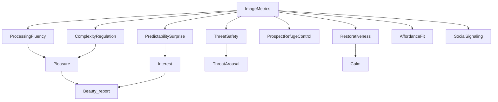

# CNfA Master Document
# Aesthetics Appraisal Framework – Integrated System

Version: 1.0  
Status: Master Integrated Markdown  
Audience: Conceptual + Implementation + Governance  

---

# PART I — CONCEPTUAL FOUNDATION

## 1. Why This Exists

This framework replaces vague aesthetic terminology with a mechanistic architecture suitable for:

- Organizing 1100+ research papers
- Building a coherent Bayesian Network (BN)
- Supporting computational image analysis
- Enforcing ontology governance
- Clarifying the eliminability of "beauty"

Core thesis:

Architectural response = Vector(Appraisal Systems)

Beauty_report = Language-layer aggregation of that vector.

---

## 2. Two-Layer Architecture

### Layer 1: Feature Layer (Computable)

Symmetry  
Clutter  
Entropy  
Fractal Dimension  
Spatial Frequency  
Curvature  
Depth Variance  
Enclosure  
Horizon Visibility  
Natural Ratio  
Material Warmth  
Reconstruction Error  

These are measurable.

---

### Layer 2: Appraisal Hubs (Explanatory)

1. ProcessingFluency  
2. ComplexityRegulation  
3. PredictabilitySurprise  
4. ThreatSafety  
5. ProspectRefugeControl  
6. Restorativeness  
7. AffordanceFit  
8. SocialSignaling  

These explain why features matter.

---

# PART II — APPRAISAL HUB DEFINITIONS

Each hub includes definition, mapping, and evidence strength.

---

## ProcessingFluency

Definition: Ease of encoding.

Feature Mapping:
Symmetry (+), Clutter (−)

Evidence: A  
Key refs: Reber et al., 2004; Winkielman et al., 2003

---

## ComplexityRegulation

Definition: Arousal via structural richness.

Pattern: Inverted-U

Evidence: A–B  
Key ref: Berlyne, 1971

---

## PredictabilitySurprise

Definition: Deviation from learned priors.

Moderate → Interest  
High → Threat

Evidence: B  
Refs: Friston, 2010; Van de Cruys & Wagemans, 2011

---

## ThreatSafety

Definition: Rapid risk appraisal.

Evidence: A  
Ref: Bar & Neta, 2006

---

## ProspectRefugeControl

Definition: See without being exposed.

Evidence: B  
Ref: Appleton, 1975

---

## Restorativeness

Definition: Attention recovery potential.

Evidence: A  
Refs: Kaplan & Kaplan, 1989; Ulrich, 1984

---

## AffordanceFit

Definition: Action compatibility.

Evidence: B  
Ref: Gibson, 1979

---

## SocialSignaling

Definition: Prestige/cultural inference.

Evidence: B  
Refs: Bourdieu, 1984; Veblen, 1899

---

# PART III — BAYESIAN NETWORK SPEC

## Structural Layers

Image Metrics → Appraisal Hubs → Affective States → Outcomes → Reports

Beauty_report is a downstream aggregation node.

---

## Core Dependencies

Symmetry → ProcessingFluency  
Clutter → ProcessingFluency (−)  
Entropy → ComplexityRegulation  
ReconstructionError → PredictabilitySurprise  
Curvature → ThreatSafety  
NaturalRatio → Restorativeness  
DepthVariance → ProspectRefugeControl  

Appraisal Hubs → Pleasure / Interest / Calm / Threat  
Affective States → ApproachProbability / DwellTime / RT / Physiology  

---

## CPD Pattern Templates

ProcessingFluency: monotonic with symmetry  
ComplexityRegulation: quadratic on pleasure  
PredictabilitySurprise: interest peak at medium  
ThreatSafety: negative on pleasure  

---

# PART IV — HIERARCHICAL EXTENSION

Add moderators:

Subject-Type:
- Expertise
- Age
- SensationSeeking
- SafetySensitivity

GoalContext:
- Work
- Healing
- Retail
- Sacred
- Social

These modify CPDs rather than base structure.

---

# PART V — PAPER INGESTION TEMPLATE

Each paper encoded as:

Antecedent_Features:  
Appraisal_Hubs:  
Affective_Mediators:  
Outcome_Types:  
Moderators:  
Evidence_Grade:  
Mechanistic_Explanation:  

---

# PART VI — FACTOR REGISTRY SCHEMA

Columns:

Factor_ID  
Factor_Name  
Layer  
Definition  
Parent_Factors  
Child_Factors  
Measurement_Type  
Scale  
Evidence_Grade  
Primary_References  
Moderator_Sensitivity  
Intervention_Possible  
Notes  

---

# PART VII — MERMAID ONTOLOGY MAP

---

# PART VIII — GOVERNANCE FRAMEWORK

## Factor Lifecycle

Candidate → Provisional → Elevated → Deprecated → Archived

---

## Promotion Criteria

At least three:

- Replication across labs
- ≥10 strong papers
- Intervention capability
- Predictive BN improvement
- Clear operational definition

---

## Demotion Criteria

- Redundant
- Empirically unstable
- Predictively weak

---

## Ontology Stability Rule

Core hubs ≤ 10 unless strong justification.

---

## Beauty Rule

Beauty_report may not parent explanatory nodes.

---

# FINAL PRINCIPLE

Clarity over proliferation.  
Mechanisms over labels.  
Intervention over description.

