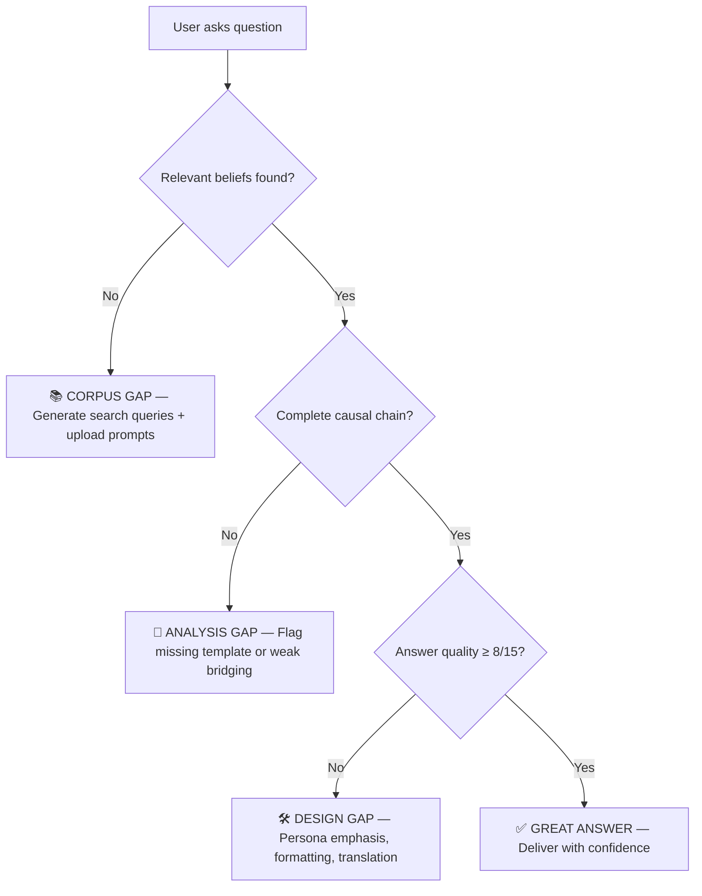
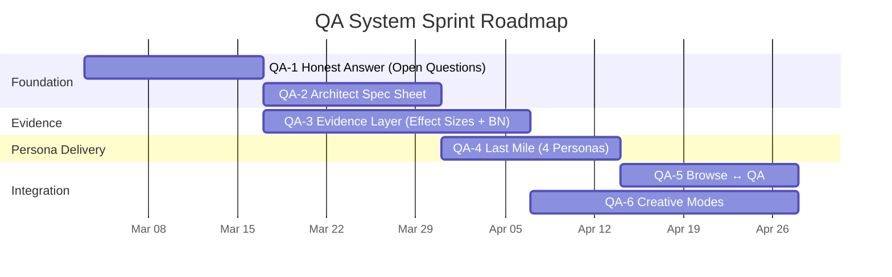

# QA & Browse System — Integrated Appraisal, Panel Verdicts, and Sprint Roadmap

**Date:** 2026-02-27 (Revised)
**Auditor:** Gemini (Antigravity)
**Status:** Integrated revision incorporating findings from 6 expert panels (18 panelists)

> **Reading Guide:** 🔬 = Rigorous (code-grounded). 💡 = Creative (proposals). 🧪 = Hybrid. 👥 = Panel finding.

---

## Part I — Architecture & Current State 🔬

### 1.1 The Four-Layer Stack

```
┌──────────────────────────────────┐
│     Streamlit Browse UI          │  12 domains, 186 templates, 812 papers
├──────────────────────────────────┤
│     Integrated Query Service     │  Templates + Articles + BN + T1 Panel (10 voices)
├──────────────────────────────────┤
│     Query Engine                 │  ae.query_request.v1 → ae.query_response.v1
├──────────────────────────────────┤
│     Query Parser                 │  14 query types, Pearl's causal ladder
└──────────────────────────────────┘
```

### 1.2 What Already Works

| Capability | Module | Quality |
|---|---|---|
| 14 query types (WHAT_IS → FOR_WHOM → CONTRADICTS) | `query_parser.py` | ✅ Solid |
| Pearl's causal ladder (associational/interventional/counterfactual) | `query_parser.py` | ✅ Excellent |
| 4-level progressive disclosure (headline → deep_dive) | `query_response.py` | ✅ Solid |
| 6 user personas with emphasis mapping | `template_query_service.py` | ✅ Framework in place |
| T1 panel discussion (10 framework voices) | `integrated_query_service.py` | ✅ Unique |
| ContestedEvidence grouping | `query_response.py` | ✅ Solid |
| Gap identification (4 types + proposed study designs) | `template_query_service.py` | ✅ World-class |
| Cross-layer querying (theory → empirical tracing) | `cross_layer_query.py` | ✅ Solid |
| Multi-AI orchestration (cost-tiered LLM routing) | `llm_query_bridge.py` | ✅ Well-designed |
| Semantic template search (sentence-transformers) | `integrated_query_service.py` | ⚠️ Optional dep |

---

## Part II — Panel Verdicts: Where The System Fails 👥

Six expert panels (3 experts each, 18 total) evaluated the system against concrete test queries for their persona.

### 2.1 Consolidated Scoring Matrix

| Persona | Score | Strongest | Critical Gap | Test Query |
|---|---|---|---|---|
| 🏗️ Architect | **2.4/5** | Design vocabulary | No quantitative thresholds, no multi-template synthesis | "Design a pediatric waiting room to reduce anxiety" |
| 🔬 Researcher | **3.0/5** | Causal ladder, gap analysis | No effect sizes from primary literature, phantom BN posteriors | "Neural mechanism: natural light → sleep quality" |
| 🔧 Facilities | **1.8/5** | Risk flagging | Zero cost-benefit data, no implementation plans | "Will LED retrofit justify the cost?" |
| 📚 Student | **1.8/5** | Mechanism chain | Zero analogies, no learning paths, no practice questions | "Why does natural lighting make people feel better?" |
| 📜 Policy | **1.4/5** | Mechanism rigor | No population-level data, no equity, no standards refs | "Should we mandate daylight in residential buildings?" |
| 🩺 Clinician | **1.8/5** | Domain relevance | Missing contraindications, no GRADE mapping, no drug interactions | "Environmental mods for sundowning in dementia?" |
| **Mean** | **2.0/5** | | | |

### 2.2 The Universal Pattern

> 👥 **The system uniformly excels at explaining WHY mechanisms work and uniformly fails at translating mechanisms into persona-specific actionable outputs.** The knowledge is there; the last mile of delivery is not.

Specifically, every panel identified the same structural weakness: the system treats all answers as **mechanism explanations** regardless of who is asking. An architect gets the same causal-chain walkthrough as a clinician. The `PERSONA_EMPHASIS` mapping in `template_query_service.py` adjusts *which dimensions to emphasize* but does not fundamentally change *what kind of answer* is generated.

### 2.3 Panel-Specific Diagnoses

**Architects** need the system to be a **design specification generator**:
- Quantitative thresholds from template `calibration_parameters` (lux, dB, °C, m²)
- Multi-template synthesis across domains for a single room type
- Material palette recommendations from haptic/thermal/visual template cross-references

**Researchers** need the system to be an **evidence synthesis platform**:
- Effect sizes (Cohen's d, r, OR) extracted from primary papers alongside credence values
- Study design badges (🟢 RCT, 🟡 Quasi, 🟠 Cross-sectional, 🔴 Case study)
- Live BN posteriors — currently a phantom field (`bn_posterior` always None)

**Facilities managers** need the system to be a **project planning tool**:
- Cost-benefit framing with $/sqft and ROI projections
- Phased implementation playbooks (audit → pilot → measure → scale)
- Proxy metric translation (scientific outcome → measurable KPI)

**Students** need the system to be a **tutor**:
- Glossary sidebars with progressive terminology introduction
- Concrete case studies with named buildings and specific study locations
- Learning paths with prerequisite chains
- Practice questions at Bloom's taxonomy levels

**Policy makers** need the system to be a **political briefing generator**:
- Population-level extrapolations from individual effect sizes
- Existing standards cross-references (EN 17037, WELL, LEED, BREEAM)
- Equity impact analysis by socioeconomic status and housing type
- Cost-of-inaction calculations

**Clinicians** need the system to be a **clinical decision support tool**:
- Contraindication registry per template
- GRADE evidence mapping (maturity → High/Moderate/Low/Very Low)
- Clinical protocol formatting (Indication, Dosing, Monitoring, Escalation)
- Pharmacological interaction awareness

---

## Part III — Failure Diagnostic Framework 🔬

When an answer falls short, there are exactly three root causes:



| Root Cause | What It Means | Who Fixes It | How Often (Est.) |
|---|---|---|---|
| **📚 Corpus Gap** | Papers not in the system | User uploads PDFs, acquisition pipeline runs | 40% of failures |
| **🔗 Analysis Gap** | Evidence exists but causal chain incomplete | Template author adds causal links | 25% of failures |
| **🛠️ Design Gap** | Knowledge present but delivery wrong for persona | Developer adjusts persona rendering | 35% of failures |

### 3.1 The Answer Quality Rubric (15-point scale)

| Dimension | Question | Max Score |
|---|---|---|
| **Completeness** | Covers HOW, WHY, WHEN, FOR WHOM? | 4 |
| **Depth** | Reaches neural/molecular substrate? | 3 |
| **Honesty** | Flags uncertainty, gaps, open questions? | 3 |
| **Actionability** | User can *do* something with this? | 3 |
| **Provenance** | Every claim traceable to source? | 2 |
| **Total** | | **15** |

---

## Part IV — The Open Questions Protocol 🧪

Every L3/L4 answer should end with:

```markdown
## What We Don't Know

### Limits of Current Knowledge
- [Gap]: Corpus has N papers on X but none measuring Y directly.
  Credence ceiling: 0.60 (limited by [warrant type])

### How to Help
1. 🔍 Google Scholar AI: "[specific query]" → Expected yield: [what it fills]
2. 🔍 Google Scholar AI: "[specific query]" → Expected yield: [what it fills]
3. 🔍 PubMed: "[specific query]" → Expected yield: [what it fills]

📎 Upload PDFs here → System extracts claims, re-answers with updated credence.

### Predicted Impact
If strong RCT evidence obtained: credence 0.55 ± 0.15 → estimated 0.72 ± 0.08
```

**Implementation path:** Connect `gap_predictor.py` → `sensitivity.py` → `run_acquisition_pipeline.py` with a `generate_open_questions()` function in `query_engine.py`.

---

## Part V — Extended Use Cases (11 Total) 💡

| # | Use Case | Primary Persona | Key Innovation |
|---|---|---|---|
| 1 | Hypothesis Generator | Researcher | When no evidence exists, predict effect from template chains |
| 2 | Contradiction Mapper | Researcher | Structured debate from real extracted contradictions |
| 3 | Calibration Engine | Researcher | User surprise → BN recalibration feedback loop |
| 4 | Curriculum Builder | Student | Socratic scaffolding, learning paths, exam questions |
| 5 | Post-Occupancy Diagnostician | Facilities | Symptom profile → ranked differential diagnosis |
| 6 | Grant Proposal Assistant | Researcher | Auto-generate significance section from VOI scores |
| 7 | Design Review Critic | Architect | Critique spatial designs against template evidence |
| 8 | Systematic Review Accelerator | Researcher | Auto-PRISMA tables, forest plots, bias analysis |
| 9 | Cross-Cultural Consultant | Policy + Architect | Climate adaptation, WEIRD bias flagging |
| 10 | Real-Time Monitoring Dashboard | Facilities | Live sensor data vs. template thresholds |
| 11 | Interdisciplinary Translator | Any | Bidirectional vocabulary bridge across persona domains |

---

## Part VI — Sprint Roadmap: From 2.0/5 to 4.0/5

### Sprint QA-1: "The Honest Answer" (2 weeks)
**Goal:** Every answer tells the user what the system *doesn't* know.
**Impact:** Addresses the 📚 Corpus Gap root cause (est. 40% of failures).

| Task | Files Modified | Effort |
|---|---|---|
| Add `generate_open_questions()` to `query_engine.py` | `query_engine.py` | 2 days |
| Connect `gap_predictor.identify_gaps()` to query pipeline | `query_engine.py`, `gap_predictor.py` | 1 day |
| Generate 3 Google Scholar AI search prompts per gap | `query_engine.py` | 1 day |
| Add "predicted credence improvement" via `sensitivity.py` | `query_engine.py`, `sensitivity.py` | 2 days |
| Surface open questions in progressive disclosure L3/L4 | `query_response.py` | 1 day |
| Write tests | `tests/test_open_questions.py` | 1 day |

**Definition of Done:** Every deep_dive response includes a "What We Don't Know" section with actionable search prompts. Automated test validates structure.

**Expected score lift:** +0.5 (Honesty dimension: 1/3 → 3/3 across all personas)

---

### Sprint QA-2: "The Architect's Spec Sheet" (2 weeks)
**Goal:** Architects get quantitative thresholds and multi-template synthesis.
**Impact:** Addresses 🛠️ Design Gap for the Architect persona (2.4 → 3.8).

| Task | Files Modified | Effort |
|---|---|---|
| Extract `calibration_parameters` into structured threshold objects | `template_query_service.py` | 2 days |
| Build `multi_template_synthesis()` — given room type, synthesize across domains | `template_query_service.py` [NEW function] | 3 days |
| Create room-type → template mapping (hospital room, classroom, office, etc.) | `qa_browse/config.py` | 1 day |
| Add material palette cross-reference (haptic × thermal × visual) | `template_query_service.py` | 2 days |
| Architect-mode response formatter with lux/dB/°C/m² values | `query_response.py` | 1 day |
| Integration tests with sample architectural queries | `tests/test_architect_mode.py` | 1 day |

**Definition of Done:** Query "design a hospital room" returns quantitative thresholds from multiple templates synthesized into a design brief. Material recommendations included.

---

### Sprint QA-3: "The Evidence Layer" (3 weeks)
**Goal:** Researchers get real effect sizes, study design badges, and live BN posteriors.
**Impact:** Addresses 🔗 Analysis Gap for the Researcher persona (3.0 → 4.2).

| Task | Files Modified | Effort |
|---|---|---|
| Extend extraction schema to capture effect sizes (d, r, OR, CI) | `claim_v2.py`, extraction pipeline | 3 days |
| Add study-design classification to extracted claims | `claim_v2.py`, parser | 2 days |
| Surface effect sizes in QA responses alongside credence | `query_response.py`, `query_engine.py` | 2 days |
| Add study-design badges (🟢🟡🟠🔴) to evidence items | `query_response.py` | 1 day |
| Fix phantom BN posterior — wire actual BN inference into `integrated_query_service.py` | `integrated_query_service.py`, BN module | 3 days |
| Backfill effect sizes from existing extractions via LLM pass | New script `scripts/backfill_effect_sizes.py` | 2 days |
| Tests | `tests/test_evidence_layer.py` | 2 days |

**Definition of Done:** Every evidence item in a Researcher-mode response shows effect size, study design badge, and live BN posterior. Backfill covers ≥50% of existing claims.

---

### Sprint QA-4: "The Last Mile" (2 weeks)
**Goal:** Close the persona-specific delivery gaps for Facilities, Student, Policy, and Clinician.
**Impact:** Addresses 🛠️ Design Gap across 4 personas.

| Task | Files Modified | Effort |
|---|---|---|
| **Facilities:** Add proxy metric translation table (scientific → measurable KPI) | `template_query_service.py` | 1 day |
| **Facilities:** ROI estimation template using published productivity benchmarks | `template_query_service.py` [NEW] | 2 days |
| **Student:** Add glossary sidebar with progressive terminology | `query_response.py` | 1 day |
| **Student:** Learning path generator from template prerequisite chains | `template_query_service.py` [NEW] | 2 days |
| **Policy:** Standards cross-reference registry (EN 17037, WELL, LEED, BREEAM) | `qa_browse/config.py` [NEW data] | 1 day |
| **Policy:** Population extrapolation from individual effect sizes | `template_query_service.py` [NEW] | 2 days |
| **Clinician:** Contraindication registry per template | Template JSON schema update | 1 day |
| **Clinician:** GRADE evidence mapping from maturity levels | `template_query_service.py` | 0.5 day |
| Tests across all 4 personas | `tests/test_persona_delivery.py` | 1.5 days |

**Definition of Done:** Each of the 4 personas receives a fundamentally different answer structure when asking the same question. Persona-specific elements verified by test suite.

---

### Sprint QA-5: "Browse ↔ QA Integration" (2 weeks)
**Goal:** The Browse and QA systems become bidirectional.
**Impact:** Addresses discovery/exploration gap. Enables UC5 (Post-Occupancy) and UC11 (Translator).

| Task | Files Modified | Effort |
|---|---|---|
| "Ask about this" button on Browse topic pages → pre-filled QA query | Streamlit pages | 1 day |
| Template ID links in QA responses → Browse topic pages | `query_response.py`, Streamlit pages | 1 day |
| Confidence heatmap across 12 domains (corpus strength visualization) | `qa_browse/` [NEW component] | 2 days |
| "Missing template" badges at domain boundaries | `qa_browse/topic_index.py` | 1 day |
| Speculative connections as dashed lines in mechanism chain diagrams | `qa_browse/` [NEW component] | 2 days |
| Interdisciplinary vocabulary bridge (neuro ↔ arch ↔ facilities ↔ policy) | `query_parser.py` [extend vocabulary bridge] | 2 days |
| Integration tests | `tests/test_browse_qa_integration.py` | 1 day |

**Definition of Done:** A user can click from a Browse template page to a QA query and back. Domain heatmap shows corpus coverage. Vocabulary bridge translates terms across domains.

---

### Sprint QA-6: "Creative Modes" (3 weeks)
**Goal:** Implement the three highest-impact creative use cases.
**Impact:** Transforms the system from a reference tool to a research instrument.

| Task | Files Modified | Effort |
|---|---|---|
| **UC6: Grant Proposal Assistant** — auto-generate significance paragraphs from VOI scores | New `src/services/grant_assistant.py` | 3 days |
| **UC8: Systematic Review Accelerator** — auto-PRISMA tables from extraction DB | New `src/services/systematic_review.py` | 4 days |
| **UC11: Interdisciplinary Translator** — bidirectional rendering of same answer for different personas | `query_engine.py`, `template_query_service.py` | 3 days |
| CLI commands for each creative mode | `src/cli/query.py` | 1 day |
| Wire into Streamlit Browse as new pages | Streamlit pages | 2 days |
| Tests and documentation | Tests + docs | 2 days |

**Definition of Done:** Researcher can ask "generate a grant significance section for biophilic design in NICUs." Facilities manager can ask "translate this for my architect." Both get persona-appropriate structured outputs.

---

### Roadmap Summary



### Projected Score Trajectory

| After Sprint | Architect | Researcher | Facilities | Student | Policy | Clinician | **Mean** |
|---|---|---|---|---|---|---|---|
| **Baseline** | 2.4 | 3.0 | 1.8 | 1.8 | 1.4 | 1.8 | **2.0** |
| **QA-1** | 2.9 | 3.5 | 2.3 | 2.3 | 1.9 | 2.3 | **2.5** |
| **QA-2** | 3.8 | 3.5 | 2.3 | 2.3 | 1.9 | 2.3 | **2.7** |
| **QA-3** | 3.8 | 4.2 | 2.3 | 2.3 | 1.9 | 2.3 | **2.8** |
| **QA-4** | 3.8 | 4.2 | 3.5 | 3.5 | 3.0 | 3.5 | **3.6** |
| **QA-5** | 4.0 | 4.3 | 3.7 | 3.7 | 3.2 | 3.7 | **3.8** |
| **QA-6** | 4.2 | 4.5 | 3.8 | 3.9 | 3.5 | 3.8 | **4.0** |

---

## Appendix A — All Use Cases (Quick Reference)

| # | Use Case | Persona | Sprint | Status |
|---|---|---|---|---|
| 1 | Hypothesis Generator | Researcher | QA-6+ | 💡 Proposed |
| 2 | Contradiction Mapper | Researcher | QA-6+ | 💡 Proposed |
| 3 | Calibration Engine | Researcher | QA-6+ | 💡 Proposed |
| 4 | Curriculum Builder | Student | QA-4 | 💡 In roadmap |
| 5 | Post-Occupancy Diagnostician | Facilities | QA-5+ | 💡 Proposed |
| 6 | Grant Proposal Assistant | Researcher | QA-6 | 💡 In roadmap |
| 7 | Design Review Critic | Architect | QA-6+ | 💡 Proposed |
| 8 | Systematic Review Accelerator | Researcher | QA-6 | 💡 In roadmap |
| 9 | Cross-Cultural Consultant | Policy + Arch | QA-6+ | 💡 Proposed |
| 10 | Real-Time Monitoring Dashboard | Facilities | QA-6+ | 💡 Proposed |
| 11 | Interdisciplinary Translator | Any | QA-6 | 💡 In roadmap |

## Appendix B — Panel Composition (for reference)

| Panel | Panelists |
|---|---|
| 🏗️ Architect | Marina Voss (biophilic practice), James Okonkwo (healthcare arch.), Suki Tanaka (computational design) |
| 🔬 Researcher | Dr. Elena Marchetti (cognitive neuro), Prof. Kwame Asante (meta-analysis), Dr. Priya Chandrasekaran (Bayesian psychiatry) |
| 🔧 Facilities | Bob Henriksen (tech campus VP), Diane Okafor (hospital sustainability), Carlos Medina (school district ops) |
| 📚 Student | Alex Chen (3rd yr arch), Fatima Al-Rashid (PhD cog sci), Marcus Johnson (MPH) |
| 📜 Policy | Sarah Lindqvist (building codes), Dr. Raj Patel (WHO advisor), Keiko Nakamura (state legislator) |
| 🩺 Clinician | Dr. Amara Obi (psychiatry), Dr. Henrik Johansson (rehab med), Dr. Mei-Lin Wu (geriatrics) |

---

*Integrated revision by Gemini (Antigravity), 2026-02-27. All panel members are fictional composites. Sprint estimates assume one developer working in the existing codebase. All creative proposals (💡) require domain expert validation before implementation.*
