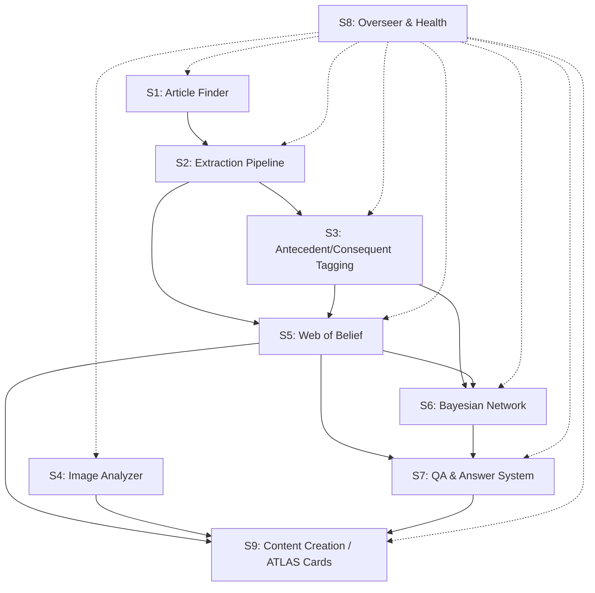

# ATLAS Subsystem Specification Document

**Date**: 2026-03-05
**Author**: AG (Antigravity)
**Version**: 1.0
**System**: ATLAS (Architecture for Typed, Layered Assessment of Science)

---

## Overview

This document provides the canonical specification for all 9 major ATLAS subsystem groups. For each subsystem it documents: purpose, file registry, input/output contracts, current success conditions, design quality assessment, and a comparison against CS best practices for that *type* of system.

**Test Baseline** (2026-03-05): 6,748 passed │ 9 failed │ 52 skipped │ 214s

---

## Subsystem Dependency Graph



---

## S1. Article Finder / Paper Acquisition

### Purpose
Discovers, triages, and acquires scientific papers from external APIs (CrossRef, PubMed, Semantic Scholar, Google Scholar). Tracks the full discovery funnel from VOI gap identification through article search, PDF retrieval, and gap closure verification.

### File Registry

| File | LOC | Role |
|:-----|:----|:-----|
| `src/services/paper_fetcher.py` | 1,282 | API interface to CrossRef, PubMed, S2 |
| `src/services/discovery_funnel.py` | 1,082 | VOI gap → search → retrieval tracking |
| `scripts/acquire_foundational_papers.py` | 622 | Bulk acquisition script |
| `scripts/acquire_pdfs_unpaywall.py` | 428 | Unpaywall PDF retrieval |
| `scripts/snowball_expand_corpus.py` | 481 | Citation snowballing |
| `scripts/filter_off_topic_papers.py` | 678 | Relevance filtering |
| `scripts/semantic_scholar_enrichment.py` | 780 | S2 metadata enrichment |
| `scripts/run_acquisition_pipeline.py` | 204 | Pipeline orchestrator |

### Input/Output Contracts

| Direction | Data | Format |
|:----------|:-----|:-------|
| **Input** | VOI gaps, search queries | `VOIGap` dataclass, keyword strings |
| **Input** | API credentials | env vars: `CROSSREF_API_KEY`, `PUBMED_API_KEY`, `S2_API_KEY` |
| **Output** | Paper metadata | `data/staging/*.json` — DOI, title, authors, abstract, pub date |
| **Output** | Downloaded PDFs | `data/pdfs/` directory |
| **Output** | Acquisition log | `papers_acquired` table |

### Current Success Conditions
- **SP-SC3**: Pipeline produces discovery output (>0 papers/run)
- **SP-SC4**: Triage stage produces classifications (100% classified)
- **INV-PA-1..5**: API keys present, 50+ papers/30 days, no duplicate DOIs, 85%+ API success rate

### CS Best Practices Comparison

| Best Practice | Status | Notes |
|:-------------|:-------|:------|
| **Recall-precision tradeoff** | ⚠️ Partial | Keyword-based search; no semantic similarity ranking |
| **Deduplication** | ✅ Good | DOI-based dedup enforced (INV-PA-3) |
| **API rate limiting** | ✅ Good | Per-API rate limits configured |
| **Snowball sampling bias** | ⚠️ Gap | No bias correction for citation graph traversal |
| **Coverage metrics** | ⚠️ Gap | No systematic recall measurement vs. known corpora |
| **Contract-first design** | ❌ Missing | No schema validation on staging output |
| **Automated refresh** | ❌ Missing | No cron/scheduler for periodic acquisition |

### Design Quality Assessment

| Dimension | Score | Rationale |
|:----------|:------|:----------|
| **Logic Quality** | 6/10 | VOI gap → search logic sound, but no relevance scoring |
| **Contract Completeness** | 4/10 | API key checks exist but staging output has no schema validation |
| **Interface Clarity** | 5/10 | Input/output contracts implicit; paper_fetcher returns raw dicts |
| **Status** | ❌ RED | API keys not configured in this environment |

---

## S2. Extraction Pipeline

### Purpose
Extracts structured causal claims, findings, and metadata from scientific PDFs using LLM-based prompts (Gemini/GPT). Implements two-pass extraction with verification, article-type-specific prompts, and produces v3-format extraction JSONs with 33,116+ findings across 1,022 articles.

### File Registry

| File | LOC | Role |
|:-----|:----|:-----|
| `src/extraction/claim_extractor.py` | 2,613 | Core claim extraction engine |
| `src/extraction/revised_prompts_v3.py` | 1,708 | V3 prompt set (5 article families) |
| `src/extraction/batch_extract.py` | 1,714 | Batch extraction orchestration |
| `src/extraction/paper_triage.py` | 360 | Article type classification |
| `src/extraction/table_classifier.py` | 316 | Table type detection |
| `src/extraction/table_semantics_codex.py` | 292 | Semantic profiling of tables |
| `src/extraction/effect_size_converter.py` | 168 | Cohen's d → probability |
| `src/extraction/v4_prompts.py` | 916 | V4 prompt set (next gen) |
| `scripts/gemini_extraction_queue.py` | 893 | Extraction queue manager |
| `scripts/two_pass_extraction.py` | 324 | Two-pass verification |
| `scripts/v3_surgical_update.py` | 598 | Surgical field updates |
| `scripts/v4_staged_extraction.py` | 1,868 | V4 staged extraction |

### Input/Output Contracts

| Direction | Data | Format |
|:----------|:-----|:-------|
| **Input** | Classified PDFs | `data/pdfs/*.pdf` with triage classification |
| **Input** | Article-type prompts | `revised_prompts_v3.py` — 5 families |
| **Output** | Extraction JSONs | `data/extractions/*.json` — ae.claim.v1 format |
| **Output** | Findings | 33,116+ structured findings with antecedent, consequent, direction, effect_size, theory_links |

### Current Success Conditions
- **GEQ-SC1..8**: Triage loads, queue persisted, PDFs located (≥80%), prompts selected, output valid, two-run verification, cost tracked
- **REP-SC1..8**: Canonical directions (4), article families (5), base prompt, validation suffix, vocab injection
- **INV-EI-1..7**: 90%+ success rate, non-null provenance, confidence [0,1], mean ≥0.75

### CS Best Practices Comparison

| Best Practice | Status | Notes |
|:-------------|:-------|:------|
| **Dual-LLM adversarial verification** | ✅ Good | Two-pass extraction with difference logging |
| **Semantic validation (LLM-as-judge)** | ⚠️ Partial | Extraction field validator exists but no LLM-based fact-checking |
| **Modular retrieval-extraction-verification** | ✅ Good | Clean separation: triage → prompt → extract → validate |
| **Prompt engineering hygiene** | ✅ Good | 5 article-family-specific prompts, canonical directions enforced |
| **Gold standard evaluation** | ✅ Good | `gold_standard/` directory with reference data |
| **Domain-specific fine-tuning** | ❌ N/A | Uses general LLMs (Gemini Flash/Pro) with prompt engineering |
| **Data augmentation for robustness** | ❌ Gap | No perturbation testing of extraction prompts |
| **Iterative retrieval-extraction-verification loop** | ⚠️ Partial | Two-pass but not iterative refinement |

### Design Quality Assessment

| Dimension | Score | Rationale |
|:----------|:------|:----------|
| **Logic Quality** | 8/10 | V3 prompts well-structured; article families map cleanly to extraction strategies |
| **Contract Completeness** | 8/10 | 8 success conditions for queue, 8 for prompts — comprehensive |
| **Interface Clarity** | 7/10 | Clear JSON schema output; prompt selection via article type |
| **Status** | ✅ GREEN | 93% theory coverage, 33K+ findings |

---

## S3. Antecedent/Consequent Tagging & Entity Normalization

### Purpose
Maps extracted natural-language antecedents (environmental variables) and consequents (human outcomes) to canonical taxonomy identifiers. This subsystem bridges the gap between free-text extraction output and the structured IDs required by the Web of Belief and Bayesian Network.

### File Registry

| File | LOC | Role |
|:-----|:----|:-----|
| `src/services/iv_dv_classifier.py` | 1,237 | IV/DV classification engine |
| `src/services/environment_taxonomy.py` | 420 | Environment variable taxonomy |
| `src/services/outcome_taxonomy.py` | 1,550 | Outcome variable taxonomy |
| `src/services/belief_env_outcome_extractor.py` | 893 | Belief → env/outcome mapping |
| `src/services/vocabulary_bridge.py` | 307 | Bridge between extraction vocab and canonical vocab |
| `scripts/backfill_env_outcome.py` | 210 | Backfill env/outcome IDs |
| `scripts/backfill_belief_ids.py` | 375 | Backfill belief IDs |
| `scripts/backfill_canonical_outcomes.py` | 387 | Canonical outcome mapping |

### Input/Output Contracts

| Direction | Data | Format |
|:----------|:-----|:-------|
| **Input** | Raw antecedent/consequent strings | Free text from extraction JSONs |
| **Input** | Taxonomy registries | `data/taxonomy.json`, `contracts/outcome_vocab/` |
| **Output** | `environment_id` | Canonical env variable UUID |
| **Output** | `outcome_id` | Canonical outcome vocabulary term ID |

### Current Success Conditions
- **BEL-SC1**: ≥99% beliefs have environment_id
- **BEL-SC2**: ≥90% beliefs have outcome_id
- **INV-TAX-1..6**: 133+ taxonomy nodes, DAG acyclic, 95%+ normalization success rate

### CS Best Practices Comparison

| Best Practice | Status | Notes |
|:-------------|:-------|:------|
| **Taxonomy DAG acyclicity** | ✅ Good | Enforced via INV-TAX-2, topological sort check |
| **Canonical vocabulary maintenance** | ✅ Good | `outcome_vocab.json` with levels and operationalizations |
| **Fuzzy matching with confidence** | ⚠️ Partial | Keyword-based matching; no semantic similarity scoring |
| **Ontology alignment (UMLS/MeSH)** | ❌ Gap | No alignment to standard biomedical ontologies |
| **Entity resolution with disambiguation** | ⚠️ Partial | Vocabulary bridge exists but ambiguous terms not handled well |
| **Versioned taxonomy changes** | ⚠️ Partial | changelog exists but not enforced |

### Design Quality Assessment

| Dimension | Score | Rationale |
|:----------|:------|:----------|
| **Logic Quality** | 6/10 | Keyword matching works but misses semantic nuance; BN mapping critically depends on this |
| **Contract Completeness** | 7/10 | Good coverage via BEL-SC conditions |
| **Interface Clarity** | 5/10 | Multiple scripts with overlapping functionality (3 backfill scripts) |
| **Status** | ⚠️ YELLOW | 0% BN node mapping (root cause: env_id/outcome_id mapping gap) |

---

## S4. Image Analyzer

### Purpose
Searches, downloads, classifies, and tags environmental images with a 41-attribute vocabulary. Links images to ATLAS evidence and templates. Currently a partially implemented pipeline with stub components.

### File Registry

| File | LOC | Role |
|:-----|:----|:-----|
| `src/services/image_pipeline_service.py` | 817 | Pipeline orchestrator (STUBBED downloads) |
| `src/services/image_tag_service.py` | 655 | 41-attribute tagging vocabulary |
| `src/services/environment_image_db.py` | 315 | Image database management |
| `src/services/image_pool_manager.py` | 852 | Pool management and allocation |
| `src/services/image_attribute_sync.py` | 296 | Attribute synchronization |
| `src/vision/new_attributes.py` | 644 | Attribute definition batch 1 |
| `src/vision/new_attributes_batch2.py` | 774 | Attribute definition batch 2 |
| `src/vision/new_attributes_batch3.py` | 746 | Attribute definition batch 3 |
| `scripts/run_image_pipeline.py` | 416 | Pipeline runner |
| `scripts/run_image_extraction_batch.py` | 690 | Batch extraction |
| `scripts/infer_template_images.py` | 383 | Template → image inference |

### Input/Output Contracts

| Direction | Data | Format |
|:----------|:-----|:-------|
| **Input** | Template stimulus descriptions | JSON from `data/templates/*.json` |
| **Input** | Search queries | Generated from template descriptions |
| **Output** | Tagged images | `data/images/` with classification labels |
| **Output** | Image-template links | `image_classifications` table |

### Current Success Conditions
- **INV-IMG-1..5**: 75%+ classification success, confidence [0,1], ≤2s latency, 24h queue clearance

### CS Best Practices Comparison

| Best Practice | Status | Notes |
|:-------------|:-------|:------|
| **Transfer learning** | ❌ Gap | No pre-trained vision model (STUB: heuristic-based tagging) |
| **Data augmentation** | ❌ Gap | No augmentation pipeline |
| **Classification confidence calibration** | ⚠️ Partial | Confidence scores assigned but not calibrated |
| **Adversarial testing** | ❌ Gap | No robustness testing |
| **Multi-modal integration** | ⚠️ Partial | Text-based heuristic tagging, no vision API integration |
| **Environmental variation handling** | ❌ Gap | No handling of lighting, angle, quality variations |
| **Continuous monitoring** | ❌ Gap | No data drift detection |

### Design Quality Assessment

| Dimension | Score | Rationale |
|:----------|:------|:----------|
| **Logic Quality** | 3/10 | Core functions are STUBBED — `download_image()` returns mock data |
| **Contract Completeness** | 5/10 | Health invariants defined but unverifiable with stubs |
| **Interface Clarity** | 6/10 | Clean dataclass models (`ImageMetadata`, `TaggingResult`) |
| **Status** | ⚠️ YELLOW | Partial implementation; stubs throughout |

---

## S5. Web of Belief

### Purpose
The primary epistemic layer — a typed graph of beliefs, warrants, and evidential support relationships based on Susan Haack's foundherentism. Manages 4,800+ bootstrapped beliefs, 8,000+ coherence constraints, warrant scaling (noisy-OR), bridge warrants, and the epistemic causal bridge (π function) that projects to the BN.

### File Registry

| File | LOC | Role |
|:-----|:----|:-----|
| `src/services/web_of_belief.py` | 2,359 | Primary epistemic service |
| `src/services/web_persistence.py` | 3,312 | SQLite persistence layer |
| `src/services/bridge_warrants.py` | 1,165 | Bridge warrant lifecycle |
| `src/services/epistemic_causal_bridge.py` | 3,810 | π function: WoB → BN translation |
| `src/services/dual_epistemology.py` | 555 | Web + BN dual-layer management |
| `src/services/stability_engine.py` | 523 | Belief stability assessment |
| `src/services/scalable_coherence.py` | 1,060 | Large-scale coherence computation |
| `src/epistemic/warrant_scaling.py` | ~400 | Noisy-OR warrant combination |
| `src/epistemic/monitors/` | 4 files | Coherence, bias, asymmetry monitors |
| `src/epistemic/entrenchment/` | 6 files | Quine-style entrenchment |
| `src/services/web_of_belief_modules/` | 16 files | Coherence, equilibrium, evidence, severity, etc. |

### Input/Output Contracts

| Direction | Data | Format |
|:----------|:-----|:-------|
| **Input** | Extracted claims (ClaimV2) | From S2 extraction pipeline |
| **Input** | Bootstrap beliefs | `data/tier3_initial_beliefs.json` (≥596 beliefs) |
| **Output** | Belief graph | `web.db` SQLite — beliefs, constraints, warrants |
| **Output** | Coherence metrics | Computed and cached in `overseer.db` |
| **Output** | Bridge warrants | Credence formula: P(effect│channel_i) = P(parent) × P(bridge) × P(CNFA) |

### Current Success Conditions
- **INV-WOB-1..8**: ≥4,800 beliefs, ≥8,000 constraints, 100% referential integrity, entrenchment [0,1], ≥60% non-marginal, provenance for all, coherence ≥0.65
- **XB-4**: BN-Web sync (edge weights match credences ±0.01)
- **XB-5**: Extraction-integration provenance chain intact
- **XB-7**: Warrant-belief referential integrity

### CS Best Practices Comparison

| Best Practice | Status | Notes |
|:-------------|:-------|:------|
| **Belief revision mechanisms** | ✅ Good | Entrenchment replay, coherence-based revision |
| **Coherence maintenance** | ✅ Good | Scalable coherence engine with ≥0.65 threshold |
| **Provenance tracking** | ✅ Good | Haack foundherentism — every belief has provenance |
| **Incremental consistency checking** | ✅ Good | Post-integration checks (INV-4: ≤5% coherence loss) |
| **Unique identifiers** | ✅ Good | DOI-based belief IDs |
| **Regular audits** | ✅ Good | Nightly overseer audits |
| **Belief change minimization** | ⚠️ Partial | Coherence delta monitored but no formal AGM-style revision |
| **Handling inconsistency** | ⚠️ Partial | Coherence audit detects but no formal reasoning zones |

### Design Quality Assessment

| Dimension | Score | Rationale |
|:----------|:------|:----------|
| **Logic Quality** | 8/10 | Well-grounded in epistemological theory (Haack, Quine, Dijkstra) |
| **Contract Completeness** | 9/10 | 8 health invariants + 4 cross-boundary contracts |
| **Interface Clarity** | 7/10 | Clean ClaimV2/EdgeV2 schemas; epistemic_causal_bridge is complex but documented |
| **Status** | ✅ GREEN (7/10 per Ruthless Audit) |

---

## S6. Bayesian Network

### Purpose
Directed acyclic graph encoding causal relationships between environmental variables and human outcomes (Pearl-compliant). Uses Beta-Bernoulli conjugate priors for incremental edge learning. Connected to Web of Belief via the π projection function.

### File Registry

| File | LOC | Role |
|:-----|:----|:-----|
| `src/services/incremental_bn.py` | 1,020 | Incremental BN builder with Beta-Bernoulli edges |
| `src/services/bbn_calibrator.py` | 72 | BBN calibration |
| `src/services/bn_coherence_client.py` | 434 | BN-Web coherence client |
| `src/services/graph_confidence_service.py` | 510 | BN-side confidence: 0.4×warrant + 0.3×grounding + 0.3×rank |
| `src/services/ecb_modules/` | 4 files | Causal models, contrast classes, counterfactuals |
| `scripts/maintain_bn.py` | 398 | BN maintenance script |
| `scripts/backfill_env_outcome.py` | 210 | Env/outcome mapping for BN nodes |

### Input/Output Contracts

| Direction | Data | Format |
|:----------|:-----|:-------|
| **Input** | Belief credences | From S5 Web of Belief |
| **Input** | Environment/outcome IDs | From S3 tagging (BEL-SC1, BEL-SC2) |
| **Output** | BN edges with CPTs | DAG structure + conditional probability tables |
| **Output** | Causal inferences | do-calculus interventional estimates |

### Current Success Conditions
- **INV-BN-1..7**: Acyclic, edge-constraint parity, weights [0,1], no dangling nodes, export succeeds, mean degree ≥1.5, weight sync ±0.01
- **XB-4**: BN-Web sync contract

### CS Best Practices Comparison

| Best Practice | Status | Notes |
|:-------------|:-------|:------|
| **DAG acyclicity enforcement** | ✅ Good | Topological sort check (INV-BN-1) |
| **Conjugate prior updates** | ✅ Good | Beta-Bernoulli with Bayesian updating |
| **Sensitivity analysis** | ⚠️ Partial | Uncertainty/CI computed but no formal sensitivity analysis |
| **Canonical identifier mapping** | ❌ CRITICAL | 0% beliefs mapped to BN nodes (bn_touched = 0) |
| **Iterative development** | ⚠️ Partial | Incremental builder exists but not iteratively validated |
| **CPT calibration** | ⚠️ Partial | bbn_calibrator exists but minimal (72 LOC) |
| **Model assessment/evaluation** | ❌ Gap | No quantitative BN model evaluation |
| **Transparency & reproducibility** | ✅ Good | GraphML/DOT export, edge provenance tracking |

### Design Quality Assessment

| Dimension | Score | Rationale |
|:----------|:------|:----------|
| **Logic Quality** | 7/10 | Sound Bayesian foundations; Beta-Bernoulli conjugacy is correct choice |
| **Contract Completeness** | 7/10 | 7 invariants + XB-4, but missing data mapping validation |
| **Interface Clarity** | 6/10 | Clean edge model but BN-Web sync interface is fragile |
| **Status** | ❌ RED (1/10 per Ruthless Audit) — 0% data mapped |

---

## S7. QA & Answer System

### Purpose
Evidence-backed question answering system with 14+ question types. Searches 33K+ extraction findings via file-indexed search, enriches answers with provenance, argumentation, interpretation, and framework voices. Generates ATLAS knowledge cards.

### File Registry

| File | LOC | Role |
|:-----|:----|:-----|
| `src/services/arbitrary_qa_handler.py` | 2,804 | Core QA handler (14+ types) |
| `src/services/answer_enrichment_orchestrator.py` | 1,977 | 9-step enrichment pipeline |
| `src/qa/card_generation_orchestrator.py` | 1,551 | ATLAS card generation |
| `src/qa/card_tab_generators.py` | 1,474 | Card tab content generators |
| `src/qa/extraction_field_validator.py` | 2,118 | 11-field extraction validation |
| `src/services/integrated_query_service.py` | 1,420 | Integrated query across layers |
| `src/qa/reflex_system.py` | 2,072 | 23-class reflex system |
| `src/services/knowledge_catalog.py` | 536 | Static knowledge catalogs |
| `src/qa/answer_renderer.py` | 459 | Answer rendering |
| `src/qa/mv_builder.py` | 665 | Materialized view builder |

### Input/Output Contracts

| Direction | Data | Format |
|:----------|:-----|:-------|
| **Input** | User queries | Natural language questions |
| **Input** | Extraction corpus | 33K+ finding JSONs in `data/extractions/` |
| **Output** | Enriched answers | JSON with evidence, provenance, framework voices |
| **Output** | ATLAS cards | 9-type card taxonomy (SBI model) |

### Current Success Conditions
- **INV-QA-1..5**: API initialized, <5% stale cache, no NULL fields, valid framework IDs, ≤3s latency
- **EFV-SC1..7**: Validator loads, violations detected, quality scores correct, batch processing
- **XB-3**: Framework-reference contract (QA→Theory)
- **XB-9**: Service availability (all 13 enrichment services callable)
- **XB-12**: QA-Export consistency

### CS Best Practices Comparison

| Best Practice | Status | Notes |
|:-------------|:-------|:------|
| **Hybrid search (lexical + semantic)** | ⚠️ Partial | File-indexed keyword search; no vector embeddings |
| **Grounded answer generation** | ✅ Good | All answers traced to extraction findings with DOIs |
| **Hallucination prevention** | ✅ Good | File-based search prevents LLM hallucination |
| **Retrieval-generation metric separation** | ⚠️ Partial | Response latency tracked, but no recall/precision@k |
| **RAG evaluation** | ❌ Gap | No systematic answer quality evaluation |
| **Knowledge graph augmentation** | ⚠️ Partial | Web of Belief accessible but not live-connected to QA |
| **Graceful degradation** | ✅ Good | Enrichment orchestrator skips failed steps |
| **Multiple retrieval indices** | ❌ Gap | Single file-based search mechanism |

### Design Quality Assessment

| Dimension | Score | Rationale |
|:----------|:------|:----------|
| **Logic Quality** | 8/10 | 14+ question types with type-specific handlers; reflex system covers common queries |
| **Contract Completeness** | 8/10 | Strong coverage; 7 validator SCs + orchestrator invariants |
| **Interface Clarity** | 7/10 | Clean handler routing; enrichment steps well-defined |
| **Status** | ✅ GREEN (8/10 per Ruthless Audit) |

---

## S8. Overseer & Health Monitoring

### Purpose
Dijkstra-inspired governance system with 6 core invariants. Manages nightly audits (~15min), post-integration checks (~5s), quarantine, self-healing, and the AESHI (Article Eater System Health Index) composite metric. Monitors all 20 subsystems with 140+ health invariants.

### File Registry

| File | LOC | Role |
|:-----|:----|:-----|
| `src/services/overseer.py` | 3,512 | Core overseer (6 components) |
| `src/services/overseer_self_healing.py` | 1,423 | Automated repair |
| `src/services/overseer_management.py` | 1,566 | Management interface |
| `src/services/overseer_diagnostician.py` | 840 | Diagnostic analysis |
| `src/services/overseer_predictive.py` | 479 | Predictive health |
| `src/services/overseer_playbooks.py` | 380 | Repair playbooks |
| `scripts/compute_system_health.py` | 1,064 | AESHI computation |
| `scripts/overseer_nightly.py` | 524 | Nightly audit runner |
| `scripts/nightly_integration_pipeline.py` | 1,280 | Nightly integration |

### Input/Output Contracts

| Direction | Data | Format |
|:----------|:-----|:-------|
| **Input** | All subsystem health metrics | Computed from each subsystem |
| **Output** | Health reports | `overseer.db`, `system_health_report.json` |
| **Output** | AESHI score | Float [0,100] with band: RED/AMBER/YELLOW/GREEN |
| **Output** | Quarantine actions | Quarantine table with 7-day expiry |
| **Output** | Alerts | Email/Slack (if configured) |

### Current Success Conditions
- **OS-SC1..8**: 6 components init, INV-0..INV-5 checked, violations detected, health report generated, scheduler triggers
- **INV-OS-1..7**: 1,440+ records/30 days, <15min audit, 24h staleness check, quarantine <50

### CS Best Practices Comparison

| Best Practice | Status | Notes |
|:-------------|:-------|:------|
| **Invariant-based monitoring (Dijkstra)** | ✅ Excellent | 6 core invariants + 140+ subsystem invariants |
| **Health metric staleness detection** | ✅ Good | 24h staleness detector (INV-OS-3) |
| **Automated recovery** | ✅ Good | Self-healing module with playbooks |
| **Escalation protocols** | ✅ Good | GREEN→YELLOW→RED with defined actions |
| **Synthetic violation testing** | ⚠️ Partial | INV-OS-4 mentions synthetic testing |
| **Predictive monitoring** | ⚠️ Partial | predictive module exists but limited |
| **Chaos engineering** | ❌ Gap | No fault injection testing |

### Design Quality Assessment

| Dimension | Score | Rationale |
|:----------|:------|:----------|
| **Logic Quality** | 9/10 | Well-grounded in Dijkstra's invariant methodology |
| **Contract Completeness** | 9/10 | 140+ invariants covering all 20 subsystems |
| **Interface Clarity** | 8/10 | Clear modes (POST_INTEGRATION, PERIODIC, ALERT, ON_DEMAND) |
| **Status** | ✅ GREEN (8/10 per Ruthless Audit) |

---

## S9. Content Creation / ATLAS Cards

### Purpose
Generates high-quality knowledge artifacts (ATLAS Cards) from raw extraction findings using the SBI (Surface/Body/Iceberg) model. Crash-safe pipeline orchestration with atomic checkpointing, two-pass generation (Flash draft → Opus polish), and hierarchical quality gates.

### File Registry

| File | LOC | Role |
|:-----|:----|:-----|
| `scripts/cc_restart_safe.py` | 734 | Crash-safe pipeline orchestrator |
| `scripts/enrich_card_sources.py` | 1,154 | Source enrichment (33K→entity JSONs) |
| `scripts/validate_card_quality.py` | 279 | Quality gate (SC-PH, SC-SD, SC-PR, SC-CQ) |
| `src/qa/card_generation_orchestrator.py` | 1,551 | Card generation engine |
| `src/qa/card_tab_generators.py` | 1,474 | Tab content generators |
| `src/qa/session_card_writer.py` | 617 | Session-based card writing |
| `scripts/batch_generate_cards.py` | 741 | Batch card generation |
| `scripts/populate_all_cards.py` | 299 | Population script |

### Input/Output Contracts

| Direction | Data | Format |
|:----------|:-----|:-------|
| **Input** | Enriched source data | `data/card_sources/*.json` (aggregated from 33K findings) |
| **Input** | Template metadata | From S5 templates and S3 tagging |
| **Output** | ATLAS cards | 9-type cards (T1 Framework, T2 Template, T3 Belief, etc.) |
| **Output** | Session logs | Atomic checkpoints per card |

### Current Success Conditions
- **SC-PH**: Pipeline health (structural/functional integrity)
- **SC-SD**: Source data sufficiency (T1 frameworks with findings >0)
- **SC-PR**: Provenance traceability (DOIs and template mapping)
- **SC-CQ**: Content quality (prose health scores and voluminosity)

### CS Best Practices Comparison

| Best Practice | Status | Notes |
|:-------------|:-------|:------|
| **Crash-safe orchestration** | ✅ Excellent | Audit/clean, process management, lock detection |
| **Idempotent operations** | ✅ Good | Atomic checkpointing per card |
| **Quality gates** | ✅ Good | 4-level hierarchical quality check |
| **Contract-first design** | ✅ Good | SBI model well-defined |
| **Monitoring and alerting** | ⚠️ Partial | Session logging but no real-time alerting |
| **Data lineage** | ✅ Good | Iceberg layer preserves full provenance |

### Design Quality Assessment

| Dimension | Score | Rationale |
|:----------|:------|:----------|
| **Logic Quality** | 8/10 | Crash-safe design, two-pass generation, quality gates |
| **Contract Completeness** | 7/10 | 4 quality gate levels; could add content completeness checks |
| **Interface Clarity** | 7/10 | Clear SBI model; card taxonomy well-documented |
| **Status** | ✅ GREEN |

---

## Design Quality Summary

| Subsystem | Logic | Contracts | Interface | Overall | Status |
|:----------|:------|:----------|:----------|:--------|:-------|
| S1. Article Finder | 6 | 4 | 5 | 5.0 | ❌ RED |
| S2. Extraction Pipeline | 8 | 8 | 7 | 7.7 | ✅ GREEN |
| S3. Antecedent/Consequent Tagging | 6 | 7 | 5 | 6.0 | ⚠️ YELLOW |
| S4. Image Analyzer | 3 | 5 | 6 | 4.7 | ⚠️ YELLOW |
| S5. Web of Belief | 8 | 9 | 7 | 8.0 | ✅ GREEN |
| S6. Bayesian Network | 7 | 7 | 6 | 6.7 | ❌ RED |
| S7. QA & Answer System | 8 | 8 | 7 | 7.7 | ✅ GREEN |
| S8. Overseer & Health | 9 | 9 | 8 | 8.7 | ✅ GREEN |
| S9. Content Creation | 8 | 7 | 7 | 7.3 | ✅ GREEN |

**System Average**: 6.9/10

---

## Critical Path

The dependency chain with the lowest scores determines system ceiling:

```
S1 (5.0) → S2 (7.7) → S3 (6.0) → S6 (6.7) → blocked (0% BN data)
```

**Bottleneck**: S3 (Antecedent/Consequent Tagging) is the critical link — its keyword-based matching delivers ~0% usable BN node IDs, blocking the entire BN integration chain.
