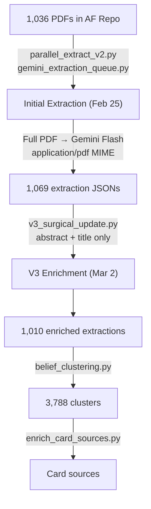

# Article Extraction Pipeline — Comprehensive Audit

## Executive Summary

**CW is partially right**: The v3 surgical update (which touched 1,010/1,069 files) used **abstract + title only, not PDFs**. However, the **initial extraction DID use full PDFs** uploaded to Gemini. The pipeline has two distinct phases with different data sources.

---

## Pipeline Architecture



## Phase 1: Initial PDF Extraction (Feb 25, 2026)

### Source Material
- **1,036 PDFs** stored in [AF repo](file:///Users/davidusa/REPOS/Article_Finder_v3_2_3/data/pdfs)
- 39 additional PDFs in AE repo (incoming, snowball, repaired)
- PDFs referenced by DOI filename (e.g. `10.1002_ad.2031.pdf`)

### Scripts Used
| Script | Role | PDF Input? |
|--------|------|-----------|
| [parallel_extract_v2.py](file:///Users/davidusa/REPOS/Article_Eater_PostQuinean_v1/scripts/parallel_extract_v2.py) | Main worker — uploads PDFs to Gemini | **YES** — `client.files.upload(mime_type="application/pdf")` |
| [gemini_extraction_queue.py](file:///Users/davidusa/REPOS/Article_Eater_PostQuinean_v1/scripts/gemini_extraction_queue.py) | Queue manager — 3-run escalation | **YES** — same upload mechanism |
| [classify_and_extract.py](file:///Users/davidusa/REPOS/Article_Eater_PostQuinean_v1/scripts/classify_and_extract.py) | Sequential two-pass (classify then extract) | **YES** — `classify_paper(client, pdf_path)` |

### Evidence of Full PDF Usage
```python
# From gemini_extraction_queue.py line 490-506:
with open(pdf_path, "rb") as f:
    uploaded = client.files.upload(file=f, config={"mime_type": "application/pdf"})
# ...
types.Part.from_uri(file_uri=uploaded.uri, mime_type="application/pdf")
```

### Output
- 1,069 extraction JSON files in `data/extractions/`
- 992 have `extracted_at` timestamp (Feb 25)
- Model: `gemini-2.5-flash`

---

## Phase 2: V3 Surgical Update (Mar 2, 2026)

### What It Did
Added v3-specific fields to existing extractions **using only abstract + title + finding samples**:
- `stimulus_description`, `stimulus_images`
- `theory_commitments`, `mechanism_chain`
- `molecule_ids`, `design_type`, `instruments`

### Scripts Used
| Script | Role | PDF Input? |
|--------|------|-----------|
| [v3_surgical_update.py](file:///Users/davidusa/REPOS/Article_Eater_PostQuinean_v1/scripts/v3_surgical_update.py) | Enrichment prompt | **NO** — uses `abstract[:500]` + title + DOI |
| [v3_reextraction_gemini.py](file:///Users/davidusa/REPOS/Article_Eater_PostQuinean_v1/scripts/v3_reextraction_gemini.py) | Re-extraction for zero-finding articles | **NO** — abstract + title |

### The Abstract-Only Prompt (v3_surgical_update.py line 94-110)
```
PAPER CONTEXT:
Title: {title}
DOI: {doi}
Article Type: {article_type}
Abstract: {abstract[:500] if abstract else 'Not available'}

Based on your knowledge of this paper (if you have encountered it)...
```

> [!WARNING]
> The v3 prompt says "based on your knowledge of this paper" — meaning Gemini is **hallucinating** stimulus descriptions and theory links from its training data, not from the actual paper text.

### Cost & Scale
- 1,010 articles updated
- Total cost: **$8.19** (avg $0.008/article)
- This low cost confirms no PDFs were uploaded (PDF extraction costs ~10-100× more)

---

## Field Provenance

| Field | Source | Fill Rate | Reliable? |
|-------|--------|-----------|-----------|
| `title` | Phase 1 (PDF) | 96% | ✅ Yes |
| `doi` | Phase 1 (PDF) | 97% | ✅ Yes |
| `authors` | Phase 1 (PDF) | 97% | ✅ Yes |
| `article_type` | Phase 1 (PDF) | 95% | ⚠️ Mixed (277 unknown) |
| `findings` (ant/cons/direction) | Phase 1 (PDF) | 97% | ✅ Yes — from full text |
| `effect_size` | Phase 1 (PDF) | 24% | ⚠️ Often absent in source papers |
| `sample_size` | Phase 1 (PDF) | 5.6% | ⚠️ Same |
| `p_value` | Phase 1 (PDF) | 31.7% | ⚠️ Same |
| `molecule_ids` | Phase 2 (abstract) | 41% | ❌ Hallucinated from Gemini knowledge |
| `stimulus_description` | Phase 2 (abstract) | 0.003% | ❌ Almost never filled |
| `theory_links` | Phase 1 + Phase 2 | 60% | ⚠️ Mixed provenance |
| `mechanism_chain` | Phase 2 (abstract) | — | ⚠️ From Gemini knowledge, not text |
| `crossref_abstract` | Crossref API | 71% | ✅ Yes |
| `crossref_citation_count` | Crossref API | 71% | ✅ Yes |

---

## Resources Summary

### PDFs
| Location | Count | Description |
|----------|-------|-------------|
| AF repo `data/pdfs/` | **1,036** | Main collection, DOI-named |
| AE `data/pdfs_incoming/` | 7 | Incoming queue |
| AE `data/pdfs_snowball/` | 8 | Snowball search additions |
| AE `data/production/pdf_repaired/` | ~24 | Recovered from failures |

### Extraction Outputs
| File Type | Count | Location |
|-----------|-------|----------|
| Extraction JSONs | **1,069** | `data/extractions/` |
| Article templates | **166** | `data/templates/` |
| Belief clusters | **3,788** | `data/materialized_views/belief_clusters.json` |
| Molecule definitions | **38** | `data/molecules/` |
| Card sources (enriched) | **4,004** total | `data/card_sources/` |

### Extraction Version Distribution
| Version × Model | Count |
|------------------|-------|
| gemini-2.5-flash + v3.0 | 992 |
| none + none (AF finder) | 28 |
| gemini-2.5-flash + none | 24 |
| none + v3.0 | 18 |

### Article Templates (166)
Rich structured knowledge:
- 154 with `mechanism_chain` — causal pathways
- 136 with `calibrated_parameters` — quantitative specs
- 128 with `key_references` — provenance links
- 118 with `building_types` — application context
- 97 with `outcome_domains` + `outcome_terms`

---

## Recommendations

1. **Re-run v3 enrichment WITH PDFs** for the 1,036 articles where we have them — this would dramatically improve stimulus_description, design_type, instruments, and effect_size fill rates
2. **Tag extractions with source provenance** — add a `source_input_type` field (pdf/abstract/title_only) so downstream consumers know what to trust
3. **Don't trust v3-only fields** (molecule_ids, stimulus_description from v3_surgical_update) — they're LLM-hallucinated from Gemini's training data, not from the actual papers
