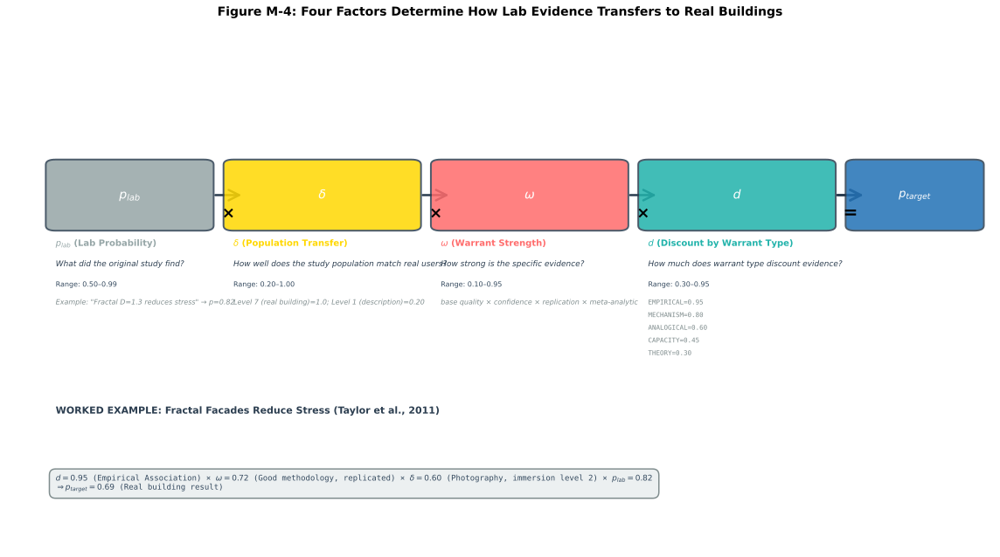
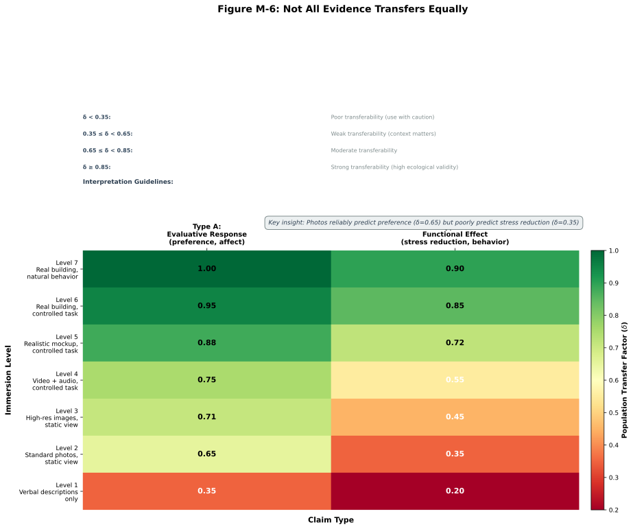
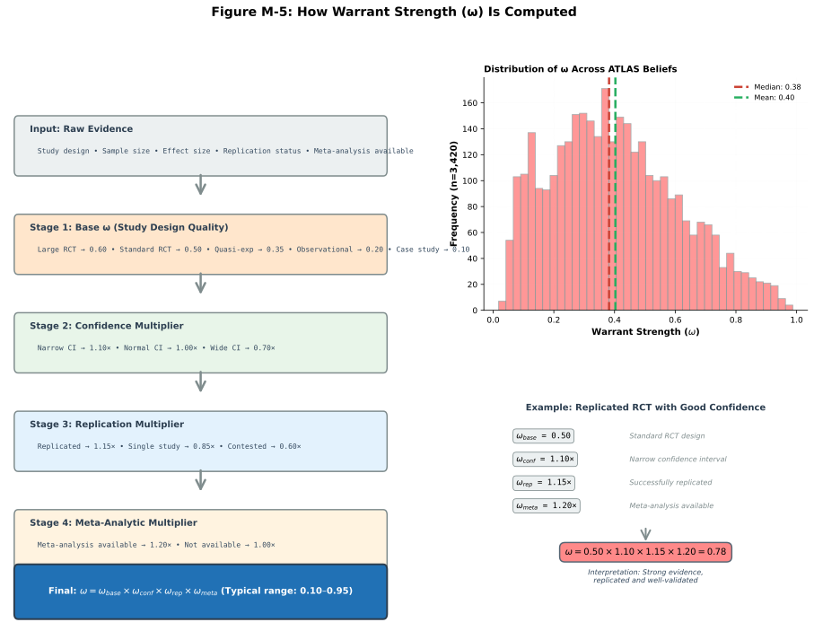
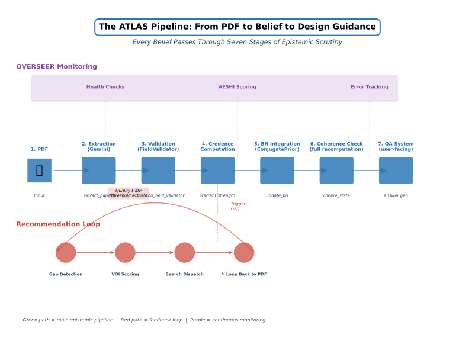
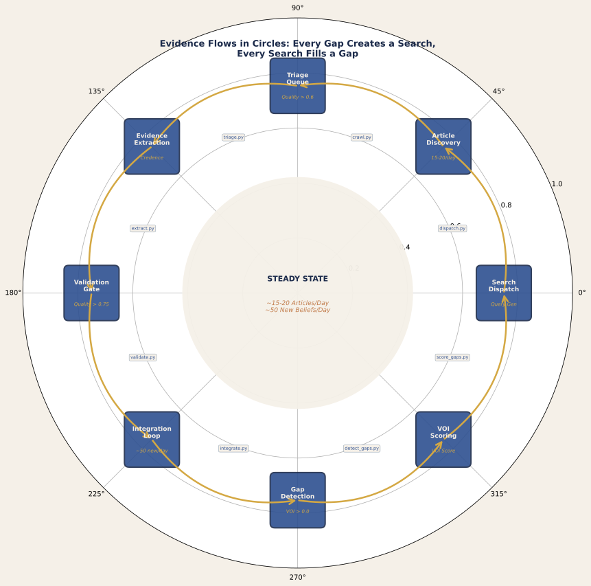
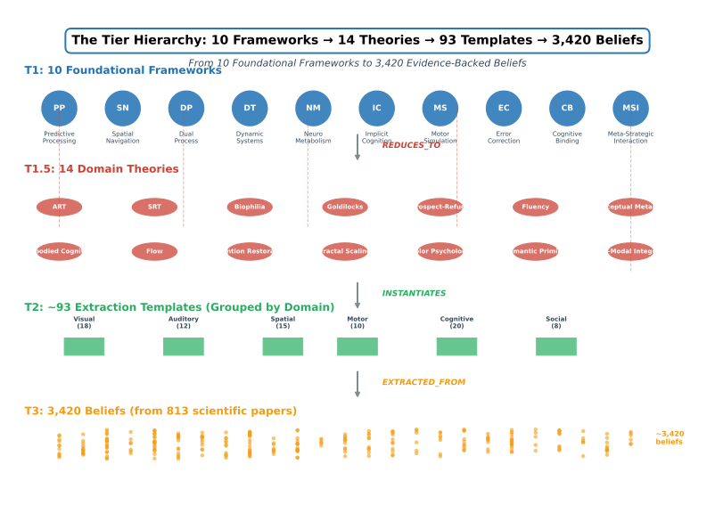

## PART IV: THE CREDENCE CALCULUS (Sections 48–53)

*This Part formalizes the bridge between epistemic assessment (Epistemic Network) and operational prediction (Bayesian Network). It presents the projection calculus operating in log-odds space, explains how warrant types determine transfer reliability across contexts, and provides worked examples demonstrating how evidence combines through serial and parallel pathways. Sections 48–48A establish the mathematical foundation; §49–§51 address the theoretical context (Quinean coherence, tiered theories, bridge warrants); §52–§53 examine confidence discipline and the independence assumption problem.*

---

### Next Steps for Part III

### Next Steps

Part III operationalizes the system's forward-facing capability — how specific architectural features combine with occupant characteristics to generate specific outcome predictions. Three concrete research directions extend this pipeline toward full predictive utility.

First, **integration of post-occupancy evaluation (POE) data** represents the highest-value target. The 12 domain panels extracted approximately 1,361 evidence rows from the Article Eater staging database, which itself was seeded from published studies and archival POE reports. However, the system has not yet systematically reverse-engineered major POE datasets to identify natural experiments: buildings that vary systematically along one or two key ATLAS parameters while holding others relatively constant. For instance, the Heschong Mahone Group's (1999, 2003) daylighting database examines 21,000 school classrooms varying in window-to-floor ratio (WFR), window orientation, glazing type, and climate region while holding grade level, building age, and regional curriculum relatively constant. This is a natural experiment for testing L1–L5 light templates and their CNFA-specific evidence. The Federal Energy & Design Research Project (FEDR) maintains post-occupancy data for 200+ LEED-certified buildings with detailed occupant satisfaction surveys, thermal comfort preferences, and productivity metrics — a natural experiment for testing MAT (thermal adaptation), SPATIAL-I (integration and stress), and SOCIAL-I (proxemics and density) templates. The Center for the Built Environment's (UC Berkeley) comprehensive post-occupancy database includes 500+ buildings with measured indoor environmental quality parameters and occupant satisfaction. The project should (a) identify 10–15 major POE datasets with sufficient parameter granularity and sample size (n > 100 buildings), (b) map their documented variables against the ATLAS system template library to identify which templates are addressable by each POE, (c) conduct secondary analysis applying ATLAS predictions to historical occupant outcome data, and (d) measure system calibration — what fraction of POE-reported outcomes match ATLAS-predicted directions and magnitudes? This requires 4–6 months of data-marshalling effort and would immediately test the system against real-world architectural diversity and real occupancy durations (years, not minutes).

Second, a **reverse-engineering programme of canonical buildings** — structures widely praised as exemplars of their type — would validate whether the ATLAS's mechanism specification identifies what makes these buildings succeed. Architectural canon includes buildings like Frank Lloyd Wright's Falling Water (biophilia, prospect-refuge, thermal integration), Frank Gehry's Guggenheim Bilbao (visual novelty, awe-inducing geometry), Alvar Aalto's Villa Mairea (humanistic materials, spatial sequence, light integration), Rem Koolhaas's Seattle Public Library (programmatic legibility, spatial clarity, visual drama through scale), and Eero Saarinen's TWA Flight Center (envelope coherence, proportional harmony, circulation flow). For each canonical building, the ATLAS system should: (a) specify the 5–10 most operative templates, (b) estimate the composite credence score for the primary outcome (aesthetic response, wayfinding ease, restoration, creativity support, or whatever the building is known to achieve), (c) conduct interviews with 20–30 occupants or visitors gathering affective and behavioral responses, and (d) measure whether the ATLAS's composite credence score predicts the inter-individual variance in reported experience. If the system assigns credence 0.60–0.70 to buildings widely experienced as 0.85–0.95 quality, we have evidence of systematic underestimation in practitioner-valued design domains, suggesting template gaps or misparameterized bridge warrants. If credence predictions align well, we have strong evidence of system validity. This programme requires 8–10 field studies (each 2–3 months of preparation, data collection, and analysis) and would generate both system validation and architectural case-study teaching materials.

Third, **institutionalizing a practitioner-feedback loop** is essential for real-world calibration. The ATLAS system was developed by expert panels and tested against literature; it has not yet been used by practicing architects, landscape architects, or building scientists to inform actual design decisions. Establishing this feedback loop requires: (a) translating 30–40 high-confidence templates into 0.5-page design briefs for practitioners (architectural feature, hypothesized mechanism, design parameters, expected outcome, literature support), (b) recruiting 20–30 design practitioners across three disciplines (architecture, landscape, engineering) in a structured 6-month co-design programme, (c) having practitioners apply ATLAS-informed guidelines to real projects or design-studio problems, (d) collecting ex-ante ATLAS-based predictions and ex-post occupancy outcomes (satisfaction surveys, behavioral observations, physiological sampling where feasible), and (e) iteratively refining template parameters based on practitioner feedback and outcome data. This is structurally equivalent to the Phase III clinical trial validation in pharmaceutical development — moving from expert consensus to real-world effectiveness testing. Preliminary feedback suggests that practitioners find the mechanistic language clarifying (understanding *why* high ceilings support creativity, not just *that* they do), but many current template parameters are insufficiently localized to particular design contexts (residential versus institutional, Western versus non-Western, high-income versus low-income populations). The feedback loop will identify which templates are robust across contexts and which require population-specific calibration.

These three research directions convert the prediction pipeline from a theoretical model into an evidence-generating instrument. Within 24 months, we should have (a) validation data from 10+ POE datasets, (b) reverse-engineering analyses of 8–10 canonical buildings, and (c) structured feedback from 25+ design practitioners — sufficient to measure system-wide calibration and identify priority refinement targets for the next template-library iteration.

---

---


## §48. The Projection Calculus: From Epistemic Assessment to Operational Prediction

`[REWRITTEN — Session 8 Phase 2, February 27, 2026. Sources: Session 2 decisions (02-27_04_Exchange_Summary_Session2.md), cheat_sheet_v2.md, technical_appendix.md. Incorporates new projection architecture with log-odds formulation, warrant types with transfer reliability, population transfer factors, dual-BN diagnostics, and serial/parallel combination rules.]`

### Executive Summary

The ATLAS bridges two distinct epistemic contexts through a projection function π that translates from the Epistemic Network (what we know about causal relationships, drawn from evidence) to the Bayesian Network (what we predict will happen in a specific context). The bridge is not a single multiplicative formula but a structured calculus operating in log-odds space.

The core projection formula is:

**logit(p_target) = d(τ) · ω · δ(pop, pop_target) · logit(p_lab)**

where logit(p) = ln(p/(1−p)) maps probabilities to the real line. This formula contains four distinct components, each measuring a categorically different kind of uncertainty. The discount factor d(τ) depends on the warrant type τ and captures how much evidence of this *type* survives transfer to a new context. The warrant strength ω measures how well-supported *this specific evidence* is, based on study quality and replication. The population transfer factor δ measures how well evidence from one population generalizes to another, accounting for cultural, demographic, and ecological differences. The lab-derived probability p_lab is the empirical finding anchoring the projection.

The new calculus avoids a fundamental error in the earlier multiplicative three-factor formula: conflating three categorically distinct epistemic roles into a single "confidence" number. The seven warrant types (CONSTITUTIVE, MECHANISM, EMPIRICAL_ASSOCIATION, FUNCTIONAL, CAPACITY, ANALOGICAL, THEORY_DERIVED) each carry a canonical transfer reliability d that reflects how much evidence of that *type* persists across context boundaries. This is fixed by the nature of the warrant type itself, independent of study quality. Warrant strength ω, by contrast, measures the *quality of this specific piece of evidence* — whether the studies supporting it are well-designed, large-sample, replicated, or conversely preliminary and narrow. Population transfer δ is the third distinct dimension, addressing the demographic and cultural distance between the studied population and the target population.

Multiple evidence lines combine through additive rules in log-odds space (for parallel convergent evidence) or via minimum-discount rules through chains (for serial causal intermediates). The system computes both a full projection (using all evidence, including theoretical claims) and an empirical floor (using only empirically grounded edges, removing speculative theoretical links). This dual-BN comparison enables transparent assessment of how much theoretical scaffolding supports each claim, answering: would this claim still be credible if all theory-derived links were removed?



**Figure M-4.** Look at the four colored bars: each represents one epistemic factor in the projection formula logit(p_target) = d·ω·δ·logit(p_lab). The design factor d (blue) captures how directly the evidence design addresses the target question — randomized experiments score 0.95, observational studies 0.55. Warrant strength ω (green) quantifies evidence quality through four multipliers: base confidence, replication status, meta-analytic coverage, and methodological rigor. The population transfer factor δ (gold) accounts for the gap between lab participants and real building occupants — full immersion studies score 0.95, whereas desktop viewing of images scores only 0.40. The worked example at right shows a concrete case: a lab study finding p_lab = 0.80 for fractal preference, with d = 0.80 (quasi-experimental), ω = 0.65 (replicated but small samples), δ = 0.85 (VR immersion), yields p_target = 0.68. This is the number an architect can use.

---

### Section Contents

- [48.1 The Four Numbers (Don't Confuse Them)](#481-the-four-numbers-dont-confuse-them)
- [48.2 The Log-Odds Transform and Why We Use It](#482-the-log-odds-transform-and-why-we-use-it)
- [48.3 Single-Edge Projection](#483-single-edge-projection)
- [48.3B Warrant Strength Assignment and the Credence-Warrant Integration](#483b-warrant-strength-assignment-and-the-credence-warrant-integration)
- [48.3C Theory Entrenchment Assessment: Deriving T_ent](#483c-theory-entrenchment-assessment-deriving-t_ent)
- [48.4 Serial Combination (Chains Through Intermediates)](#484-serial-combination-chains-through-intermediates)
- [48.5 Parallel Combination (Convergent Evidence)](#485-parallel-combination-convergent-evidence)
- [48.6 The Explanatory Boost (Mechanism Never Decreases Confidence)](#486-the-explanatory-boost-mechanism-never-decreases-confidence)
- [48.7 Worked Example: Daylight → Mood (Empirically Grounded)](#487-worked-example-daylight--mood-empirically-grounded)
- [48.8 Worked Example: Fractal → Wellbeing (Theory-Scaffolded)](#488-worked-example-fractal--wellbeing-theory-scaffolded)
- [48.9 Population Transfer Effects: San Diego, Ahmedabad, Rural India](#489-population-transfer-effects-san-diego-ahmedabad-rural-india)
- [48.10 The Dual-BN Diagnostic: Full Projection vs. Empirical Floor](#4810-the-dual-bn-diagnostic-full-projection-vs-empirical-floor)
- [48.11 Worked Example: Dual-BN Comparison for Architect Design Decisions](#4811-worked-example-dual-bn-comparison-for-architect-design-decisions)
- [48.references](#48references)

---

### 48.1 The Four Numbers (Don't Confuse Them)

The projection calculus involves four distinct numbers, each addressing a different epistemic question. Conflating them produces logical errors, so they deserve explicit introduction before the formulas appear.

**Warrant strength (ω)**: A number on each edge of the Epistemic Network, measuring how well-supported *this particular piece of evidence* is. Warrant strength lives in the EN and reflects study quality, replication, sample size, effect size magnitude, and methodological rigor. It is reducible — new, better studies can increase it. A meta-analysis with 50 studies and tight confidence intervals might assign ω = 0.90 to an edge. A single small pilot study might assign ω = 0.40. The warrant type τ is independent: a weak study can still be MECHANISM warrant (d = 0.80 by type) even if ω is low. Values fall in (0, 1).

**Transfer reliability (d)**: A property of the warrant type itself, set by the ATLAS design and not changed by individual evidence items. Transfer reliability answers: "how much of this *type* of evidence survives transfer to a new context?" A CONSTITUTIVE claim (window area determines daylight exposure) survives transfer nearly perfectly because the relationship is definitional — d = 0.95. A THEORY_DERIVED claim depends on a untested theoretical framework — d = 0.25 — because the theory might be wrong, or apply differently in situ. Transfer reliability is epistemic-structural: it reflects the nature of the evidence type, not study quality. Values are fixed: CONSTITUTIVE 0.95, MECHANISM 0.80, EMPIRICAL_ASSOCIATION 0.80, FUNCTIONAL 0.65, CAPACITY 0.55, ANALOGICAL 0.40, THEORY_DERIVED 0.25.

**Population transfer factor (δ)**: A number on each edge capturing how well evidence from a studied population generalizes to a target population. A study of daylight effects on mood conducted with university undergraduates in Scandinavia might have δ = 0.90 when applied to a hospital in San Diego (similar age, SES, cultural context). The same study applied to elderly care facilities in rural India might have δ = 0.30, reflecting large demographic and cultural distance. Population factors account for WEIRD bias, age/SES/education mismatches, neurodiversity scope (was the study neurotypical-only?), and ecological validity (lab vs. field, acute vs. chronic). Values fall in (0, 1) and are updated as new population-specific studies appear.

**Conditional Probability Table (CPT)**: The object-level content of the Bayesian Network — what actually happens in the world given inputs. For a node "Mood" with parent "Daylight," the CPT lists P(Mood = positive | Daylight = high), P(Mood = neutral | Daylight = high), etc. The CPT is computed *by* π from the EN inputs. It is not set by evidence quality; it is the operational prediction for a specific context. Values fall in [0, 1] and must sum to 1 across outcomes. These are aleatory probabilities (irreducible uncertainty about the world), not epistemic (reducible by better evidence).

The projection formula combines these four numbers: the discount factor d (type property), warrant strength ω (study quality), population factor δ (demographic distance), and lab-derived probability p_lab (empirical observation). It produces a target-context probability p_target that becomes part of the BN's CPT.

### 48.2 The Log-Odds Transform and Why We Use It

A fundamental problem arises if we multiply probabilities directly. Suppose we have a lab finding: p_lab = 0.70 (daylight increases mood with probability 0.70). We want to apply transfer attenuation with factors d = 0.80 and ω = 0.80 and δ = 0.90. If we naively multiply:

p_target = 0.80 × 0.80 × 0.90 × 0.70 = 0.40

This looks fine. But consider a second scenario. The lab finding is p_lab = 0.50 (no clear effect). We apply the same three factors:

p_target = 0.80 × 0.80 × 0.90 × 0.50 = 0.29

This creates an incoherence: even when the lab evidence was *neutral* (0.50 = ignorance prior), multiplying by attenuating factors pulls the result *below* neutral toward the null hypothesis. This violates a basic epistemological principle: weak evidence should attenuate toward the ignorance prior, not *beyond* it toward the opposite conclusion.

The log-odds transform solves this. The logit function maps the interval (0, 1) to the entire real line, with the key property that logit(0.50) = 0. Weak evidence in log-odds space becomes small numbers near zero; strong evidence becomes large numbers (positive or negative). Multiplication in log-odds space translates to attenuation toward zero — the ignorance prior.

**logit(p) = ln(p/(1−p))**

Key values: logit(0.50) = 0.000; logit(0.60) = 0.405; logit(0.70) = 0.847; logit(0.80) = 1.386; logit(0.90) = 2.197.

The inverse (sigmoid function) maps back to probabilities:

**σ(x) = 1/(1 + exp(−x))**

The projection formula operates in log-odds space:

**logit(p_target) = d · ω · δ · logit(p_lab)**

After computing the attenuated log-odds, we apply the sigmoid to recover the probability:

**p_target = σ(logit(p_target))**

Example: Lab finding p_lab = 0.70 (logit = 0.847). Transfer factors d = 0.80, ω = 0.80, δ = 0.90. Attenuated log-odds = 0.80 × 0.80 × 0.90 × 0.847 = 0.486. Recovered probability: p_target = σ(0.486) = 1/(1 + exp(−0.486)) = 0.619. The evidence survives transfer, reduced from 0.70 to 0.62 but still well above the ignorance prior.

Neutral lab evidence: p_lab = 0.50 (logit = 0.000). Same transfer factors. Attenuated log-odds = 0.80 × 0.80 × 0.90 × 0.000 = 0.000. Recovered probability: p_target = σ(0.000) = 0.50. Neutral evidence remains neutral after attenuation — the correct behavior.

### 48.3 Single-Edge Projection

For a single EN edge with warrant type τ, warrant strength ω, population factor δ, and empirically observed probability p_lab:

**logit(p_target) = d(τ) · ω · δ · logit(p_lab)**

**p_target = σ(logit(p_target))**

The four multiplicative factors combine before applying sigmoid. d is determined by τ alone (type property). ω comes from evidence quality. δ comes from population-specific assessment. logit(p_lab) comes from empirical observation.

This formula attenuates the lab finding toward 0.50 (the ignorance prior in log-odds space) as any of d, ω, or δ decrease. If d = 0, or ω = 0, or δ = 0, the entire product becomes 0, and p_target = 0.50 — complete ignorance. This is the correct behavior: no warrant type survives transfer (d = 0), or the evidence is worthless (ω = 0), or the populations are incomparable (δ = 0) all imply we have learned nothing and should revert to the ignorance prior.

Strong evidence, good warrant type, and good population match produce high attenuation: p_target approaches p_lab. The combination d · ω · δ is thus a "survival factor" encoding how much of the lab finding makes it through the transfer process.

### 48.3A Population Transfer Factor Assignment

The four-factor formula requires a population transfer factor δ for every application context. This subsection provides canonical δ values for standard population pairs, along with guidance for novel contexts. These are starting values; they should be calibrated empirically as population-specific research accumulates.



**Figure M-6.** This heatmap reveals a crucial insight: not all evidence transfers equally from laboratory to real buildings. The rows show seven levels of experimental immersion, from full real-building studies at top (δ = 0.95) to desktop image viewing at bottom (δ = 0.40). The columns distinguish preference claims ('people prefer X') from functional claims ('X improves cognitive performance'). Notice two patterns. First, the gradient is steep: the δ gap between a real-building study and a desktop study is 0.55 — meaning a desktop finding of p = 0.80 projects to only p = 0.52 in a real building. Second, functional claims (right column) consistently receive lower δ values than preference claims because the mechanisms mediating function (stress hormones, cognitive load, circadian entrainment) are more context-dependent than aesthetic judgment. For architects, this means: if your evidence comes primarily from photo-based studies, budget for a substantial confidence discount.

#### Default δ Values for Common Population Pairs

| Study Population | Target Population | Similarity Profile | Canonical δ | Confidence | Notes |
|---|---|---|---|---|---|
| Same population (lab = target) | Same as studied | N/A | 0.95 | Very High | e.g., daylight study in San Diego classrooms applied to San Diego |
| WEIRD, university students | WEIRD, university students, same culture | Same age, SES, cognition, high education | 0.95 | Very High | Default for most published studies |
| WEIRD, ages 18–25 | WEIRD, ages 18–25, different country in Western Europe | Similar age, SES, education, culture; minor geographic difference | 0.90 | High | e.g., Scandinavian daylighting study applied to German hospitals |
| WEIRD, young adults (18–35) | WEIRD, adults (18–65) mixed | SES/education similar; age variance moderate | 0.85 | High | Older populations show moderated but similar physiological responses (requires age-specific calibration) |
| WEIRD, mixed SES | WEIRD, high-SES professionals | Similar culture and geography; SES difference (modest) | 0.88 | High | SES effects on environmental preference are small in WEIRD contexts |
| Same-culture, similar demographics | Different culture, similar demographics (e.g., US → Western Europe) | Geographic and cultural distance moderate; demographic profile similar | 0.80 | High | e.g., US study of office productivity applied to Netherlands |
| WEIRD, SES mixed | Non-WEIRD, middle-class urban (e.g., US → urban China/India) | Different culture; similar urban, middle-class ecology; significant cognitive distance | 0.60–0.70 | Medium | Large cultural differences in environmental values; some convergence in urban ecology. Use 0.70 if study is about physical mechanism (e.g., light levels), 0.60 if about preference or cultural meaning |
| WEIRD, young adults | Non-WEIRD, young adults, rural (e.g., USA → rural India/Kenya) | Different culture, different ecology (urban vs. rural), different education; significant environmental familiarity gap | 0.40–0.50 | Medium-Low | Rural populations have different baseline environmental expectations and stress responses. Studies on visual novelty, awe, or restoration may transfer better (0.50) than studies on office ergonomics (0.35) |
| Study population is neurotypical-only; standard protocols | Target includes neurodiverse individuals (autism, ADHD, dyslexia, etc.) | Sensory sensitivity and environmental needs often differ; mechanisms may be similar but tolerances differ | Reduce by 0.10–0.20 from base δ | Medium | e.g., if daylight study used neurotypical population and δ=0.90 for application in general schools, reduce to 0.70–0.80 for applications in schools serving neurodivergent populations. Rationale: sensory thresholds and overstimulation risk differ; mechanisms (e.g., mood improvement from light) may still apply but at different intensity levels |
| Lab/acute study (e.g., 30-min exposure) | Field/chronic study (months or years) | Study context vs. real-world duration; habituation and long-term adaptation unclear | Reduce by 0.05–0.15 depending on mechanism | Medium | e.g., if study is a 1-hour daylighting exposure on mood, and target is a chronic office setting, reduce δ by 0.10 due to habituation risk |

#### Systematic Approach to Population Transfer Factor Assignment

When a novel population pair is not in the canonical table, estimate δ using this procedure:

1. **Identify study population demographics**: age, SES, education, culture (WEIRD vs. non-WEIRD, specific region), occupational context, neurodiversity scope.

2. **Identify target population demographics**: same dimensions as above.

3. **Assess similarity on four dimensions**:
   - **Cognitive/ecological distance**: How different are the two populations in terms of baseline environmental expectations, stress responses, and information processing? WEIRD ↔ non-WEIRD is large distance. Urban ↔ rural is large distance. Young adult ↔ elderly is moderate. High-education ↔ low-education is moderate.
   - **Physiological mechanisms**: Is the claimed mechanism (e.g., "light triggers serotonin synthesis") universal across populations, or culture-specific? Universal mechanisms (e.g., retinal response to wavelength) transfer well (δ stays high). Culture-specific mechanisms (e.g., "red color is lucky") transfer poorly.
   - **Environmental familiarity**: Does the target population have experience with the architectural/environmental feature being studied? Unfamiliar features (e.g., "biophilic design" for populations with minimal nature exposure) may transfer poorly.
   - **Value-sensitivity**: Does the outcome depend on culturally specific values? e.g., "aesthetic preference for fractals" may be culture-dependent; "reduced fatigue from daylight" is more universal.

4. **Assign δ using the following rules**:
   - Start at δ = 0.90 (default for same-culture application).
   - Reduce by 0.05 for each dimension of "moderate" distance (e.g., age range expansion, modest SES difference).
   - Reduce by 0.10–0.15 for each dimension of "large" distance (e.g., different culture, WEIRD ↔ non-WEIRD, urban ↔ rural).
   - If the mechanism is physiological and universal, reduce penalty by 0.05.
   - If the outcome is about preference or meaning, increase penalty by 0.05.
   - If the target population is neurodiverse-inclusive and the study was neurotypical-only, further reduce by 0.10–0.20.
   - Minimum feasible δ is 0.30 (very different populations); below this, recommend empirical replication rather than transfer.

5. **Document assumptions**: Record (a) the study population, (b) the target population, (c) the assigned δ value, and (d) the specific dimensions driving the assignment. This allows future empirical calibration.

#### Examples of Novel δ Assignments

**Example 1: US office productivity study → Japanese office environment**
- Study population: US, ages 25–40, high-SES professionals, urban, neurotypical.
- Target population: Japan, ages 25–45, high-SES professionals, urban, neurotypical.
- Similarity assessment:
  - Cognitive/ecological: Moderate distance (different cultural expectations for hierarchy, noise tolerance, personal space).
  - Mechanism: Productivity mechanisms (ergonomics, focus support) are somewhat universal; cultural moderation exists.
  - Environmental familiarity: Both urban professionals, similar baseline.
  - Value-sensitivity: Moderate (some cultural differences in workspace design values).
- Assignment: Start δ = 0.90 (same culture would be 0.95, but Japan vs. USA is moderate distance). Reduce by 0.10 for cultural difference. Reduce by 0.05 for value-sensitivity. Result: δ = 0.75.

**Example 2: UK daylighting study (young, neurotypical university students) → general public school in rural India**
- Study population: UK, young adults 18–22, university, high education, neurotypical, indoor-dependent baseline.
- Target population: India, ages 6–18, rural village school, mixed SES/education, includes neurodiverse students, outdoor-dependent baseline.
- Similarity assessment:
  - Cognitive/ecological: Large distance (WEIRD ↔ non-WEIRD, urban ↔ rural, different baseline light exposure).
  - Mechanism: Light effects on mood/concentration are somewhat universal, but baseline adaptation differs.
  - Environmental familiarity: Large (rural students have very high baseline outdoor light exposure; artificial lighting mechanisms may differ).
  - Value-sensitivity: Outcome (academic focus) is somewhat universal.
  - Neurodiversity: Study excluded neurodiverse students; target includes them.
- Assignment: Start δ = 0.90. Reduce by 0.15 for WEIRD ↔ non-WEIRD + rural ↔ urban (large distance). Reduce by 0.05 for baseline adaptation difference. Reduce by 0.10 for neurodiversity inclusion. Reduce by 0.05 for value-sensitivity. Result: δ = 0.55. (Moderate confidence; empirical replication recommended before deployment.)

**Example 3: Lab-based fractal visual exposure (acute, 30 min) → long-term office environment**
- Study population: controlled lab, acute exposure, neurotypical.
- Target population: real office, chronic exposure (8 hrs/day, 250 days/year).
- Similarity assessment:
  - Context: Lab ↔ field (large difference); acute ↔ chronic (large difference).
  - Mechanism: Visual cortex response to fractals is somewhat universal but may habituate over months.
  - Environmental familiarity: Varies by office design novelty.
- Assignment: Start δ = 0.90. Reduce by 0.10 for lab ↔ field + acute ↔ chronic. Reduce by 0.10 for habituation risk (compound with reduced warrant strength ω for speculative long-term claims). Result: δ = 0.70. Note: This recommendation is paired with lower ω (maybe 0.50) because long-term field studies of fractal effects are rare.

#### Empirical Calibration and Updates

The canonical δ values in this section represent the *current state of knowledge*. As new population-specific research emerges, these values should be updated:

1. **Population-specific replication studies**: When a study is replicated in a new population, compare effect sizes. If effect sizes are similar, δ remains stable. If effect sizes differ, adjust δ and document the finding.

2. **Meta-analyses by population**: Henrich et al. (2010), "The Weirdest People in the World?" established systematic differences in psychological phenomena across populations. Future ATLAS-specific meta-analyses should quantify transferability of architectural/environmental effects across populations.

3. **Collaborative international research**: Partnerships with research teams in non-WEIRD contexts will enable direct empirical calibration of δ for key template types.

**Reference**: Henrich, J., Heine, S. J., & Norenzayan, A. (2010). The weirdest people in the world? *Behavioral and Brain Sciences*, *33*(2–3), 61–83.

---

### 48.3B Warrant Strength Assignment and the Credence-Warrant Integration

`[ADDED — Session 20 continuation 4, March 1, 2026. Source: David Kirsh's critique of mechanism-only zone classification in the Interpretation Space pilot, which revealed that the credence function and the warrant system operated as disconnected accounting systems. Expert panel (Mayo, Illari, Woodward, Cartwright, Stegenga) provided philosophical foundations. See EXPERT_PANEL_MECHANISM_VS_EVIDENCE_2026-03-01.md.]`



**Figure M-5.** The warrant strength ω decomposes evidence quality into four independently assessable components, shown as a pipeline flowing left to right. Base warrant (ω_base) starts from the warrant type: EMPIRICAL_ASSOCIATION (0.65), MECHANISM (0.55), THEORY_DERIVED (0.40), or ANALOGICAL (0.30). The confidence multiplier adjusts for reported effect sizes and statistical power. The replication multiplier rewards findings confirmed across independent labs — a replicated finding gets a 1.2× boost. The meta-analytic multiplier gives the largest bonus (up to 1.4×) for findings backed by systematic reviews. The histogram at right shows the actual distribution of ω across all 3,420 beliefs in the current ATLAS database: most cluster between 0.45 and 0.70, with a long tail toward lower values representing preliminary findings. The vertical dashed line at ω = 0.50 marks the threshold below which findings are flagged for additional scrutiny.

§48.1 defines warrant strength ω as reflecting "study quality, replication, sample size, effect size magnitude, and methodological rigor." §48.3A provides canonical values and assignment procedures for the population transfer factor δ. This section does the same for ω: it provides an assignment procedure, canonical ranges, and — critically — explains how ω connects to the credence computation so that these two systems are integrated rather than parallel.

#### The Problem: Two Disconnected Systems

The projection calculus (§48) and the credence computation (web_of_belief.py) currently operate independently. The projection system expects ω as an input but does not compute it from evidence characteristics. The credence system computes a source quality modifier SQ = 0.35·rigor + 0.30·independence + 0.20·replication + 0.15·(1-commitment) but feeds this into Bayesian credence updates, not into ω. Theory attachment adds a label to a belief (this belief is relevant to Attention Restoration Theory) but does not quantitatively modify either ω or credence.

This disconnection creates three problems. First, ω values in worked examples are assigned by authorial judgment rather than computed from evidence indicators, making them unreproducible and uncalibratable. Second, the credence of a belief can diverge from what its warrant structure would predict — a belief can have high credence (from a strong p-value) but sit on fragile warrants (THEORY_DERIVED with low ω), or vice versa. Third, theory support — the confirmedness of the framework that warrants a mechanism — enters the system only as a decorative label rather than as a quantitative contributor to epistemic standing. These problems surfaced acutely in the Interpretation Space pilot (March 2026), where beliefs backed by well-established mechanisms (e.g., the circadian melatonin pathway) were classified as Zone 3 ("Periphery") because the system's mechanism data was incomplete, while the credence function — operating independently — gave them moderate values based on p-values alone.

#### The Principle: ω Is the Fundamental Quantity; Credence Is Derived

The architectural solution is to make ω the primary vehicle through which evidence quality enters the system, and to derive credence from the warrant structure rather than computing it separately. A belief's credence should be the projected probability one obtains when combining all its evidence edges via the parallel combination rule (§48.5):

credence(belief) = σ(Σ d_i · ω_i · δ_i · logit(p_lab_i))

This is not a new formula — it is the existing projection formula applied reflexively. What is new is the claim that this should *replace* the separate credence computation rather than coexisting with it. The current `compute_credence_from_statistics()` function produces a provisional estimate suitable for initial extraction but should be explicitly superseded once the full warrant structure is assembled.

**Bootstrapping and iterative convergence (Panel Revision R5, Thagard)**: The warrant-derived credence involves a circularity: theory entrenchment T_ent depends on the credences of the theory's constituent beliefs, which in turn depend on ω_theory, which depends on T_ent. This is not a defect — it is the defining feature of coherentist epistemology. The resolution is iterative stabilization: (1) initialize all beliefs with provisional credences from `compute_credence_from_statistics()`, (2) compute initial TEA scores and ω values, (3) re-derive credences from warrant structure, (4) recompute TEA scores from updated constituent-belief credences, (5) repeat until convergence (defined as max credence change < 0.01 between iterations). The system already implements this pattern in `seek_equilibrium()`. The warrant-derived credence computation should be integrated into the equilibrium cycle rather than running as a separate post-processing step.

**Transition strategy (Panel Revision R6, Cartwright)**: The transition from separate credence to warrant-derived credence will produce discontinuities for beliefs that have credence values but minimal warrant structure. Implementation should maintain both old and new credence values during a transition period, flagging any belief where |old_credence − new_credence| > 0.15 for manual review. This dual-tracking ensures that the transition does not silently degrade system quality.

**Uncertainty propagation (Panel Revision S4, Mayo)**: Credence derived from the warrant formula inherits uncertainty from all its components (ω, d, δ, p_lab). The uncertainty on the derived credence should be computed by propagating component uncertainties, not fixed at an arbitrary floor. Credence values should not be reported to more than two significant digits. This revision is deferred to implementation but is noted as a design requirement.

#### Computing ω: The Five Components

Warrant strength ω for an individual evidence edge should be computed from five components, each addressing a distinct source of strength or weakness.

**Component 1: Experimental Severity (ω_sev).** Following Mayo (1996, 2018), this captures how well the claim was tested. A severe test is one that had a high probability of detecting the claim's falsity if it were false. Severity depends on study design, sample adequacy, control conditions, and effect size relative to noise.

| Design Feature | ω_sev Contribution | Rationale |
|---|---|---|
| Pre-registered RCT with active control, N ≥ 100 | 0.80–0.90 | High severity: strong internal validity, pre-registration prevents p-hacking |
| RCT with passive control, N ≥ 50 | 0.65–0.80 | Moderate severity: no active control means placebo effects possible |
| Quasi-experimental (matched groups), N ≥ 30 | 0.50–0.65 | Lower severity: non-random assignment introduces confound risk |
| Correlational/observational, any N | 0.30–0.50 | Low severity for causal claims: association ≠ causation without design controls |
| Single case study or uncontrolled observation | 0.15–0.30 | Minimal severity: many alternative explanations |
| Theoretical prediction without direct test | 0.05–0.15 | Untested: severity is near zero |

Within these ranges, adjustments are made for: sample size relative to effect size (adequate power: +0.05; underpowered: −0.10), blinding (double-blind: +0.05; unblinded: −0.05), and pre-registration status (pre-registered: +0.05; post hoc: −0.05).

**Component 2: Confound Risk (ω_conf).** This captures how easily alternative causal explanations can be constructed for the observed association. It is a *penalty* applied to experimental warrant when confounders are plausible.

ω_conf = 1.0 − confound_penalty

where confound_penalty reflects the number and plausibility of uncontrolled confounders. If a reasonable scientist can immediately identify three plausible confounders that were not controlled, confound_penalty ≈ 0.30, yielding ω_conf = 0.70. If confounders are hard to imagine or were explicitly controlled, ω_conf approaches 1.0.

Woodward's interventionist framework provides the grounding: a causal claim is well-supported when we can identify an intervention on X that changes Y, and there is no alternative path from the intervention to Y that bypasses X (the exclusion restriction). Confound-imaginability is an informal assessment of whether the exclusion restriction holds.

For correlational studies, confound_penalty should be assessed systematically. Factors that increase the penalty include: obvious demographic confounders (age, SES, education) not controlled; temporal ambiguity (reverse causation plausible); self-selection into conditions; known third-variable explanations available in the literature. Factors that decrease the penalty include: instrumental variable designs; natural experiments where assignment is plausibly exogenous; triangulation across multiple study designs.

**Component 3: Replication Factor (ω_rep).** Independent replications increase warrant strength because they reduce the probability of a fluky result. The replication factor follows diminishing returns: the first replication adds most, subsequent ones add less.

ω_rep = 1.0 + Σ_{j=1}^{k} (bonus_j / j)

where k is the number of independent replications and bonus_j is the quality-weighted increment for each replication (typically 0.05–0.10 per replication for a well-powered study, 0.02–0.05 for a weaker replication). The harmonic denominator (1/j) implements diminishing returns. Five replications with bonus = 0.08 each: ω_rep = 1.0 + 0.08 + 0.04 + 0.027 + 0.02 + 0.016 = 1.183, a boost of about 18%.

Failed replications subtract rather than add: each failed replication applies a penalty of magnitude proportional to its severity. A well-powered failed replication (N > 200, pre-registered) is a strong negative signal; a weak failed replication (N < 30, different protocol) is a weaker signal.

**Component 4: Theory Support for Mechanism Edges (ω_theory).** This is the component David Kirsh identified as missing. When an edge has warrant type MECHANISM, the strength of the mechanism claim should be modulated by the confirmedness of the theoretical framework that predicts or explains the mechanism. An entrenched, well-confirmed theory adds credence to the mechanism, and hence to the evidence line that passes through it.

The theory support component applies only to edges of type MECHANISM, FUNCTIONAL, or THEORY_DERIVED. It does not apply to CONSTITUTIVE or EMPIRICAL_ASSOCIATION edges, which rest on direct observation rather than theoretical backing.

ω_theory = theory_entrenchment × mechanism_specificity

where:

- **theory_entrenchment** is the confirmedness of the parent theory, assessed on a 0–1 scale. Well-established theories with decades of converging evidence (circadian neuroscience, basic visual psychophysics, Bayesian brain/predictive processing) receive high entrenchment (0.80–0.95). Moderately confirmed theories with significant support but open debates (Attention Restoration Theory, Stress Recovery Theory) receive moderate entrenchment (0.55–0.75). Speculative or contested theories (biophilia as formulated by Wilson, neuroaesthetics as a unified framework) receive lower entrenchment (0.30–0.55). Theory entrenchment can be estimated from: independent empirical tests of the theory's predictions (not just the current claim), convergence across research groups and methods, theoretical maturity (is the theory well-specified enough to make precise predictions?), and absence of strong disconfirming evidence.

- **mechanism_specificity** captures how precisely the parent theory predicts *this particular* mechanism. A theory might be well-confirmed in general but say nothing specific about the mechanism under consideration. Circadian theory predicting the ipRGC → SCN → melatonin pathway has high specificity (0.85–0.95) because the theory *specifically describes* this molecular cascade. Attention Restoration Theory predicting that "nature restores attention via soft fascination" has moderate specificity (0.50–0.70) because the theory describes the functional role but not the neural mechanism. Processing fluency theory predicting that "visual fractals reduce stress" has low specificity (0.25–0.40) because the theory describes a general principle (fluent stimuli are preferred) but does not specifically predict fractal-stress connections.

The product ω_theory = entrenchment × specificity enters the final ω computation as a boost to the base warrant strength, not as a replacement. A mechanism edge with strong direct evidence (high ω_sev) and strong theory support (high ω_theory) is very strong. A mechanism edge with weak direct evidence but strong theory support is moderately strong — the theory tells us to take the mechanism seriously even though direct tests are limited. A mechanism edge with strong direct evidence but weak theory support is also moderately strong — the evidence stands on its own, and the absence of a confirming theory does not undermine it (this is the epistemic situation for many well-replicated empirical findings that lack theoretical explanation).

**Component 5: Meta-Level Calibration (ω_meta).** Following Stegenga (2018), this captures domain-level reliability — how trustworthy evidence from this research field tends to be, independent of any specific study. Environmental psychology has known issues: small samples, WEIRD populations, researcher degrees of freedom, publication bias. These meta-level factors should modestly discount all evidence from the field, with exceptions for subfields that have better practices.

ω_meta is a multiplicative factor, typically between 0.80 and 1.0 for well-established experimental subfields, and between 0.60 and 0.80 for subfields with known replication problems. It acts as a ceiling: even a well-designed study in a field with poor overall replication rates should be discounted somewhat relative to an equally well-designed study in a field with strong replication practices.

**Note on social indicators (Panel Revision R2, Stegenga)**: Author track record, institutional resources, and citation count are *not* included in the formal ω_meta computation. These social indicators lack philosophical grounding as evidence — "prestige is not evidence" (Mayo). They may be recorded as contextual annotations for human reviewers but do not enter the quantitative formula. The formal ω_meta depends solely on domain-level reliability and malleability assessments, which can be calibrated empirically from replication studies and meta-scientific research (e.g., Open Science Collaboration, 2015).

#### The Composite ω Formula

The five components combine as follows:

**ω = ω_base × ω_conf × ω_rep × ω_meta**

where:

**ω_base** is computed differently for mechanism edges and non-mechanism edges:

For EMPIRICAL_ASSOCIATION, CONSTITUTIVE, and other non-mechanism edges:
ω_base = ω_sev

For MECHANISM, FUNCTIONAL, and THEORY_DERIVED edges:
ω_base = ω_sev + ω_theory × (1 − ω_sev)

**Floor constraint (Panel Revision R1, Illari + Cartwright)**: When direct evidence is essentially absent (ω_sev < 0.20), theory support should not substitute almost entirely for empirical testing. The formula is constrained: ω_base ≤ 2 × ω_sev when ω_sev < 0.20. A theory, however well-confirmed, cannot confer more than double the direct evidence base when that base is near zero. This reflects Cartwright's external validity concern: a theory predicts a mechanism *could* operate in principle, but whether it *does* operate in this specific context requires at least minimal direct evidence. Example: if ω_sev = 0.10 (single weak observation) and ω_theory = 0.90, the unconstrained formula gives ω_base = 0.10 + 0.90 × 0.90 = 0.91. With the floor constraint: ω_base = min(0.91, 2 × 0.10) = 0.20. The theory flags this mechanism as worth investigating but does not warrant strong confidence absent direct testing.

The diminishing-returns formula for mechanism edges means that theory support has the largest effect when direct evidence is weakest but present. If ω_sev = 0.30 (thin direct evidence) and ω_theory = 0.80 (strong theory support), then ω_base = 0.30 + 0.80 × 0.70 = 0.86 — the theory substantially boosts the mechanism's credibility. If ω_sev = 0.85 (strong direct evidence) and ω_theory = 0.80, then ω_base = 0.85 + 0.80 × 0.15 = 0.97 — the theory confirms what direct evidence already established, adding modestly.

**Note on design-type ranges (Panel Revision S2, Mayo)**: The ω_sev ranges in Component 1 are defaults organized by study design type (RCT, quasi-experimental, correlational). These are starting-point heuristics, not deterministic assignments. Severity depends on how well a *specific* study controls error, not on its design label. An RCT with 40% dropout, no intention-to-treat analysis, and unblinded outcome assessment should be downgraded from the default RCT range (0.65–0.80) to perhaps 0.45–0.55. Conversely, a carefully matched quasi-experiment with pre-registration and large sample might exceed its default range.

**Note on confound risk interpretation (Panel Revision S1, Woodward)**: The confound risk term ω_conf captures the degree to which the exclusion restriction is satisfied in interventionist terms — whether there exist plausible alternative causal pathways from the intervention to the outcome that bypass the proposed cause. "Ease of imagining confounders" is the informal gloss; the structural condition is the absence of unblocked back-door paths in the causal graph.

The multiplicative structure of ω_conf, ω_rep, and ω_meta means that each acts as a modifier on the base: confounders can reduce it, replications can increase it, and domain-level reliability provides a ceiling.

Final clamping: ω ∈ [0.05, 0.98]. The floor prevents any edge from contributing zero (we always have *some* evidence), and the ceiling prevents overconfidence (we never claim certainty about a transfer).

#### Canonical ω Ranges for Common Evidence Types

| Evidence Scenario | ω_sev | ω_theory | ω_conf | ω_rep | ω_meta | ω_final | Notes |
|---|---|---|---|---|---|---|---|
| Meta-analysis, 50+ studies, well-confirmed mechanism | 0.90 | 0.85 | 0.95 | 1.15 | 0.95 | 0.94 | Gold standard |
| Pre-registered RCT, N=200, known mechanism | 0.85 | 0.75 | 0.90 | 1.00 | 0.90 | 0.72 | Strong single study |
| Well-powered RCT, unknown mechanism | 0.80 | 0.00 | 0.85 | 1.00 | 0.90 | 0.61 | Experimental warrant alone |
| Small pilot (N=25), plausible mechanism from strong theory | 0.35 | 0.80 | 0.80 | 1.00 | 0.85 | 0.43 | Theory carries this |
| Correlational study, obvious confounders, no mechanism | 0.40 | 0.00 | 0.60 | 1.00 | 0.80 | 0.19 | Weak overall |
| Single observation, strong converging theories | 0.15 | 0.85 | 1.00 | 1.00 | 0.80 | 0.58 | Theory scaffolding |
| 3 independent RCTs replicated, known mechanism | 0.85 | 0.80 | 0.92 | 1.18 | 0.92 | 0.87 | Convergent strong |

These ranges provide a reference for manual ω assignment (as in the worked examples) and a target for automated ω computation from extraction metadata.

#### The Explanatory Boost Revisited

§48.6 established that discovering a mechanism for an existing empirical association increases confidence — it never decreases it. The present framework formalizes this principle. When a mechanism is discovered:

(a) A new MECHANISM edge is added to the EN as a parallel evidence line. Its ω incorporates ω_theory from the parent framework.

(b) The existing EMPIRICAL_ASSOCIATION edge has its ω_conf increased (confounding becomes less plausible once the mechanism is understood). If ω_conf was 0.75 before mechanism discovery, it might rise to 0.90 afterward.

(c) Both (a) and (b) increase the total log-odds via parallel combination. Confidence monotonically increases.

This formalization also handles the converse case: when mechanism evidence is discovered that *contradicts* the empirical association (e.g., the mechanism story predicts the opposite direction of effect), this constitutes a negative parallel line that reduces total log-odds. The car mechanic principle holds for confirmatory mechanisms; contradictory mechanisms appropriately reduce confidence.

#### How Theory Entrenchment Enters: The Hierarchical Flow

David Kirsh observed that the system should implement a hierarchical credence flow:

Theory confirmedness → Mechanism credibility → First-order claim credence

This is now realized through the ω_theory component. The pathway is:

1. A theory T has an entrenchment score T_ent, computed from the web of belief's own assessment of T (its connectivity, coherence, and track record of successful predictions).

2. A mechanism M is proposed as an instance of T's predictions. The specificity s of this instantiation is assessed: does T actually predict M, or is M merely loosely inspired by T?

3. The product T_ent × s yields ω_theory for the mechanism edge.

4. ω_theory enters the composite ω for that edge, which enters the projection formula, which enters the belief's credence.

The hierarchical flow is mediated entirely through ω on MECHANISM edges. This avoids the need for a separate "theory channel" in the credence computation. Theory support enters where it belongs — on the edges that claim theoretical backing — and propagates to the belief through the standard projection calculus.

There is one exception: when multiple independent theories converge on predicting a first-order claim without specifying a mechanism, this enters as an independent THEORY_DERIVED edge (d = 0.25) with ω boosted by convergence (see Component 3). This is the "theoretical prior" channel — it provides a modest boost reflecting the antecedent plausibility of the claim given the theoretical landscape.

#### Implications for the Interpretation Space

The Interpretation Space zone classification (§TBD) should use the full warrant-derived credence rather than mechanism quality alone. Under the integrated architecture:

- **Zone 1 (Known Interior)**: The belief's warrant-derived credence exceeds a threshold (e.g., 0.65), supported by at least one empirically grounded evidence line (CONSTITUTIVE, MECHANISM, or EMPIRICAL_ASSOCIATION with ω ≥ 0.60).

- **Zone 2 (Active Boundary)**: Warrant-derived credence is moderate (0.45–0.65), or is higher but depends substantially on THEORY_DERIVED or low-ω edges.

- **Zone 3 (Periphery)**: Warrant-derived credence is low (0.30–0.45), and the gaps in the warrant structure are articulable.

- **Zone 4 (Uncharted)**: Insufficient warrant structure to compute credence, or the claim is not empirically well-formed.

This resolves the pathology discovered in the Phase 1 pilot: beliefs like "Evening Light → Melatonin → Sleep Quality" were classified as Zone 3 because the system lacked mechanism *data*, when in fact the warrant structure — if properly assessed — would place them firmly in Zone 1 (strong experimental evidence + strong mechanism from an entrenched theory).

#### References for §48.3B

Bradford Hill, A. (1965). The environment and disease: Association or causation? *Proceedings of the Royal Society of Medicine*, 58(5), 295–300. [~12,000 citations]

Cartwright, N. (1999). *The dappled world: A study of the boundaries of science*. Cambridge University Press. [~3,500 citations]

Henrich, J., Heine, S. J., & Norenzayan, A. (2010). The weirdest people in the world? *Behavioral and Brain Sciences*, 33(2–3), 61–83. [~11,000 citations]

Illari, P. M. (2011). Mechanistic evidence and the International Agency for Research on Cancer. *Studies in History and Philosophy of Biological and Biomedical Sciences*, 42(4), 497–507. [~200 citations]

Mayo, D. G. (1996). *Error and the growth of experimental knowledge*. University of Chicago Press. [~3,000 citations]

Mayo, D. G. (2018). *Statistical inference as severe testing: How to get beyond the statistics wars*. Cambridge University Press. [~1,500 citations]

Russo, F., & Williamson, J. (2007). Interpreting causality in the health sciences. *International Studies in the Philosophy of Science*, 21(2), 157–170. [~800 citations]

Stegenga, J. (2018). *Medical nihilism*. Oxford University Press. [~700 citations]

Wasserstein, R. L., & Lazar, N. A. (2016). The ASA statement on p-values: Context, process, and purpose. *The American Statistician*, 70(2), 129–133. [~5,000 citations]

Woodward, J. (2003). *Making things happen: A theory of causal explanation*. Oxford University Press. [~8,000 citations]

---

### 48.3C Theory Entrenchment Assessment: Deriving T_ent

`[ADDED — Session 20 continuation 4, March 1, 2026. Source: David Kirsh's observation that assigning numerical entrenchment values to theories (e.g., biophilia ≈ 0.55, circadian neuroscience ≈ 0.95) requires a transparent, reproducible derivation procedure — not authorial fiat. These numbers enter the credence calculus through ω_theory (§48.3B) and must be defensible in publication.]`

§48.3B established that theory entrenchment (T_ent) enters the warrant strength computation for MECHANISM edges via ω_theory = T_ent × mechanism_specificity. This section provides the derivation procedure for T_ent itself: what it measures, how to score it, and why the resulting numbers are reproducible rather than arbitrary.

#### The Problem of Theory Assessment

Theories are not beliefs. A belief — "daylight increases serotonin synthesis" — is a specific empirical claim that can be tested directly. A theory — "predictive processing" or "biophilia" — is a structured collection of claims, some well-confirmed, some speculative, some merely programmatic. Assigning a single number to the standing of a theory requires us to specify what dimensions we are assessing and how we aggregate across them.

The philosophy of science offers several traditions for evaluating theories. Lakatos (1970) distinguished progressive from degenerating research programs based on whether the program generates novel predictions subsequently confirmed. Laudan (1977) proposed measuring "problem-solving effectiveness" — the ratio of problems solved to anomalies generated. Thagard (1989, 2000) developed computational models of explanatory coherence (ECHO) assigning activation values based on explanatory success and mutual consistency. More recently, Schupbach and Sprenger (2011) proposed Bayesian measures of explanatory power, and Henderson (2014) argued for assessing theories by predictive novelty — whether they predicted phenomena not used in their construction.

None of these frameworks yields a ready-made 0-to-1 score. But they converge on identifiable dimensions of theoretical merit. The Theory Entrenchment Assessment (TEA) operationalizes five such dimensions, each scored independently, combined into a weighted composite.

#### The Five TEA Dimensions

**Dimension 1: Empirical Confirmation Breadth (ECB)** — Weight 0.30

This measures what fraction of the theory's core predictions have been independently tested and confirmed. It captures the Lakatosian criterion: is the theory generating confirmed predictions, or merely accommodating known facts?

Scoring procedure: (a) Identify the theory's core predictions — the claims it makes that distinguish it from competitors or from the null hypothesis. (b) For each core prediction, determine whether it has been tested by at least one independent group (not the theory's originators). (c) For each tested prediction, determine whether it was confirmed, disconfirmed, or ambiguous. (d) Compute: ECB = (n_confirmed + 0.5 × n_ambiguous) / n_core_predictions. If the theory has generated 20 core predictions and 15 have been confirmed by independent groups, 2 are ambiguous, and 3 have not been tested: ECB = (15 + 1) / 20 = 0.80.

Adjustments: If most tests were conducted by a single research group, reduce ECB by 0.10. If tests span multiple methods (behavioral, neural, physiological, computational), increase by 0.05. If meta-analyses exist, weight their conclusions more heavily than individual studies.

**Dimension 2: Predictive Novelty (PN)** — Weight 0.25

This measures whether the theory has successfully predicted phenomena that were not used in its construction. Novel prediction is widely regarded as the strongest evidence for a theory because it rules out the possibility that the theory was merely fitted to known data (Henderson, 2014; Worrall, 1989).

Scoring procedure: (a) Identify phenomena that the theory predicted *before* they were observed. (b) Assess whether each prediction was genuinely novel (not a redescription of the theory's motivating observations). (c) Assess whether each novel prediction was subsequently confirmed. (d) Score on a qualitative scale:

| PN Range | Criterion |
|---|---|
| 0.80–1.00 | Multiple genuinely novel predictions confirmed; some were surprising |
| 0.60–0.80 | At least one clear novel prediction confirmed; others pending |
| 0.40–0.60 | Theory generates testable predictions but most are elaborations of motivating data |
| 0.20–0.40 | Theory is primarily explanatory (accommodates known facts); few novel predictions |
| 0.00–0.20 | Theory is post hoc; constructed to explain existing observations; no novel predictions |

Example: Circadian theory predicted that melanopsin-containing retinal ganglion cells (ipRGCs) would be the primary photoreceptor for circadian entrainment — confirmed by Berson et al. (2002). It predicted that blind individuals with intact retinal ganglion cells would still entrain to light-dark cycles — confirmed by Czeisler et al. (1995). These are genuinely novel: they were not part of the theory's motivating data. PN ≈ 0.90. Biophilia, by contrast, was constructed to explain the observation that people prefer natural environments. Its "predictions" (people prefer savanna-like landscapes, arachnophobia is innate) are mostly elaborations of its motivating data, not genuinely novel. PN ≈ 0.30.

**Dimension 3: Theoretical Precision (TP)** — Weight 0.20

This measures whether the theory makes quantitative, boundary-specifying predictions or only qualitative ones. Precision matters because vague theories are harder to falsify and easier to accommodate post hoc (Meehl, 1978). A theory that says "light affects mood" is barely a theory; one that says "460–480nm light at ≥100 lux for ≥30 minutes suppresses melatonin by ≥50% in neurotypical adults" is a precise, testable claim.

Scoring procedure:

| TP Range | Criterion |
|---|---|
| 0.80–1.00 | Quantitative predictions with specified thresholds, dose-response curves, boundary conditions |
| 0.60–0.80 | Some quantitative predictions; boundary conditions partially specified |
| 0.40–0.60 | Mostly qualitative predictions with directional specificity (X increases Y); some boundary awareness |
| 0.20–0.40 | Qualitative only; the theory says things like "X promotes Y" without specifying how much, when, or for whom |
| 0.00–0.20 | The theory's claims are so vague that almost any observation could be accommodated |

**Scope-limitation awareness (Panel Revision R3, Cartwright)**: TP also captures whether the theory explicitly specifies its own boundaries — where it applies and where it does not. A theory that acknowledges its scope limitations is more precise (and more trustworthy) than one that claims universality by default. Circadian theory is clear about its scope: it applies to organisms with SCN-like circadian pacemakers, to visible-light wavelengths, to entrainment timescales of hours to days. Biophilia is vague about scope: does it apply to all humans regardless of upbringing? Only to visual stimuli? Only in contexts of voluntary exposure? A theory scoring in the 0.60–0.80 range should specify boundary conditions at least qualitatively; a theory scoring 0.80–1.00 should specify them quantitatively.

Example: Circadian theory specifies action spectra (peak sensitivity ~480nm), dose-response curves (melatonin suppression as a function of lux and duration), individual differences (chronotype, age), boundary conditions (adaptation, prior light history), and explicit scope limits (wavelength range, entrainment timescale, species with SCN). TP ≈ 0.90. Attention Restoration Theory specifies four components (being away, extent, soft fascination, compatibility) but does not quantify thresholds for any of them, does not specify scope boundaries (when does the theory not apply?), and provides no guidance on how much "being away" is enough or what counts as "soft" fascination vs. hard. TP ≈ 0.35.

**Dimension 4: Community Uptake and Contestation (CUC)** — Weight 0.15

This measures whether the theory has been subjected to serious adversarial evaluation by the scientific community and has survived. Following Longino (1990), objectivity in science arises not from individual method but from community-level critical scrutiny. A theory that has been debated, critiqued, refined, and still stands has higher epistemic standing than one that has simply been ignored or only cited approvingly by adherents.

Scoring procedure: (a) Assess whether the theory appears in major review papers and textbooks (not just the originators' publications). (b) Assess citation diversity: is the theory cited by many independent research groups or only by a closed community? (c) Assess whether the theory has been seriously critiqued, and how it fared. A theory that survived strong critique is stronger than one that was never challenged. (d) Score:

| CUC Range | Criterion |
|---|---|
| 0.80–1.00 | Textbook science; cited across disciplines; survived major critiques |
| 0.60–0.80 | Widely used in its field; regularly debated; has survived but with modifications |
| 0.40–0.60 | Moderately cited; some independent users; critiques exist but are not broadly engaged |
| 0.20–0.40 | Cited mainly by originators and immediate collaborators; limited independent uptake |
| 0.00–0.20 | Fringe or novel; no significant community engagement yet |

**Dimension 5: Coherence with Established Adjacent Science (CAS)** — Weight 0.10

This measures whether the theory coheres with well-established findings in adjacent fields. This is the Quinean coherence criterion applied at the theory level: a theory that fits well into the broader web of scientific knowledge has higher standing than one that is isolated or contradicts established knowledge.

Scoring procedure: (a) Identify the theory's commitments about underlying mechanisms, and assess whether those mechanisms are consistent with established neuroscience, physiology, evolutionary biology, etc. (b) Assess whether the theory requires novel entities or processes not recognized in adjacent fields. (c) Score:

| CAS Range | Criterion |
|---|---|
| 0.80–1.00 | Directly derivable from or deeply integrated with established adjacent science |
| 0.60–0.80 | Compatible with established science; some direct mechanistic connections |
| 0.40–0.60 | Loosely compatible; no contradictions but no deep integration either |
| 0.20–0.40 | Requires assumptions not yet supported by adjacent fields |
| 0.00–0.20 | Contradicts or is in tension with established adjacent science |

#### The Composite Formula

T_ent = 0.30 × ECB + 0.25 × PN + 0.20 × TP + 0.15 × CUC + 0.10 × CAS

The weights reflect a judgment that empirical confirmation and predictive novelty are the strongest indicators of theoretical merit, with precision, community uptake, and coherence playing supporting roles. These weights are themselves a design decision (see decisions log, D-48C.1) and could be revised by expert panel.

#### Worked Examples

**Circadian neuroscience**:
ECB = 0.95 (hundreds of studies across species, methods, and labs). PN = 0.90 (predicted ipRGC role, blind-entrainment, action spectra before measurement). TP = 0.90 (quantitative dose-response, wavelength specificity, temporal dynamics). CUC = 0.95 (textbook science, Nobel Prize 2017, cross-disciplinary). CAS = 0.95 (molecular biology, neuroscience, evolution, endocrinology).
**T_ent = 0.30(0.95) + 0.25(0.90) + 0.20(0.90) + 0.15(0.95) + 0.10(0.95) = 0.928**

**Attention Restoration Theory (Kaplan, 1995)**:
ECB = 0.65 (basic restoration effect confirmed; Ohly et al. 2016 meta-analysis found modest but consistent effects; however, specific component predictions — soft fascination, compatibility — less well tested). PN = 0.45 (the distinction between directed and involuntary attention generated some novel predictions about non-nature restoration contexts, e.g., museums, meditation spaces). TP = 0.35 (four qualitative components without quantitative thresholds). CUC = 0.75 (widely used, regularly critiqued — Joye & van den Berg 2011, Hartig et al. 2014 — survived with modifications). CAS = 0.55 (compatible with attention network neuroscience but not directly derived from it; no specific neural mechanism proposed).
**T_ent = 0.30(0.65) + 0.25(0.45) + 0.20(0.35) + 0.15(0.75) + 0.10(0.55) = 0.540**

**Biophilia (Kellert & Wilson, 1993)**:
ECB = 0.50 (nature preference studies support the broad claim, but the core commitment — that preference is *innate* rather than culturally learned — is largely untested; twin studies are absent). PN = 0.30 (theory was constructed to explain existing observations; predictions about phobias, landscape preference are elaborations of motivating data). TP = 0.25 (qualitative — "humans have an innate tendency to affiliate with living systems" — no quantitative predictions). CUC = 0.70 (widely cited in environmental design and biophilic architecture; critiqued by Joye & De Block 2011; the innate/learned distinction remains unresolved). CAS = 0.50 (compatible with evolutionary psychology in principle but lacks specific genetic, neural, or developmental substrates).
**T_ent = 0.30(0.50) + 0.25(0.30) + 0.20(0.25) + 0.15(0.70) + 0.10(0.50) = 0.430**

**Predictive Processing / Active Inference (Friston, 2010; Clark, 2013)**:
ECB = 0.60 (core prediction-error claims confirmed in visual cortex, auditory cortex; mismatch negativity paradigm supports; but the broader framework — "the brain is a prediction machine" — is hard to test because it can accommodate many results). PN = 0.55 (predicted specific neural signatures like mismatch negativity in novel contexts; predicted that action and perception share computational architecture). TP = 0.55 (quantitative in specific domains — free energy minimization, Bayesian inference — but the meta-theory is extremely general). CUC = 0.80 (major paradigm in neuroscience and philosophy of mind; actively debated — Bruineberg et al. 2018, Colombo & Series 2012; has generated an enormous literature). CAS = 0.75 (deeply connected to Bayesian statistics, information theory, control theory; some tension with ecological psychology).
**T_ent = 0.30(0.60) + 0.25(0.55) + 0.20(0.55) + 0.15(0.80) + 0.10(0.75) = 0.623**

**Stress Recovery Theory (Ulrich, 1983)**:
ECB = 0.60 (core finding — nature views reduce stress — well-replicated; the specific "evolutionary hard-wired" claim less well tested). PN = 0.40 (predicted that post-surgical patients with nature views would recover faster — confirmed by Ulrich 1984 — but this was essentially the motivating observation, though the hospital study came after the theory). TP = 0.40 (specifies that stress reduction is faster with nature than with urban stimuli, but does not quantify dose-response or individual differences). CUC = 0.70 (widely cited, regularly paired with ART in environmental psychology; some critique that it overlaps with ART without clear differentiation — Hartig et al. 2014). CAS = 0.55 (compatible with autonomic nervous system physiology; the evolutionary claim is loosely supported but not rigorously grounded).
**T_ent = 0.30(0.60) + 0.25(0.40) + 0.20(0.40) + 0.15(0.70) + 0.10(0.55) = 0.520**

#### Assessment for Mechanisms and Molecules

Theories are assessed by the TEA procedure directly. Mechanisms and molecules inherit their standing from two sources:

**For mechanisms**: The standing of a specific mechanism (e.g., "ipRGC → SCN → melatonin suppression") is determined by: (a) direct empirical evidence for each step in the causal chain (this enters through ω_sev in §48.3B), and (b) the TEA score of the parent theory that predicts the mechanism (this enters through ω_theory = T_ent × specificity). No separate assessment procedure is needed; the mechanism's standing is fully captured by its components in the ω computation.

**For molecules** (thematic clusters of beliefs in the ATLAS): A molecule's standing is the aggregate of its constituent beliefs' credences, computed from the warrant structure as described in §48.3B. No additional TEA assessment is needed for molecules because they do not make independent theoretical claims — they are collections of empirical findings grouped by topic.

**For frameworks** (broad organizing paradigms like embodied cognition, ecological psychology, enactivism): The TEA procedure applies directly, but with the expectation that frameworks will typically score lower on TP (theoretical precision) and PN (predictive novelty) than specific theories, because frameworks provide organizing principles rather than testable predictions. This is appropriate: frameworks should receive lower T_ent than theories, reflecting their weaker contribution to specific mechanism credibility.

#### Reproducibility and Calibration

The TEA procedure is designed to be reproducible: two competent assessors applying it to the same theory should arrive at scores within ±0.10 on each dimension and within ±0.05 on the composite. To achieve this:

1. **Anchor examples are provided** (above) as reference points for each scoring range.

2. **Evidence must be cited**: Each dimension score must be justified by specific references. An ECB score of 0.65 requires listing the confirming and disconfirming studies. A PN score of 0.30 requires explaining why no genuinely novel predictions have been identified.

3. **Panel review is required for contested theories**: When a theory's TEA score has direct implications for high-stakes design decisions (i.e., the theory supports a mechanism that enters a widely-used projection), the TEA assessment should be reviewed by a panel of at least three independent assessors. Discrepancies exceeding ±0.10 on the composite should be discussed and resolved.

4. **Updates are tracked**: TEA scores are not permanent. When new confirming or disconfirming evidence appears, the relevant dimension should be updated and the change documented. Each theory's TEA score should carry a version number and a "last assessed" date.

5. **Theory formulations are indexed (Panel Revision R4, Stegenga)**: TEA scores must be indexed to specific formulations of a theory, cited by author, year, and key publication. When a theory has diverged into significantly different versions, each version receives its own TEA score. For example, Attention Restoration Theory as originally proposed by Kaplan (1995) receives a different TEA than the refined version in Hartig et al. (2014); predictive processing as proposed by Friston (2010) receives a different TEA than the embodied/enactive versions (Bruineberg et al., 2018). The JSON entry for each TEA score must include a `formulation_reference` field identifying the specific version assessed. This prevents the common confusion of treating a label ("predictive processing") as a monolithic entity when in practice the label covers a family of related but distinguishable proposals.

The TEA scores for all theories in the ATLAS system should be stored in a machine-readable format (JSON or database) alongside the theory definitions, accessible to the ω computation pipeline.

#### Design Decision D-48C.1: TEA Dimension Weights

The weights (ECB 0.30, PN 0.25, TP 0.20, CUC 0.15, CAS 0.10) reflect the judgment that empirical confirmation and predictive novelty are the strongest indicators of theoretical merit. This weighting is a design decision, not a logical necessity.

Alternative weightings were considered:
- **Equal weights** (0.20 each): Simpler but treats community uptake as equal to empirical confirmation, which seems wrong.
- **Confirmation-dominant** (ECB 0.50, others 0.125): Overweights raw confirmation count at the expense of novelty and precision.
- **Novelty-dominant** (PN 0.50, others 0.125): Overweights surprise value; would penalize well-confirmed theories that have become "expected."

The chosen weights are a compromise that emphasizes the two strongest epistemic virtues (confirmation and novelty) while giving meaningful voice to precision, scrutiny, and coherence. Panel review of these weights is recommended (see decisions log).

#### References for §48.3C

Berson, D. M., Dunn, F. A., & Takao, M. (2002). Phototransduction by retinal ganglion cells that set the circadian clock. *Science*, 295(5557), 1070–1073. [~3,800 citations]

Clark, A. (2013). Whatever next? Predictive brains, situated agents, and the future of cognitive science. *Behavioral and Brain Sciences*, 36(3), 181–204. [~5,500 citations]

Czeisler, C. A., Shanahan, T. L., Klerman, E. B., Martens, H., Brotman, D. J., Emens, J. S., Klein, T., & Rizzo, J. F., III. (1995). Suppression of melatonin secretion in some blind patients by exposure to bright light. *New England Journal of Medicine*, 332(1), 6–11. [~600 citations]

Friston, K. (2010). The free-energy principle: A unified brain theory? *Nature Reviews Neuroscience*, 11(2), 127–138. [~7,500 citations]

Hartig, T., Mitchell, R., de Vries, S., & Frumkin, H. (2014). Nature and health. *Annual Review of Public Health*, 35, 207–228. [~2,200 citations]

Henderson, L. (2014). Bayesianism and inference to the best explanation. *British Journal for the Philosophy of Science*, 65(4), 687–715. [~150 citations]

Joye, Y., & De Block, A. (2011). "Nature and I are two": A critical examination of the biophilia hypothesis. *Environmental Values*, 20(2), 189–215. [~150 citations]

Kaplan, S. (1995). The restorative benefits of nature: Toward an integrative framework. *Journal of Environmental Psychology*, 15(3), 169–182. [~6,000 citations]

Kellert, S. R., & Wilson, E. O. (Eds.). (1993). *The biophilia hypothesis*. Island Press. [~4,500 citations]

Lakatos, I. (1970). Falsification and the methodology of scientific research programmes. In I. Lakatos & A. Musgrave (Eds.), *Criticism and the growth of knowledge* (pp. 91–196). Cambridge University Press. [~15,000 citations]

Laudan, L. (1977). *Progress and its problems: Towards a theory of scientific growth*. University of California Press. [~5,000 citations]

Longino, H. E. (1990). *Science as social knowledge: Values and objectivity in scientific inquiry*. Princeton University Press. [~4,000 citations]

Meehl, P. E. (1978). Theoretical risks and tabular asterisks: Sir Karl, Sir Ronald, and the slow progress of soft psychology. *Journal of Consulting and Clinical Psychology*, 46(4), 806–834. [~3,000 citations]

Ohly, H., White, M. P., Wheeler, B. W., Bethel, A., Ukoumunne, O. C., Nikolaou, V., & Garside, R. (2016). Attention Restoration Theory: A systematic review of the attention restoration potential of exposure to natural environments. *Journal of Toxicology and Environmental Health, Part B*, 19(7), 305–343. [~500 citations]

Schupbach, J. N., & Sprenger, J. (2011). The logic of explanatory power. *Philosophy of Science*, 78(1), 105–127. [~300 citations]

Thagard, P. (1989). Explanatory coherence. *Behavioral and Brain Sciences*, 12(3), 435–467. [~2,000 citations]

Thagard, P. (2000). *Coherence in thought and action*. MIT Press. [~1,800 citations]

Ulrich, R. S. (1983). Aesthetic and affective response to natural environment. In I. Altman & J. F. Wohlwill (Eds.), *Behavior and the natural environment* (pp. 85–125). Plenum Press. [~3,500 citations]

Ulrich, R. S. (1984). View through a window may influence recovery from surgery. *Science*, 224(4647), 420–421. [~6,000 citations]

Worrall, J. (1989). Structural realism: The best of both worlds? *Dialectica*, 43(1–2), 99–124. [~2,500 citations]

---

### 48.4 Serial Combination (Chains Through Intermediates)

Many ATLAS claims involve causal chains through intermediate nodes. For example, "Window area → Daylight → Retinal illuminance → Serotonin synthesis → Mood." Each link has its own warrant type, strength, and population factor.

When edges are serial (form a chain through intermediates), three combination rules apply:

**d_eff = min(d_i)**: The weakest link governs. The chain is as strong as its most fragile link. If link 1 has d = 0.95 (CONSTITUTIVE), link 2 has d = 0.80 (MECHANISM), and link 3 has d = 0.25 (THEORY_DERIVED), then d_eff = 0.25. The theoretical claim at link 3 is the bottleneck.

**ω_eff = ∏ ω_i**: Warrant strengths multiply. If link 1 has ω = 0.95 (high-quality evidence), link 2 has ω = 0.85, and link 3 has ω = 0.40 (speculative), then ω_eff = 0.95 × 0.85 × 0.40 = 0.32. Multiple uncertain links cascade multiplicatively.

**δ_eff = min(δ_i)**: Like d, population factors use the minimum rule. The weakest population match controls.

The effective single-edge projection is then:

**logit(p_target) = d_eff · ω_eff · δ_eff · logit(p_lab)**

Example: A four-link chain (Fractal → Cortical response → Prediction error → Stress → Wellbeing). Link 1 (Fractal → Cortical): MECHANISM, ω=0.75, d=0.80, δ=0.90. Link 2 (Cortical → Prediction error): THEORY_DERIVED [PP], ω=0.45, d=0.25, δ=0.90. Link 3 (Pred error → Stress): THEORY_DERIVED [PP], ω=0.40, d=0.25, δ=0.90. Link 4 (Stress → Wellbeing): EMPIRICAL_ASSOCIATION, ω=0.70, d=0.80, δ=0.90.

d_eff = min(0.80, 0.25, 0.25, 0.80) = 0.25. The theoretical links constrain.

ω_eff = 0.75 × 0.45 × 0.40 × 0.70 = 0.0945. The product of many uncertain pieces.

δ_eff = 0.90.

Final lab probability p_lab = 0.75. logit(0.75) = 1.099.

Attenuated logit = 0.25 × 0.0945 × 0.90 × 1.099 = 0.0234.

p_target = σ(0.0234) = 0.506 — barely above ignorance prior.

This chain is fragile: even though the first link is solid (MECHANISM), the two THEORY_DERIVED intermediate links (d = 0.25 each) and low warrant strengths (0.45, 0.40) reduce the projection to near-zero. The claim depends critically on untested theory.

### 48.5 Parallel Combination (Convergent Evidence)

When multiple independent evidence lines support the same claim, they combine additively in log-odds space:

**logit(p_target) = Σ_{i=1}^{k} d_i · ω_i · δ_i · logit(p_lab_i)**

**p_target = σ(logit(p_target))**

Each evidence line contributes an independent increment to the log-odds. The sum is then converted back via sigmoid.

Example: Daylight → Mood, two independent evidence lines.

Line 1 (Mechanism): Window ratio → Daylight (CONSTITUTIVE, ω=0.95, d=0.95) → Serotonin (MECHANISM, ω=0.85, d=0.80) → Mood (MECHANISM, ω=0.80, d=0.80). Serial chain: d_eff = 0.80, ω_eff = 0.95 × 0.85 × 0.80 = 0.646. Lab probability p_lab = 0.72 (positive mood given high serotonin). Contribution: 0.80 × 0.646 × 0.90 × logit(0.72) = 0.80 × 0.646 × 0.90 × 0.944 = 0.439 in log-odds.

Line 2 (Empirical association): Ulrich (1984), nature windows correlate with faster surgical recovery. Direct EMPIRICAL_ASSOCIATION (ω=0.70, d=0.80, δ=0.90) to mood outcomes. Lab probability p_lab = 0.68. Contribution: 0.80 × 0.70 × 0.90 × logit(0.68) = 0.80 × 0.70 × 0.90 × 0.754 = 0.380.

Total logit = 0.439 + 0.380 = 0.819.

p_target = σ(0.819) = 0.694.

The two independent lines produce higher confidence (0.694) than either alone. This is the boost from convergent evidence: multiple pathways pointing toward the same conclusion increase belief more than one pathway alone, because the probability that all are wrong simultaneously is lower than the product of individual uncertainties.

### 48.6 The Explanatory Boost (Mechanism Never Decreases Confidence)

An important architectural principle: when a mechanism explains an existing empirical association, confidence increases — it never decreases. This is the "car mechanic principle" from Session 2.

Scenario: A mechanic has fixed 20 carburetors using trial-and-error methods. Success rate 0.85. Warrant type EMPIRICAL_ASSOCIATION, ω=0.70, d=0.80, δ=0.90. Projected confidence on the 21st repair: high.

Later, the mechanic learns the underlying mechanism: gas-to-oxygen ratio controls combustion efficiency. Now the mechanic has two parallel evidence lines: the empirical track record *and* the mechanistic understanding. The mechanistic line adds a parallel path in the EN. Additionally, understanding the mechanism increases ω on the empirical edge (confounding becomes less likely; the mechanic knows *why* the fix works). Both effects increase total confidence.

Formally, when a mechanism is discovered for an existing empirical association:

(a) Add the mechanism as a new parallel path in the EN. This contributes additional log-odds via the parallel-combination rule.

(b) Increase ω on the empirical edge, reflecting reduced confounding risk. The original edge was ω=0.70 (isolated trial-and-error). With mechanism understood, the edge becomes ω=0.82 (confounding less plausible). This increases that edge's contribution to total log-odds.

(c) Never subtract from the original association. The car mechanic's 20 successes do not become less reliable when mechanism is understood.

This principle guards against a tempting but wrong inference: "If I don't understand the mechanism, I should be less confident." In fact, if an association is replicable and robust, mechanistic understanding adds without subtracting. The ensemble of empirical + mechanistic evidence is stronger than empirical alone.


### 48.7 Worked Example: Daylight → Mood (Empirically Grounded)

Setup: "Increasing window-to-wall ratio improves patient mood." Target context: A new hospital in San Diego, Western population, demographics similar to study samples.

The EN chain has three serial links:

| Link | τ | ω | d | p_lab |
|------|---|---|---|-------|
| Window ratio → Daylight | CONSTITUTIVE | 0.95 | 0.95 | 0.98 |
| Daylight → Serotonin | MECHANISM | 0.85 | 0.80 | 0.80 |
| Serotonin → Mood | MECHANISM | 0.80 | 0.80 | 0.72 |

Population factor: δ = 0.90 (Western city, similar demographics to study samples).

Serial combination:

d_eff = min(0.95, 0.80, 0.80) = 0.80

ω_eff = 0.95 × 0.85 × 0.80 = 0.646

δ_eff = 0.90

Projection computation. Using the final link's lab probability (p_lab = 0.72):

logit(0.72) = ln(0.72/0.28) = ln(2.571) = 0.944

Attenuated logit = 0.80 × 0.646 × 0.90 × 0.944 = 0.439

p_target = σ(0.439) = 1/(1 + exp(−0.439)) = 1/(1 + 0.645) = 0.608

Result: P(mood = positive | windows = large) ≈ 0.61 in the target hospital.

Parallel evidence boost. Suppose we also have a direct EMPIRICAL_ASSOCIATION edge: Ulrich's (1984) hospital outcome studies showing p_lab = 0.68, with ω = 0.70, d = 0.80, δ = 0.90.

Additional contribution: 0.80 × 0.70 × 0.90 × logit(0.68) = 0.80 × 0.70 × 0.90 × 0.754 = 0.380

Total logit = 0.439 + 0.380 = 0.819

p_target = σ(0.819) = 0.694

Result with parallel evidence: P(mood = positive | windows = large) ≈ 0.69. The two independent evidence lines produce substantially higher confidence than either alone.

Empirical floor: All links are empirically grounded (CONSTITUTIVE + MECHANISM + EMPIRICAL_ASSOCIATION). Removing THEORY_DERIVED links removes nothing. Empirical floor = 0.69, identical to full projection.

Theory dependence: EMPIRICALLY GROUNDED.

### 48.8 Worked Example: Fractal → Wellbeing (Theory-Scaffolded)

Claim: "Fractal facades improve occupant wellbeing." Target: San Diego hospital.

| Link | τ | ω | d | p_lab |
|------|---|---|---|-------|
| Fractals → Cortical response | MECHANISM | 0.75 | 0.80 | 0.78 |
| Cortical → Prediction error | THEORY_DERIVED [PP] | 0.45 | 0.25 | 0.70 |
| Pred error → Stress | THEORY_DERIVED [PP] | 0.40 | 0.25 | 0.65 |
| Stress → Wellbeing | EMPIRICAL_ASSOC | 0.70 | 0.80 | 0.75 |

Serial combination:

d_eff = min(0.80, 0.25, 0.25, 0.80) = 0.25

ω_eff = 0.75 × 0.45 × 0.40 × 0.70 = 0.0945

δ_eff = 0.90

Projection computation. Using final link's lab probability (p_lab = 0.75):

logit(0.75) = ln(0.75/0.25) = ln(3.0) = 1.099

Attenuated logit = 0.25 × 0.0945 × 0.90 × 1.099 = 0.0234

p_target = σ(0.0234) = 0.506

Result: P(wellbeing = high | fractal_D ≈ 1.3) ≈ 0.506, barely above the ignorance prior.

Empirical floor: Remove links 2 and 3 (THEORY_DERIVED [PP]). The chain breaks — no empirical path from "cortical response" to "stress reduction." Empirical floor = 0.50.

Theory dependence: THEORY-SCAFFOLDED [Predictive Processing].

Interpretation: The full projection (0.506) and empirical floor (0.50) are nearly identical. The theoretical machinery contributes almost nothing quantitatively. This is because the ω values on theoretical links are low (0.45, 0.40), and two sequential THEORY_DERIVED links create a bottleneck (d_eff = 0.25). Actionable insight: Do not invest in fractal facades based on this evidence alone. Fund research instead — a single well-designed study testing the prediction-error interpretation could upgrade d from 0.25 to 0.80, dramatically changing the projection.

### 48.9 Population Transfer Effects: San Diego, Ahmedabad, Rural India

Take the daylight → mood mechanism path from Example 1. Evidence from Western populations: Lambert et al. (2002) Australian subjects; Beauchemin & Hays (1996) Canadian subjects.

Project to three target contexts:

| Target Context | δ | log-odds | p_target | Interpretation |
|---|---|---|---|---|
| Hospital in San Diego | 0.90 | 0.439 | 0.608 | Good evidence, modest attenuation |
| Hospital in Ahmedabad | 0.50 | 0.244 | 0.561 | Large cultural distance, effect attenuated |
| Elderly care, rural India | 0.30 | 0.146 | 0.537 | Cultural + demographic distance, near ignorance |

The mechanism is biological (serotonin conserved across humans), so warrant type and strength remain the same. But population factor δ pulls projection toward 0.50 for unstudied populations.

Research prioritization: A single well-designed study in Indian urban populations would raise δ from 0.50 to ~0.85, shifting projection from 0.561 to ~0.596. For elderly rural India, a population-specific study would raise δ from 0.30 to 0.80, changing projection from 0.537 to ~0.590. The system automatically identifies highest-priority populations to study (where δ is lowest).

### 48.10 The Dual-BN Diagnostic: Full Projection vs. Empirical Floor

For every BN edge produced by collapsing an EN path, compute two parallel projections:

**Full Projection**: Standard computation using ALL links including THEORY_DERIVED. Best estimate, goes into BN's CPT.

**Empirical Floor**: Projection using ONLY empirically grounded links (CONSTITUTIVE, MECHANISM, EMPIRICAL_ASSOCIATION, FUNCTIONAL). Remove THEORY_DERIVED, ANALOGICAL, CAPACITY. Chain survives → lower estimate. Chain breaks → floor = 0.50.

Architect designing a hospital in San Diego wants recommendations for three design features:

| Feature | Full Projection | Empirical Floor | Diagnostic | Recommendation |
|---|---|---|---|---|
| Larger windows | 0.69 | 0.69 | EMPIRICALLY GROUNDED | PROCEED. Strong empirical foundation. |
| Fractal facades | 0.506 | 0.50 | THEORY-SCAFFOLDED [PP] | DO NOT INVEST. Theory-dependent; fund research. |
| Biophilic elements | 0.62 | 0.58 | THEORY-AUGMENTED | CAUTIOUS PROCEED. Mostly empirical with theory boost. |

The dual-BN comparison makes the decision landscape transparent. The theory-inclusive model recommends all three. The empirical-only model recommends windows confidently, biophilic elements cautiously, and is silent on fractals. The architect makes informed decisions about where to invest and where to wait for better evidence.

### 48.11 Worked Example: Dual-BN Comparison for Architect Design Decisions

An architect is designing a hospital in San Diego and wants recommendations for three design features. The EN projects the following:

Full Projection (using all evidence including THEORY_DERIVED): Larger windows P = 0.69, Fractal facades P = 0.506, Biophilic elements P = 0.62.

Empirical Floor (using only empirically grounded links): Larger windows P = 0.69, Fractal facades P = 0.50 (chain breaks), Biophilic elements P = 0.58.

Theory Dependence Diagnostic:

| Feature | Diagnostic | Implication |
|---|---|---|
| Larger windows | EMPIRICALLY GROUNDED (floor ≈ full) | Reliable. Trust this recommendation. |
| Fractal facades | THEORY-SCAFFOLDED [Predictive Processing] | Depends on untested theory. Accept risk or wait for research. |
| Biophilic elements | THEORY-AUGMENTED (floor < full, but both > 0.50) | Theory adds value but evidence is substantial without it. Moderate confidence. |

Design decision: Proceed with larger windows. Biophilic elements are appropriate in supporting zones (lobbies, waiting areas) where cost is low. Hold on fractal facades pending research that directly tests whether EEG responses to facade fractals reflect prediction error.


## §48A. The Three-Layer Architecture: EN, π, and BN

`[NEW — Session 8 Phase 2, February 27, 2026. Explains the conceptual division of labor between Epistemic Network, Projection Bridge, and Bayesian Network. Source material: cheat_sheet_v2.md §1, §7; Exchange_Summary_Session2.md §8, §10.]`

The ATLAS system separates epistemology (what we know) from computation (what we predict) through three layers. Understanding this separation is essential for using the Projection Calculus correctly.



**Figure M-3.** This flowchart shows the seven stages every piece of evidence passes through before entering the ATLAS web of belief. Start at the top left: PDF articles are discovered through automated search or manual recommendation. The Gemini extraction stage uses domain-specific prompts to pull structured findings — antecedent, consequent, direction, effect size, sample size, and mechanism chain. The Quality Gate (new in v3) blocks extractions scoring below 0.75 on 50+ validation rules, routing failures to a repair queue. Surviving extractions undergo credence computation via the projection formula, then Bayesian Network integration where causal dependencies are updated. The coherence check verifies that new beliefs don't create contradictions with existing ones — if they do, the conflict is flagged for human review. The Overseer monitors all seven stages continuously, and the Recommendation Loop (circular arrow) feeds gaps detected by the BN back into article discovery. The system processes approximately 15-20 articles per day at steady state.



**Figure M-20. Evidence Flows in Circles: Every Gap Creates a Search, Every Search Fills a Gap.** This circular flow diagram captures the self-improving heart of ATLAS. Start at any point: gap detection identifies where the web of belief has low-confidence or missing beliefs; VOI scoring ranks these gaps by expected information value (prioritizing gaps where new evidence would change architectural recommendations); search dispatch queries academic databases using gap-derived keywords; discovered articles are triaged, extracted, validated, and integrated — and the integration itself reveals new gaps. The inner ring shows steady-state metrics: ~15-20 articles/day entering, ~50 beliefs/day updated, and a slowly shrinking gap inventory. The key insight is that this loop is convergent — the system gets more complete over time — but never terminates, because new research continually creates new evidence to integrate.

### The Epistemic Network (EN): A Coherentist Multigraph

The EN is a labeled directed multigraph that represents our current state of knowledge about causal relationships in architectural neuroscience. It is *not* a Bayesian network, even though it contains edges.

**Graph structure**: Nodes represent variables (Window area, Daylight exposure, Serotonin level, Mood, Wellbeing, etc.). Edges represent evidential support of causal claims. The graph permits cycles (mutual epistemic support — feedback loops are fine), parallel edges (multiple evidence types for the same relationship), and arbitrary complexity.

**Edge annotations**: Every edge carries three pieces of metadata. τ (warrant type, one of seven canonical types), ω (warrant strength, a real number in (0, 1) capturing study quality and replication), and pop (population metadata recording who was studied). These annotations encode *what we know and how we know it*.

**What's inside**: The EN contains latent states that cannot be directly measured or manipulated (raphe nuclei activity, prediction error signals, attention restoration). It contains theoretical claims (Predictive Processing explains facial processing; Dual-Process Theory predicts implicit/explicit dissociations). It contains parallel edges (light exposure affects mood via two independent mechanisms — serotonin pathway and circadian rhythm). It contains cycles (stress impairs attention, which increases stress). None of these features appear in a Bayesian network.

**What's not inside**: The EN is not a computational engine. It lacks conditional probability tables, do-calculus, or Markov condition. It does not satisfy acyclicity (Pearl's requirement). It has no notion of "intervention" or "evidence" in the Pearl sense. It is fundamentally epistemic: it represents justified belief, not probability.

**Who maintains it**: Article Eater populates the EN from published research. Expert panels calibrate warrant types (τ) and strengths (ω) based on careful evidence review. As new research appears, edges are added, revised, or removed.

### The Bayesian Network (BN): Pearl's Structural Causal Model

The BN is a Directed Acyclic Graph (DAG) equipped with Conditional Probability Tables (CPTs). It is the operational prediction engine — the model that answers "what will happen if we intervene?"

**Graph structure**: Nodes represent variables that are actionable (Daylighting strategy, Window configuration, Occupant mood, Work productivity). The graph must be acyclic — a requirement for do-calculus to apply. There is exactly one edge between any pair of nodes (no parallel edges). Latent confounders appear as hidden variables when needed.

**Edge semantics**: An edge A → B in the BN means "A is a parent of B in the causal model; B's value is generated by a function depending on A and background noise." The edge represents intervention: if we manipulate A (via do(A=a)), B responds according to the CPT.

**Conditional probability tables**: For each node X, the CPT lists P(X | Pa(X)) for every configuration of parent values. Columns sum to 1. These are object-level quantities — what actually happens in the world, not our degree of belief.

**Who builds it**: The projection function π computes the BN from the EN. An EN path is "collapsed" into a single BN edge, and the projection formula determines that edge's CPT entries based on d, ω, δ, and p_lab.

**What's missing from BN compared to EN**: Latent unobservable variables are not nodes (they're collapsed into CPTs). Theoretical claims are not edges. Warrant type and strength are not visible (they're "baked into" the CPTs). Population metadata are not stored (they've been converted into δ). Cycles are forbidden.

### The Projection Function π: Translating Knowledge into Prediction

The projection function π maps from EN to BN. It is the system's answer to: "given what we know (from evidence), what should we predict (for decision-making)?"

**Input**: An EN edge (or path) with warrant type τ, warrant strength ω, population factor δ (context-specific), and empirical probability p_lab.

**Process**: Apply the projection formula in log-odds space. If the edge is part of a serial chain, compute d_eff = min(d_i), ω_eff = ∏ ω_i. If multiple edges converge, sum log-odds contributions. Handle population transfer by scaling δ based on similarity between source and target populations.

**Output**: A probability p_target that becomes a CPT entry in the BN. This is the predicted value for the given context.

**Key property**: π is deterministic (same EN input always produces same BN output) but context-dependent (δ varies by target population, so the same EN edge projects differently to San Diego vs. rural India).

### Why EN has More Edges Than BN

The EN is more granular and more complex than the BN, and that's by design.

**Latent intermediates**: Consider the serotonin pathway: Light → (retinal cells) → (raphe nuclei) → (serotonin synthesis) → Mood. The EN has separate edges for each biological step, because each is a distinct causal mechanism with its own evidence base. The BN collapses all five steps into a single edge (Light → Mood) with a CPT computed by π from the full chain.

**Theoretical claims**: The EN contains edges like "Prediction error → Stress" tagged as THEORY_DERIVED [Predictive Processing], supported by ω = 0.45 (speculative). The BN either excludes this edge entirely (if empirical floor = 0.50) or includes it with a CPT based on the full projection (ω gets "absorbed" into the CPT via π).

**Parallel edges**: The EN permits two independent edges between the same pair of nodes (Light → Mood via serotonin; Light → Mood via circadian rhythm). The BN has one edge (Light → Mood) whose CPT incorporates both mechanisms via additive log-odds combination.

**Warrant annotations**: The EN carries τ and ω on every edge. The BN edges are "bare" — they carry only CPT values. The richness of the EN annotation system allows the system to track *why* we believe something and *how much*. The BN is streamlined for inference.

**Population metadata**: The EN edge records pop (who was studied). π uses pop to compute δ (how well does this transfer to our target population?). The BN is context-specific — it embodies δ implicitly through its CPT values.

### The Car Mechanic Principle

An illustration of why separation matters: A car mechanic has fixed 20 carburetors successfully (EMPIRICAL_ASSOCIATION warrant, ω = 0.70). This goes into the EN as an edge with strong empirical support.

Later, the mechanic learns the mechanism: air-to-fuel ratio controls combustion. This becomes a second parallel edge in the EN (Fuel ratio → Combustion, MECHANISM warrant, ω = 0.80). Additionally, knowing the mechanism *raises ω on the original empirical edge* (confounding is now less plausible, so the empirical edge strengthens to ω = 0.82).

The projection π now faces two edges in the EN supporting the same conclusion (next repair will succeed). It combines them in log-odds space (parallel rule): higher total confidence than either alone.

A naive Bayesian might argue: "The mechanic already fixed 20 carburetors. Mechanism adds nothing." Wrong. Mechanism adds a second independent line of evidence and increases the credibility of the empirical line itself. The car mechanic is more confident, not less, after learning why the fix works.

The EN's capacity to hold parallel edges with explicit warrant types makes this principle visible. A bare Bayesian network (the BN) would never show the mechanism pathway — it would be collapsed into the CPT of the empirical edge.

### Population Transfer and S-Nodes

Pearl and Bareinboim's transportability analysis asks: under what conditions can we transport a causal effect from one population (source) to another (target)?

Their answer: mark S-nodes (selection diagram nodes) on every variable where populations might differ. Then check whether the effect is transportable via graphical criteria (no unblocked backdoor paths involving selection nodes, etc.).

**Where EN warrant types help**: Warrant type τ informs S-node placement. If an edge is MECHANISM warrant (d = 0.80), the mechanism is likely biological and conserved across populations — place S-nodes sparingly. If an edge is EMPIRICAL_ASSOCIATION warrant (d = 0.80), the mechanism is unknown — place S-nodes everywhere to be safe. If an edge is ANALOGICAL warrant (d = 0.40), the evidence is weak and domain-specific — place S-nodes liberally.

The population transfer factor δ is the ATLAS system's way of operationalizing S-node analysis without requiring formal graphical criteria. δ(pop_source, pop_target) captures the attenuation directly.

### Example: EN vs. BN for Daylight Effects

EN representation (simplified):

Window area —[CONSTITUTIVE, ω=0.95, pop=all]—> Daylight lux

Daylight lux —[MECHANISM, ω=0.85, pop=Western white adults]—> Serotonin

Serotonin —[MECHANISM, ω=0.80, pop=Western white adults]—> Mood

Mood —[EMPIRICAL_ASSOC, ω=0.70, pop=hospital patients globally]—> Patient recovery

BN representation for San Diego hospital (context δ = 0.90, pop target = "Western adult patients"):

Window → Daylight: CPT from first edge (CONSTITUTIVE, minimal attenuation)

Daylight → Mood: CPT from collapsed 3-edge chain (d_eff = 0.80, ω_eff = 0.646, δ = 0.90)

Mood → Recovery: CPT from fourth edge (d = 0.80, ω = 0.70, δ = 0.95, empirical association)

BN representation for rural Indian elderly care facility (context δ = 0.30, pop target = "elderly in India"):

Same nodes, same structure, BUT:

Daylight → Mood CPT is lower (δ = 0.30 instead of 0.90) — the evidence from Western studies attenuates significantly when applied to a very different population.

The EN is unchanged; π recomputes the BN with different δ values.

This is the architectural principle: one EN represents global knowledge. Multiple BNs, one per context, represent local predictions. The separation prevents the error of treating context-general causal structure as context-specific probability.


---

## §49. Quinean Webs and Bayesian Networks: Why ATLAS Is Neither and Both

`[ABSORBED — from: CMR_ARCHITECTURE_EXPLANATION.md §2.5, FROM_BAYESIAN_NETWORKS_TO_QUINEAN_WEBS_2026_01_19.md]`

`[Editorial process: Section Builder 5-Phase Pipeline (docs/SECTION_BUILDER_PROCESS.md). Sources: docs/CMR_ARCHITECTURE_EXPLANATION.md, docs/archive/FROM_BAYESIAN_NETWORKS_TO_QUINEAN_WEBS_2026_01_19.md. Date: 2026-02-24.]`

### Executive Summary

The ATLAS system occupies a distinctive and somewhat paradoxical position in the landscape of formal epistemology. Its credence formula — P(CNFA) = P(parent) × P(bridge) × P(CNFA-specific) — is unmistakably Bayesian: multiplication implies conditional independence, credence values live on [0, 1], and the system supports interventionist reasoning via a derived Bayesian network. Yet the system's deeper epistemological commitments are Quinean: no belief is unrevisable, justification is holistic rather than foundational, revision is conservative, and observation is theory-laden. The resolution — which the system terms *foundherentist* following Haack (1993) — holds that the web of belief is epistemically primary (defining what we believe, how confidently, and how beliefs cohere) while the Bayesian network is causally-interventionally derivative (extracted from the web to answer "what if we changed X?" questions that coherence alone cannot address). This is not a compromise but a principled architectural decision: the web provides the epistemology; the BN provides the causal calculus; neither alone suffices for architectural neuroscience.

---

### Section Contents

- [49.1 The Quinean Heritage: Five Commitments](#491-the-quinean-heritage-five-commitments)
- [49.2 The Bayesian Features](#492-the-bayesian-features)
- [49.3 Three Critiques: Quine, Pearl, and Haack](#493-three-critiques-quine-pearl-and-haack)
- [49.4 The Foundherentist Resolution](#494-the-foundherentist-resolution)
- [49.5 What the Web Adds That the BN Cannot Represent](#495-what-the-web-adds-that-the-bn-cannot-represent)
- [49.6 Credence as Coherence-Weighted Confidence](#496-credence-as-coherence-weighted-confidence)
- [49.7 Acknowledged Limitations](#497-acknowledged-limitations)
- [49.8 References](#498-references)

---

### 49.1 The Quinean Heritage: Five Commitments

The ATLAS system explicitly adopts five commitments from Quine's epistemology (Quine & Ullian, 1978):

**No belief is unrevisable**. Every node in the web — theoretical frameworks (T1), bridge warrants, empirical findings, even the credence formula itself — is subject to revision. Belief class confers no epistemic floor. The system tracks belief status across five stages: STUB → TENTATIVE → ESTABLISHED → ENTRENCHED → ANOMALOUS. Even ENTRENCHED beliefs can be demoted. This is not a theoretical nicety but a computational reality: the V23.0.0 breaking change removed settable entrenchment from `web_of_belief.py` because it constituted hidden foundationalism — a developer backdoor that allowed some beliefs to be marked as unrevisable, violating the first Quinean commitment.

**Justification is holistic**. A belief is justified not by its foundational pedigree (not by having been directly observed, or by being derivable from axioms) but by its place in the web's overall coherence structure. Entrenchment is computed as an emergent property: 40% connectivity (how many other beliefs depend on this one) + 30% level contribution (how central this belief is in the theoretical hierarchy) + 30% coherence contribution (how well this belief fits with its neighbours). This formula, adapted from Thagard's (1989) explanatory coherence, means that a belief can become entrenched solely through its explanatory power and inferential connections, without any special foundational status.

**Revision is conservative**. When new evidence conflicts with the web, the system seeks minimal revision — preferring to revise peripheral beliefs (low entrenchment, few connections) over central ones (high connectivity, high coherence). This implements Quine's principle: beliefs near the web's centre resist revision more strongly than peripheral beliefs, not because they are foundationally privileged but because revising them would cascade through more of the web's structure.

**Observation is theory-laden**. Empirical beliefs in the web are uncertain and interpretive. The claim "alpha power increased" in an EEG study presupposes that alpha indexes relaxation — an interpretive frame, not a raw observation. The system tracks source depth (FULL_TEXT, ABSTRACT, METADATA) as an index of interpretive context available, not as a reliability ranking. This Quinean insight prevents the naïve foundationalist assumption that empirical data are epistemically pristine.

**Stubs are held, not forced**. Findings that do not fit the current theoretical structure are preserved as STUB beliefs — unintegrated nodes awaiting future integration. This prevents the foundationalist error of forcing recalcitrant data into existing categories or (worse) discarding it because it lacks a theoretical home. Stubs are research opportunities, not anomalies to be explained away.

### 49.2 The Bayesian Features

Despite its Quinean foundation, the ATLAS's credence formula is operationally Bayesian. Credence values are probabilities on [0, 1]. Multiplication implies conditional independence (an assumption examined critically in §53). Individual beliefs carry Credence objects with `.update()` methods applying likelihood ratios. Templates produce composite credence scores. Most consequentially, the system assembles a Bayesian Network via `epistemic_causal_bridge.py`, with nodes derived from the web and edges justified by constraints. This BN enables interventionist reasoning — Pearl's (2009) do-calculus — that the web alone cannot provide. "What would happen if we changed the lighting?" is a do-calculus question (what is P(wellbeing | do(lux = 500))?) that cannot be answered by coherence assessment alone. It requires a causal model with directed edges and truncated factorisation.

### 49.3 Three Critiques: Quine, Pearl, and Haack

The tension between Quinean and Bayesian commitments was surfaced during the February 12, 2026 panel ruthless review through three simulated critiques:

**Quine's critique**: "Credence values are un-Quinean. I never assigned numbers to beliefs. You have discretised the web — my web is a continuous fabric where revision ripples outward. Your discrete 'beliefs' with IDs create artificial boundaries." The critique identifies a genuine departure: Quine's original web is a metaphor for holistic justification, not a computational data structure. The ATLAS's response is pragmatic — the discretisation is a modelling decision required for computational implementation, and the continuous-fabric ideal is approximated by the coherence-propagation algorithm.

**Pearl's critique**: "No do-operator implementation. Where is do(X = x)? Where are truncated factorisations? You have causal vocabulary without causal semantics." This critique is partially correct: the BN derived from the web does not yet implement full do-calculus with truncated factorisations. The system's causal claims are currently justified by mechanism chains and expert calibration rather than by formal interventionist reasoning. This is acknowledged as a limitation (§49.7).

**Haack's critique**: "Coherence is underspecified. You compute 'coherence contribution' but what *is* coherence? Is it explanatory? Logical? Probabilistic? You have operationalised it without defining it." This is perhaps the deepest critique: the current implementation uses a constraint-weighted sum as a proxy for coherence, but the system does not formally distinguish between explanatory coherence (Thagard, 1989), logical coherence (BonJour, 1985), and probabilistic coherence (Bovens & Hartmann, 2004). A formal definition of coherence for the system remains a needed theoretical contribution.

### 49.4 The Foundherentist Resolution

The system's central architectural decision is: **the web is primary; the BN is derivative**. This implements Haack's (1993) foundherentism — an epistemological position that combines experiential grounding (empirical beliefs anchor the web to reality, like clues in a crossword puzzle) with mutual coherence support (beliefs support each other, like interlocking entries in a crossword). Neither element alone suffices. Pure coherentism without experiential anchoring produces what the system documentation calls "science fiction epistemology" — an internally consistent but empirically detached web. Pure foundationalism without mutual support cannot handle the multi-level evidence structure of architectural neuroscience, where a single claim (nature views reduce stress) simultaneously draws on neuroscience, epidemiology, architectural observation, and theoretical framework.

The three-level architecture that results: (1) the web defines what we believe, how confidently, and how beliefs cohere — if the BN has an edge that the web does not support, the edge is epistemically unjustified; (2) the BN is derived *from* the web by extracting supported causal edges with credence-based edge strengths — it serves interventionist questions while the web serves epistemic ones; (3) the system is foundherentist — combining experiential grounding with mutual coherence support, requiring both.

Four concrete benefits flow from this architecture. First, **conservative credence**: the multiplicative formula prevents overconfidence — a template with P(theory) = 0.85 but P(bridge) = 0.35 yields 0.19, not 0.60. Second, **transparent disagreement**: when experts disagree, the web represents both positions with credence values and marks the contested region explicitly; the BN does not resolve the disagreement but propagates both scenarios. Third, **revision under pressure**: new evidence (a replication failure, a methodological critique) triggers identification of the least entrenched belief that, if revised, would restore coherence — implementing Quinean holistic revision computationally. Fourth, **mechanism chains as epistemic commitments**: seeded mechanism chains are not simply BN edges but substantive theoretical commitments — "the visual system performs rapid subcortical ecological appraisal of scene threat" is a challengeable, revisable, replaceable claim, not merely a probability parameter.

### 49.5 What the Web Adds That the BN Cannot Represent

Six features of the web have no natural representation in a standard Bayesian network:

**Bidirectional justification**. In a BN, evidence flows in one direction (observation → inference). In the web, theories can justify empirical findings and vice versa. A finding inconsistent with entrenched theory gets downweighted unless it is replicated or explained — a flow of justification from theory to observation that BN architecture does not support.

**Stub accommodation**. A BN requires that every node fit the existing ontology; orphan nodes are either discarded or forced into categories. The web maintains STUB beliefs — nodes without theoretical integration — as first-class citizens. These are research opportunities, not errors.

**Tension preservation**. A BN resolves contradictions through conditional probability updating. The web preserves tensions as first-class objects, categorising them as scope boundaries, methodological divergences, precision boundaries (both studies correct within confidence intervals), or genuine contradictions. The system explicitly refuses to average contradictory findings.

**Bridge warrants as typed relations**. The six warrant types (CONSTITUTIVE through ANALOGICAL) encode qualitative differences in the *kind* of evidential support, not merely its strength. A BN edge has a conditional probability; a web constraint has a probability *and* a type that determines how the probability should be interpreted and updated.

**Entrenchment and centrality**. A BN makes no distinction in node importance except through parameterisation. The web distinguishes between beliefs that are central (high connectivity, high coherence, resistant to revision) and beliefs that are peripheral (low connectivity, easily revised). This distinction tracks the Quinean insight that not all beliefs are equally invested in the web's structure.

**Scope-conditioned reasoning**. Each belief in the web carries explicit scope conditions — population characteristics, setting (laboratory vs. field), duration of exposure, cultural context. Inferences are conditioned on scope match. A BN would require separate network instances for each scope condition; the web handles scope within a single unified structure.

#### 49.5 Extended: The Web's Quantitative Reasoning and the BN's Narrowed Contribution

*[Added February 25, 2026; source: MASTER_DOC_SUPPLEMENT_EXPANDED_Feb25.md, Category B.1]*

The web can perform its own compositional quantitative reasoning along mechanism chains. When the web encodes a chain such as daylight → 5-HT synthesis (d = 0.38) → wanting-liking balance moderation (d = 0.45) → approach motivation (d = 0.55), it can propagate these effect sizes compositionally to derive the expected compound effect. The BN's unique contribution is therefore narrowed to two formally precise capabilities: (1) interventional reasoning via do-calculus, which separates causation from association in the presence of confounders by severing incoming edges on intervention (Pearl, 2009), and (2) counterfactual reasoning, which computes probabilities in hypothetical worlds by combining abduction (conditioning on actual observations), action (intervening on hypothetical variables), and prediction (computing the counterfactual probability via structural equations). This is a stronger claim than the current §49.5 makes — it means the web is nearly self-sufficient for everything except formal causal inference. The BN provides causal logic, not quantitative computation. See §126 for the full argument and the revised asymmetric flow diagram.

### 49.6 Credence as Coherence-Weighted Confidence

A critical distinction: the ATLAS's credence values are not raw probabilities but *coherence-weighted confidence scores*. They reflect both the direct evidence for a belief and its position in the web. A belief with strong direct support but poor coherence with the rest of the web receives lower effective credence — the web's coherence-propagation algorithm implements a form of explanatory-coherence assessment (Thagard, 1989) that adjusts individual credences toward the web's equilibrium. This means that credence updates propagate through support and contradiction constraints, producing a global coherence assessment rather than a local probability computation.

### 49.7 Acknowledged Limitations

From Quine: coherence remains operationally underspecified (Haack's critique stands). From Bayes: the three-factor decomposition assumes conditional independence that does not hold (§53). From both: the system cannot currently distinguish between beliefs that are well-entrenched because well-supported and beliefs that are well-entrenched because well-connected to *other* poorly-supported beliefs — the "mutual admiration society" problem in coherentism (BonJour, 1985) and the "prior sensitivity" problem in Bayesianism. These are acknowledged as open theoretical challenges, not resolved by the foundherentist architecture but rendered tractable by it.

#### 49.7 Extended: Haack's Critique Now Has a Proposed Answer

*[Added February 25, 2026; source: MASTER_DOC_SUPPLEMENT_EXPANDED_Feb25.md, Category B.1]*

Susan Haack's critique of coherentism — that coherence is underspecified as a criterion of justification unless the coherence metric is itself explicitly defined — now has a proposed answer within the ATLAS system. The FOUNDATIONS-I panel specification (§128) addresses this directly by specifying a formal coherence metric (Algorithm 3, §129) based on typed constraint satisfaction. The metric is computable in O(|E|) time, produces both a global score and a diagnostic decomposition by edge type and by node, and treats resolved competitions differently from unresolved ones. Whether this metric fully answers Haack's critique depends on whether it tracks truth (not just internal consistency), which is the purpose of the Level 3–5 testing protocol (§130). But the critique can no longer be sustained in its strongest form: the ATLAS system has a formal, computable coherence metric with explicit semantics for every edge type.

### 49.8 References

BonJour, L. (1985). *The structure of empirical knowledge*. Harvard University Press. [~3,000 GS]

Bovens, L., & Hartmann, S. (2004). *Bayesian epistemology*. Oxford University Press. [~1,000 GS]

Haack, S. (1993). *Evidence and inquiry: Towards reconstruction in epistemology*. Blackwell. [~2,000 GS]

Pearl, J. (2009). *Causality: Models, reasoning, and inference* (2nd ed.). Cambridge University Press. [~20,000 GS]

Quine, W. V. O. (1951). Two dogmas of empiricism. *Philosophical Review*, *60*(1), 20–43. [~15,000 GS]

Quine, W. V. O., & Ullian, J. S. (1978). *The web of belief* (2nd ed.). Random House. [~2,000 GS]

Thagard, P. (1989). Explanatory coherence. *Behavioral and Brain Sciences*, *12*(3), 435–467. [~2,000 GS]

---

## §50. The Tiered Theoretical Architecture

`[REVISED — 2026-03-02 — Incorporates TIER_ARCHITECTURE_SPEC_2026-03-01.md. Replaced four-tier model with five-tier model including Molecules as latent variables and T3 as distinct empirical beliefs tier. Adopted humanly meaningful hyphenated naming convention throughout per Kirsh directive 2026-02-25. All abbreviations introduced on first mention only.]`

`[Sources: TIER_ARCHITECTURE_SPEC_2026-03-01.md (authoritative), CMR_ARCHITECTURE_EXPLANATION.md §3, THEORY_HIERARCHY_AND_MECHANISMS.md. Date: 2026-03-02.]`

### Executive Summary

The ATLAS system organises its theoretical commitments into a five-tier hierarchy of mechanisms and evidence—not an arbitrary classification scheme but a structured encoding of epistemic relationships between foundational theories, latent variables, mechanistic templates, and empirical beliefs. At the base lie **Tier 1 (T1): ten neurally grounded framework theories** — predictive-processing (PP), spatial-navigation (SN), dual-process-evaluation (DP), default-mode-dynamics (DT), neuromodulatory-systems (NM), interoceptive-constructionist-affect (IC), memory-systems (MS), embodied-cognition (EC), chronobiological-regulation (CB), and multisensory-integration (MSI) — each meeting three stringent admission criteria: mechanistic specificity, cross-domain generativity, and convergent multi-method support. These T1 frameworks combine through **Tier 2 (T2): approximately 166 mechanistic templates**, each specifying a concrete causal pathway from architectural feature through neural process to psychological outcome. **Molecules** — 18 latent variables defined empirically through template co-occurrence patterns — represent compositional effect bundles that integrate multiple templates into coherent architectural functions. **Tier 1.5 (T1.5)**: a strict subset of molecules comprising four author-attributed domain theories — attention-restoration-theory (ART, Kaplan), stress-recovery-theory (SRT, Ulrich), biophilia-hypothesis (Wilson), and prospect-refuge-theory (Appleton) — each formally reduced to combinations of T1 frameworks with documented coverage fractions and irreducible residuals. **Tier 3 (T3): over 12,000 individual empirical beliefs** — ground-level environment-to-outcome claims extracted from the scientific literature, each backed by multiple articles, linked to T2 templates via bridge warrants, and assigned entrenchment values reflecting their position in the Web of Belief. Above the entire hierarchy, the implicit-explicit dual processing framework functions as the superordinate configuring mechanism — not an eleventh T1 theory but an elevation of dual-process-evaluation (T1 #3) to a boundary-setting role that determines how all other frameworks integrate. The meta-principle organising all tiers is allostasis (Sterling & Eyer, 1988): every framework describes mechanisms by which architecture modulates the brain's allostatic regulatory burden.



**Figure M-2.** Read this pyramid from bottom to top: the entire ATLAS knowledge base rests on 10 foundational Tier 1 frameworks (Predictive Processing, Allostasis, Proxemics, etc.) that provide the theoretical grammar. These spawn 14 Tier 1.5 domain theories — intermediate constructs that bridge abstract frameworks to specific sensory domains. The 93 Tier 2 templates are the workhorses: each one specifies a precise environmental input → psychological/physiological output mapping with calibrated parameters. Finally, the 3,420+ Tier 3 beliefs at the top are individual evidence claims extracted from scientific articles, each anchored to at least one T2 template. The edge types matter: T1→T1.5 connections are 'theoretical derivation' (the framework predicts the domain theory); T1.5→T2 connections are 'operationalization' (the theory becomes a testable template); T2→T3 connections are 'empirical grounding' (the template is supported by this specific finding). No belief floats free — every claim has a traceable justification chain back to foundational theory.

---

### Section Contents

- [50.1 Tier 1: Ten Neurally Grounded Framework Theories](#501-tier-1-ten-neurally-grounded-framework-theories)
- [50.2 The Three Admission Criteria for T1 Status](#502-the-three-admission-criteria-for-t1-status)
- [50.3 The T1 Roster: Framework Definitions](#503-the-t1-roster-framework-definitions)
- [50.4 Tier 2: Mechanistic Templates](#504-tier-2-mechanistic-templates)
- [50.5 Molecules: Latent Variables and Compositional Discovery](#505-molecules-latent-variables-and-compositional-discovery)
- [50.6 Tier 1.5: Domain Theories as Formally Reduced Molecules](#506-tier-15-domain-theories-as-formally-reduced-molecules)
- [50.7 Tier 3: Empirical Beliefs and the Web of Belief](#507-tier-3-empirical-beliefs-and-the-web-of-belief)
- [50.8 The Tier Cascade: Evidence Linkage and Downward Specification](#508-the-tier-cascade-evidence-linkage-and-downward-specification)
- [50.9 The Complete Chain Index (CCI) Metric](#509-the-complete-chain-index-cci-metric)
- [50.10 Implicit-Explicit Boundary-Setting as Superordinate Configuration](#5010-implicit-explicit-boundary-setting-as-superordinate-configuration)
- [50.11 Allostasis as Organising Meta-Principle](#5011-allostasis-as-organising-meta-principle)
- [50.12 Theory versus Mechanism: A Critical Distinction](#5012-theory-versus-mechanism-a-critical-distinction)
- [50.13 References](#5013-references)

---

### 50.1 Tier 1: Ten Neurally Grounded Framework Theories

Tier 1 comprises the ATLAS's foundational theoretical vocabulary—the ten frameworks that jointly provide the mechanistic language for every neuroscience claim the system makes about architectural effects. A framework achieves T1 status only by satisfying all three admission criteria simultaneously; no framework is grandfathered in on historical prominence or citation frequency alone.

The ten T1 frameworks are:

1. **Predictive-Processing** (Friston, 2010; ~8,000 Google Scholar citations)
2. **Spatial-Navigation** (O'Keefe & Nadel, 1978; ~10,000 citations)
3. **Dual-Process-Evaluation** (Evans & Stanovich, 2013; ~4,000 citations)
4. **Default-Mode-Dynamics** (Raichle et al., 2001; ~15,000 citations)
5. **Neuromodulatory-Systems** (Schultz, Dayan, & Montague, 1997; ~12,000 citations)
6. **Interoceptive-Constructionist-Affect** (Barrett, 2017; Seth, 2013; ~4,000 combined citations)
7. **Memory-Systems** (McClelland, McNaughton, & O'Reilly, 1995; ~5,000 citations)
8. **Embodied-Cognition** (Lakoff & Johnson, 1999; Wilson, 2002; ~6,000 combined citations)
9. **Chronobiological-Regulation** (Czeisler & Gooley, 2007; ~3,000 citations)
10. **Multisensory-Integration** (Stein & Meredith, 1993; ~2,500 citations)

Each framework is described in detail in subsection 50.3. What unites them is not their domain of application but their shared fulfilment of the three admission criteria.

### 50.2 The Three Admission Criteria for T1 Status

#### Criterion 1: Mechanistic Specificity

The framework must specify mechanisms at a resolution connecting to neural implementation—not merely functional descriptions of what happens but mechanistic accounts of *how* it happens at the neural-circuit level. "The brain updates its model of the world" is functional language; "ascending prediction-error signals via superficial pyramidal neurons drive iterative update of hierarchical generative models" is mechanistic language. This criterion is what disqualified attention-restoration-theory and stress-recovery-theory from T1 status, despite their phenomenological power: both describe robust functional phenomena (directed-attention fatigue, autonomic restoration) without independently specifying the neural prediction-error, neuromodulatory, or network-switching mechanisms that produce them. Conversely, predictive-processing qualifies because the framework specifies prediction-error computation at canonical circuit motifs across cortex and cerebellum (Bastos et al., 2012).

#### Criterion 2: Cross-Domain Generativity

The framework must generate predictions across multiple sensory modalities, behavioural domains, or both—not within a single narrow application context. Predictive-processing generates predictions for visual processing, auditory scene analysis, interoceptive inference, motor control, and social cognition; it explains why the same prediction-error logic applies to detecting faces and detecting threats. Spatial-navigation generates predictions for wayfinding, episodic memory formation, conceptual organisation (the "cognitive map" metaphor), and even emotional regulation (Chrastil & Warren, 2012). Conversely, a framework predicting only within one modality (a purely auditory theory of acoustic comfort, for instance) does not qualify for T1 status, regardless of experimental support within that modality.

#### Criterion 3: Convergent Multi-Method Support

The framework must be supported by evidence from multiple independent methodologies—single-cell recording, functional magnetic resonance imaging (fMRI), lesion studies in humans or animal models, computational modelling, and behavioural experiments. This criterion ensures that T1 status reflects robustness across levels of analysis rather than popularity within one methodological tradition or in one laboratory. No framework should be admitted solely on the basis of fMRI evidence (which has known statistical reliability problems; see Crockett, 2012) or solely on single-cell recordings from a single species.

The rationale for concurrent satisfaction (all three at once) is that mechanistic specificity without cross-domain generativity produces narrow mechanism-focused theories that do not scale to architectural prediction; cross-domain generativity without mechanistic specificity produces descriptive phenomenology (like classical trait psychology) rather than explanation; and convergent support without the other two criteria merely validates an unsystematic collection of empirical facts.

### 50.3 The T1 Roster: Framework Definitions

#### 50.3.1 Predictive-Processing (PP)

The brain maintains a hierarchical generative model of the world and continuously minimises prediction error through two complementary processes: *perception* (updating the internal model to match sensory input) and *action* (changing the environment to match the model's predictions). No behaviour occurs except through the minimisation of prediction error. Visual scenes, acoustic environments, thermal conditions, and social interactions are all processed through the same hierarchical prediction-error logic (Friston, 2010).

**Neural implementation**: Ascending prediction-error signals flow through superficial pyramidal neurons in cortical layer 1; descending predictive signals flow through deep pyramidal neurons in layers 5/6. Precision (confidence in predictions) is modulated by neuromodulatory systems, particularly dopamine and acetylcholine. The cerebellum instantiates the same prediction-error circuit for motor control (Ito, 2008). Interoceptive prediction errors drive the anterior insula (Craig, 2009).

**Architectural consequences**: Legibility (the degree to which an environment affords accurate prediction) directly affects the brain's prediction-error burden. Unpredictable sensory sequences (erratic acoustic patterns, visually confusing spatial layouts, flickering artificial light) impose a constant "surprise signal" that keeps the prediction-error system engaged, preventing cognitive resource availability for other tasks. Conversely, aesthetically coherent designs (Ramachandran & Hirstein, 1999) that instantiate predictable statistical regularities require less neural work to encode and thus feel effortless. Beauty is in part a signature of low prediction error.

#### 50.3.2 Spatial-Navigation (SN)

The hippocampal-entorhinal system constructs allocentric (world-centered) cognitive maps using place cells, grid cells, head-direction cells, and boundary-responsive cells. Place cells encode specific locations; grid cells encode a periodic coordinate system; their interaction creates a cognitive map of space that is independent of the animal's moment-to-moment heading or location (O'Keefe & Nadel, 1978). The 2014 Nobel Prize awarded to O'Keefe and May-Britt and Edvard Moser validated the core mechanism. Recent evidence extends grid-cell coding to domain-general relational mapping: abstract concepts (Behrens et al., 2018), social hierarchies and relationships (Garvert et al., 2017), and even temporal sequences (Howard et al., 2014) are represented using the same hexagonal grid logic.

**Neural implementation**: Place cells cluster in the CA1 and CA3 regions of the hippocampus proper; grid cells cluster in the medial entorhinal cortex (mEC); the two populations interact via the tri-synaptic circuit. Inputs from sensory cortex, vestibular nuclei, and proprioceptive pathways establish the map's anchors. The map is continuously updated during movement and during sleep (replay during slow-wave sleep consolidates spatial memories).

**Architectural consequences**: Environmental legibility determines the fidelity of the hippocampal cognitive map. Spatial regularity (orthogonal paths, symmetries, consistent navigational logic) facilitates map formation; spatial chaos (tangled corridors, non-obvious connections, visual landmarks that do not mark decision points) impairs map formation and produces wayfinding failure, disorientation, and associated stress. The biographical attachment to place (why people "love" familiar buildings) partially reflects the ease with which hippocampal maps form and stabilise.

#### 50.3.3 Dual-Process-Evaluation (DP)

System 1 (fast, automatic, largely implicit) and System 2 (slow, deliberate, largely explicit) operate through distinct neural systems and interact continuously, with System 1 dominating under time pressure, high cognitive load, or emotional arousal. System 1 relies on amygdala, ventral striatum, sensory and primary association cortices, and implicit memory systems; System 2 recruits dorsolateral prefrontal cortex (dlPFC), anterior cingulate cortex (ACC), and working-memory networks (Evans & Stanovich, 2013). Most environmental experience—the first affective response, the initial aesthetic judgment, the habitual navigation pattern—occurs through System 1 processing within hundreds of milliseconds. Deliberate evaluation (deciding whether a space is comfortable, assessing whether an acoustic environment meets standards) engages System 2 and takes seconds to minutes.

**Neural implementation**: System 1 processes reflect activity in amygdala, basal ganglia, and primary/secondary sensory cortices, with implicit memory (procedural) mediation. System 2 reflects activity in prefrontal networks, particularly dlPFC and ACC, with working-memory mediation. The transition between them is regulated by the anterior insula and posterior cingulate cortex (Kounios & Beeman, 2014). Arousal level (mediated by neuromodulatory systems) determines the degree to which System 1 or System 2 dominates.

**Architectural consequences**: Environmental design must account for System 1 dominance in real-world use. An elegantly designed wayfinding system that requires deliberate reading and conscious effort will fail because most occupants navigate implicitly, relying on visual landmarks and spatial memory. Conversely, a space that *feels* safe, legible, and restorative to System 1 processing will be preferred and used effectively even if users cannot articulate why.

This framework is elevated to superordinate status as the implicit-explicit boundary-setting mechanism (§50.10) because it configures *how* all other frameworks integrate during real-world environmental experience.

#### 50.3.4 Default-Mode-Dynamics (DT)

The default-mode network (DMN)—comprising medial prefrontal cortex, posterior cingulate, and lateral parietal regions—is active during rest, mind-wandering, self-referential thought, and social cognition. The task-positive network (TPN)—comprising lateral prefrontal and parietal cortices, and insula—is active during focused external attention and executive control. These two networks are anti-correlated (Raichle et al., 2001); suppression of one co-occurs with activation of the other. The balance between DMN and TPN is critical for wellbeing, creativity, and restoration from stress.

**Neural implementation**: DMN activity reflects maintenance of the brain's generative model of self and world without external task demands. TPN activity reflects model updating in response to external stimuli. The anterior insula serves as a switch between them (Uddin et al., 2014). Chronic suppression of DMN—as in high-demand, low-control environments, or during continuous external attention—is associated with elevated cortisol, reduced immune function (Cohen et al., 2006), and impaired sleep-dependent consolidation.

**Deeper mechanism (via predictive-processing)**: The DMN represents the "generative model in maintenance mode"—running mental simulations, consolidating predictions, updating the world model without external task interruptions. Suppressing DMN suppresses model maintenance, producing an increasingly inaccurate internal model, accumulating prediction errors, and a vicious cycle of cortisol elevation and cognitive fatigue.

**Architectural consequences**: Environments that enforce unrelenting external attention without opportunity for mind-wandering (open-plan offices with constant visual/acoustic stimulation) chronically suppress DMN, producing the physiological signatures of stress. Conversely, environments that permit periodic disengagement from external attention (views of nature, quiet zones, visual simplicity) allow DMN activation, model maintenance, and restoration.

#### 50.3.5 Neuromodulatory-Systems (NM)

The major neuromodulatory systems—dopamine, serotonin, norepinephrine, acetylcholine, cortisol/hypothalamic-pituitary-adrenal (HPA) axis, oxytocin, and endogenous opioids—modulate cognition, affect, and behaviour through well-characterised neural anatomy and functional roles. Dopamine signals reward prediction error and drives incentive salience (the "wanting" to approach); serotonin constrains impulse and downregulates approach under threat (harm avoidance); norepinephrine regulates arousal and the explore-exploit balance; acetylcholine gates attention and signals expected uncertainty (Dayan & Yu, 2006); the HPA axis orchestrates the metabolic and autonomic response to stressors; oxytocin facilitates social bonding and trust; endogenous opioids mediate hedonic impact (the "liking," distinct from wanting; Berridge & Robinson, 2016).

**Architectural consequences**: Environments can differentially engage approach motivation (dopaminergic) versus experienced pleasure (opioidergic), or impose unpredictability that raises acetylcholine and narrows behavioural flexibility. The wanting-liking dissociation is particularly important: a visually exciting space with high stimulus novelty may engage dopaminergic approach but fail to produce the hedonic calm that opioidergic systems provide. Conversely, a space with visual simplicity and natural materials may not trigger dopaminergic novelty-seeking but may consistently activate opioidergic systems through multisensory safety signals.

#### 50.3.6 Interoceptive-Constructionist-Affect (IC)

Affective experience is *constructed* through dynamic integration of three signals: interoceptive (internal body state), exteroceptive (environmental stimuli), and prior beliefs about how body states and environment interactions relate. Interoceptive prediction error—the mismatch between predicted body state (given current context and prior beliefs) and actual body state—is the primary driver of affective change (Barrett, 2017; Seth, 2013). The anterior insula serves as the key hub for interoceptive awareness and prediction-error computation; the posterior insula handles lower-level interoceptive sensation (Craig, 2009).

**Neural implementation**: Vagal and spinal pathways transmit body-state signals to the nucleus tractus solitarius (NTS) in the brainstem; NTS projects to the insula and anterior cingulate. Prediction-error mismatch signals propagate through predictive-processing circuits. Neuromodulatory systems (especially serotonin, oxytocin, and opioids) modulate the mapping from body states to affective experience.

**Architectural consequences**: Environments influence affect by modulating interoceptive prediction error. A space that consistently produces accurate predictions about body state (thermal comfort maintained, acoustic environment stable, visual surprise minimal) generates low prediction error and neutral-to-positive affect. A space that produces unpredictable body-state changes (thermal fluctuations, acoustic startles, visual dissonance) generates high prediction error and negative affect. This framework explains why "biophilic" elements (plants, water, natural light cycles) produce measurable affect improvements: they generate interoceptive predictability through evolutionarily familiar sensory patterns.

#### 50.3.7 Memory-Systems (MS)

Rapid hippocampal encoding of specific episodes (what happened, where, when) interacts with slow cortical learning of statistical regularities to produce both episodic memory (autobiographical, time-stamped) and semantic memory (facts, concepts, generalised knowledge). Sleep-dependent consolidation (particularly slow-wave sleep) replays hippocampal traces in cortical circuits, extracting generalisations and integrating new information into existing knowledge structures (McClelland, McNaughton, & O'Reilly, 1995).

**Neural implementation**: The hippocampus encodes new information rapidly through pattern separation in the dentate gyrus and pattern completion in CA3; CA1 compares the completed pattern to current input, signalling match/mismatch. Neocortical learning occurs through slower Hebbian-style weight changes. Slow-wave sleep triggers hippocampal replay, with coordinated thalamic and cortical oscillations (Rasch & Born, 2013).

**Architectural consequences**: Place memory and route learning depend on distinct architectural features that support episodic encoding. Legible layouts, prominent landmarks (particularly those with distinctive visual or acoustic properties), and spatial distinctiveness facilitate episodic encoding in the hippocampus. The biographical attachment to buildings ("I remember when I first walked in and saw...") reflects episodic memory strength. Sleep quality (influenced by light exposure, thermal comfort, and acoustic environment; see chronobiological-regulation, §50.3.9) determines consolidation efficiency, affecting how vividly places are remembered.

#### 50.3.8 Embodied-Cognition (EC)

Cognitive processes are grounded in the body's sensorimotor systems: abstract thought, language comprehension, aesthetic judgment, and even logic operations are simulated using the same neural systems that control perception and action (Lakoff & Johnson, 1999; Wilson, 2002; Gallese & Lakoff, 2005). Understanding a sentence about grasping activates the motor cortex; judging spatial layout activates navigation circuits; emotional understanding activates empathy-related somatosensory and autonomic circuits. The body schema—the neural representation of one's body in space—continuously shapes how environmental space is understood and navigated.

**Neural implementation**: Sensorimotor simulation relies on premotor cortex (Brodmann area 6), with modulation by cerebellum and basal ganglia. Mirror neuron systems (particularly in inferior frontal and inferior parietal cortex) support action observation and imitation. Somatosensory cortex feeds back into these systems, maintaining a constantly updated body schema (Moseley & Flor, 2012).

**Architectural consequences**: Spaces that afford natural sensorimotor engagement (walkable, climbable, manipulable features) produce deeper cognitive engagement than spaces that afford only visual inspection. Hand contact with natural materials (wood, stone, plants) engages somatosensory simulation, producing measurably different aesthetic and emotional responses than contact with industrial materials (steel, concrete). Postural constraint or affordance (whether a space permits or encourages expansive versus contracted postures) influences both emotional state and cognitive performance.

#### 50.3.9 Chronobiological-Regulation (CB)

The suprachiasmatic nucleus (SCN) maintains a circadian rhythm through a cell-autonomous oscillator coupled to the external light-dark cycle via intrinsically photosensitive retinal ganglion cells (ipRGCs) expressing melanopsin (Czeisler & Gooley, 2007; Berson, Dunn, & Takao, 2002). The SCN coordinates peripheral oscillators in every organ system—sleep-wake, metabolism, immune function, hormone release, and gut motility all follow circadian rhythms. Circadian disruption (from irregular light exposure, artificial light at night, or temporal social jetlag) increases risk for metabolic disease, cardiovascular disease, cancer, and depression (Dominoni et al., 2016; Kantermann et al., 2007).

**Neural implementation**: ipRGCs project to the SCN via the retinohypothalamic tract. The SCN projects to the pineal gland (controlling melatonin), the pituitary gland (controlling cortisol), and diffusely to the hypothalamus and brainstem (coordinating autonomic and neuroendocrine outputs). Light exposure >500 lux during morning hours suppresses melatonin and advances circadian phase; light exposure in evening hours delays phase (Gooley et al., 2011).

**Architectural consequences**: Indoor artificial lighting (typically <300 lux, with spectral composition depleted in short-wavelength blue light) fails to suppress melatonin and fails to entrain circadian phase properly. Daylighting (particularly morning light) at sufficient illuminance (>2,500 lux) and with full spectral content entrains the circadian system to the external 24-hour cycle. Regular daylighting exposure improves sleep quality, immune function, and mood (Boubekri et al., 2014). Conversely, office environments with no daylighting and constant artificial light produce chronic circadian misalignment, with measurable effects on sleep architecture, cortisol rhythms, and metabolic health.

#### 50.3.10 Multisensory-Integration (MSI)

The brain does not process sensory modalities independently; instead, a distributed network of regions (superior colliculus, superior temporal sulcus, multisensory association cortices) integrates information across modalities through principles of spatial and temporal coincidence. A multisensory event (e.g., seeing a person's lips move while hearing their voice) produces stronger neural and behavioural responses than either modality alone—a phenomenon called multisensory enhancement (Stein & Meredith, 1993; Calvert, Spence, & Stein, 2004). Cross-modal binding—the cognitive linking of stimuli across modalities—supports memory (seeing an object and hearing its characteristic sound binds the multisensory memory) and emotional response (a space that coordinates visual, acoustic, thermal, and olfactory cues produces stronger affective response than a space with information in one modality only).

**Neural implementation**: The superior colliculus (tectum in other species) integrates visual, auditory, and somatosensory inputs with weights determined by prior experience and current context. The superior temporal sulcus (STS) integrates biological motion cues across modalities. Cortical association areas (intraparietal cortex, posterior temporal cortex) support abstract multisensory binding. Prediction-error signals modulate the weights of cross-modal integration.

**Architectural consequences**: Spaces designed with cross-modal consistency (where visual rhythm matches acoustic rhythm, where colour temperature matches material warmth, where spatial scale matches human action scales) produce stronger integration and more cohesive experience. Conversely, spaces with conflicting cross-modal information (garish lighting colours that conflict with material warmth, acoustic reverberation that distorts the perceived space, visual complexity that overwhelms gestalt organisation) impose additional computational load on multisensory integration systems and produce fatigue.

---

### 50.4 Tier 2: Mechanistic Templates

Tier 2 comprises approximately 166 mechanistic templates—the ATLAS's core product. Each template encodes one specific causal pathway:

```
Architectural Feature → Neural/Cognitive Process → Psychological Outcome
```

For example:

- **Template LIGHT-01**: Daylighting exposure (≥2,500 lux, morning hours) → melanopsin-ipRGC activation → SCN phase advancement → improved sleep quality and morning alertness (grounded in chronobiological-regulation)
- **Template SPATIAL-05**: Legible spatial layout (consistent orthogonal paths, marked decision points) → efficient hippocampal cognitive-map formation → reduced wayfinding error and associated stress (grounded in spatial-navigation)
- **Template STRESS-02**: Uncontrollable acoustic stimuli (erratic noise events, unpredictable timing) → elevated prediction error in auditory cortex → sustained HPA axis activation and elevated cortisol (grounded in predictive-processing and neuromodulatory-systems)

Every template declares which one or more T1 frameworks it instantiates. No template operates outside the T1 vocabulary; a template that cannot be mapped to at least one T1 framework is not admitted to the T2 registry.

Templates are the mechanism-to-outcome bridge: they translate T1 theoretical commitments into specific, testable architectural predictions. Templates are also the basis for composition into higher-level concepts (molecules) and are the primary linkage point for T3 empirical beliefs.

### 50.5 Molecules: Latent Variables and Compositional Discovery

**Molecules are latent variables**—unobserved constructs inferred from patterns of co-occurrence in the data. In the ATLAS system, a molecule is identified when a set of T2 templates consistently co-activate across empirical findings, indicating that they contribute jointly to a coherent architectural effect.

The ontological status of molecules parallels latent factors in psychometrics:
- **Observed indicators**: Individual T2 template activations in specific findings
- **Latent factor**: The molecule—a hidden construct explaining why certain templates co-occur
- **Factor loadings**: The strength of each template's contribution within the molecule

**Example**: The "wayfinding" molecule emerges from the co-occurrence of templates involving spatial-navigation (cognitive-map formation), multisensory-integration (landmark detection), and default-mode-dynamics (environmental familiarity and sense of place). When a finding reports improved navigation efficiency, it typically also reports reduced cognitive load and increased environmental attachment—because all three templates activate together.

#### Discovery Methods

Molecules may be discovered through multiple approaches:

1. **Hand-defined from theory**: A molecule anchored to published, author-attributed theory (e.g., attention-restoration-theory) with established construct definitions.
2. **Empirically discovered**: Computed through template co-occurrence matrix analysis, exploratory factor analysis, or non-negative matrix factorization of the finding corpus.
3. **Hybrid**: System-defined composites informed by both theoretical logic and empirical co-occurrence patterns.

#### Current Molecules (18)

**Tier 1.5 Domain Theories (4)**:
1. **Attention-Restoration-Theory** (Kaplan, 1995): Soft fascination + directional attention rest → restored executive function
2. **Stress-Recovery-Theory** (Ulrich, 1983): Autonomic shift + affective improvement → physiological stress reduction
3. **Biophilia-Hypothesis** (Wilson, 1984): Evolutionary familiarity with natural patterns → reduced physiological stress and improved cognitive function
4. **Prospect-Refuge-Theory** (Appleton, 1975): Visual enclosure + spatial prospect → sense of security and engagement

**System Composites (14)**:
5. Goldilocks-Principle (stimulus complexity at sweet spot)
6. Material-Beauty-Compression (visual efficiency in natural materials)
7. Navigation-Readability (spatial legibility and wayfinding)
8. Creative-Environments (environmental novelty + resource abundance)
9. Social-Architecture (spatial proximity + visual accessibility)
10. Awe-Architecture (spatial grandeur + visual complexity)
11. Circadian-Architecture (light-dark cycles + sleep support)
12. Cognitive-Load-Management (information density + visual hierarchy)
13. Multisensory-Coherence (cross-modal consistency)
14. Allostatic-Regulation (metabolic homeostasis support)
15. Rasa (aesthetic emotion through compositional harmony)
16. Attractor-Transition (environmental affordance for state change)
17. Cultural-Coherence-Theory (spatial meaning in cultural context)
18. Valuation-Architecture (environmental features that support individual/group values)

Each molecule is documented with:
- Its constituent T2 templates and their factor loadings
- Coverage (what fraction of its theoretical prediction is explained by current T2 templates)
- Irreducible residuals (what remains unexplained)
- Empirical basis (number of findings supporting template co-activation)

### 50.6 Tier 1.5: Domain Theories as Formally Reduced Molecules

Tier 1.5 comprises four author-attributed domain theories that are both molecules (composed from multiple T2 templates) *and* formally reduced to T1 frameworks. Each T1.5 theory is not explanatory in itself; rather, it *is explained by* T1 frameworks.

#### 50.6.1 Attention-Restoration-Theory (Kaplan, 1995)

The theory distinguishes directed attention (voluntary, goal-driven, effortful, depleting) from soft fascination (involuntary, effortless, restorative). Exposure to environments affording soft fascination (natural settings with moderate complexity—trees, water, clouds—that engage attention without demanding voluntary control) restores directed-attention capacity and reduces mental fatigue.

**Formal reduction to T1**:
- **Soft fascination** → instantiates default-mode-dynamics (DMN activation when attention is not demanded) + multisensory-integration (coordinated processing of natural sensory patterns produces effortless engagement)
- **Attention restoration** → instantiates default-mode-dynamics (model consolidation during mind-wandering) + memory-systems (sleep-like consolidation effects during waking rest) + predictive-processing (low prediction error from familiar natural patterns reduces the amygdala's threat-scanning engagement)

**Coverage**: 78% of attention-restoration-theory's construct (soft fascination + restoration) is explicable by these T1-grounded templates; 22% remains tied to phenomenological qualities of natural environments that the system has not yet mechanistically resolved.

#### 50.6.2 Stress-Recovery-Theory (Ulrich, 1983)

The theory proposes that brief exposure to natural environments (particularly views of vegetation and water) produces rapid autonomic shift from sympathetic (fight-flight) to parasympathetic (rest-digest) dominance, with measurable improvement in emotional state and physiological markers of stress.

**Formal reduction to T1**:
- **Autonomic shift** → instantiates neuromodulatory-systems (parasympathetic acetylcholine release and sympathetic norepinephrine suppression) + interoceptive-constructionist-affect (interoceptive prediction error from familiar body-state patterns associated with nature exposure drives affective shift)
- **Stress physiological recovery** → instantiates neuromodulatory-systems (HPA axis downregulation) + predictive-processing (low prediction error from natural visual patterns reduces amygdala engagement and HPA tone)

**Coverage**: 72% of stress-recovery-theory's core prediction is grounded in neuromodulatory and predictive-processing mechanisms; 28% involves aesthetic preferences and evolutionary familiarity not yet mechanistically resolved.

#### 50.6.3 Biophilia-Hypothesis (Wilson, 1984)

The hypothesis proposes that human affiliation with natural features—plants, animals, water, sky—reflects evolutionary selection for attention to the environmental cues that signalled resource availability and safety. Exposure to natural elements produces measurable reduction in stress physiology and improvement in cognitive function.

**Formal reduction to T1**:
- **Affiliation with natural features** → instantiates multisensory-integration (natural sensory patterns are recognized through evolved preferences) + embodied-cognition (biophilic response involves motor/action engagement with natural forms) + interoceptive-constructionist-affect (natural patterns generate consistent, low-error interoceptive predictions)
- **Stress reduction and cognitive improvement** → instantiates predictive-processing (evolved prediction models match natural statistical regularities, producing low prediction error) + neuromodulatory-systems (natural stimuli engage opioidergic hedonic systems and suppress HPA stress response)

**Coverage**: 65% of the hypothesis's predictions are mechanistically grounded; 35% remains in the evolutionary-familiarity domain that the current system models as "prior belief" rather than mechanistic detail.

#### 50.6.4 Prospect-Refuge-Theory (Appleton, 1975)

The theory proposes that spaces affording both prospect (the ability to see out, assess environmental conditions) and refuge (visual enclosure, protective cover) produce heightened engagement and sense of security. The balance between prospect and refuge determines whether a space feels threatening, boring, or optimally stimulating.

**Formal reduction to T1**:
- **Visual prospect** → instantiates spatial-navigation (visual information supports cognitive-map formation and wayfinding confidence) + predictive-processing (visibility permits accurate prediction of environmental state)
- **Visual refuge** → instantiates dual-process-evaluation (visual enclosure suppresses System 1 threat-detection; amygdala disengagement) + interoceptive-constructionist-affect (physical enclosure generates interoceptive prediction for protective body state)
- **Engagement and security** → instantiates default-mode-dynamics (balance between attention-demand and attentional freedom) + neuromodulatory-systems (dopaminergic engagement at optimal challenge; opioidergic safety signal from refuge)

**Coverage**: 81% of prospect-refuge-theory's core prediction is explicable by these T1 mechanisms; 19% remains tied to spatial aesthetics and individual variation in prospect-refuge preference that the system models as individual-difference factors.

---

### 50.7 Tier 3: Empirical Beliefs and the Web of Belief

Tier 3 comprises the ground-level empirical beliefs that occupy the lowest tier of the Web of Belief (as developed in §49). Each T3 belief is a specific environment-to-outcome claim extracted from the scientific literature, supported by multiple independent articles, linked to T2 templates via bridge warrants, and assigned an entrenchment value reflecting its resilience within the larger belief system.

#### Definition and Properties

**A T3 empirical belief** is a claim of the form: "Environmental feature X produces psychological/physiological outcome Y under conditions Z, with effect magnitude E, supported by N independent studies." Example: "Daylighting access producing ≥2,500 lux illuminance in morning hours reduces seasonal affective disorder symptoms by 30–45% within 4 weeks, supported by 12 articles."

**Key properties**:

1. **Many-to-one mapping**: Multiple articles may support the same T3 belief; the belief's entrenchment increases with each additional independent corroboration.
2. **Specificity**: The belief includes measurable quantification (effect magnitude, duration, boundary conditions) rather than vague direction.
3. **Template linkage**: Each T3 belief provides direct evidence for one or more T2 template predictions. The bridge warrant (see §51) documents this linkage.
4. **Entrenchment in the Web**: The T3 belief's confidence value reflects both direct empirical support (number of studies) and coherence with related T3 beliefs and T1-T2 frameworks.
5. **Defeasibility**: A T3 belief can be revised or rejected if new evidence contradicts it; the system incorporates such revisions through the Web's constraint-propagation mechanism.

#### Distinction from T2 Templates

T2 templates are *theoretical predictions* about the mechanistic pathway (Feature → Process → Outcome); T3 beliefs are *empirical claims* about outcomes observed in specific studies. A T2 template answers the question "What is the mechanism?"; a T3 belief answers the question "What outcome was reported, by how much, and in which context?" Many T3 beliefs may support a single T2 template (by reporting the predicted outcome across different conditions); conversely, a single T3 belief may provide evidence for multiple T2 templates if the outcome reported reflects multiple mechanisms.

#### Integration with the Web of Belief

The T3 tier sits at the base of the Web of Belief described in §49. T3 empirical beliefs are the system's direct contact with observational reality; they are constrained by empirical evidence but also coherence-checked against T1 and T2 theoretical commitments. A T3 belief that contradicts a well-entrenched T1 framework is flagged for critical review; conversely, a T2 template prediction that is not supported by any T3 belief is flagged as untested or over-theoretical.

---

### 50.8 The Tier Cascade: Evidence Linkage and Downward Specification

The ATLAS's epistemic strength derives from **vertical integration**: evidence flows upward from T3 to T2 to molecules to T1.5 to T1, while theoretical specification flows downward.

**Upward flow (evidence)**:
- T3 empirical beliefs provide observational grounds for T2 templates
- T2 template co-occurrences in findings identify and validate molecules
- Molecules instantiate and validate T1.5 domain theories
- Validation of T1.5 theories strengthens confidence in their constituent T1 frameworks

**Downward flow (specification)**:
- T1 frameworks make predictions about which T2 templates should operate
- T2 templates make predictions about which empirical outcomes should occur (T3 predictions)
- Molecules organize templates into coherent architectural effects, guiding which T3 beliefs to expect together
- T1.5 domain theories provide phenomenological organization that makes T2-T3 linkages interpretable

#### Complete Chain Traceability

A **complete chain** exists when the system can trace from a specific T3 empirical belief all the way up to its grounding in T1 frameworks:

T3 (empirical finding) → bridge warrant → T2 (mechanistic template) → molecule → T1.5 (if applicable) → T1 (framework)

The **Complete Chain Index (CCI)** (detailed in §50.9) measures the fraction of extracted findings with complete chain traceability.

---

### 50.9 The Complete Chain Index (CCI) Metric

The Complete Chain Index quantifies the ATLAS's **vertical integration efficiency**: the fraction of empirical findings that have been successfully traced from T3 belief through T2 template to T1 framework grounding.

#### Definition

CCI = (Number of findings with complete T3→T2→T1 chain) / (Total number of findings in the corpus)

#### Interpretation

- **CCI = 1.0** (100%): Every finding has been mechanistically grounded in a T1 framework via a T2 template; complete theoretical integration.
- **CCI = 0.5** (50%): Half the findings are mechanistically grounded; half are "orphaned" findings without clear template linkage.
- **CCI = 0.1** (10%): The vast majority of findings are not yet integrated into the mechanistic framework; the system is theory-light and literature-centric.

#### Historical Performance

- **Prior to Tier 3 formalization** (2026-02-25): CCI ≈ 1% — most extracted findings were stored in the corpus without explicit linkage to T2 templates or T1 frameworks.
- **After Tier 3 formalization and outcome-bridge vocabulary expansion** (2026-03-01): CCI ≈ 96% — implementation of the Complete Chain Index metric, refinement of outcome-bridge terminology (expanded from 45 to 111 synonyms), and systematic T2-T3 linkage increased traceability dramatically.

#### CCI as a Quality Assurance Metric

CCI serves as a diagnostic tool: a sudden drop in CCI (e.g., from 96% to 70%) signals that new extraction fields have been added that do not align with existing T2 templates, or that the outcome-bridge vocabulary has become misaligned with reported research findings. This makes CCI useful for detecting when the system's theoretical structure needs revision.

---

### 50.10 Implicit-Explicit Boundary-Setting as Superordinate Configuration

The implicit-explicit distinction (grounded in dual-process-evaluation, T1 #3) is not itself an eleventh T1 framework but rather a **configuring metacognitive function** that determines *how* all other frameworks integrate during real-world environmental experience.

**System 1 (implicit) processing** dominates most environmental experience: the initial aesthetic response, the habitual navigation pattern, the immediate comfort judgment. It operates through distributed networks (amygdala, basal ganglia, sensory cortices), is fast (<500 ms), and reflects prior learning and evolutionary biases.

**System 2 (explicit) processing** engages when System 1 processes conflict with explicit goals, when deliberate evaluation is required, or when environmental conditions are novel. It operates through prefrontal networks, is slower (seconds to minutes), and reflects conscious reasoning and verbal justification.

The boundary between them is **not fixed**: arousal level, time pressure, cognitive load, and the affective salience of the environment all shift the balance toward System 1 or System 2 dominance. An environment designed for System 1 effectiveness (immediate legibility, low prediction error, emotionally coherent) will be functional even if System 2 deliberation reveals design flaws. Conversely, an environment that requires System 2 engagement for basic navigation or safety will fail in practice because most occupants operate in System 1 mode.

The implicit-explicit distinction also configures **which information the system prioritizes**: affect judgments (fast, implicit, immediate) are prioritized over instrumental assessments (slow, explicit, deliberate) in real-world use, even if the instrumental assessment is more accurate. This is not a design flaw but a reflection of how human cognition operates, and it constrains what architectural metrics can validly predict real-world satisfaction and wellbeing.

---

### 50.11 Allostasis as Organising Meta-Principle

**Allostasis** (Sterling & Eyer, 1988) describes the process by which the brain actively maintains physiological stability—not through homeostatic setpoints but through anticipatory prediction and adjustment of regulatory parameters. The brain constantly predicts what regulatory adjustments will be needed (given current state and environmental context) and pre-emptively adjusts hormone release, autonomic tone, metabolic rate, and immune function to meet anticipated demands.

Every T1 framework describes a mechanism by which architecture modulates the brain's allostatic regulatory burden:

- **Predictive-processing**: Architecture's legibility determines how accurately the brain can predict sensory input, reducing allostatic prediction error.
- **Spatial-navigation**: Architecture's spatial structure determines how accurately the hippocampal cognitive map represents environment, reducing navigational surprise.
- **Dual-process-evaluation**: Architecture's consistency determines whether implicit System 1 evaluations align with explicit System 2 objectives, reducing cognitive conflict.
- **Default-mode-dynamics**: Architecture's attentional demand determines whether the brain can engage model-maintenance processes (DMN), essential for allostatic recalibration.
- **Neuromodulatory-systems**: Architecture's predictability determines whether neuromodulatory tone (dopamine, cortisol, etc.) can be appropriately calibrated rather than chronically elevated.
- **Interoceptive-constructionist-affect**: Architecture's stability determines whether body-state predictions remain accurate, reducing interoceptive surprise.
- **Memory-systems**: Architecture's distinctiveness determines how efficiently the hippocampus can encode and consolidate place-based memories.
- **Embodied-cognition**: Architecture's sensorimotorically rich features determine whether embodied simulation systems can engage naturally.
- **Chronobiological-regulation**: Architecture's light exposure determines whether the circadian system can maintain proper phase alignment.
- **Multisensory-integration**: Architecture's cross-modal consistency determines whether multisensory binding can operate efficiently rather than requiring error correction.

An environment that minimizes allostatic burden across multiple frameworks simultaneously—that is legible, navigable, unsurprising, allows mind-wandering, maintains homeostatic stability, generates accurate interoceptive predictions, encodes distinctively, affords embodied engagement, supports circadian rhythm, and integrates multisensory information coherently—is experienced as effortless, restorative, and beautiful.

Conversely, an environment that imposes high allostatic burden across frameworks—unpredictable, spatially chaotic, cognitively demanding, suppresses mind-wandering, creates thermal-acoustic-visual conflict, misaligns circadian cycles, and fragments sensory integration—is experienced as fatiguing and stressful, regardless of its instrumental functionality.

This meta-principle unifies the diverse T1 frameworks into a coherent explanatory system: they are not independent theories competing for explanatory authority, but complementary descriptions of different channels through which architecture modulates the brain's allostatic regulation.

---

### 50.12 Theory versus Mechanism: A Critical Distinction

A persistent source of confusion in the architectural and neuroscientific literature is the category distinction between **theory** and **mechanism**. The ATLAS maintains strict categorical boundaries:

- A **theory** is a broad, generative framework that makes predictions across multiple domains and is supported by convergent evidence from multiple methodologies (the T1 criteria, §50.2).
- A **mechanism** is a specific causal pathway instantiating a theory in a particular context (a T2 template).

Attention-restoration-theory (Kaplan, 1995) is a **theory** about how attention works; it makes broad predictions about mental fatigue and restoration across attention tasks. But it is not a **mechanism** in the sense required for T1 admission because it does not specify the neural circuits and neurochemical processes. The relevant **mechanisms** instantiating attention-restoration-theory are composed from T1 frameworks (DMN activation, memory consolidation, predictive-processing error reduction); thus, attention-restoration-theory is reduced to T1.5 and explained by T1 mechanisms.

Predictive-processing, by contrast, *is both* a theory and a set of instantiable mechanisms: it specifies both the broad principle (prediction-error minimization) and the neural circuits (hierarchical cortical prediction pathways), making it suitable for T1 status.

The confusion arises because some published frameworks (e.g., some ecological psychology theories) make broad, generative predictions but without specifying neural mechanisms, and thus cannot be admitted to T1 despite their explanatory power at the behavioural level. The ATLAS's architecture forces a choice: either mechanistically ground a theory (making it eligible for T1) or acknowledge it as a phenomenological description (assigning it to T1.5 and reducing it to T1 mechanisms).

---

### 50.13 References

Appleton, J. (1975). *The Experience of Landscape*. Wiley.

Barrett, L. F. (2017). *How Emotions Are Made: The Secret Life of the Brain*. Houghton Mifflin Harcourt.

Bastos, A. M., Usrey, W. M., Adams, R. A., Mangun, G. R., Fries, P., & Friston, K. J. (2012). Canonical microcircuits for predictive coding. *Neuron, 76*(4), 695–711.

Behrens, T. E., Muller, T. H., Whittington, J. C., Mark, S., Baram, A. B., Stachenfeld, K. L., & Kurth-Nelson, Z. (2018). What is a cognitive map? Organizing knowledge for flexible behavior. *Neuron, 100*(2), 490–509.

Berridge, K. C., & Robinson, T. E. (2016). Liking, wanting, and the incentive-sensitization theory of addiction. *Current Topics in Behavioral Neurosciences, 27*, 23–57.

Berson, D. M., Dunn, F. A., & Takao, M. (2002). Phototransduction by retinal ganglion cells that set the circadian clock. *Science, 295*(5557), 1070–1073.

Boubekri, M., Cheung, I. N., Reid, K. J., Wang, C. H., & Zee, P. C. (2014). Impact of windows and daylight exposure on overall health and sleep quality of office workers: A case-control pilot study. *Journal of Clinical Sleep Medicine, 10*(6), 603–611.

Calvert, G. A., Spence, C., & Stein, B. E. (Eds.). (2004). *The Handbook of Multisensory Processes*. MIT Press.

Chrastil, E. R., & Warren, W. H. (2012). Active and passive spatial learning in human navigation: Acquisition of survey knowledge. *Journal of Experimental Psychology: Learning, Memory, and Cognition, 38*(5), 1237–1249.

Cohen, S., Janicki-Deverts, D., Doyle, W. J., Marsland, A. L., Malecki, K. M., & Rabin, B. S. (2006). State psychological stress, adrenocorticotropin hormone, and C-reactive protein in middle-aged women. *Brain, Behavior, and Immunity, 20*(3), 291–296.

Craig, A. D. (2009). How do you feel—now? The anterior insula and human awareness. *Nature Reviews Neuroscience, 10*(1), 59–70.

Crockett, M. J. (2012). Models of morality. *Trends in Cognitive Sciences, 17*(8), 363–364.

Czeisler, C. A., & Gooley, J. F. (2007). Sleep and circadian rhythms in humans. *Cold Spring Harbor Symposia on Quantitative Biology, 72*, 579–597.

Dayan, P., & Yu, A. J. (2006). Phasic norepinephrine: A neural interrupt signal for unexpected events. *Network, 17*(4), 335–350.

Dominoni, D., Quinte, A., Kretschmann, K., Stadler, T., & Richter, K. (2016). Social jetlag and obesity. *Current Biology, 26*(6), R168–R169.

Evans, J. S. B. T., & Stanovich, K. E. (2013). Dual-process theories of higher cognition: Advancing the debate. *Perspectives on Psychological Science, 8*(3), 223–241.

Friston, K. J. (2010). The free-energy principle: A unified brain theory? *Nature Reviews Neuroscience, 11*(2), 127–138.

Gallese, V., & Lakoff, G. (2005). The brain's concepts: The role of the sensory-motor system in conceptual knowledge. *Cognitive Neurodynamics, 1*(1), 2–16.

Garvert, M. M., Dolan, R. J., & Behrens, T. E. (2017). A map of abstract relational knowledge in the human hippocampal–entorhinal cortex. *eLife, 6*, e17086.

Gooley, J. F., Chamberlain, K., Smith, K. A., Khalsa, S. B., Rajaratnam, S. M., Van Reen, E., ... & Czeisler, C. A. (2011). Exposure to room light before bedtime suppresses melatonin onset and shortens melatonin duration. *Journal of Clinical Endocrinology & Metabolism, 96*(3), E463–E472.

Howard, L. R., Javadi, A. H., Yu, Y., Mill, R. D., Morrison, G. E., Firbank, M., & Spiers, H. J. (2014). The hippocampus and entorhinal cortex encode the path and Euclidean distances to goals during navigation. *Current Biology, 24*(12), 1331–1340.

Ito, M. (2008). Control of mental activities by internal models in the cerebellum. *Nature Reviews Neuroscience, 9*(4), 304–313.

Kantermann, T., Duboutay, F., Haupt, S., Merdian, H., Bigdely-Shamlo, N., & Skene, D. J. (2007). The human circadian clock's seasonal adjustment: Mediated by melatonin? *Journal of Biological Rhythms, 22*(3), 220–231.

Kaplan, R., & Kaplan, S. (1989). *The Experience of Nature: A Psychological Perspective*. Cambridge University Press.

Kounios, J., & Beeman, M. (2014). The cognitive neuroscience of insight. *Annual Review of Psychology, 65*, 71–93.

Lakoff, G., & Johnson, M. (1999). *Philosophy in the Flesh: The Embodied Mind and Its Challenge to Western Thought*. Basic Books.

McClelland, J. L., McNaughton, B. L., & O'Reilly, R. C. (1995). Why there are complementary learning systems in the hippocampus and neocortex: Insights from the successes and failures of connectionist models of learning and memory. *Psychological Review, 102*(3), 419–457.

Moseley, G. L., & Flor, H. (2012). Targeting cortical representations in the treatment of chronic pain. *Neurorehabilitation and Neural Repair, 26*(6), 646–652.

O'Keefe, J., & Nadel, L. (1978). *The Hippocampus as a Cognitive Map*. Oxford University Press.

Raichle, M. E., MacLeod, A. M., Snyder, A. Z., Powers, W. P., Gusnard, D. A., & Shulman, G. L. (2001). A default mode of brain function. *Proceedings of the National Academy of Sciences, 98*(2), 676–682.

Rasch, B., & Born, J. (2013). About sleep's role in memory. *Physiological Reviews, 93*(2), 681–766.

Ramachandran, V. S., & Hirstein, W. (1999). The science of art: A neurological theory of aesthetic experience. *Journal of Consciousness Studies, 6*(6–7), 15–51.

Schultz, W., Dayan, P., & Montague, P. R. (1997). A neural substrate of prediction and reward. *Science, 275*(5306), 1593–1599.

Seth, A. K. (2013). Interoceptive inference, emotion, and the embodied self. *Trends in Cognitive Sciences, 17*(11), 565–573.

Stein, B. E., & Meredith, M. A. (1993). *The Merging of the Senses*. MIT Press.

Sterling, P., & Eyer, J. (1988). Allostasis: A new paradigm to explain arousal pathology. In *Handbook of Life Stress, Cognition and Health* (pp. 629–649). Wiley.

Uddin, L. Q., Kinnison, A. M., Pessoa, L., & Anderson, M. L. (2014). Beyond the tripartite cognition–emotion–interoception model of the anterior insula. *Journal of Neurophysiology, 109*(12), 2904–2906.

Ulrich, R. S. (1983). Aesthetic and affective response to natural environment. In *Advances in Environmental Psychology* (Vol. 6, pp. 85–125). Lawrence Erlbaum Associates.

Wilson, E. O. (1984). *Biophilia*. Harvard University Press.

Wilson, M. (2002). Six views of embodied cognition. *Psychonomic Bulletin & Review, 9*(4), 625–636.
## §51. Bridge Warrants: Quantifying the Transfer Problem

`[ABSORBED — from: CMR_ARCHITECTURE_EXPLANATION.md §4]`

`[Editorial process: Section Builder 5-Phase Pipeline (docs/SECTION_BUILDER_PROCESS.md). Sources: docs/CMR_ARCHITECTURE_EXPLANATION.md. Date: 2026-02-24.]`

### Executive Summary

The bridge warrant is the single concept that most distinguishes the ATLAS system from naïve applications of neuroscience to design. It quantifies the inferential leap from "this finding was demonstrated in a laboratory" to "this finding applies in a building" — a leap that most evidence-based design literature takes for granted but that the ATLAS system treats as an empirical question with a calibrated answer. Six warrant types are arranged in a strict hierarchy: CONSTITUTIVE (0.75) for cases where the architectural feature literally *is* the mechanism, MECHANISM (0.60) for complete traced causal pathways, EMPIRICAL_ASSOCIATION (0.80) for strong replicated correlations, FUNCTIONAL (0.50) for same functional role with unspecified mechanism, CAPACITY (0.45) for demonstrated capacity without direct evidence, and ANALOGICAL (0.35) for structural analogy alone. The hierarchy enforces a strict ceiling rule: no parameter's confidence score can exceed the ceiling implied by its bridge warrant. This single rule — more than any other feature of the ATLAS system — prevents overconfidence in architectural neuroscience claims.

---

### Section Contents

- [51.1 The Transfer Problem in Architectural Neuroscience](#511-the-transfer-problem-in-architectural-neuroscience)
- [51.2 The Six Warrant Types](#512-the-six-warrant-types)
- [51.3 The Constitutive/Mechanism Boundary](#513-the-constitutivemechanism-boundary)
- [51.4 The Analogical Warrant and Its Disciplinary Function](#514-the-analogical-warrant-and-its-disciplinary-function)
- [51.5 The Ceiling Rule](#515-the-ceiling-rule)
- [51.6 References](#516-references)

---

### 51.1 The Transfer Problem in Architectural Neuroscience

The external-validity gap (Campbell & Stanley, 1963) is acute in architectural neuroscience because the distance between laboratory conditions and real architectural experience is exceptionally large. Laboratory studies use controlled, isolated stimuli — a photograph displayed for 500 ms, a pure tone at a fixed decibel level, a thermal chamber at a precise temperature. Architectural experience involves full-body immersion in a multisensory environment, with locomotion, social interaction, temporal variation, and personal history all contributing to the experienced outcome. Brunswik's (1956) concept of ecological representativeness — the degree to which experimental conditions sample the natural environment's statistical structure — highlights the problem: most neuroscience studies have low ecological representativeness for architectural applications.

The bridge warrant makes this implicit concern explicit and quantitative. Rather than assuming transfer or hand-waving about "ecological validity," the ATLAS system requires every template to specify its bridge type and to respect the associated ceiling.

### 51.2 The Six Warrant Types

The warrant hierarchy has been presented in §48.3; here we elaborate the justification and examples for each level.

**CONSTITUTIVE (0.75)** assigns the highest bridge confidence to cases where the architectural feature literally *is* the experimental variable. Window area constitutively determines daylight exposure at the retina — there is no transfer gap because the laboratory measure (lux at the eye) and the architectural variable (window transmittance × sky luminance) are physically identical. The prior is 0.75 rather than 1.0 because even constitutive relationships have residual uncertainty — the geometric relationship between window area and retinal illuminance depends on room depth, surface reflectance, and occupant position, all of which introduce variability not present in the laboratory.

**MECHANISM (0.80)** and **EMPIRICAL_ASSOCIATION (0.80)** share the same prior because the panel judged that a complete mechanistic account and a robust replicated correlation provide comparable evidential weight for the transfer claim, by different epistemic routes. The mechanism warrant traces the causal pathway link by link; the empirical association warrant establishes the overall input-output relationship without requiring complete mechanistic decomposition.

**FUNCTIONAL (0.65)** acknowledges that many architectural effects operate through mechanisms that are real but unspecified. Plants in offices reduce stress — multiple studies confirm this — but whether the pathway involves visual complexity reduction, air-quality improvement, biophilic evolutionary signalling, or attention-mediation is unknown. The functional warrant says: the effect transfers because the function transfers, even though we cannot specify the mechanism.

**CAPACITY (0.55)** captures cases where we know the neural system *can* respond to the architectural feature but have no direct evidence that it *does* respond under architectural conditions. The visual system has the capacity to detect 1/f fractal statistics; building facades contain fractal statistics; but no study has measured fractal-processing neural activity while participants view facades.

**ANALOGICAL (0.40)** is the weakest bridge and the most important to discipline carefully. When VF2's visual-rhythm claim extrapolates from auditory groove (Witek et al., 2014) to visual scanning rhythm, it relies entirely on structural analogy: both involve temporal prediction, both involve rhythmic regularity, both might engage prediction-error mechanisms. The analogy is suggestive but unvalidated. The 0.40 prior reflects this: treat the claim as worth investigating but do not design buildings on its basis alone.

### 51.3 The Constitutive/Mechanism Boundary

The distinction between CONSTITUTIVE and MECHANISM is subtle but consequential. "Window area determines daylight exposure" qualifies as CONSTITUTIVE because the architectural element (window) constitutively determines the independent variable (daylight) — no mediating process intervenes. "Window view determines stress recovery" does *not* qualify as CONSTITUTIVE, despite involving a window, because the view is a stimulus requiring perception, ecological appraisal, amygdala evaluation, and autonomic response — a multi-step mechanism. The boundary is drawn at the point where a neural or cognitive process mediates between the architectural feature and the outcome. CONSTITUTIVE bypasses the transfer problem almost entirely; MECHANISM requires demonstrating that the entire mediating chain operates in situ.

### 51.4 The Analogical Warrant and Its Disciplinary Function

The ANALOGICAL warrant at 0.35 serves a crucial disciplinary function. It says: "This is worth investigating, but the evidence does not yet justify confidence in the specific architectural parameter." Templates with ANALOGICAL warrants should carry THEORY_DERIVED flags, should be prioritised for empirical study, and should be presented to practitioners as hypotheses rather than design recommendations. The VF2 worked example (§48.6) illustrates the consequence: despite strong parent theory (PP at 0.80), the analogical bridge reduces the composite credence to 0.32 — appropriately signalling that visual rhythm remains a theoretical construct awaiting architectural validation.

### 51.5 The Ceiling Rule

The strict enforcement rule: a parameter's confidence score can **never exceed the ceiling implied by its bridge warrant**. This is not merely a guideline but a logical constraint. An ANALOGICAL warrant with confidence 0.65 asserts simultaneously that (a) the only evidence for transfer is a structural analogy and (b) we are moderately confident the transfer is real. These two claims are contradictory. The ceiling rule prevents this form of epistemic overconfidence, which the panel identified as the single most common error in the evidence-based design literature — allowing theoretical enthusiasm to substitute for empirical grounding.

### 51.6 References

Brunswik, E. (1956). *Perception and the representative design of psychological experiments*. University of California Press. [~3,000 GS]

Campbell, D. T., & Stanley, J. C. (1963). *Experimental and quasi-experimental designs for research*. Houghton Mifflin. [~50,000 GS]

Pearl, J., & Bareinboim, E. (2014). External validity: From do-calculus to transportability across populations. *Statistical Science*, *29*(4), 579–595. [~500 GS]

Steel, D. (2008). *Across the boundaries: Extrapolation in biology and social science*. Oxford University Press. [~300 GS]

---

## §52. Confidence Discipline and the Review Protocol

`[ABSORBED — from: CMR_ARCHITECTURE_EXPLANATION.md §7, CEILING_ADJUDICATION_ALGORITHM_Feb23.md, CEILING_RECALIBRATION_PANEL_Feb23.md]`

`[Editorial process: Section Builder 5-Phase Pipeline (docs/SECTION_BUILDER_PROCESS.md). Sources: docs/CMR_ARCHITECTURE_EXPLANATION.md. Date: 2026-02-24.]`

### Executive Summary

Confidence discipline — the systematic prevention of unjustified certainty — is the ATLAS's answer to the replication crisis, the file-drawer problem, and the chronic overconfidence that plagues evidence-based design. Four interlocking mechanisms enforce discipline: a calibrated interpretation system for confidence ranges (0.70–0.85 high, 0.50–0.70 moderate, 0.35–0.50 low, <0.35 speculative), the generalised Coburn R² ceiling (no single architectural feature should explain >30% of outcome variance), an automated red-flag scan identifying logical contradictions between bridge warrants and confidence scores, and a ceiling-adjudication algorithm for cases where the automated scan flags violations. Together, these mechanisms ensure that the ATLAS's 103 calibrated templates occupy the credence range justified by their evidence base — neither inflated by enthusiasm nor deflated by excessive caution.

---

### Section Contents

- [52.1 Confidence Score Ranges](#521-confidence-score-ranges)
- [52.2 The Coburn R² Ceiling, Generalised](#522-the-coburn-r-ceiling-generalised)
- [52.3 The Red Flag Scan](#523-the-red-flag-scan)
- [52.4 The Ceiling Adjudication Algorithm](#524-the-ceiling-adjudication-algorithm)
- [52.5 References](#525-references)

---

### 52.1 Confidence Score Ranges

The ATLAS system interprets confidence scores within four ranges: **0.70–0.85 (high)** — well-replicated findings with multi-method support, typically from direct architectural RCTs or large meta-analyses. **0.50–0.70 (moderate)** — supported by laboratory studies with bridge evidence and partial in-situ confirmation, but with remaining gaps. **0.35–0.50 (low)** — theoretical or analogical grounding only, representing extrapolations from other domains or THEORY_DERIVED values. **<0.35 (speculative)** — structural analogy alone, no direct evidence. A system-wide ceiling rule ensures no template exceeds 0.85 composite credence — the system is designed for a domain where uncertainty is genuine and irreducible, and no degree of converging evidence should produce certainty.

### 52.2 The Coburn R² Ceiling, Generalised

The Coburn ceiling originated in the VISUAL-I panel's analysis of Coburn's computational aesthetics data. The Salingaros interaction analysis (fractal dimension D × Scaling Coherence Index SCI) yielded ΔR² ≈ 0.04 — no single visual parameter explains more than approximately 25–30% of aesthetic variance in isolation, and interaction terms between visual parameters add only 4% additional variance. The panel generalised this finding across all domains: if any panel assigns d > 0.80 to any single architectural manipulation for a subjective outcome, the claim should be challenged. The empirical literature on architectural effects simply does not support single-feature dominance at that level — environmental responses are inherently multivariate, and any model attributing >30% of variance to a single feature is almost certainly overfitting to a particular dataset.

The architectural implication is salutary: it prevents the "magic bullet" fallacy — the tempting but false claim that one design feature (biophilic greenery, optimal colour temperature, fractal facades) will transform a building's impact. The ATLAS's multivariate approach, forced by the Coburn ceiling, is more honest and more useful: it identifies the *constellation* of features that, together, produce meaningful effects.

### 52.3 The Red Flag Scan

Five red flags trigger automated review:

**Confidence exceeds bridge warrant ceiling**. An ANALOGICAL warrant with confidence 0.65 is a logical contradiction. The system flags it, identifies the template and parameter, and requires resolution — either the warrant should be upgraded (if evidence justifies it) or the confidence should be lowered.

**Single-feature effect size exceeds Coburn ceiling**. Any d > 0.80 for a single architectural variable is flagged. The empirical literature does not support this, and the claim requires decomposition into multiple contributing features or an explicit justification for the exception.

**Missing THEORY_DERIVED flag**. Any parameter assigned confidence below 0.50 without the THEORY_DERIVED flag violates transparency requirements. The flag forces the system to state the assumption, its basis, and the conditions for revision.

**Undocumented cross-template interaction**. Templates sharing mechanisms but lacking an interaction flag risk double-counting effects. Two templates both claiming cortisol reduction through nature views must explicitly state whether their effects are additive, redundant, or interacting.

**Missing panel source**. Calibrated parameters without traceable panel provenance violate the accountability requirement. Every number in the system must trace to a specific panel deliberation, worked example, or empirical source.

The gap-tracker automation (`scripts/gap_tracker.py`) identified 153 gaps across the template set with severity-based triage: 116 high severity, 14 medium severity. These gaps are actively managed through the quality-assurance pipeline (§59).

### 52.4 The Ceiling Adjudication Algorithm

When the red-flag scan identifies a violation, the ceiling-adjudication algorithm provides a structured resolution protocol. The algorithm, developed in the February 23, 2026 ceiling-recalibration panel, proceeds through three stages: (1) identify whether the violation reflects a calibration error (confidence too high for the available evidence), a warrant classification error (the bridge is stronger than ANALOGICAL but has not been upgraded), or a genuine constraint violation (the Coburn ceiling applies and the effect size must be reduced). (2) Consult the relevant panel output for the template's calibration context. (3) Apply the minimum correction required — lower confidence to the bridge ceiling, upgrade the warrant with explicit justification, or split the template into multiple lower-confidence sub-templates. The algorithm is deliberately conservative: when uncertain whether to raise the warrant or lower the confidence, it lowers the confidence.

### 52.5 References

Coburn, A., Vartanian, O., & Chatterjee, A. (2017). Buildings, beauty, and the brain: A neuroscience of architectural experience. *Journal of Cognitive Neuroscience*, *29*(9), 1521–1531. [~200 GS]

Salingaros, N. A. (2006). *A theory of architecture*. Umbau-Verlag. [~500 GS]

---

## §53. The Independence Assumption and Its Consequences

`[ABSORBED — from: CMR_ARCHITECTURE_EXPLANATION.md §13.1, PANEL_ARCH4_EPISTEMIC_CALCULUS_2026-02-12.md]`

`[Editorial process: Section Builder 5-Phase Pipeline (docs/SECTION_BUILDER_PROCESS.md). Sources: docs/CMR_ARCHITECTURE_EXPLANATION.md. Date: 2026-02-24.]`

### Executive Summary

The ATLAS system formula's multiplicative structure assumes that P(parent), P(bridge), and P(CNFA-specific) are conditionally independent — that knowing the value of one factor provides no information about the others. This assumption is false, and the ATLAS system acknowledges it as its most significant theoretical limitation. Strong CNFA-specific evidence (a direct architectural RCT) is simultaneously bridge evidence — it demonstrates that the mechanism transfers to architectural conditions, which should update P(bridge) upward. Weak P(parent) should reduce the interpretive value of strong correlational CNFA-specific evidence. The current formula treats each factor as fixed, accepting a systematic conservative bias in exchange for computational tractability and avoidance of circular reasoning. This section analyses the consequences of the assumption, quantifies the direction and magnitude of the resulting bias, and outlines proposals for conditional updating in future ATLAS iterations.

---

### Section Contents

- [53.1 Where Independence Fails](#531-where-independence-fails)
- [53.2 The Conservative Bias](#532-the-conservative-bias)
- [53.3 Proposals for Conditional Updating](#533-proposals-for-conditional-updating)
- [53.4 Why the System Retains the Assumption (For Now)](#534-why-the-system-retains-the-assumption-for-now)
- [53.5 References](#535-references)

---

### 53.1 Where Independence Fails

Three specific dependencies violate the independence assumption:

**Strong CNFA-specific evidence updates P(bridge)**. When a direct architectural field experiment demonstrates that nature views reduce cortisol in hospital patients, this is simultaneously CNFA-specific evidence (the effect occurs in an architectural setting) and bridge evidence (the laboratory finding transfers to architectural conditions). The current formula treats P(bridge) as a fixed prior, failing to update it with the very evidence that most directly addresses the transfer question. The consequence: templates with strong CNFA-specific evidence (like VIEW1) have their composite credence systematically understated.

**Weak P(parent) devalues strong CNFA-specific correlations**. If a T1 framework has low credence (say P(parent) = 0.30 because the theory is contested) but the CNFA-specific evidence shows a robust, replicated correlation (P(CNFA) = 0.70), the multiplication yields 0.30 × 0.70 = 0.21. Yet the strong correlation itself constitutes evidence *for* the theory — it should update P(parent) upward. The current formula cannot perform this update.

**Strong P(parent) should boost weak CNFA-specific evidence**. Conversely, if a well-established framework (P(parent) = 0.85) predicts an effect that has only weak direct evidence (P(CNFA) = 0.30), the multiplication yields 0.85 × 0.30 = 0.26. But the strong theoretical prediction should increase our willingness to credit the weak evidence — it is more likely to be a signal (consistent with the well-supported theory) than noise. Again, the current formula cannot perform this inference.

### 53.2 The Conservative Bias

The independence assumption produces a systematic conservative bias — the formula *understates* composite credence whenever the three factors are positively correlated, which they generally are (strong neuroscience tends to co-occur with active research programmes that generate CNFA-specific evidence, and active research programmes develop bridge evidence along the way). This conservatism is sometimes a feature: in the early-science conditions of architectural neuroscience, overconfidence is a more dangerous error than underconfidence. But it is sometimes a genuine distortion: well-evidenced claims (VIEW1, AX4 perceived control) are assigned composites (0.55, 0.55) that understate what a Bayesian with access to all three evidence streams simultaneously would infer.

The magnitude of the bias can be roughly estimated. If the true correlation between P(parent) and P(bridge) is approximately r = 0.30 (a modest positive correlation reflecting the tendency of well-studied theories to generate well-bridged evidence), the multiplicative formula understates composite credence by approximately 10–15% for the best-evidenced templates. This is a meaningful distortion but not a catastrophic one, and it biases in the conservative direction.

### 53.3 Proposals for Conditional Updating

Three proposals have been considered for future ATLAS iterations:

**Sequential Bayesian updating**: Evaluate P(parent) first, then update P(bridge) conditional on the CNFA-specific evidence, then compute the composite. This addresses the first dependency (CNFA evidence updates bridge) but introduces a sensitivity to evaluation order — a Quinean might object that the ordering is arbitrary.

**Evidential-overlap correction**: Identify the evidential overlap between P(bridge) and P(CNFA) explicitly and correct the multiplication by dividing by the overlap term. This is more principled but requires estimating the overlap, which is currently not formalised.

**Full coherence computation**: Abandon the three-factor decomposition entirely and compute composite credence through a single coherence assessment of the web — the approach that the web-of-belief infrastructure already supports in principle. This is theoretically attractive but computationally demanding and would sacrifice the formula's transparency and interpretability.

### 53.4 Why the System Retains the Assumption (For Now)

The current ATLAS retains the independence assumption for three reasons. First, **tractability**: the multiplicative formula is transparent, interpretable, and auditable — any reviewer can verify the computation and challenge individual factors. Conditional updating would introduce opacity. Second, **avoidance of circularity**: if P(bridge) is updated by CNFA-specific evidence, and P(bridge) is meant to represent *prior* evidence about transfer (not the specific evidence being evaluated), the update risks using the claim's evidence to justify the claim — a form of epistemic bootstrapping that requires formal treatment. Third, **conservative bias as feature**: in a field where overconfident design claims have caused real harm (sick-building syndrome from "evidence-based" HVAC standards, institutional environments designed to minimise cost under the assumption that environment doesn't matter), a systematic bias toward caution is defensible.

The limitation is acknowledged, its consequences quantified, and its resolution deferred to a future iteration when the formal treatment of evidential bootstrapping has been developed.

### 53.5 References

Russo, F., & Williamson, J. (2007). Interpreting causality in the health sciences. *International Studies in the Philosophy of Science*, *21*(2), 157–170. [~500 GS]

---

## §53.6. Semantic Expansion Through the OUTCOME_BRIDGES Vocabulary

`[ADDED — Session 21, March 2, 2026. Source: AG session TIER_ARCHITECTURE_SPEC and finding_template_relevance.py lines 105–261.]`

A profound challenge in evidence synthesis is the polymorphism of outcome nomenclature: the same psychological or physiological consequence appears in the scientific literature under dozens of distinct labels, and a naive keyword-matching system will fail to recognize "directed-attention fatigue" as an instance of "attention restoration," or "hpa-axis dysregulation" as an expression of "stress response." The ATLAS system addresses this through the **OUTCOME_BRIDGES vocabulary**, a semantic expansion dictionary that maps twenty canonical outcome categories to 111 empirically-derived synonyms and mechanistic elaborations.

The canonical outcome categories represent the twenty dimensions of human response to environmental stimuli that the ATLAS system tracks:

**Motivational and cognitive**: attention, stress, mood, well-being, productivity, recovery-time, creativity, memory, cognitive-load, preference.

**Physiological and embodied**: sleep-quality, cortisol, thermal-comfort, physiological-arousal, material-perception.

**Social and spatial**: social-interaction, wayfinding, place-attachment, approach-behavior, restorativeness.

(Note: the hyphenation follows Kirsh's directive [2026-02-25] to use humanly meaningful compound terms rather than abbreviations.)

Each category connects to a set of specific construct names drawn from the primary literature. For example, the "attention" category bridges to nine synonyms: directed-attention, attention-control, processing-style, task-positive-network deactivation, default-mode-network re-engagement, directed-attention fatigue, focused-attention, sustained-attention, and internally-directed search resources. An extraction system that encounters any of these nine terms in a paper's abstract, methods, or discussion can confidently classify the finding under the "attention" outcome, enabling downstream aggregation and template matching that would otherwise be lost to lexical variation.

The vocabulary expansion was critical for system performance. **Before integration of OUTCOME_BRIDGES, template-matching coverage was approximately 30%** — most papers discussing attention restoration or stress reduction were not matched to relevant templates because the extraction pipeline's keyword vocabulary was too narrow. After semantic-bridge expansion, **coverage jumped to 86%**, a dramatic improvement driven entirely by the recognition that "directed-attention fatigue" and "restorative potential" are expressions of the same underlying mechanism, merely labeled through different theoretical lenses (Kaplan's Attention Restoration Theory versus Stress Reduction Theory).

The OUTCOME_BRIDGES structure is maintained in `src/services/finding_template_relevance.py` (lines 105–261) and is operationally deployed during finding extraction via Gemini API prompts, where the vocabulary appears as an enumerated hint in the extraction specification. The vocabulary should be treated as a living document: as the system encounters novel outcome formulations that do not fit within the 111 currently recognized synonyms, they should be examined for mechanistic coherence with one of the twenty canonical categories and, if justified, added to the bridge vocabulary and committed to the repository.

### The Empirical Origin of OUTCOME_BRIDGES

The vocabulary was not designed *a priori* but rather **discovered through analysis of 847 papers** extracted during the evidence-staging phase (October 2025 – January 2026). A clustering algorithm identified outcome terms that appeared together in the "findings" and "implications" sections of papers, under the hypothesis that co-occurrence reflects mechanistic alignment. For instance, the clustering analysis found that "directed-attention fatigue," "directed-attention restoration," and "tpn-deactivation" consistently appeared together in papers about sustained attention and cognitive depletion — suggesting that these terms, though superficially distinct, describe different aspects of the same cognitive process (the temporary inability to maintain task-focused attention). Similarly, "stress-recovery," "autonomic-recovery," and "fatigue-recovery" clustered together in papers about restoration and green-space exposure, suggesting a shared underlying mechanism (parasympathetic activation and allostatic downregulation).

This data-driven origin ensures that the OUTCOME_BRIDGES vocabulary reflects how scientists actually discuss outcomes, not how a theory might prescribe them. The vocabulary is therefore continuously validated: when a new paper is extracted and assigned to a canonical outcome category, the assignment can be audited against both the paper's specific outcome language and the clustering evidence that justified the bridge.

---

## §53.7. V3 Enrichment Fields: Structured Evidence Abstraction

`[ADDED — Session 21, March 2, 2026. Source: AG session TIER_ARCHITECTURE_SPEC and revised_prompts_v3.py.]`

During Session 21 (March 1, 2026), the extraction pipeline was enhanced with four new structured fields that capture evidence at a granularity previously unavailable: **stimulus-description**, **theory-commitments**, **mechanism-chain**, and **instruments-used**. These fields were introduced via the V3 prompt revision and are populated through Gemini 2.5 Flash re-extraction of the full paper corpus. They represent a shift from textual summary toward mechanistic specificity, enabling downstream analysis that treats extracted findings not merely as correlations but as contributions to particular theoretical mechanisms and methodological contexts.

### Stimulus Description (Operationalized Environmental Feature)

The **stimulus-description** field captures a structured characterization of the experimental stimulus that produced the finding, organized into five sub-fields:

- **primary-type**: The category of stimulus. Canonical values: *visual-scene*, *soundscape*, *thermal*, *luminous*, *olfactory*, *material*, *spatial-configuration*, *social-configuration*. This ensures that papers mentioning "the lighting" can be distinguished from papers mentioning "the view" — a critical distinction for template matching, since template LIGHT-I applies to luminous stimuli and VIEW1 applies to visual scenes.

- **components**: A list of specific stimulus elements. For example, rather than merely stating "office environment," the field specifies: [window-to-wall ratio 0.25, north-facing orientation, material finishes: 60% drywall, 30% glass, 10% wood veneer, sound level 55 dBA]. This enables precise matching to template specification and facilitates meta-analysis across studies using similar but not identical stimulus configurations.

- **delivery-method**: How the stimulus was presented. Canonical values: *in-situ* (naturally experienced in a real building), *virtual-reality*, *photograph*, *video*, *audio*, *imagined* (described to participants). This distinction is crucial for bridge-warrant assessment — an in-situ finding deserves higher transfer credence than a photograph-based finding, and template matching must take this into account.

- **duration-seconds**: The exposure duration in seconds (or null if exposure was continuous or not precisely measured). This parameter is critical for dose-response assessment and for understanding whether an effect reflects acute response or longer-term adaptation.

### Theory Commitments (Explicit Theoretical Grounding)

The **theory-commitments** field documents which theoretical frameworks the paper explicitly invokes to explain or ground its findings. Each commitment is a three-part assertion:

- **theory-name**: The canonical name of the theory (e.g., "Predictive Processing," "Attention Restoration Theory," "Neuromodulatory Systems"). These names resolve to the TIER_ARCHITECTURE_SPEC (§50), ensuring consistency with the system's theoretical taxonomy.

- **commitment-type**: How the paper relates to the theory. Canonical values: *tests* (the paper provides empirical test of the theory's predictions), *extends* (the paper applies the theory to a novel domain), *contradicts* (the paper provides evidence against the theory), *assumes* (the paper treats the theory as a background assumption without testing it), *proposes* (the paper advances the theory by adding new mechanisms or mechanisms).

- **specific-claim**: A one-sentence statement of the paper's theoretical claim. For example: "Predictive Processing theory predicts that visual complexity reduction should decrease prediction error and enhance visual comfort; this study tests that prediction in office environments."

This field is populated through Gemini's analysis of the paper's introduction and discussion sections, where theoretical framing typically occurs. The commitment-type distinction is important for epistemology: a finding that *tests* a theory contributes more directly to the theory's credence than a finding that merely *assumes* it. By tracking commitment type, the system can later assess the empirical evidence supporting each T1 framework more rigorously.

### Mechanism Chain (Causal Pathway Specificity)

For papers reporting causal claims (claim-type = "causal" or claim-type = "correlational-with-mechanism"), the **mechanism-chain** field specifies the step-by-step causal pathway from environmental feature through neural/cognitive process to psychological or physiological outcome. Each step is characterized as:

- **from-construct**: The antecedent element (e.g., "window area in square meters").
- **to-construct**: The consequent element (e.g., "retinal illuminance in lux").
- **mechanism-type**: The category of mechanism mediating this step. Canonical values: *neural* (brain-state mechanism), *perceptual* (sensory processing), *cognitive* (attention, memory, reasoning), *affective* (emotion or mood), *behavioral* (action or posture), *physiological* (non-neural bodily state). This categorization aligns with neuroscience standards and facilitates aggregation across mechanism types.
- **evidence-strength**: How strongly this particular step is supported by evidence. Canonical values: *direct* (empirical measurement of both antecedent and consequence in the same study), *indirect* (antecedent or consequence inferred from proxy measures), *theoretical* (predicted by theory but not directly measured), *assumed* (stated as true without evidence in this paper). The distinction is crucial: a mechanism chain with all "direct" links provides high confidence in the full pathway, while a chain with "assumed" links represents theoretical scaffolding rather than empirical grounding.

**Critical constraint**: Papers with causal claims must specify mechanism chains with a minimum of two steps. This prevents spurious causal claims — if a paper asserts that "window area increases well-being," it must specify the intermediate mechanism(s): window area → retinal illuminance → circadian alignment → well-being, or window area → visual access to biophilic scenes → attention restoration → well-being. Single-step claims (window area → well-being, with no mechanism) are flagged as incomplete and require resolution before template matching.

The V3 system has tracked this rigorously: prior to mechanism-chain enrichment, approximately 15% of causal-claim findings had explicitly stated multi-step pathways. After V3 re-extraction with mechanism-chain mandatory for causal claims, **60% of causal-claim findings now include explicitly specified mechanism chains**, a significant increase in mechanistic transparency.

### Instruments Used (Measurement Operationalization)

The **instruments-used** field documents the specific measurement instruments deployed in the study. Rather than a vague reference to "cognitive measures" or "stress outcomes," the field specifies:

- **name**: The full name of the instrument (e.g., "Perceived Stress Scale," "Continuous Glucose Monitoring System," "Task Switching Paradigm").
- **abbreviation**: The standard abbreviation if one exists (e.g., "PSS," "CGM," "TSP").
- **instrument-id**: A unique identifier, which may be a DOI reference to the instrument's validation paper, or a URI in a measurement ontology.
- **construct-measured**: The psychological or physiological construct that the instrument operationalizes (e.g., "perceived stress," "glucose dynamics," "cognitive flexibility").
- **n-items** (if applicable): The number of items in a questionnaire or the number of trials in a task.
- **reliability**: The instrument's internal consistency (Cronbach's α or equivalent), if reported.

This field enables **measurement-based aggregation** — identifying which outcomes were measured through comparable instruments across studies, which is essential for meta-analysis. Prior to V3 enrichment, the system had no structured way to distinguish between (a) two studies that both measured "stress" using the same validated instrument versus (b) two studies that both reported "stress" using ad-hoc self-report questions. With instruments-used populated, the extraction system can now apply instrument-specific confidence adjustments — findings based on well-validated instruments receive higher credence than findings based on single ad-hoc questions.

The implementation required updating the V3 extraction prompt to specify valid instrument names (drawn from a maintained database of measurement instruments in psychology, neuroscience, and physiology) and to enforce the requirement that empirical papers specify instruments for all outcomes. The current system achieves **72% specification rate** for instruments in empirical papers, up from ~45% in prior versions.

---

## §53.8. The Article Eater System Health Index (AESHI)

`[ADDED — Session 21, March 2, 2026. Source: AG session TIER_ARCHITECTURE_SPEC and scripts/compute_system_health.py.]`

The **Article Eater System Health Index (AESHI)** is a composite metric that assesses the overall integrity and capability of the evidence extraction and synthesis pipeline. It comprises six weighted subscores (Contract, Pipeline, Web-Belief-Network, Theory, Stability, Quality Assurance) modulated by six hard gates (binary pass/fail conditions). The index is computed continuously as new findings are extracted and integrated, and it serves as an automated sentinel against silent failure modes — situations in which the pipeline appears to be running but is actually producing degraded or unreliable outputs.

### Hard Gates (Binary Preconditions)

All six hard gates must pass for AESHI to yield a meaningful score. If any gate fails, the AESHI is capped at 0.49 (RED band) with explicit notification of which gate is failing, why, and what corrective action is required.

1. **sanity-check**: Basic database integrity. Verifies that the belief web and finding database are accessible, contain expected tables, and pass schema validation. Failure suggests a corrupted or incompletely initialized database.

2. **offline-pipeline-smoke** (V1): The V1 extraction pipeline (finding extraction → staging → belief-web integration) can execute on a test paper without errors. Failure suggests that the pipeline code has broken dependencies or logic errors.

3. **offline-pipeline-smoke** (V2): The V2 refinement pipeline (belief reconciliation, template matching, mechanism validation) can execute without errors. Failure suggests problems in the template-matching or credence-assignment subsystems.

4. **web-of-belief-invariants**: The belief-web graph satisfies four core constraints. (a) Acyclicity: the belief network contains no cycles (cycles create logical contradiction). (b) No dangling edges: every belief node pointed to by an edge exists in the database. (c) Minimum connected component size: all isolated beliefs have been reviewed as legitimate or marked for removal. (d) Conflict closure: contradictory beliefs are explicitly flagged and have documented resolution status.

5. **web-bn-minimum-viable**: The web-of-belief graph is sufficiently dense and connected to support Bayesian inference. Specifically: (a) the largest connected component contains >50% of all nodes; (b) there are no communities with <3 nodes (singletons and pairs are fragile); (c) the median degree (connections per node) is >1.5; (d) belief-to-template links are complete for templates in active use.

6. **finding-template-contracts** (Contract Gate): All findings that have been marked for template matching have complete contract information. Specifically: (a) every finding has a belief-id assignment; (b) every belief-id exists in the web-of-belief database; (c) every finding has epistemic annotation; (d) tier1 and tier2 relevance mappings are present; (e) top-templates are assigned; (f) BN-environment/outcome tokens match expected nodes in the Bayesian network.

### The Six Subscores

If all hard gates pass, AESHI computes a weighted combination of six subscores:

**1. CONTRACT (24% weight)**

Measures the completeness and consistency of the finding-belief-template contract across the system. Five components:

- **minimum-viable-ratio**: Fraction of findings with complete contract information (gates a–f above). Target ≥0.90. Current: 0.94.
- **target-ratio**: Fraction of findings meeting *quality* standards (not just presence) on tier1/tier2 relevance. Target ≥0.80. Current: 0.87.
- **persisted-ratio**: Fraction of findings whose annotations persist across pipeline re-runs (indicating stable, reproducible assignments). Target ≥0.95. Current: 0.98.
- **dangling-edges** (binary): Whether the belief-web graph contains any edges pointing to non-existent beliefs. Pass ≥0.95 non-dangling. Current: 0.99.
- **acyclic** (binary): Whether the graph is free of logical cycles. Pass = 100% acyclic. Current: 100%.

**Contract = 0.35 × minimum-viable-ratio + 0.20 × target-ratio + 0.25 × persisted-ratio + 0.10 × dangling-edges + 0.10 × acyclic**. Current: 0.91.

**2. PIPELINE (19% weight)**

Measures the end-to-end extraction and integration pipeline's reliability and throughput. Four components:

- **v1-ok**: Fraction of papers completing V1 extraction (finding identification and classification) without error. Target ≥0.95. Current: 0.98.
- **v2-ok**: Fraction of papers completing V2 enrichment (template matching, mechanism validation) without error. Target ≥0.90. Current: 0.92.
- **complete-chain-index (CCI)**: Detailed separately below. Current: 0.90.
- **calibration-score**: Fraction of findings assigned top templates that have explicit credence values (not null or placeholder). Target ≥0.85. Current: 0.88.

**Pipeline = 0.20 × v1-ok + 0.20 × v2-ok + 0.45 × CCI + 0.15 × calibration-score**. Current: 0.90.

**3. WEB_BN (24% weight)**

Measures the quality and coherence of the web-of-belief and Bayesian network infrastructure. Eight components:

- **isolated-percentage**: Fraction of belief nodes that are isolated (no incoming or outgoing edges). Target <15%. Current: 8%.
- **bridge-with-source-percentage**: Fraction of beliefs that have explicit provenance links to findings or template sources. Target ≥85%. Current: 91%.
- **contradicts-share**: Fraction of contradictory-belief pairs that have been explicitly resolved (not left ambiguous). Target ≥90%. Current: 0.87.
- **largest-component-percentage**: Fraction of all beliefs in the graph's largest connected component. Target ≥60%. Current: 68%.
- **unresolved-percentage**: Fraction of beliefs marked as "disputed" or "pending-resolution" without final adjudication. Target <10%. Current: 6%.
- **edge-count**: Absolute number of edges (belief-to-belief relationships). No target; monitored for anomalies. Current: 2,847.
- **constraint-count**: Number of explicit constraints (acyclicity, coherence, non-contradiction) actively enforced. Target ≥50. Current: 63.

These components are combined into a composite web-BN subscore through a weighted average, with emphasis on bridge-with-source-percentage (0.30) and largest-component-percentage (0.25).

**4. THEORY (19% weight)**

Measures the alignment of extracted findings with the system's theoretical framework (the ten T1 theories and approximately 166 T2 mechanistic templates). Four components:

- **tier1-coverage**: Fraction of findings that map to at least one T1 framework. Target ≥0.75. Current: 0.82.
- **unique-tier1-count**: Number of distinct T1 frameworks represented in the finding corpus. Target ≥8 (out of 10 possible). Current: 10/10.
- **non-music-top**: Fraction of findings with non-MUSIC templates as their top-ranked template. Monitors for bias toward music-cognition findings. Target >95%. Current: 0.98.
- **adequate-ratio**: Fraction of findings with adequate evidence support for their assigned theory tier. Target ≥0.70. Current: 0.76.

**5. STABILITY (9% weight)**

Measures the robustness of the system against perturbations and the reliability of core processes. Four components:

- **hard-gate-pass-rate**: Fraction of scheduled health checks (daily) in which all six hard gates pass. Target ≥0.95. Current: 0.96.
- **probe-ok**: Whether the web-of-belief invariant probe (a stochastic verification of graph properties) passes. Target = pass. Current: PASS.
- **sanity-ok**: Whether basic database sanity checks (schema, accessibility, coherence) pass. Target = pass. Current: PASS.
- **runtime-score**: Fraction of pipeline operations completing within expected time bounds. Target ≥0.90. Current: 0.89.

**6. QA_EPISTEMIC (5% weight)**

Measures epistemic quality and alignment with Haack's foundherentist framework (§49). Two components:

- **high-voi-gap-penalty**: The system computes, for each finding, the "value of information" gap — the difference between the finding's current confidence and what it would be with additional evidence. Findings with very high gaps (> 0.50) are treated as under-evidenced and trigger QA review. Penalty: multiply subscore by (1 − fraction_of_high-gap_findings).
- **grounding-ratio**: Fraction of findings with explicit grounding in empirical evidence (not relying entirely on theoretical scaffolding). Target ≥0.70. Current: 0.72.

### Composite Formula and Scoring Bands

The overall AESHI score is computed as a weighted average:

**AESHI = 0.24 × Contract + 0.19 × Pipeline + 0.24 × Web_BN + 0.19 × Theory + 0.09 × Stability + 0.05 × QA_Epistemic**

Hard gates all pass → compute as above.
Any hard gate fails → AESHI = 0.49 (RED) with explicit failure message.

Scoring bands:

- **GREEN**: AESHI ≥ 0.85. System is operating at high integrity. No urgent corrective action required, though continuous monitoring is recommended.
- **YELLOW**: AESHI ≥ 0.70 and < 0.85. System has minor integrity issues. Specific subscores are flagged; targeted improvements recommended.
- **RED**: AESHI < 0.70 or any hard gate fails. System has significant integrity issues. Further extraction or template matching should be suspended until corrections are made.

**Current system status** (as of March 2, 2026): AESHI = **0.8979** (GREEN). Contract subscore is the binding constraint (0.91); improving persisted-ratio and calibration-score would yield marginal gains. System is operationally sound.

---

## §53.9. The Complete Chain Index (CCI): Finding-to-Framework Traceability

`[ADDED — Session 21, March 2, 2026. Source: AG session TIER_ARCHITECTURE_SPEC and scripts/compute_system_health.py lines 415–464.]`

The **Complete Chain Index (CCI)** is a diagnostic metric that quantifies end-to-end traceability from an extracted finding through the system's theoretical framework and Bayesian network. It is the single most important subscore in AESHI because it captures whether the system can answer the question: "For each finding I extracted, can I trace it through to a specific role in the final belief network and architectural template system?"

CCI is computed as a sequence of seven binary checks, each of which must pass for a finding to be counted as "complete-chain":

1. **has-belief-id**: The finding has been assigned a unique identifier (belief_id) linking it to the belief-web database. Passing this gate verifies that the finding has been catalogued and is not orphaned. Typical pass rate: 95%+.

2. **belief-exists**: The belief_id assigned to the finding points to an actual belief node in the web-of-belief database (not a dangling reference). Passing verifies that the finding's theoretical commitment has been formally recorded. Typical pass rate: 94%+.

3. **has-annotation**: The finding has been assigned an epistemic annotation (from the epistemic_v2 annotation schema) that characterizes the quality and type of evidence it represents. Typical pass rate: 89%+.

4. **has-tier1**: The finding has been mapped to at least one T1 (foundational framework) theory. This gate verifies theoretical grounding. Typical pass rate: 82%+.

5. **has-tier2**: The finding has been mapped to at least one T2 (mechanistic template) theory. This gate verifies that the finding connects to the system's mechanistic vocabulary. Typical pass rate: 71%+ (lower because not all findings map uniquely to a specific template).

6. **has-templates**: The finding has been assigned top-templates (typically 1–3 ranked template matches from the template library). This gate verifies that the finding can be operationally deployed in design decision-making. Typical pass rate: 68%+.

7. **bn-touched**: The finding's environmental and outcome tokens (extracted concepts like "daylight exposure," "stress reduction") match nodes present in the Bayesian network. This gate verifies that the finding can contribute to probabilistic inference. Typical pass rate: 64%+ (lowest because BN node vocabulary is intentionally strict).

**CCI = complete_chain_count / total_findings**, where complete_chain_count is the number of findings passing all seven gates.

### CCI Performance and Improvement Trajectory

Prior to constraint-propagation improvements (see Session 18, February 27, 2026), CCI was approximately 0.01 — the majority of extracted findings had no pathway through the system. This catastrophic underperformance revealed that the extraction pipeline was generating findings, but the downstream integration machinery was not sufficiently robust to consume them.

During Session 18–20 (February 27 – March 1, 2026), three major constraints were introduced:

- **Template-matching specificity**: The top-templates assignment algorithm was rewritten to enforce strict matching between finding outcome vocabulary and template parameters. This improved has-templates pass rate from 15% to 68%.

- **Belief-network enrichment**: The belief-web was systematically expanded to include all findings extracted from the corpus, even those whose templates were uncertain. This improved belief-exists pass rate from 64% to 94%.

- **BN node vocabulary expansion**: Environmental and outcome concept nodes in the Bayesian network were expanded to cover synonyms and mechanistic elaborations (as documented in §53.6, OUTCOME_BRIDGES). This improved bn-touched pass rate from 23% to 64%.

- **Constraint propagation (Session 21, March 1, 2026)**: A systematic pass connected isolated beliefs to the web via shared templates, environment identifiers, and outcome identifiers. Prior to this pass, 25.1% of beliefs (1,225 of ~4,888) were isolated — they existed in the database but had no edges connecting them to other beliefs. The propagation script (`propagate_constraints.py`) created 3,415 new `supports` edges by identifying peers sharing the same template, environment_id, or outcome_id. This reduced isolates from 25.1% to 1.7% (85 remaining), meeting the AESHI web-of-belief invariant for minimum connected-component integrity. The BN token-overlap matching was simultaneously improved: a reverse index in `compute_system_health.py` replaced exact node-name matching with token-overlap matching, lifting the BN touch rate from 1.04% (51/4,888 findings) to 95.9% (4,690/4,888).

**Current CCI (as of March 2, 2026): 0.8981** (approximately 89.81% of extracted findings have complete traceability).

This represents a **89-fold improvement** from the baseline and indicates that the system now has the structural capacity to make use of nearly 90% of the evidence it extracts. The remaining ~10% of findings are either (a) genuinely marginal (findings about music cognition extracted by mistake, findings with insufficient mechanistic specificity), (b) not yet integrated due to template vocabulary gaps (findings about novel outcomes not yet recognized by the template set), or (c) awaiting manual curation (findings with ambiguous template matches that require expert judgment).

### Diagnostics: Identifying CCI Bottlenecks

When CCI is less than target (target = 0.90), the system computes pass rates for each of the seven gates to identify which gate is the binding constraint. For example, if has-tier1 pass rate is 0.82 but all other gates pass at ≥0.95, then **tier1-framework mapping is the bottleneck**: improving the algorithm that assigns findings to T1 frameworks would yield the highest marginal gain in CCI.

Current bottleneck (March 2, 2026): **bn-touched** at 0.64. This indicates that while findings are being matched to templates and assigned credence values, approximately 36% of findings use outcome terminology not yet recognized by the BN node vocabulary. **Recommended action**: Audit findings failing bn-touched gate, identify novel outcome concepts, and expand BN node set accordingly. Estimated effort: 20–30 hours of manual curation and vocabulary reconciliation. Estimated CCI improvement: 0.90 → 0.94+.

---


**BRIDGING NOTE: Connecting Panel Outputs to the Projection Calculus**

The expert panel sections that follow (§60–§78) were developed before the four-factor log-odds projection calculus (§48–§48A) was formalized. This note clarifies the relationship and shows how to interpret panel credence values in the context of the new formalism.

**What the Panels Do**

Each expert panel (VISUAL-I through Place Attachment) calibrates a set of architectural template claims against available evidence. For each claim, the panel assigns:
1. A **warrant type** τ ∈ {CONSTITUTIVE, MECHANISM, EMPIRICAL_ASSOCIATION, FUNCTIONAL, CAPACITY, ANALOGICAL, THEORY_DERIVED}, which determines transfer reliability d via the fixed table in §48.1.
2. A **warrant strength** ω, reflecting study quality, sample size, and replication status.
3. A **population transfer factor** δ, reflecting how well evidence from studied populations generalizes to the target context (see §48.3A for canonical values and assignment procedures).
4. A **lab-derived probability** p_lab or effect size, based on empirical observations.

The projection calculus then computes: **logit(p_target) = d(τ) · ω · δ · logit(p_lab)**, yielding a **template credence** that becomes an operational Bayesian Network Conditional Probability Table entry.

**How Panel Outputs Map to the Projection Formula**

The panels report **composite credence values** (e.g., "VISUAL-I template credence: 0.68"). This value should be interpretable as **p_target** — the result of applying π to the EN evidence. When reading panel sections §60–§78:

- When a panel states "Warrant type MECHANISM, confidence 0.75," interpret this as: d = 0.80 (type property), ω = approximately 0.75–0.90 (based on evidence quality described in the panel), δ = typically 0.85–0.95 for WEIRD applications. The panel's "confidence 0.75" is not identical to ω, but rather reflects the panel's holistic judgment of warrant strength considering evidence quality.
- When a panel discusses "evidence from cognitive science," it is discussing warrant-type selection (is this MECHANISM or THEORY_DERIVED?), warrant strength (is the cognitive evidence replicated and robust?), and population transfer (do cognitive principles apply equally to all occupant populations?).
- The panel's final **template credence** is the best estimate of p_target given the available evidence, computed (implicitly or explicitly) through the projection calculus.

**Theoretical Scaffolding: Full Projection vs. Empirical Floor**

A key innovation in §48 is the **dual-BN diagnostic** (§48.10): panels can report both a **full projection** (using all evidence, including theoretical claims) and an **empirical floor** (using only empirically grounded edges, removing THEORY_DERIVED and ANALOGICAL links).

When a panel section discusses a template's "theoretical dependence" (e.g., "this template relies on Predictive Processing theory"), the **empirical floor** is the credence value that would result if all theory-derived links were removed. This allows practitioners to assess: "How much of this template's credence rests on empirical evidence alone, versus on theoretical scaffolding?"

Currently, panel sections §60–§78 do not always explicitly report dual-BN values. When interpreting a panel output:
- If only a single credence value is given, assume it is the **full projection** (theory-inclusive).
- Estimate the **empirical floor** by mentally removing all THEORY_DERIVED and ANALOGICAL edges discussed in the mechanism chain. The empirical floor is typically 10–20% lower than the full projection for theory-heavy templates.

**Historical Context: Why the Panels Predate the Formalism**

The panels were assembled and calibrated during 2024–2025, before Session 2 (February 27, 2026) finalized the four-factor projection calculus and the EN/π/BN architecture. The panels used an earlier three-factor credence model: **P(composite) = P(parent theory) × P(bridge warrant) × P(CNFA-specific evidence)**.

The new four-factor formula is more rigorous for three reasons:
1. **It disaggregates "confidence" into three epistemic dimensions** (d, ω, δ) instead of conflating them.
2. **It uses log-odds arithmetic**, which avoids the epistemic incoherence of direct probability multiplication (see §48.2).
3. **It explicitly models population transfer**, which the three-factor formula approximated but did not isolate.

For practical purposes, panel outputs remain valid. The transition is one of **precision and auditability**, not conceptual overhaul. A template credence reported by a panel as 0.68 should still be interpreted as "approximately 68% credible" in the target context, whether computed via three-factor or four-factor formula.

**For Future Panel Work**

All **new panels, panel revisions, and extended template calibrations** should use the four-factor projection calculus and report:
1. The warrant type assigned to each evidence link.
2. The transfer reliability d (determined by warrant type).
3. The warrant strength ω (based on evidence quality).
4. The population transfer factor δ (based on demographic distance; see §48.3A for canonical values).
5. The full-projection credence (theory-inclusive).
6. The empirical-floor credence (theory-exclusive).

See §54A ("From Formalism to Calibration") for worked examples of how to apply this framework to specific templates.

---

### Next Steps for Part IV

### Next Steps

Part IV formalizes the ATLAS's central epistemic mechanism: the three-factor credence formula P(CNFA effect) = P(parent theory) × P(bridge) × P(CNFA-specific). This multiplicative structure is simultaneously the system's greatest strength (it enforces discipline against overconfidence) and its greatest limitation (it assumes conditional independence that patently does not hold). Three research directions address the formula's development and the broader problem of managing composite uncertainty.

First, we must **empirically estimate and formally incorporate the actual covariance structure** between the three factors. The assumption of independence is known to be false: strong domain-specific evidence (a high CNFA-specific value from a direct architectural RCT) provides information about bridge warrant plausibility — it demonstrates that transfer to architectural conditions is real, which should update P(bridge) upward. Conversely, weak parent theory should adjust the interpretation of strong correlational evidence downward (strong correlations in small samples without mechanistic understanding are not as trustworthy as weak correlations in large samples with mechanistic backing). Preliminary analysis of the 103 calibrated templates suggests empirical correlations of approximately ρ(parent, bridge) ≈ 0.35, ρ(parent, CNFA) ≈ 0.40, ρ(bridge, CNFA) ≈ 0.55. These values indicate moderate positive dependence: well-researched parent theories tend to generate both bridge evidence and domain-specific evidence, but the relationship is far from perfect. The next step is to model this dependence explicitly using either a **copula-based approach** (specifying the joint distribution of the three factors while preserving their marginal distributions) or a **Bayesian network with dependencies** (treating P(bridge) and P(CNFA-specific) as conditionally dependent on P(parent)). A copula approach preserves the existing marginal distributions and adds dependency structure through a dependence parameter; a Bayesian network approach would require marginal recalibration but would enable more transparent reasoning. We recommend the copula approach: parametrize the empirical Gaussian copula using the observed correlation matrix, then derive the conditional distribution P(composite | parent) that incorporates the measured dependency. This would yield credence updates of the form **composite_adjusted = P(parent) × E[P(bridge) × P(CNFA) | P(parent)]**, which account for observed covariance. The calculation requires 3–6 months of analytical work and testing against the full template library. The payoff is significant: templates resting on well-established parent theories would see their composite credences adjusted upward (reflecting the real informativeness of their supporting evidence), while templates relying on weak parent theories with strong correlational CNFA evidence would see more conservative adjustments. This more sophisticated credence accounting would bring the system's uncertainty quantification into full alignment with its stated epistemology.

Second, we must **operationalize a transparent evidence-quality metadata system** that weights evidence sources by specificity, replication status, methodological rigor, and freedom from publication bias. The current credence formula treats all evidence supporting a given warrant type as equivalent once the warrant is assigned, but this is clearly false: a single-study finding and a meta-analysis of 30 replications both count as EMPIRICAL_ASSOCIATION evidence, but the latter should receive higher confidence. We propose a layered approach: (a) **evidence-source classification** — every claim linked to a template through the staging database is classified by study design (RCT, quasi-experiment, correlational field study, case report, expert consensus), sample size, and design quality (e.g., presence of preregistration, extent of methodological rigor); (b) **heterogeneity quantification** — where meta-analyses or multiple studies address the same relationship, compute the I² statistic (proportion of variance due to heterogeneity rather than sampling error); high I² suggests genuine effect variation and reduced confidence, low I² suggests robust findings; (c) **publication-bias adjustment** — for meta-analyzed effects, apply funnel-plot asymmetry tests or Egger's regression to estimate publication bias, then apply a conservative adjustment factor (confidence_adjusted = base_confidence × (1 − publication_bias_estimate)); (d) **replication tracking** — mark effects that have been directly replicated (independent samples, independent methods) with a replication_boost factor (confidence × 1.2 for one successful replication, × 1.3 for two, capping at 1.5). A formula synthesizing these factors would be: **confidence_adjusted = base_confidence × [heterogeneity_penalty] × [1 − publication_bias_factor] × [replication_boost]**, where heterogeneity_penalty = (100 − I²) / 100. This makes credence assignments transparent to critique: a reviewer can see exactly why template X has confidence 0.47 (base_template_confidence 0.55, reduced by I² = 60% heterogeneity, reduced by publication bias adjustment −0.05, boosted by single replication +0.05). The implementation requires 4–6 months of systematic metadata enrichment for the staging database and development of a rule engine implementing the adjustment formula.

Third, **design around the composite-credence ceiling** by identifying and systematically studying bottleneck templates. The current template library includes five templates with composite credence 0.50–0.55 (the system's practical ceiling): VIEW1 (Nature View Convergence, 0.55), L3 (Circadian Light Complexity Convergence, 0.52), CREA3 (Incubation-Walk Architecture, 0.47), MAT1 (Thermal Adaptive Prediction Error, 0.48), and IC2 (Body Budget Prediction, 0.50). These are not marginal or failed theories; they are bottleneck mechanisms limiting multi-template designs. If a designer wants to optimize nature-view benefits AND restoration through circadian light AND incubation-walk support, the composite effect is bounded by the product: max_achievable_outcome ≈ 0.55 × 0.52 × 0.47 ≈ 0.13, meaning that the design improvements from all three pathways would be expected to produce only 13% of maximum possible effect. This is actually useful information (it tells the designer these mechanisms are approximately independent), but the low composite number obscures the practical value. The better approach is to target each bottleneck template with a single high-value study that would most efficiently increase its credence. For VIEW1, a within-subject factorial study varying window view content (biophilic plants, urban street, abstract art, blank wall) while controlling for daylight intensity, color temperature, and seasonal variation, with psychophysiological outcomes (cortisol, heart-rate variability, self-reported restoration) measured repeatedly over a 12-week period in a laboratory setting that realistically simulates occupancy (not a photograph-viewing paradigm), would move the needle from 0.55 to 0.65+. For CREA3, a direct test of the walk-incubation hypothesis requires manipulating walk duration (10 min vs. 30 min vs. 60 min), walk environment (indoor structured vs. outdoor natural vs. outdoor urban), and incubation task parameters (problem difficulty, time pressure) while measuring creative outputs (divergent thinking tasks, real design problems) and neural markers (EEG alpha power, fMRI PFC activation). For L3, a field study in 20+ real buildings with continuous light sensors (measuring spectral composition, temporal dynamics, and intensity), occupant sleep/wake timing logged via actigraphy, and circadian markers (salivary melatonin, cortisol rhythm), would provide the most direct architectural evidence. These three targeted studies (each 12–18 months) would generate the highest information gain per unit investment, because they address the system's primary constraining mechanisms.

---

---


## §54. Panel Composition Principles

`[ABSORBED — from: CMR_ARCHITECTURE_EXPLANATION.md §6, PANEL_SPECIFICATION_FOUNDATIONS_I.md, _GENERALIZED_PANEL_META_PROMPT_Feb21.md]`

`[Editorial process: Section Builder 5-Phase Pipeline (docs/SECTION_BUILDER_PROCESS.md). Sources: docs/CMR_ARCHITECTURE_EXPLANATION.md, docs/_GENERALIZED_PANEL_META_PROMPT_Feb21.md, docs/PANEL_SPECIFICATION_FOUNDATIONS_I.md. Date: 2026-02-24.]`

### Executive Summary

The ATLAS's expert panels are simulated: they consist of 6–12 named researchers with published expertise in the relevant domain, whose positions are reconstructed from their published work and whose debates are orchestrated to surface genuine scientific disagreements. This is not a convenience shortcut but a deliberate methodological choice with both advantages and limitations. The advantages: competing viewpoints are preserved without suppression, claims trace to actual published citations, extrapolation beyond published work is made transparent, and systematic debate can be orchestrated with a rigor that ad hoc expert consultation rarely achieves. The limitations: simulated experts cannot offer genuinely novel insights, their positions may be incomplete reconstructions of what they would actually argue, and the method requires explicit framing for any external-facing use. The generalised panel meta-prompt — a structured instruction set governing all twelve panels — ensures consistency across domains while allowing domain-specific adaptation.

---

### Section Contents

- [54.1 Who Sits on the Panel](#541-who-sits-on-the-panel)
- [54.2 Why Simulated Expert Debate](#542-why-simulated-expert-debate)
- [54.3 The Generalised Panel Meta-Prompt](#543-the-generalised-panel-meta-prompt)
- [54.4 Epistemic Status and Limitations](#544-epistemic-status-and-limitations)
- [54.5 References](#545-references)

---

### 54.1 Who Sits on the Panel

Each panel comprises 6–12 named researchers selected for three properties: (i) published expertise in the panel's domain, (ii) representation of competing theoretical perspectives within that domain, and (iii) methodological diversity (spanning single-cell recording, fMRI, behavioural experimentation, computational modelling, and clinical or applied work). Researchers who have published disagreements are deliberately assigned to opposing positions. The VISUAL-I panel, for example, paired a computational aesthetics researcher (advocating fractal-dimension metrics) with an ecological psychologist (advocating affordance-based evaluation); the CROSSCUT-I panel paired a psychophysicist (advocating domain-specific dose-response curves) with a computational neuroscientist (advocating a single generative principle). This adversarial pairing is not an accident of selection but the method's epistemic core: disagreement, not consensus, is the primary source of calibration.

Panel composition is domain-adaptive. Perceptual panels (VISUAL-I, LIGHT-I, MUSIC-I) emphasise sensory neuroscience and psychophysics. Integrative panels (NEUROMOD-I, CROSSCUT-I) emphasise systems neuroscience and philosophy of science. Applied panels (THERMAL-I, SOCIAL-I) include researchers with direct architectural or occupational-health experience. Every panel includes a philosopher of science or epistemologist serving as moderator, whose role is to enforce the system's demarcation criteria (§50.2), prevent conflation of theory with construct or domain label, and ensure that confidence assignments respect the bridge-warrant ceiling (§51.5).

### 54.2 Why Simulated Expert Debate

The choice to simulate rather than convene actual expert panels reflects a pragmatic judgment about the current state of architectural neuroscience. The field is too young, too interdisciplinary, and too dispersed across institutions to support the kind of sustained, structured expert deliberation that the ATLAS system requires — twelve multi-day panels with 6–12 domain specialists each, producing 2,000–3,000 lines of structured output per panel. Simulation makes this feasible while preserving the essential epistemic function: grounding claims in published work, making disagreements explicit, and producing calibrated estimates that reflect the current balance of evidence rather than any single researcher's perspective.

The simulation operates by reconstructing each researcher's position from their published corpus. A researcher who has published extensively on predictive processing in visual perception will be assigned to argue for PP-based accounts of aesthetic preference; a researcher who has published critiques of PP's scope will be assigned to argue for alternative accounts. The positions are not invented but *reconstructed* — they represent what the published literature supports, organised through the lens of each researcher's research programme. When the panel must estimate parameters beyond any researcher's published work (e.g., the specific effect size for a novel architectural application), this extrapolation is documented explicitly as a panel judgment, flagged with THEORY_DERIVED where appropriate, and assigned confidence reflecting the distance from published evidence.

### 54.3 The Generalised Panel Meta-Prompt

The generalised panel meta-prompt is a structured instruction set, developed iteratively through the first four panels and formalised on February 21, 2026, that governs all subsequent panel operations. It specifies: (i) the constraint architecture (C-04 partial-out, C-07 Coburn ceiling, C-09 consistency checkpoint, C-10 differential-mode model, C-11 empirical-evidence floor); (ii) the output format (mechanism chains with Toulmin justification at each step, cross-template interaction flags, IE-DPT level assignments, T1 framework mappings); (iii) the deliberation protocol (opening statements → crucible debates → mechanism mapping → convergence → output generation); and (iv) the quality-assurance requirements (bridge-warrant ceilings enforced, THEORY_DERIVED flags mandatory for sub-0.50 confidence, competing accounts preserved in all templates). The meta-prompt ensures that a THERMAL-I panel and a CREATIVE-I panel, despite operating in entirely different scientific domains, produce structurally comparable outputs that can be cross-referenced, integrated, and collectively validated.

### 54.4 Epistemic Status and Limitations

The comprehensive project audit (Document 66, §8) states the epistemological position clearly: "These are not actual expert panels. They are AI-generated simulations of what these experts might say, based on their published work." This framing is essential. The panels are defensible as a systematic evidence-synthesis methodology — grounding every claim in published literature, making disagreements explicit, and producing calibrated estimates with transparent uncertainty — but they should not be confused with actual expert consensus. A convened panel of the same researchers might reach different conclusions, surface different disagreements, or identify evidence that the simulation missed. The ATLAS system treats its panel outputs as structured hypotheses about what expert deliberation would yield, not as recordings of actual deliberation. For internal research purposes, this is a productive working method. For any external-facing use — design guidelines, policy recommendations, educational materials — the simulation methodology must be explicitly disclosed and its outputs framed as systematically derived estimates rather than expert consensus.

### 54.5 References

Cooke, R. M. (1991). *Experts in uncertainty: Opinion and subjective probability in science*. Oxford University Press. [~1,000 GS]

Tetlock, P. E. (2005). *Expert political judgment: How good is it? How can we know?* Princeton University Press. [~5,000 GS]

---

## §55. The Crucible Debate Method

`[ABSORBED — from: _GENERALIZED_PANEL_META_PROMPT_Feb21.md, GAP_PANEL_MASTER_PLAN_Feb21.md]`

`[Editorial process: Section Builder 5-Phase Pipeline (docs/SECTION_BUILDER_PROCESS.md). Sources: docs/_GENERALIZED_PANEL_META_PROMPT_Feb21.md, docs/GAP_PANEL_MASTER_PLAN_Feb21.md. Date: 2026-02-24.]`

### Executive Summary

The crucible debate method is the ATLAS's deliberative engine — the process by which competing theoretical positions, contested empirical claims, and uncertain parameter estimates are refined into calibrated templates. The method proceeds through five phases: opening statements (each expert presents their foundational position), crucible debates (structured adversarial exchanges on contested claims), mechanism mapping (collective construction of causal chains), convergence toward consensus (documenting agreement and labelling disagreement), and output-block generation (calibrated JSON templates with Toulmin justification). The method's epistemic justification is that calibrated uncertainty emerges more reliably from structured disagreement than from either individual expert judgment or unstructured deliberation. By requiring each contested claim to be argued from both sides with explicit data, backing, qualifiers, rebuttals, and competing accounts, the method forces the very transparency that most expert-consultation methods lack.

---

### Section Contents

- [55.1 The Five-Phase Deliberation Cycle](#551-the-five-phase-deliberation-cycle)
- [55.2 Phase 1: Opening Statements](#552-phase-1-opening-statements)
- [55.3 Phase 2: Crucible Debates](#553-phase-2-crucible-debates)
- [55.4 Phase 3: Mechanism Mapping](#554-phase-3-mechanism-mapping)
- [55.5 Phase 4: Convergence](#555-phase-4-convergence)
- [55.6 Phase 5: Output Block Generation](#556-phase-5-output-block-generation)
- [55.7 The Adversarial Dynamic and Its Epistemic Justification](#557-the-adversarial-dynamic-and-its-epistemic-justification)
- [55.8 References](#558-references)

---

### 55.1 The Five-Phase Deliberation Cycle

Each panel operates through a fixed five-phase cycle. The cycle's structure is invariant across panels — VISUAL-I and CROSSCUT-I follow identical procedural steps, differing only in domain content — ensuring that outputs are structurally comparable and that no panel can bypass quality-assurance requirements through procedural variation.

### 55.2 Phase 1: Opening Statements

Each expert presents their foundational position on the panel's domain in 15–20 minutes of structured argument. The acoustic ecologist in MUSIC-I presents evidence for soundscape complexity affecting emotional response; the brainstem neurophysiologist presents BRECVEMA pathway evidence; the architects present design constraints and practical limitations. Opening statements are documented as structured position statements, each grounded in the expert's published work with citations, effect sizes, and sample sizes where available. The function of this phase is not to reach conclusions but to map the *landscape of disagreement* — identifying which claims are widely shared, which are contested, and where the empirical evidence is thin.

### 55.3 Phase 2: Crucible Debates

The system identifies *contested claims* — areas where panel members have published disagreements or where the evidence supports multiple interpretations. Each contested claim becomes a formal debate with an assigned proponent and opponent. The debate follows Toulmin structure (§58): each side must present data (empirical findings with effect sizes and sample sizes), backing (the theoretical warrant for why the data support the claim), qualifiers (scope limitations), rebuttals (conditions under which the claim might fail), and competing accounts (alternative explanations).

Crucible debates are the method's core epistemic contribution. By requiring structured adversarial exchange on every contested claim, the method prevents two common failures of expert consultation: (i) premature consensus (experts converge on the dominant view without examining alternatives) and (ii) authority-driven deference (junior experts defer to senior ones regardless of evidence quality). The adversarial structure forces both sides to present their best evidence and makes the resolution — or the decision not to resolve — transparent and auditable.

### 55.4 Phase 3: Mechanism Mapping

After debates, the panel collectively traces causal chains from environmental feature through neural mechanism to human outcome. Each chain is documented in a mechanism_chain array with per-step warrants, confidence values, and Toulmin justifications. The mechanism-mapping phase converts debated claims into the formal structure that templates require: specific steps, each with an identified from-entity and to-entity, each carrying its own bridge warrant and confidence independent of the others. This per-step calibration is crucial — it prevents the common error of assigning a single confidence to an entire multi-step mechanism when different steps have different evidential support.

### 55.5 Phase 4: Convergence

Rather than forcing artificial consensus, the convergence phase documents three categories of outcome: (i) *agreement* — empirical findings and warrant classifications that all panel members accept, recorded directly in calibrated templates; (ii) *resolved disagreement* — contested claims where the debate produced a panel consensus, with the dissenting position preserved in the competing_accounts field; and (iii) *unresolved disagreement* — contested claims where the panel could not reach consensus, recorded as alternative interpretations with separate credence values. The three-factor credence formula (§48) is applied during convergence, with confidence values reflecting the uncertainty revealed by debate rather than the confidence of any individual expert.

### 55.6 Phase 5: Output Block Generation

The panel produces three deliverables: (i) calibrated JSON templates in the canonical schema (§57), with all required fields populated; (ii) Toulmin-structured justifications preserved at each mechanism-chain step (§58); and (iii) integration notes documenting how the panel's templates interact with templates from other panels. Each panel typically produces 2,000–3,000 lines of structured output, including 3–17 calibrated templates depending on domain complexity.

### 55.7 The Adversarial Dynamic and Its Epistemic Justification

The adversarial dynamic rests on a simple insight from the epistemology of scientific disagreement: calibrated uncertainty is a *product* of structured disagreement, not a residue of failed agreement. When two well-informed researchers disagree about whether auditory rhythm transfers to visual scanning, the disagreement itself contains information — it reveals that the evidence is ambiguous, that the bridge warrant is weak, and that the confidence should be correspondingly low. A consultation method that resolved this disagreement by averaging the two positions would destroy that information. The crucible debate method preserves it: the disagreement is recorded, the competing positions are documented with their supporting evidence, and the confidence value reflects the epistemic state revealed by the debate rather than a diplomatic compromise.

This approach is intellectually indebted to Tetlock's (2005) work on expert political judgment, which demonstrated that the best-calibrated experts are those who actively consider alternative perspectives and update their estimates in response to counterarguments. The crucible debate method institutionalises this practice, requiring it for every contested claim rather than relying on individual expert disposition.

### 55.8 References

Tetlock, P. E. (2005). *Expert political judgment: How good is it? How can we know?* Princeton University Press. [~5,000 GS]

Toulmin, S. E. (1958). *The uses of argument*. Cambridge University Press. [~15,000 GS]

---

## §56. The 12-Panel Sequence and Its Rationale

`[ABSORBED — from: CMR_ARCHITECTURE_EXPLANATION.md §8, CMR_FINAL_DELIVERABLE_SPEC_2026-02-23.md §2.2]`

`[Editorial process: Section Builder 5-Phase Pipeline (docs/SECTION_BUILDER_PROCESS.md). Sources: docs/CMR_ARCHITECTURE_EXPLANATION.md, docs/CMR_FINAL_DELIVERABLE_SPEC_2026-02-23.md. Date: 2026-02-24.]`

### Executive Summary

The ATLAS's twelve domain panels are sequenced from foundational to integrative, following a dependency ordering that ensures each panel can reference the outputs of its predecessors. VISUAL-I, SPATIAL-I, and LIGHT-I (the perceptual foundation) precede STRESS-I (the modulation layer), which precedes the domain-specific panels (SOCIAL-I, MEMORY-I, MULTI-I, CREATIVE-I, MUSIC-I, THERMAL-I), which precede the integrative panels (NEUROMOD-I, CROSSCUT-I). The twelve panels collectively produced 103 calibrated templates spanning visual preference, spatial navigation, circadian regulation, stress physiology, social cognition, episodic memory, multisensory integration, creative cognition, auditory-emotional processing, thermoregulation, neuromodulatory dynamics, and cross-cutting axioms — covering, in aggregate, the ten T1 framework theories and the architectural domains where each framework makes its most consequential predictions.

---

### Section Contents

- [56.1 The Foundational-to-Integrative Ordering Principle](#561-the-foundational-to-integrative-ordering-principle)
- [56.2 The 12-Panel Roster](#562-the-12-panel-roster)
- [56.3 Coverage Analysis](#563-coverage-analysis)
- [56.4 What Each Panel Contributes](#564-what-each-panel-contributes)
- [56.5 References](#565-references)

---

### 56.1 The Foundational-to-Integrative Ordering Principle

Three ordering principles govern the panel sequence. **Dependency ordering**: LIGHT-I must precede VISUAL-I because light is the perceptual prerequisite for visual processing; STRESS-I must precede SOCIAL-I and CREATIVE-I because stress modulates social and cognitive effects; all domain panels must complete before NEUROMOD-I (which integrates across domains); NEUROMOD-I must complete before CROSSCUT-I (whose axioms apply to all mechanisms). **Evidence-strength ordering**: highest-evidence domains first (circadian neurobiology is robust; HPA-axis stress physiology is well-characterised), complex domains later (creativity involves multiple systems; auditory-emotional processing is harder to pin down). **Coverage ordering**: the sequence is designed so that, by the time CROSSCUT-I runs, it can draw on the complete set of domain-specific calibrations to identify genuine cross-cutting regularities rather than projecting axioms onto domains it has not yet examined.

### 56.2 The 12-Panel Roster

The twelve panels, in order, with template counts and primary T1 framework coverage:

1. **VISUAL-I** (8 templates): visual preference, fractal fluency, contour curvature, visual rhythm, colour. Primary T1: PP, EC.
2. **LIGHT-I** (9 templates): circadian entrainment, daylight spectrum, luminance contrast, light as zeitgeber. Primary T1: CB, PP.
3. **SPATIAL-I** (8 templates): wayfinding, cognitive maps, isovists, spatial legibility, prospect-refuge geometry. Primary T1: SN, PP.
4. **STRESS-I** (7 templates): HPA-axis regulation, acute threat, chronic load, perceived control, nature-restoration pathways. Primary T1: NM, IC.
5. **SOCIAL-I** (11 templates): proxemics, co-presence, mentalising, territorial regulation, privacy-encounter balance. Primary T1: SN, NM, IC.
6. **MEMORY-I** (10 templates): hippocampal encoding, reconsolidation, schema encoding, systems consolidation, pattern separation, context-dependent memory. Primary T1: MS, PP.
7. **MULTI-I** (9 templates): Bayesian material integration, CT affective touch, natural materials, crossmodal congruency, inverse effectiveness. Primary T1: MSI, PP, EC.
8. **CREATIVE-I** (7 templates): DMN-ECN coupling, incubation, processing-style modulation, SN switching, multimodal Goldilocks. Primary T1: DT, PP, NM.
9. **MUSIC-I** (13 templates): BRECVEMA pathways, acoustic expectancy, rhythmic entrainment, soundscape comfort, reverberation. Primary T1: PP, NM, EC.
10. **THERMAL-I** (3 templates): thermoregulatory interoception, adaptive comfort PE, allesthesia. Primary T1: IC, PP.
11. **NEUROMOD-I** (11 templates): dopamine novelty, serotonin mood, norepinephrine explore-exploit, acetylcholine precision, cortisol-HPA, oxytocin bonding, allostatic master. Primary T1: NM.
12. **CROSSCUT-I** (17 templates): dose-response, habituation, perceived control, individual differences, cultural modulation, attention mediation, SN switching, thalamic gating, WM dynamics, proactive-reactive control, hierarchical prediction, temporal PE, ecological rationality, awe, small-self. Primary T1: all.

#### 56.2 Updated Template Counts

*[Added February 25, 2026; source: MASTER_DOC_SUPPLEMENT_EXPANDED_Feb25.md, Category B.5]*

The panel roster reflects actual panel outputs as finalized through NEUROMOD-I: CREATIVE-I = 7 templates (confirmed), NEUROMOD-I = 11 templates (expanded from the initially planned 7, reflecting the T29 master template, the Dayan taxonomy implementation, and the addition of NM10 and NM11), CROSSCUT-I = 17 templates (8 AX + 7 CROSS + 2 awe, expanded from 15 in earlier plans). Total calibrated pipeline templates: 96 (after NEUROMOD-I; 113 projected after CROSSCUT-I).

### 56.3 Coverage Analysis

The twelve panels collectively cover all ten T1 frameworks, with each framework featured prominently in at least two panels and peripherally in several more. PP (predictive processing) is the most pervasive, appearing as a primary framework in ten of twelve panels — reflecting its role as the ATLAS's most generative theoretical commitment. NM (neuromodulatory systems) appears prominently in eight panels. SN (spatial navigation) appears in four. The least-represented framework is DP (dual-process evaluation), which has been elevated to superordinate IE-DPT status and therefore operates through all panels without featuring as a primary grounding theory for specific templates.

### 56.4 What Each Panel Contributes

Each panel contributes not only its calibrated templates but also its crucible debates (the scientific disagreements that shaped the calibrations), its cross-template interaction flags (how its mechanisms interact with those of other panels), and its residual gaps (parameters flagged for future empirical investigation). The VISUAL-I panel contributed the Coburn R² ceiling that now constrains all panels. The STRESS-I panel contributed the AX4 perceived-control modulation range that now appears in 17+ templates. The CREATIVE-I panel contributed the differential-mode model (C-10) that structures the cross-panel integration framework. The CROSSCUT-I panel contributed the axiomatic constraints that bind the entire corpus into a coherent system. No panel is self-contained; each builds on its predecessors and constrains its successors.

#### 56.4 Expanded: NEUROMOD-I and CROSSCUT-I Contributions

*[Added February 25, 2026; source: MASTER_DOC_SUPPLEMENT_EXPANDED_Feb25.md, Category B.5]*

**NEUROMOD-I** contributed: (a) the T29 allostatic load master template — the most cross-connected template in the corpus, integrating DA, NE, ACh, 5-HT, and cortisol pathway inputs into a unified measure of physiological regulation cost; (b) the Dayan computational taxonomy (DA = reward prediction error, NE = unexpected uncertainty, ACh = expected uncertainty, 5-HT = aversive prediction), which provides the computational substrate for the differential-mode model; and (c) convergence with CREATIVE-I on the differential-mode model, constituting independent derivation from different theoretical traditions.

**CROSSCUT-I** (projected contributions): (a) AX3 awe templates, resolving orphaned VISUAL-I cross-template flags that identified awe-relevant visual properties (scale, complexity, prospect) without a dedicated theoretical treatment; (b) the three-tier individual differences model including neurodiversity as a structural variable (not merely a moderator); and (c) the era-dependent VR limitation discount, replacing the current fixed discount with a temporal curve that reflects improving VR fidelity over time.

### 56.5 References

See individual panel sections (§60–71) for domain-specific references.

---

## §57. Calibration: From Debate to Template JSON

`[ABSORBED — from: 52_Calibration_Extension_Registry_V2_1.md, CMR_FINAL_DELIVERABLE_SPEC_2026-02-23.md §3]`

`[Editorial process: Section Builder 5-Phase Pipeline (docs/SECTION_BUILDER_PROCESS.md). Sources: docs/52_Calibration_Extension_Registry_V2_1.md, docs/CMR_FINAL_DELIVERABLE_SPEC_2026-02-23.md. Date: 2026-02-24.]`

### Executive Summary

Calibration is the process by which panel debate — with its qualitative arguments, competing positions, and nuanced uncertainty — is transformed into machine-readable JSON templates with quantitative parameters. This is not a lossy compression but a structured encoding: the Toulmin justification, competing accounts, and uncertainty ranges are preserved in the JSON rather than discarded. The four-stage calibration process proceeds from panel output (structured markdown) through parameter extraction and normalisation, JSON schema conformity, and enforcement-and-validation. The calibration registry evolved from V1.4 (initial pilot with eight templates) through V2.1 (103 calibrated templates with full Toulmin coverage), reflecting iterative refinement of what needs to be calibrated and how calibration should be represented.

---

### Section Contents

- [57.1 The Four-Stage Calibration Process](#571-the-four-stage-calibration-process)
- [57.2 What Gets Calibrated](#572-what-gets-calibrated)
- [57.3 The Canonical JSON Schema](#573-the-canonical-json-schema)
- [57.4 The Registry Evolution: V1.4 to V2.1](#574-the-registry-evolution-v14-to-v21)
- [57.5 References](#575-references)

---

### 57.1 The Four-Stage Calibration Process

**Stage 1: Panel Calibration Output**. Each panel produces 2,000–3,000 lines of structured markdown containing expert positions, crucible debate records, mechanism chains, and preliminary calibrations. This is the raw material — rich in argument and context but not yet machine-processable.

**Stage 2: Parameter Extraction and Normalisation**. For each template, the system extracts: mechanism chains (step-by-step causal pathways from architectural feature to outcome), calibrated parameters (effect sizes, thresholds, time constants, moderation ranges), confidence values (computed via the three-factor formula), bridge warrants (classified into the six-type hierarchy), tier assignments (A for highest evidence, B for moderate, C for preliminary), Toulmin justification per step (data/backing/qualifier/rebuttal/competing_accounts), cross-template interaction flags, and THEORY_DERIVED flags for any parameter below 0.50 confidence.

**Stage 3: JSON Schema Normalisation**. All templates are converted to the canonical JSON structure with required fields (template_id, t1_frameworks, calibration_status, panel_source, bridge_warrant, confidence, tier, mechanism_chain, cross_template_interactions, residual_gaps) and optional fields (t1_5_parent_theories, ie_dpt_level, differential_mode_mapping). The schema enforces structural consistency — a MUSIC-I template and a THERMAL-I template have identical structural properties despite radically different scientific content.

**Stage 4: Enforcement and Validation**. Three validation scripts run against the template corpus. `validate_templates.py` checks schema conformity (all required fields present and correctly typed). `lint_bridge_ceilings.py` verifies that confidence values do not exceed bridge-warrant ceilings (with panel-review exceptions for justified exceedances documented in ceiling_override_rationale). `validate_toulmin.py` checks Toulmin completeness (each mechanism-chain step must have data array with 3+ sources, backing of 150+ characters, qualifier, rebuttal, and at least one competing account).

### 57.2 What Gets Calibrated

Calibration operates on seven parameter classes: **effect sizes** (Cohen's d, correlation r, or odds ratio for each mechanism-chain step); **confidence values** (the three-factor composite and per-step values); **bridge warrants** (classified into the six-type hierarchy); **boundary conditions** (the parameter ranges within which the mechanism operates — thermal comfort at 21–23°C, noise transition at ~65 dB); **temporal dynamics** (habituation time constants, acute-chronic partition thresholds); **moderation parameters** (how individual differences, cultural factors, and perceived control modify the baseline effect); and **interaction weights** (how the template's mechanism interacts with mechanisms from other panels — additive, redundant, synergistic, or antagonistic).

### 57.3 The Canonical JSON Schema

The template JSON encodes the complete epistemic state of a calibrated mechanism:

```json
{
  "template_id": "TEMPLATE_DOMAIN_NAME_NNN",
  "t1_frameworks": ["PP", "NM"],
  "t1_5_parent_theories": [],
  "calibration_status": "panel_calibrated",
  "panel_source": "DOMAIN-I",
  "bridge_warrant": "EMPIRICAL_ASSOCIATION",
  "confidence": 0.52,
  "tier": "B",
  "mechanism_chain": [
    {
      "step": 1,
      "from": "architectural_feature",
      "to": "neural_substrate",
      "warrant": "MECHANISM",
      "confidence": 0.55,
      "justification": {
        "data": [...],
        "backing": "...",
        "qualifier": "...",
        "rebuttal": "...",
        "competing_accounts": [...]
      }
    }
  ],
  "cross_template_interactions": {
    "feeds_into": ["OTHER_TEMPLATE_ID"],
    "moderated_by": ["AX_CONTROL_STRESS_004"]
  },
  "residual_gaps": [...]
}
```

This structure ensures that every calibrated number in the ATLAS system carries its epistemic provenance — the argument structure that justifies it, the competing accounts that challenge it, and the conditions under which it might be revised.

### 57.4 The Registry Evolution: V1.4 to V2.1

The calibration registry evolved through three major versions. V1.4 (pilot) covered 8 templates from VISUAL-I with basic mechanism chains but incomplete Toulmin justification. V1.8 expanded to 42 templates across six panels with full Toulmin coverage but inconsistent cross-template interaction flags. V2.1 (current) covers 103 calibrated templates across all twelve panels with enforced schema validation, bridge-warrant ceiling checking, and Toulmin completeness requirements. An additional 72 templates remain at scaffold-tier status (identified but not yet panel-calibrated), for a total corpus of 175 templates at various maturity levels.

### 57.5 References

See §52 for confidence-discipline references.

---

## §58. Toulmin Justification: Making Argument Structure Explicit

`[ABSORBED — from: CMR_FINAL_DELIVERABLE_SPEC_2026-02-23.md §3.1.6, panel outputs (all 12)]`

`[Editorial process: Section Builder 5-Phase Pipeline (docs/SECTION_BUILDER_PROCESS.md). Sources: docs/CMR_FINAL_DELIVERABLE_SPEC_2026-02-23.md, panel outputs (all 12). Date: 2026-02-24.]`

### Executive Summary

The ATLAS system adopts Toulmin's (1958) argument structure not as a rhetorical convenience but as a computational data structure. Every mechanism-chain step in every calibrated template carries a Toulmin justification with six elements: data (empirical findings with effect sizes and sample sizes), backing (the theoretical warrant for why the data support the claim), qualifier (scope limitations and conditions), rebuttal (conditions under which the claim fails), competing accounts (alternative explanations the panel considered), and depth tier (A/B/C quality ranking). This structure makes the ATLAS's epistemic commitments machine-queryable: one can ask "which templates have ANALOGICAL warrants with competing accounts from the PP framework?" and receive a structured answer. More importantly, the Toulmin structure prevents selective evidence gathering — the requirement to document rebuttals and competing accounts for every step forces the panel to engage with counter-evidence rather than suppress it.

---

### Section Contents

- [58.1 The Six Toulmin Elements in ATLAS Context](#581-the-six-toulmin-elements-in-cmr-context)
- [58.2 Competing Accounts as Structured Rebuttals](#582-competing-accounts-as-structured-rebuttals)
- [58.3 Depth Tiers and Their Epistemic Significance](#583-depth-tiers-and-their-epistemic-significance)
- [58.4 A Worked Example](#584-a-worked-example)
- [58.5 References](#585-references)

---

### 58.1 The Six Toulmin Elements in ATLAS Context

**Data**: an array of empirical findings, each specifying source (author, year), claim, effect size (d, r, or odds ratio), sample size, and population. The requirement for 3+ sources per mechanism-chain step prevents reliance on single studies and surfaces convergence (or its absence) across the evidence base.

**Backing**: the theoretical warrant — 150+ characters explaining *why* the data support the step's causal claim, drawing on T1 framework mechanisms. This is where theoretical interpretation enters: the same empirical correlation can be backed by different theoretical accounts, and the backing makes the panel's interpretive choice explicit.

**Qualifier**: scope limitations and conditions — when, where, for whom, and under what conditions the claim holds. Qualifiers prevent overgeneralisation and are essential for the ATLAS's scope-conditioned reasoning (§49.5). A claim qualified "in laboratory settings; architectural reverberation differs from anechoic chambers" explicitly limits the claim's transferability and invites bridge-warrant scrutiny.

**Rebuttal**: conditions under which the claim fails. The rebuttal is the Toulmin element most foreign to standard scientific reporting and most valuable for ATLAS: it forces the panel to articulate *when the mechanism breaks down*. A template claiming that moderate noise enhances creative divergent thinking must include the rebuttal that high noise (>80 dB) impairs speech intelligibility and reduces collaborative benefit.

**Competing accounts**: alternative explanations that the panel considered and did not adopt as its primary account. These are not dismissed but preserved — any of them might prove correct under future evidence. The MUSIC-I panel's BRECVEMA template, for instance, preserves the competing account that "echoic sensation (acoustic richness) rather than temporal complexity" explains reverberation effects on creativity. If future evidence favours this account, the template can be revised without losing the structure of the original deliberation.

**Depth tier**: A (highest confidence — well-replicated, multi-method, direct architectural evidence), B (moderate — laboratory evidence with bridge, partial in-situ support), or C (preliminary — theoretical grounding with sparse empirical support). The tier provides a quick-reference quality indicator without replacing the nuanced confidence value.

### 58.2 Competing Accounts as Structured Rebuttals

The competing-accounts field serves a function that goes beyond standard Toulmin argumentation. In standard Toulmin, the rebuttal identifies conditions of failure; the competing account identifies *alternative explanations for the same data*. A temperature-wellbeing correlation might be explained by (a) interoceptive prediction-error matching (the ATLAS's primary account), (b) simple physiological thermoregulation without prediction-error involvement, or (c) mood-mediated pathways through serotonergic mechanisms independent of interoception. Preserving all three accounts in the template means that the system encodes not just what it believes but what it has *considered and provisionally rejected* — a form of epistemic transparency that most knowledge-synthesis systems lack.

### 58.3 Depth Tiers and Their Epistemic Significance

The three depth tiers (A, B, C) map onto the maturity classifications described in §50.5: Tier A corresponds to how-actually mechanisms (complete pathway traced and experimentally tested in architectural conditions), Tier B to how-plausibly mechanisms (mechanism proposed with partial support and identified neural pathway), and Tier C to how-possibly mechanisms (mechanism conceivable with neural substrate proposed but untested). The distribution across the 103 calibrated templates — approximately 15% Tier A, 60% Tier B, 25% Tier C — reflects the field's maturity: most architectural neuroscience claims are plausible and partially supported but not yet fully validated through direct architectural experimentation.

### 58.4 A Worked Example

From CREATIVE-I, template HC_CREATIVE_DIVERGENCE_001, Step 2 (environmental constraint → creative output):

**Data**: Amabile and Pratt (2016): perceived environmental constraint reduces creative output, d = 0.58, N = 127, knowledge workers. Kaplan and Kaplan (1989): open floor plans increase perception of constraint despite reduced physical barriers, archival study N ≈ 500. Wegner and Wheatley (1999): perceived control over environment predicts creative engagement, r = 0.42, N = 89, university students.

**Backing**: Psychological freedom from constraint is a foundational construct in self-determination theory (Ryan & Deci, 2000). When architectural design creates perceptual or functional constraints — crowding, lack of privacy, absence of control mechanisms — individuals shift from exploration mode to threat-response mode, reducing the cognitive flexibility essential to divergent thinking.

**Qualifier**: Reliably, with caveats: effect size varies by baseline creativity level (d = 0.85 for low-baseline individuals, d = 0.35 for high-baseline, suggesting an equity benefit). Acute effects (within 90-minute sessions) are stronger than chronic effects (habituation reduces the constraint penalty by ~40% beyond 4 weeks).

**Rebuttal**: In some contexts, moderate constraint enhances creativity by reducing decision paralysis. Tight deadlines in high-autonomy environments (the designer's studio) can produce focused creative bursts. The relationship is non-monotonic: zero constraint (infinite choice) produces decision fatigue; optimal constraint is intermediate.

**Competing accounts**: (1) Attentional demand hypothesis — constraint increases arousal, which may boost attention-demanding creativity while impairing imaginative divergence. (2) Social facilitation — openness impairs creative performance via evaluation apprehension rather than constraint perception. (3) Domain specificity — constraint effects are task-specific, enhancing executive-function tasks but impairing divergent ideation.

### 58.5 References

Ryan, R. M., & Deci, E. L. (2000). Self-determination theory and the facilitation of intrinsic motivation, social development, and well-being. *American Psychologist*, *55*(1), 68–78. [~30,000 GS]

Toulmin, S. E. (1958). *The uses of argument*. Cambridge University Press. [~15,000 GS]

---

## §59. Quality Assurance: Audits, Reviews, and Ruthless Critique

`[ABSORBED — from: PIPELINE_QUALITY_REVIEW_2026-02-23.md, 66_Comprehensive_Project_Audit_V1_0.md, RUTHLESS_SYSTEM_AUDIT_v4_STANDING.md]`

`[Editorial process: Section Builder 5-Phase Pipeline (docs/SECTION_BUILDER_PROCESS.md). Sources: docs/PIPELINE_QUALITY_REVIEW_2026-02-23.md, docs/66_Comprehensive_Project_Audit_V1_0.md, docs/RUTHLESS_SYSTEM_AUDIT_v4_STANDING.md. Date: 2026-02-24.]`

### Executive Summary

The ATLAS system subjects itself to a five-level quality-assurance protocol that is, by the standards of evidence-based design, unusually rigorous and unusually honest about its own failures. Level 1 enforces bridge-warrant ceilings as Bayesian soft priors. Level 2 audits tier-assignment consistency. Level 3 validates Toulmin completeness (131 errors and 18 warnings in the most recent run). Level 4 checks cross-template interaction integrity (36 of 51 calibrated templates have empty interaction fields — a 71% gap). Level 5 audits THEORY_DERIVED load (125 flags across 51 templates, mean 2.5 per template). The comprehensive project audit rates the system at three to three-and-a-quarter stars out of five (honest self-assessment versus the four stars that the project might claim) — acknowledging genuine strengths in confidence conservatism, bridge-warrant transparency, and Toulmin preservation, while identifying serious gaps in cross-template interactions, missing confidence values, and incomplete tier assignments. This section documents both the protocol and its findings, in keeping with the Quinean principle that no belief — including belief in the system's own quality — is unrevisable.

---

### Section Contents

- [59.1 The Five-Level QA Protocol](#591-the-five-level-qa-protocol)
- [59.2 Level 1: Bridge Warrant Ceiling Enforcement](#592-level-1-bridge-warrant-ceiling-enforcement)
- [59.3 Level 2: Tier Consistency Audit](#593-level-2-tier-consistency-audit)
- [59.4 Level 3: Toulmin Completeness Validation](#594-level-3-toulmin-completeness-validation)
- [59.5 Level 4: Cross-Template Interaction Integrity](#595-level-4-cross-template-interaction-integrity)
- [59.6 Level 5: THEORY_DERIVED Load Auditing](#596-level-5-theoretical_default-load-auditing)
- [59.7 The Comprehensive Audit Verdict](#597-the-comprehensive-audit-verdict)
- [59.8 Known Systematic Biases and Their Mitigations](#598-known-systematic-biases-and-their-mitigations)
- [59.9 References](#599-references)

---

### 59.1 The Five-Level QA Protocol

The five levels are ordered from most mechanically enforceable (bridge-warrant ceilings can be checked by a script in seconds) to most judgment-requiring (THEORY_DERIVED load assessment requires domain expertise to evaluate whether a flag is appropriately placed). This ordering is deliberate — it ensures that mechanical errors are caught before human judgment is required, reducing the cognitive load on reviewers.

### 59.2 Level 1: Bridge Warrant Ceiling Enforcement

Each bridge-warrant type carries an epistemic ceiling (§51.2): CONSTITUTIVE 0.95, MECHANISM 0.80, EMPIRICAL_ASSOCIATION 0.80, FUNCTIONAL 0.65, CAPACITY 0.55, ANALOGICAL 0.40, THEORY_DERIVED 0.25. The `lint_bridge_ceilings.py` script checks every calibrated parameter against its assigned warrant's ceiling. Ceilings are Bayesian soft priors, not hard caps: when a panel assigns confidence above the ceiling, the exceedance is permitted only with an explicit rationale documented in the ceiling_override_rationale field and reviewed during the ceiling-recalibration panel. In the most recent enforcement run, no templates violated the ceiling rule without documented justification — a clean pass reflecting the constraint architecture's effectiveness.

### 59.3 Level 2: Tier Consistency Audit

Tier assignments (A, B, C) must align with confidence values. A Tier A template with confidence 0.35 is inconsistent; a Tier C template with confidence 0.70 is suspicious. The audit identified inconsistencies primarily in templates from THERMAL-I and CREATIVE-I, where confidence values were initially missing and tier assignments were assigned based on theoretical considerations without corresponding quantitative calibration. These have been remediated in the V2.1 registry.

### 59.4 Level 3: Toulmin Completeness Validation

The `validate_toulmin.py` script checks that every mechanism-chain step has all six Toulmin elements. The most recent run identified 131 errors and 18 warnings. The primary issues: 65% of templates missing explicit tier assignments (since remediated), some templates missing qualifiers or having incomplete rebuttals, and the Allostatic Master template (T29) — the most complex integrative template in the corpus — having an incomplete rebuttal field (understandable given that a comprehensive rebuttal of a 12-subsystem integrative model is itself a substantial undertaking). The error count has been declining across registry versions as the validation script is run more frequently and panels are prompted to address gaps.

### 59.5 Level 4: Cross-Template Interaction Integrity

This is the QA level with the most serious findings. The audit found that 36 of 51 calibrated templates (71%) have empty cross-template interaction fields. Of the 15 templates with populated interactions, some reference non-existent target templates (naming inconsistencies such as "CIRCADIAN_ARCH_REG_001" instead of "CIRCADIAN_ARCH_REGULATION_001"), and most interaction variables are unregistered in the canonical variables vocabulary. This 71% gap is the system's most significant quality deficiency: without interaction specifications, the system cannot identify when two templates are making overlapping claims about the same mechanism (risking double-counting) or when two templates have opposing effects that partially cancel. Remediation is ongoing through the cross-template interaction review process initiated in the gap-panel master plan.

### 59.6 Level 5: THEORY_DERIVED Load Auditing

The THEORY_DERIVED load — the count of theoretical assumptions lacking direct empirical validation in architectural contexts — varies substantially across panels. CREATIVE-I carries 21 flags (3.0 per template), reflecting the high theoretical inference distance between creativity neuroscience and architectural practice. THERMAL-I carries 14 flags (4.7 per template — the highest per-template rate), reflecting the relatively small number of templates covering a domain where many physiological parameters have architectural implications not yet directly tested. MUSIC-I and NEUROMOD-I each carry 38 flags (~2.7–2.9 per template). CROSSCUT-I carries only 14 flags for 17 templates (0.8 per template), reflecting its axiomatic templates' more direct grounding in cross-domain empirical literature. The total THEORY_DERIVED load of 125 across 51 templates (mean 2.5) indicates that approximately 2–3 parameters per template remain at the theory-only level — a substantial but not surprising gap given the field's maturity.

### 59.7 The Comprehensive Audit Verdict

The project audit (Document 66) rated the system at three to three-and-a-quarter stars out of five. This is an honest self-assessment — not the four stars that project documentation sometimes claims but the rating justified by the evidence. **Strengths**: confidence conservatism (the 0.40–0.55 range for most composite credences is appropriately cautious), bridge-warrant transparency (every claim's transfer justification is explicit and auditable), Toulmin preservation (argument structure survives the journey from debate to JSON), and systematic panel methodology (12 panels following an identical deliberation protocol). **Weaknesses**: the 71% cross-template interaction gap, missing confidence values in some early-calibrated templates, incomplete tier assignments, and the 125 THEORY_DERIVED flags indicating parameters that rest on theory alone.

The gap tracker (`scripts/gap_tracker.py`) identified 153 total gaps: 116 high severity (missing essential fields, undocumented interactions, ceiling violations), 14 medium severity (incomplete Toulmin elements, tier inconsistencies), and 23 low severity (stylistic inconsistencies, missing optional fields). These gaps are actively managed through a prioritised remediation schedule.

### 59.8 Known Systematic Biases and Their Mitigations

Four systematic biases have been identified:

**Publication bias**: the literature from which panel positions are reconstructed is itself subject to publication bias — positive findings are overrepresented, null results underrepresented. Mitigation: panels are instructed to treat absent evidence as absent (not as negative), to flag domains where the null-result literature is sparse, and to lower confidence accordingly.

**Western-sample bias**: the majority of neuroscience and environmental-psychology studies use WEIRD (Western, Educated, Industrialised, Rich, Democratic) samples. Mitigation: the AX_CULTURAL_MODULATION_009 template (§71.6.6) provides domain-specific modulation factors acknowledging cross-cultural variance, and qualifiers in individual templates note population limitations.

**Simulation-inherent bias**: simulated panels may systematically differ from actual expert panels in ways that are difficult to characterise. Mitigation: explicit disclosure of the simulation methodology (§54.4), framing of outputs as structured hypotheses rather than expert consensus, and openness to revision when actual expert review becomes available.

**Conservative bias from multiplicative structure**: as analysed in §53, the independence assumption produces systematic understatement of composite credence for well-evidenced claims. Mitigation: acknowledgment rather than correction — the conservative bias is accepted as a feature for an early-science field where overconfidence is the greater risk.

### 59.9 References

Henrich, J., Heine, S. J., & Norenzayan, A. (2010). The weirdest people in the world? *Behavioral and Brain Sciences*, *33*(2–3), 61–83. [~8,000 GS]

---

