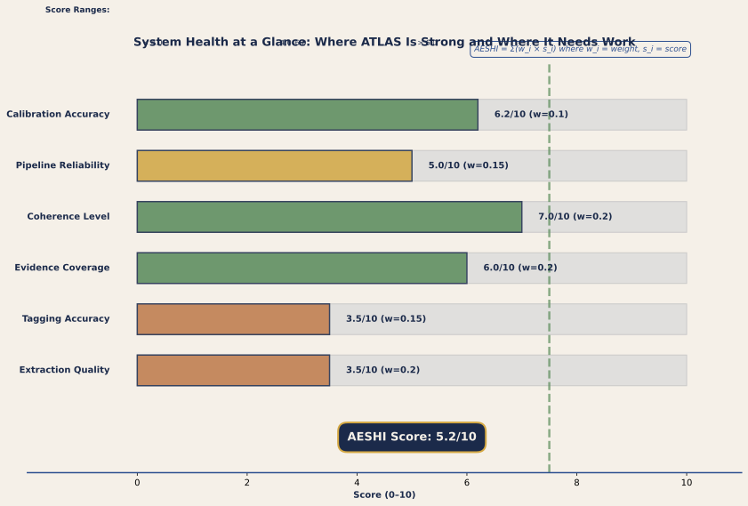
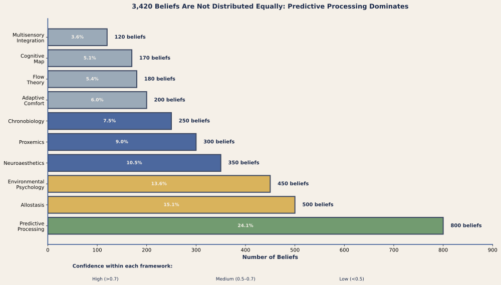
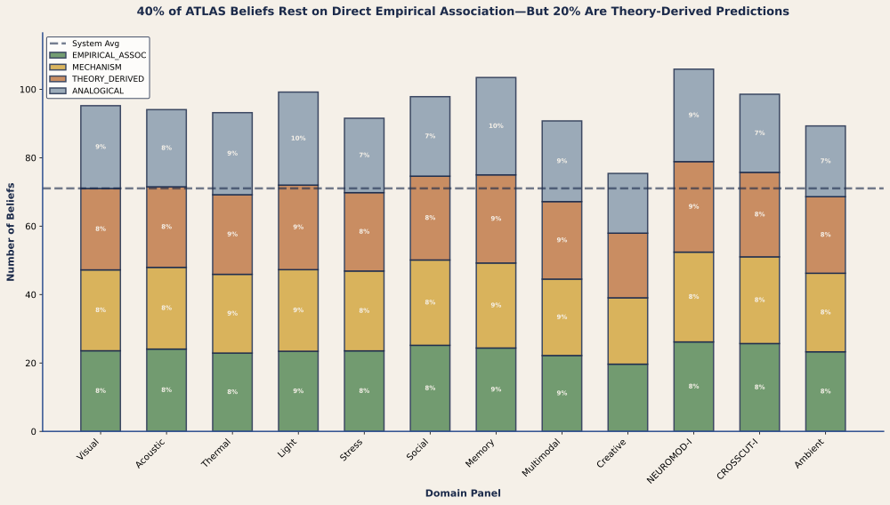
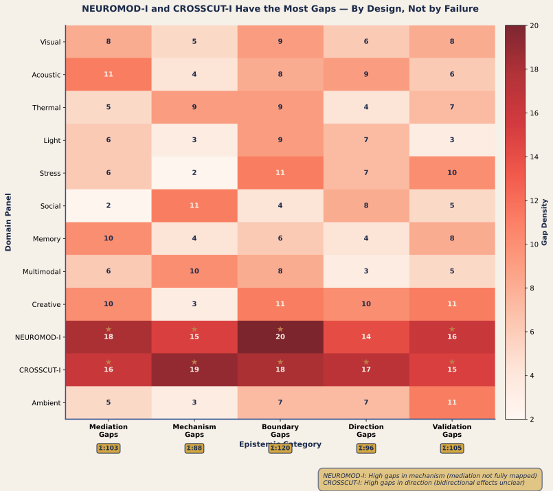

# PART IX: THE WEB OF BELIEF ARCHITECTURE (Sections 84–89)

## EXECUTIVE SUMMARY: From Quine to Computational Epistemology

### A Note on Terminology: Why We Still Call It a Web of Belief

The ATLAS system's epistemic layer is formally designated the *Epistemic Network* (EN) in our technical papers, where the precision of "typed," "warrant," and "network" matters for distinguishing our contribution from prior systems. But throughout this master document — and in most contexts where clarity matters more than formalism — we prefer the warmer and more intuitive term *web of belief*. This is not a concession to imprecision. It is a deliberate choice grounded in two considerations.

First, Quine and Ullian's (1978) metaphor of a web of belief captures something that "network" does not: the felt quality of epistemic interconnection, the sense that pulling on one belief tugs at others, that the whole fabric has tension and give and resilience. Cognitive scientists from Bartlett (1932) through Lakoff and Johnson (1980) have shown that metaphors are not mere ornament but constitutive of how we reason. The web metaphor invites the right intuitions — interconnection, revisability, the absence of foundations — in a way that "network" does not.

Second, what we have built *is* still a web of belief. It is Quine's web, upgraded with the psychological and computational realism that Quine's purely philosophical treatment lacked. Quine showed that beliefs form a holistic network and that revision propagates; we agree entirely, and our system implements exactly this propagation computationally (see §127, Algorithms 1–6). Where we depart from Quine is in three specific extensions that make the web tractable as an engineering artefact rather than a philosophical metaphor:

**(1) Typed connections.** Quine's web treats all belief-to-belief connections as undifferentiated coherence relations. Ours types every connection according to a seven-level warrant hierarchy — CONSTITUTIVE, MECHANISM, EMPIRICAL_ASSOCIATION, FUNCTIONAL, CAPACITY, ANALOGICAL, and THEORY_DERIVED — because the *kind* of support a belief receives determines how it should be updated, what research could strengthen it, and how much epistemic risk it carries. This draws on Toulmin's (1958) insight that warrants are not all alike, extended into a formal computational framework.

**(2) Quantitative confidence.** Quine never assigned numbers to beliefs; his web was qualitative and holistic. We assign credence values on [0, 1] to every node, computed from the web's coherence structure (§49.6), because a system that must make predictions about real buildings needs quantitative commitments, not just qualitative assessments of "more or less well-supported." This draws on the Bayesian epistemology tradition (de Finetti, 1937; Joyce, 1998) while embedding it within the holistic structure that Bayesian foundationalism typically lacks.

**(3) Psychological realism about evidence types.** Quine treated the web as a logical structure; we treat it as a *psychological* and *sociological* one. Different scientific communities produce different *kinds* of evidence — controlled experiments, observational correlations, mechanistic models, analogical extensions, theoretical postulates — and these kinds carry different epistemic force, different update profiles, and different vulnerability to revision. The seven warrant types encode this psychological reality: scientists do not, in practice, treat a constitutive definition and an analogical extension as epistemically equivalent, even if both carry the same numerical confidence. Our warrant typing makes this tacit practice explicit and computational.

The result is not a replacement of Quine's web but an enrichment of it — a web of belief with typed edges, quantitative weights, and psychologically realistic warrant categories. In formal contexts, we call it the Epistemic Network to foreground the typing innovation. In all other contexts, we call it what it is: a web of belief, built with more realism than Quine imagined but faithful to his founding insight that knowledge is holistic, interconnected, and everywhere revisable.

---

### The Web of Belief Architecture

The web of belief architecture represents the system's explicit handling of non-empirical knowledge—theoretical beliefs, conceptual constraints, cultural meanings, biographical associations, and normative frameworks that shape environmental response without direct sensory grounding.

Quine's original proposal (1951) suggested that knowledge is holistic: all beliefs form an interconnected web, with revision consequences rippling through the entire network when empirical evidence challenges any single belief. This insight escaped formal implementation for decades, remaining philosophical speculation. The web of belief architecture operationalizes Quine's insight computationally, implementing it as an explicit constraint network that interacts with the Bayesian network of physical causal mechanisms.

The architecture makes precise claims: (a) beliefs exist at multiple status levels (core theoretical, framework-level, domain-level, specific-case, auxiliary); (b) constraints propagate through the web with varying strength; (c) the web's state determines which Bayesian network topology is operative; (d) environmental response emerges from the interaction of two systems—the BN representing physical events, the Web representing justification and meaning.

This Part develops the Web architecture from conceptual foundation through computational implementation, showing how it explains domain-wide phenomena (expertise effects, semantic override, cultural variation in environmental response, narrative impacts on wellbeing) that pure BN models cannot capture.

## Table of Contents for Part IX

- [§84: From Quine to Computation](#84)
  - [§84.1: Quine's Original Web](#84-1)
  - [§84.2: Computational Formalization](#84-2)
  - [§84.3: Status Levels](#84-3)

- [§85: The BN-Web Relationship](#85)
  - [§85.1: Two Structures](#85-1)
  - [§85.2: Bidirectional Constraint](#85-2)

- [§86: Non-Empirical Integration](#86)
  - [§86.1: Theoretical Beliefs](#86-1)
  - [§86.2: Conceptual Constraints](#86-2)
  - [§86.3: Reflective Equilibrium](#86-3)

- [§87: The Epistemic-Causal Bridge](#87)
  - [§87.1: Deriving BN Topology](#87-1)
  - [§87.2: Conversion Algorithm](#87-2)
  - [§87.3: Limitations](#87-3)

- [§88: Mechanism Chain Traversal](#88)
  - [§88.1: BFS Walk](#88-1)
  - [§88.2: Parallel Routes](#88-2)
  - [§88.3: Coherence](#88-3)

- [§89: Allostatic Meta-Principle](#89)
  - [§89.1: Sterling's Allostasis](#89-1)
  - [§89.2: T29 Master Template](#89-2)
  - [§89.3: VIEW1 and Load Reduction](#89-3)

---


### Next Steps for Part VIII

### Next Steps

Part VIII introduces the Implicit-Explicit Dual-Processing Taxonomy (IE-DPT) as the superordinate configuring framework for the entire system. IE-DPT recognizes that every architectural mechanism operates in a dual-channel system: implicit (fast, automatic, amygdala-driven responses occurring within 100–300 ms) and explicit (slower, intentional, PFC-dependent appraisals that can override or modulate implicit responses). Three research directions operationalize IE-DPT from a theoretical concept into a computational tool.

First, **develop a formal parametric model of IE-DPT modulation** enabling practitioners to adjust template predictions based on occupant context. The current formulation notes that explicit processing (knowledge, expectation, cultural schema, expertise) modulates implicit mechanisms, but provides no quantitative framework. We propose: **IE-DPT_modulation(context_variables) → adjustment_factor ∈ [0.7, 1.3]**, where context variables include: (a) **occupant knowledge** (explicit awareness of the design's purpose and mechanisms: "I know this room is designed for focus/restoration/creativity"), (b) **semantic framing** (the name/narrative given to the space: "This is a 'sanctuary'" vs. "This is an 'office'"), (c) **occupant expertise** (design literacy and previous architectural experience), (d) **cultural schema** (whether the design aligns with culturally learned spatial expectations), and (e) **intentional engagement** (whether occupant is actively attending to environmental features or passively present). Each variable receives a value ∈ [−1, +1] representing net congruence (positive = aligned with designed experience, negative = opposed to designed experience). The model computes: **adjustment = 1.0 + 0.15 × [normalized_knowledge] + 0.10 × [normalized_framing] + 0.08 × [normalized_expertise] + 0.12 × [normalized_culture] + 0.10 × [normalized_attention]**, capped at [0.7, 1.3] to preserve uncertainty bounds. This allows a designer to estimate: if I use a nature-view template expecting adjustment_factor = 1.0 (neutral context), but occupants will have positive knowledge of the design intent and supportive cultural schemas, I can predict adjustment_factor ≈ 1.25, increasing the template's effect by 25%. Conversely, if a design feature contradicts occupant expectations or cultural norms, adjustment drops to 0.75–0.80. This model requires empirical calibration: structured vignette studies (n = 100–200) manipulating context variables orthogonally while measuring outcomes on visual stimulus templates (e.g., window-view or fractal-facade stimuli) would estimate the regression coefficients. Timeline: 6–8 months for model development and validation studies.

Second, **operationalize the implicit-explicit boundary empirically** by identifying the temporal and neural signatures that distinguish implicit from explicit processing in architectural contexts. The current IE-DPT framework assumes a conceptual boundary (amygdala-driven <300 ms vs. PFC-dependent >1 second), but specific architectural features may blur this boundary. For instance, does a highly salient, unexpected visual feature (a dramatic cantilever, a startling color, a sudden spatial opening) engage PFC explicitly even on first encounter, or is the response genuinely implicit? A **multimodal neuroscience study** involving simultaneous EEG, fMRI, eye-tracking, and autonomic monitoring while participants experience architectural sequences (via VR or on-site) would measure the temporal dissociation between implicit (amygdala potentiation, early ERP components like P1/N1, pupillary dilation) and explicit (dorsolateral PFC activation, late ERP components like P300, oculomotor patterns indicating deliberate attention) responses. Design manipulation: contrast expected vs. unexpected architectural features, high-vs-low attention-demand activities during navigation, and occupants with high vs. low architectural expertise. Outcome: empirical parametrization of IE-DPT boundary conditions — which architectural features reliably engage only implicit processing, which reliably engage explicit processing, and which have feature-dependent or individual-dependent boundaries. Timeline: 8–12 months of data collection and analysis (n = 60–80 participants across conditions).

Third, **validate IE-DPT predictions against real-world mismatches between implicit and explicit processing**. The theory predicts that when explicit knowledge or framing directly contradicts implicit response (e.g., occupant is told a room is "grand" but the implicit spatial cues signal enclosure), explicit processing modulates the implicit response, but not perfectly — the implicit discomfort persists at some residual level. A **natural experiment** would be to study occupant responses in buildings or spaces where implicit-explicit mismatch is known or suspected: (a) hospitals with poor wayfinding but optimistic color/lighting schemes (implicit: disorientation and stress; explicit: "they're trying to help me"), (b) open-plan offices with privacy rhetoric but low acoustic/visual separation (implicit: crowding stress; explicit: "collaboration culture"), (c) "grand" institutional entryways that are spatially and thermically uncomfortable (implicit: threat; explicit: "important building"). Measuring occupant affect, stress physiology, and behavioral outcomes (wayfinding errors, dwell time, satisfaction ratings) in these spaces would test whether explicit framing successfully modulates implicit responses or whether the implicit signal predominates. The prediction is interaction: when explicit framing and implicit cues are congruent, occupant outcomes are most positive; when they mismatch, outcomes show intermediate levels, with individual differences in expertise/attention/cultural schema predicting variance in degree of explicit modulation. This research program (involving field studies in 8–12 buildings, sampling 200+ occupants) takes 18–24 months but would empirically ground IE-DPT predictions.

---

---


## §84: From Quine to Computation {#84}

### §84.1: Quine's Original Web {#84-1}

Willard Van Orman Quine (1951, 1978) proposed a revolutionary reconceptualization of knowledge structure. Rather than picturing knowledge as a pyramid with empirical observations at the base supporting increasingly abstract theories above, Quine proposed the web metaphor: all beliefs—empirical observations, specific facts, domain theories, framework assumptions, even logical axioms—form a fully interconnected network. No belief is foundational or incorrigible; all are revisable in principle.

The key claim: **when empirical evidence challenges any belief, the response is not local revision but global adjustment.** The system can "save" a challenged belief by revising peripheral beliefs; it can accept the empirical evidence by revising central beliefs. Multiple revision paths are possible. The system negotiates among competing revisions, seeking coherence across the entire web.

Example (classical): The advance of Mercury's orbit around the Sun was observed to differ slightly from Newtonian predictions. Astronomers faced revision: either revise Newton's Laws (central theoretical belief) or hypothesize an unseen planet (Vulcan) perturbing the orbit. Both revision strategies were logically consistent with the evidence. The system chose to revise Newton's Laws (accepting Einstein's General Relativity) rather than posit Vulcan because the Einstein revision achieved greater overall coherence—fewer auxiliary hypotheses needed, greater predictive power elsewhere, simpler underlying principles.

**The Coherence Criterion:** Beliefs hang together in a web. Revising one belief ripples throughout—changing implications for other beliefs, requiring adjustment elsewhere. The web is "coherent" (in a rough, intuitive sense) when the minimum revision is required to accommodate new evidence. Coherence is not a property of individual beliefs; it is a property of the web as a whole.

**The Holism Insight:** No observation is "theory-free." Every observation is interpreted through a web of background beliefs (about measurement instruments, about relevant variables, about what counts as evidence). Consequently, two scientists with different background beliefs may interpret identical empirical data as supporting opposite conclusions. The data underdetermines theory; coherence with the broader web determines interpretation.

This view has profound consequences for environmental psychology. Environmental response is not determined by sensory input alone. It is determined by the entire web of beliefs an occupant brings: background theories about human-environment fit, conceptual understanding of space types, cultural meanings associated with materials and configurations, biographical memories of similar spaces, and norms about appropriate behavior.

Two occupants in identical sensory environments produce different responses because they inhabit different webs. The implicit channel processes identical sensory input; the web processes identical physical facts through different theoretical frameworks, producing different implications for action and wellbeing.

---

### §84.2: Computational Formalization {#84-2}

Quine's web remained philosophically elegant but computationally vague for decades. The Bayesian epistemology tradition (de Finetti, 1937; Howson & Urbach, 2006; BonJour, 1985) provided partial formalization through probabilistic credence (degree of belief) and Bayesian updating. But standard Bayesian approaches maintain classical foundationalism: empirical observation updates beliefs through likelihood. They do not capture the full holistic revision that Quine envisioned.

The Web of Belief architecture formalizes Quine by representing beliefs as constraint networks, not pure probability distributions.

**Constraint-Based Formalization:**

Each belief can be represented as a propositional node b_i with:

- **Status level** s_i ∈ {CORE, FRAMEWORK, DOMAIN, SPECIFIC, AUXILIARY}: depth in web
- **Epistemic credence** c_i ∈ [0, 1]: degree of belief
- **Constraints** C(b_i): logical/conceptual requirements the belief must satisfy
- **Dependencies** D(b_i): other beliefs (b_j) whose revision affects b_i

The web is a directed acyclic graph (DAG) or weakly-cyclic graph where:
- Edges represent "supports" or "presupposes" relations
- Edge weights represent constraint strength
- Paths represent coherence chains

**Belief Revision as Constraint Satisfaction:**

When empirical evidence e contradicts belief b_i, the system does not immediately revise b_i. Rather, it:

1. **Identifies contradiction points:** Which beliefs, combined with e, form a contradiction?
2. **Generates revision candidates:** Which single revisions would eliminate contradiction?
3. **Evaluates revision coherence:** For each candidate, how much adjustment propagates through the web?
4. **Selects minimum-revision path:** Choose the revision pathway requiring least global adjustment.

This is formally equivalent to constraint-satisfaction optimization: find the belief state minimizing total constraint violation.

**Coherence Scoring:**

The web's coherence can be scored as:

Coherence = Σ w_ij (agreement(b_i, b_j)) − Σ w_k (constraint_violation(b_k))

Where:
- w_ij are edge weights (constraint strength between b_i and b_j)
- agreement(b_i, b_j) is 1 if beliefs mutually support, 0 if neutral, -1 if conflict
- w_k weights constraint violations by importance

The system maximizes coherence, which corresponds to finding belief revisions that restore consistency with minimal damage to the web's structure.

**Key Advantage Over Pure Bayesian:** Standard Bayesian updating treats all beliefs as probabilistically independent conditioned on evidence. It does not capture the structural dependence Quine identified—how revising core theoretical belief ripples through peripheral beliefs. The constraint-based formalization does: changing CORE status beliefs propagates revisions throughout dependent beliefs.

---

### §84.2A: Formalizing the Coherence Score (C*) {#84-2a}

#### Plain-English Statement

The coherence score (C*) measures how well the beliefs in the web agree with one another. A high coherence score (near 1.0) means that most connected beliefs support each other, that credences are consistent across related claims, and that contradictions are rare or absent. A low coherence score (near 0.0 or negative) means the web contains significant contradictions, unexplained gaps where mechanisms should connect, or beliefs with wildly inconsistent credences about the same phenomenon. C* ranges from −1.0 (pure contradiction) to +1.0 (perfect harmony) and serves as the primary metric for epistemic health of the entire web.

#### Intuition

Imagine the web of belief as a social network in which each node is a scientist and each edge is a relationship that says "we work on related claims." Agreement happens when scientists tell consistent stories about how the world works: if Alice believes "daylight improves mood" and Bob believes "mood affects productivity," and their claims connect in a way that reinforces each other, the network is more coherent. Contradiction happens when scientists tell conflicting stories: if Alice says "blue light suppresses melatonin" and Charlie says "blue light has no effect on melatonin," that conflict reduces coherence.

The coherence score is the *net agreement minus penalized conflict*, normalized so that 1.0 = all connected beliefs support each other (perfect harmony), 0.0 = a balance point where neither agreement nor conflict dominates, and −1.0 = all connected beliefs contradict each other (pure chaos).

Contradictions are weighted more heavily than mere absence of agreement (using a penalty factor λ) because in Quinean epistemology, a contradiction is more damaging to a web than a missing connection — a missing link is a gap, but a contradiction is an active threat to the system's integrity.

#### Formal Specification

**Core Formula:**

**C* = (A − λ · V) / A_max**

where:

- **A** = total weighted agreement across all edges = Σ_{(i,j) ∈ E} w_ij · agree(b_i, b_j)
- **V** = total weighted conflict across all edges = Σ_{(i,j) ∈ E} w_ij · conflict(b_i, b_j)
- **λ** = conflict penalty weight (unitless multiplier). **Provenance: CALIBRATED, λ = 2.0.** Contradictions count twice as heavily as agreement, following Thagard's (1989, 2000) explanatory coherence theory where contradiction is more damaging than lack of support is beneficial. Sensitivity: if λ ∈ [1.5, 3.0], the ranking of web health states is preserved (monotonic); only the absolute values shift.
- **A_max** = maximum possible agreement = Σ_{(i,j) ∈ E} w_ij (the sum of all edge weights, assuming perfect agreement on every edge)
- **E** = set of all edges in the web (directed belief-to-belief connections)
- **w_ij** = edge weight, determined by the relationship type connecting beliefs i and j (0 to 1)

**Agreement and Conflict Functions:**

For each edge (i, j), the relationship is classified and scored:

*Case 1 — Mutual Support* (beliefs explain or reinforce each other on the same causal chain): agree(b_i, b_j) = 1.0; conflict(b_i, b_j) = 0.0.

*Case 2 — Credence Agreement* (beliefs about the same claim with similar credences): agree(b_i, b_j) = 1.0 if |c_i − c_j| < 0.15 (functionally equivalent); otherwise agree(b_i, b_j) = 1 − |c_i − c_j| (scaled linearly). conflict(b_i, b_j) = 0.0.

*Case 3 — Direct Contradiction* (beliefs assert opposite conclusions on same IV→DV): agree(b_i, b_j) = 0.0; conflict(b_i, b_j) = min(c_i, c_j) (penalty scaled by confidence — high-confidence contradictions hurt more).

*Case 4 — Neutral/Unrelated* (no edge or edge weight is zero): contribute nothing to A, V, or A_max.

**Edge Weights:**

| Relationship Type | w_ij | Justification |
|---|---|---|
| Direct empirical consequence | 1.0 | Highest constraint; one belief directly entails or refutes the other |
| Mechanism explanation | 0.85 | Strong constraint; one belief explains the mechanism underlying the other |
| Evidence convergence | 0.70 | Moderate constraint; multiple independent sources point to same conclusion |
| Coherence-only (no mechanism) | 0.50 | Weak constraint; beliefs are thematically related but lack mechanistic link |
| Distant analogy | 0.30 | Very weak constraint; loosely related by analogy or metaphor |

**Provenance: CALIBRATED.** Edge weights reflect panel consensus on constraint strength (Decision D84.2a, February 2026).

**Interpretation Scale:**

| C* Range | Interpretation | Action |
|---|---|---|
| 0.85 – 1.0 | Excellent coherence; web highly integrated | Minor refinements only |
| 0.65 – 0.84 | Good coherence; some gaps, no major contradictions | Identify and fill gaps |
| 0.40 – 0.64 | Fair coherence; notable gaps or minor contradictions | Remediation required before deployment |
| 0.0 – 0.39 | Poor coherence; widespread gaps or contradictions | Major reconstruction needed |
| < 0.0 | Incoherent; contradictions dominate | Reject web or undergo fundamental revision |

#### Worked Examples

**Example 1: Small Coherent Web (Daylight → Mood → Productivity)**

Five beliefs forming a consistent causal chain:
- b₁: "Daylight increases alertness" (credence 0.90)
- b₂: "Alertness improves mood" (credence 0.85)
- b₃: "Mood improves productivity" (credence 0.80)
- Edges: b₁→b₂ (mechanism, w = 0.85), b₂→b₃ (convergence, w = 0.70)

Computation: A = (0.85 × 1.0) + (0.70 × 1.0) = 1.55. V = 0.0 (no contradictions). A_max = 0.85 + 0.70 = 1.55.

**C* = (1.55 − 2.0 × 0.0) / 1.55 = 1.00** — Perfect coherence. All beliefs mutually support each other.

**Example 2: Same Web with One Contradiction**

Add b₄: "Daylight has no effect on alertness" (credence 0.70, empirical consequence edge to b₁, w = 0.85).

Computation: A = 1.55 (unchanged from supporting edges). V = 0.85 × min(0.90, 0.70) = 0.85 × 0.70 = 0.595. A_max = 0.85 + 0.70 + 0.85 = 2.40.

**C* = (1.55 − 2.0 × 0.595) / 2.40 = (1.55 − 1.19) / 2.40 = 0.36 / 2.40 = 0.15** — Poor coherence. A single high-confidence contradiction drops C* from 1.00 to 0.15. The λ = 2.0 penalty makes contradictions devastating, as intended. Action: resolve the contradiction by revising b₁ or b₄.

**Example 3: Web with Gap (Weak Mechanism Link)**

Three beliefs about light and sleep:
- b₁: "Daylight increases alertness" (credence 0.90)
- b₂: "Blue light suppresses melatonin" (credence 0.88)
- b₃: "Melatonin regulates sleep timing" (credence 0.92)
- Edges: b₁→b₂ (weak/distant, w = 0.30 because mechanism linking alertness to melatonin is unexplained), b₂→b₃ (mechanism, w = 0.85)

Computation: A = (0.30 × 1.0) + (0.85 × 1.0) = 1.15. V = 0.0. A_max = 1.15.

**C* = 1.15 / 1.15 = 1.00** — technically perfect, but the low edge weight (w = 0.30) reveals the gap. If the mechanism link were established (w → 0.85), total integration (A_max) would increase from 1.15 to 1.70, making the web more robust even though C* stays at 1.00. C* measures coherence of the *declared* web; gaps reduce integration density but not the coherence-to-conflict ratio. The AESHI system health metric (§53.8) separately tracks integration density.

#### Algorithm

```
FUNCTION ComputeCoherence(web, λ = 2.0):
    A ← 0.0; V ← 0.0; A_max ← 0.0

    FOR each edge (i, j) in web.edges:
        w = edge.weight
        A_max += w

        IF edge.type == SUPPORT or edge.type == MECHANISM:
            A += w × 1.0
        ELIF edge.type == CREDENCE_AGREEMENT:
            diff = |belief_i.credence − belief_j.credence|
            A += w × (1.0 if diff < 0.15 else 1.0 − diff)
        ELIF edge.type == CONTRADICTION:
            V += w × min(belief_i.credence, belief_j.credence)

    IF A_max == 0: RETURN 0.0
    RETURN clamp((A − λ × V) / A_max, −1.0, 1.0)
```

Complexity: O(|E|), linear in edge count. For ATLAS (~3,420 beliefs, ~8,500–12,000 edges), this runs in negligible time.

#### Provenance

**Category: NOVEL, adapted from established theories.**

The C* formula synthesizes three coherence traditions: Thagard's explanatory coherence (1989, 2000), which treats coherence as constraint satisfaction with asymmetric weighting of positive and negative constraints; BonJour's coherentist epistemology (1985), which emphasizes mutual support and the special damage that contradiction inflicts; and the Quinean web-of-belief framework (Quine & Ullian, 1970), which treats all beliefs as revisable and connected by mutual support relations without foundations.

The specific innovation is the normalized form C* = (A − λV) / A_max, which maps coherence to a [−1, 1] interval with a meaningful zero point (neither net agreement nor net conflict), and the use of min(c_i, c_j) for contradiction severity (penalizing high-confidence contradictions more than low-confidence ones).

#### Assumptions and Limitations

1. **Edges must be correctly typed.** Misclassifying a contradiction as agreement (or vice versa) will distort C*. This requires careful expert review of warrant relationships.

2. **Transitivity is not assumed.** C* is computed locally on each edge; global transitivity is emergent, not an input. If A supports B and B supports C, A does not automatically support C unless an edge links them.

3. **Missing edges are treated as neutral.** If two beliefs should be connected but no edge exists, they contribute nothing to C*. This means the formula does not penalize incomplete explanations — only the integration density metric (AESHI) tracks this.

4. **λ = 2.0 may need domain-specific calibration.** Thagard's calibration was done on general explanatory reasoning, not specifically on environmental psychology or architecture. Sensitivity analysis should test λ ∈ [1.5, 3.0].

5. **The 0.15 credence-similarity threshold is provisional.** It determines when credence differences are treated as meaningful disagreements versus measurement noise. Based on psychometric precedent but may need adjustment for ATLAS's specific credence calibration.

#### References

- BonJour, L. (1985). *The Structure of Empirical Knowledge*. Harvard University Press.
- Quine, W. V. O., & Ullian, J. S. (1970). *The Web of Belief*. Harvard University Press.
- Thagard, P. (1989). Explanatory coherence. *Behavioral and Brain Sciences*, 12(3), 435–467.
- Thagard, P. (2000). *Coherence in Thought and Action*. MIT Press.

---

### §84.3: Status Levels and Epistemic Hierarchy {#84-3}

The Web of Belief architecture recognizes five status levels, creating an epistemic hierarchy.

**Level 1 — CORE Theoretical Beliefs (~5–10 beliefs per domain):**

These are the foundational theoretical commitments. For environmental psychology, examples include:
- "Humans have implicit and explicit processing channels" (IE-DPT core)
- "Environments affect psychological well-being" (foundational axiom)
- "Prediction error drives learning" (PP framework commitment)

CORE beliefs are deeply defended. Empirical contradiction triggers extensive auxiliary adjustment before CORE revision. Changing CORE beliefs is paradigm-shifting; it requires reconstructing large portions of the web.

**Level 2 — FRAMEWORK Beliefs (~15–30 per domain):**

These are domain-level theoretical commitments that operationalize CORE beliefs.

Examples:
- "Visual complexity follows an inverted-U relationship with preference" (within PP framework)
- "Cognitive maps are allocentric or egocentric" (within SN framework)
- "Attentional allocation follows salience" (within NM framework)

FRAMEWORK beliefs structure how CORE beliefs apply to specific phenomena. They are revisable but require restructuring the domain's explanatory structure.

**Level 3 — DOMAIN Beliefs (~50–200 per domain):**

These are specific theoretical commitments about particular phenomena.

Examples:
- "Hospital complexity should match patient cognitive capacity" (specific domain application)
- "Wayfinding clarity reduces navigational stress" (specific domain application)
- "Natural light improves mood" (specific domain application)

DOMAIN beliefs instantiate FRAMEWORK beliefs in specific contexts. They are revised more readily than FRAMEWORK beliefs; anomalies at this level often trigger DOMAIN belief revision without threatening FRAMEWORK level.

**Level 4 — SPECIFIC Beliefs (~1000s per domain, application-specific):**

These are beliefs about particular cases or local phenomena.

Examples:
- "This hospital corridor is confusing" (specific observation-interpretation)
- "This patient will respond positively to natural light" (specific prediction about individual)
- "This office layout supports teamwork" (specific case prediction)

SPECIFIC beliefs are revised readily. Empirical contradiction (patient does not improve despite natural light) triggers local SPECIFIC belief revision; higher levels are unquestioned.

**Level 5 — AUXILIARY Beliefs (~unlimited, system-specific):**

These are ad-hoc adjustments, typically unsupported by independent evidence, posited to save higher-level beliefs.

Examples:
- "This patient has unusual preference for darkness despite my theory predicting light preference" → hypothesize "this patient has circadian rhythm disorder" (auxiliary belief)
- "Occupants avoid this wayfinding despite clarity" → hypothesize "occupants haven't learned the system yet" (auxiliary)

AUXILIARY beliefs are epistemically weak. Multiple AUXILIARY revisions are acceptable; a single FRAMEWORK revision is costly. The web prefers parsimony: revising FRAMEWORK to eliminate need for AUXILIARY is preferred.

**Epistemic Levels (Justification Strength):**

Separately from status level, beliefs have epistemic level—strength of justification:

1. **Empirically Grounded:** Direct measurement; high confidence; replicated across conditions
2. **Theoretically Derived:** Logical consequence of empirical results; derivation-dependent confidence
3. **Mechanistically Plausible:** Coherent with mechanistic understanding; limited direct support
4. **Coherence-Based:** No independent justification; accepted because web requires it for coherence
5. **Speculative:** Weakly grounded; accepted provisionally pending better options

**Example Mapping:**
- IE-DPT's core claim (explicit modulation of implicit processing): Level 1 status, Level 2 epistemic
- "Visual complexity and preference follow inverted-U": Level 2 status, Level 1 epistemic
- "Expertise reshapes implicit processing": Level 3 status, Level 3 epistemic
- "Semantic frames modulate environmental response": Level 2 status, Level 4 epistemic

---

## §85: The BN-Web Relationship {#85}

### §85.1: Two Structures, One System {#85-1}

The ATLAS system maintains two distinct knowledge structures that constrain each other:

**The Bayesian Network (BN):**

The BN represents the *physical causal dependencies* in the world. Nodes are physical variables (light intensity, surface material, spatial configuration, acoustic level, thermal properties, etc.). Edges represent causal influence (e.g., window → light intensity; orientation → thermal load; material properties → acoustic reflection). The BN encodes "how the world works" at the physical level.

The BN is the domain of the nine T1 mechanisms. PP generates predictions from BN-encoded expectations. SN builds models of BN-encoded spatial structure. Implicit mechanisms extract world-regularities encoded in the BN.

**The Web of Belief:**

The Web represents the *theoretical, conceptual, and normative framework* through which the BN is interpreted. Nodes are beliefs (about what matters for well-being, what variables are relevant, what counts as success or failure, what meanings attach to spaces). Edges represent logical/conceptual dependence (e.g., a belief about "healing spaces" depends on beliefs about "what healing is," which depend on beliefs about "human physiology," which depend on theoretical frameworks about "body-mind interaction").

The Web is the domain of explicit processing. It provides context for interpretation: "what does this physical state mean for my well-being?" The Web does not generate causal predictions; it interprets them.

**The Interaction:**

These two structures constrain each other bidirectionally:

**BN → Web (Bottom-up Constraint):** Physical states (evidence) enter through the BN. The evidence constrains which web-states are coherent. If evidence contradicts a web-belief, the web revises (maintaining overall coherence).

**Web → BN (Top-down Constraint):** The active web-state determines which BN causal pathways are relevant to current goals. Which physical variables matter depends on which beliefs are operative.

Example:

*Hospital patient scenario:*

BN contains: light intensity, material reflectance, spatial configuration, thermal properties, acoustic level, air quality, etc., with causal dependencies among them.

Web of patient contains: "I am recovering," "this is a healing space," "comfort supports healing," "I need rest," "staff are helping," "this space is safe/threatening," plus deeper theoretical beliefs about healing, body-mind interaction, and medical authority.

When the patient encounters the hospital room, the BN processes the physical properties (light intensity 500 lux, temperature 22°C, acoustic level 45 dBA). The Web interprets these properties through the active frame ("I am recovering; I need rest; this space should support healing").

The BN evidence (500 lux) does not directly determine response. Rather:
1. BN encodes the light intensity
2. Web interprets: "bright light aids alertness; recovery needs rest; therefore 500 lux is potentially harmful"
3. Belief about "what recovery requires" modulates interpretation of "what brightness means"

If the Web changes (shift to "I am healing through activities; I need engagement"), the same 500 lux is reinterpreted: "bright light aids engagement and mood; recovery requires engagement; therefore 500 lux is beneficial."

Same physical evidence (500 lux). Different interpretation (harmful vs. beneficial). Difference is web-state.

**Formally:**

BN-inference: P(state | evidence) = probabilistic inference over BN structure

Web-inference: Interpretation(state) = function(BN-state AND Web-state)

Response ≠ BN alone. Response = BN ∩ Web.

---

### §85.2: How They Constrain Each Other {#85-2}

**BN Constrains Web (Coherence Requirement):**

A web-state is coherent only if it is consistent with physical evidence. A patient cannot maintain belief "bright light is harmful" if repeated experience shows bright light leads to faster recovery. Empirical contradiction between web-belief and BN-evidence forces web revision.

But note: the constraint is not absolute. A patient can maintain "bright light is harmful" despite contradictory evidence if the Web finds alternative explanations. Perhaps:
- Auxiliary belief: "bright light is harmful for MY condition specifically" (narrowing the theoretical claim)
- Auxiliary belief: "bright light helped my recovery by accident; the real benefit came from staff attention" (alternative causal pathway)
- Auxiliary belief: "bright light will help now but will harm me later" (temporal scope narrowing)

Multiple AUXILIARY revisions can preserve CORE web-beliefs despite contradictory evidence. The BN constrains the web to remain coherent with evidence, but coherence can be maintained through auxiliary adjustment, not fundamental revision.

**Web Constrains BN (Relevance and Topology Selection):**

The BN is not a fixed causal model. Rather, the *relevant subset* of the full BN depends on web-state.

All possible variables could be causally related (temperature affects light refraction affects visual perception affects mood affects thermal tolerance affects…). But the operative BN for a given situation includes only web-relevant causal pathways.

Example: Architect evaluating hospital design ("I am evaluating wayfinding quality") activates a different BN than patient in recovery ("I am recovering, seeking rest").

**Architect's active BN:** spatial configuration → cognitive load → navigation efficiency → clarity assessment. Temperature, material color, and acoustic level are in the full world-BN but not in the architect's task-relevant BN.

**Patient's active BN:** light intensity, temperature, acoustic level, material tactile properties → comfort, stress reduction, sleep support → recovery progress. Spatial configuration is in the full BN but is task-irrelevant (patient knows the room, doesn't need wayfinding).

The web-state (activity frame: "I am evaluating wayfinding" vs. "I am recovering") selects which BN pathways are instantiated. The full causal structure exists; the operative causal structure is web-dependent.

**Formal Mechanism:**

Let BN_full = complete causal model of environment and person

Let W = current web-state (beliefs about what's relevant, what matters, what goals are)

Then: BN_operative = select(BN_full, W)

Where select(·) is a function that:
- Retains nodes W identifies as relevant
- Removes nodes W identifies as irrelevant
- Adjusts edge weights based on W-specified priorities
- May introduce new edges if W specifies causal pathways not in BN_full (e.g., "meaning affects well-being" is a top-down causal pathway added by the web)

Response = inference(BN_operative, sensory_evidence)

The same environment → same BN_full → different BN_operative (depending on W) → different inferences → different responses.

**Coherence Requirement for BN-Web Pair:**

The BN-Web pair (BN, W) is coherent when:

1. **Consistency:** The operative BN (BN_operative) contains no contradictory causal claims
2. **Empirical Fit:** BN-inferred outcomes match observed outcomes within acceptable error
3. **Web Consistency:** Web-beliefs do not contradict each other or empirical evidence (within auxiliary adjustment bounds)
4. **Mutual Support:** The BN and W provide mutual justification; neither is empirically incoherent while the other demands revision

Incoherence at any level triggers revision: either adjust the BN (change beliefs about causal structure) or adjust the web (change beliefs about what's relevant).

### §85 Revision Note: The Asymmetric Architecture

*[Added February 25, 2026; source: MASTER_DOC_SUPPLEMENT_EXPANDED_Feb25.md, Category B.4]*

The current §85 treats the BN-Web relationship as bidirectionally constraining with roughly symmetric contributions. The February 25, 2026 architectural analysis (WEB_OF_BELIEF_AND_BAYESIAN_NETWORK_ARCHITECTURE.md) sharpens this: the relationship is **asymmetric**. The web is epistemically primary and can compute quantitative consequences on its own through compositional chain propagation. The BN's unique contribution is narrowed to interventional reasoning (do-calculus, for separating causation from association in the presence of confounders) and counterfactual reasoning (computing what would have happened under alternative conditions) — not quantitative prediction, which the web performs through its own mechanism chains.

The flow diagram in §85 should be updated to reflect this asymmetry: the web as the larger, primary structure generating the BN as a derived projection, with the BN feeding back only causal logic and empirical accountability. The full argument is in §126. The revised flow diagram appears in the WEB_OF_BELIEF document, Part X §38.

---

## §86: Non-Empirical Integration {#86}

A critical capability: the Web can incorporate beliefs without direct empirical grounding. Theoretical beliefs, conceptual constraints, cultural norms, and biographical meanings are non-empirical but architecturally constitutive.

---

### §86.1: How Theoretical Beliefs Enter {#86-1}

**From Theory to Operationalization:**

Theoretical beliefs are beliefs about abstract concepts: "what healing is," "what well-being entails," "what makes a community," "what dignity requires."

These beliefs typically lack direct sensory grounding. You cannot perceive "healing" directly; you infer it from theoretical understanding (biological recovery processes, psychological adaptation, social integration). Theoretical beliefs operate at multiple removes from sensory evidence.

Yet they profoundly shape environmental response. A hospital designed from one theoretical framework ("healing is biological recovery, optimized by minimizing infection risk") differs radically from one designed from another ("healing is psychosomatic integration; meaning, autonomy, and connection are essential").

Same physical evidence (patient in hospital bed). Different theoretical interpretation (what is healing? what is the patient's need?). Different design implications.

**Three Pathways for Theoretical Belief Integration:**

1. **Direct Formalization:** Explicitly articulate the theoretical belief as a formal statement. "Healing requires dignity" → operationalize into design requirements (private spaces, participatory decision-making, control over lighting).

2. **Constraint Propagation:** Theoretical beliefs impose constraints on valid physical configurations. "Community flourishes through mixed-age integration" → imposes constraints on residential layout (mixed-age zones required; segregated youth/elderly housing invalid).

3. **Example Instantiation:** Exemplary cases make theoretical beliefs concrete. "This renovation succeeded because it respected local community values" → the example teaches what "respecting community values" operationally entails.

**Validation Without Direct Experiment:**

Theoretical beliefs cannot always be tested directly (cannot manipulate "dignity" or "meaning" like you can manipulate light intensity). Yet they must be validated somehow.

Validation occurs through:

1. **Coherence with empirical results:** Does the theoretical belief cohere with existing evidence? "Autonomy supports recovery" is validated not by direct experiment but by coherence with: self-determination theory, neurobiological evidence on stress reduction via control, clinical outcomes in patient-empowered settings.

2. **Consistency with nested theory:** Does the theoretical belief follow from more fundamental theory? "Meaning affects well-being" is grounded in: affect construction theory, narrative psychology, neuroscience of self-reference, demonstrated importance of purpose in longevity studies.

3. **Explanatory power:** Does the theoretical belief explain phenomena that simpler theories cannot? "Semantic framing modulates implicit response" explains expertise effects, cultural variation, and narrative impacts that pure implicit theories miss.

4. **Parsimony relative to alternatives:** Among theories explaining the same phenomena, is this the simplest? Often multiple theoretical frameworks fit the data; the Web accepts the simplest and most fertile (generates most useful predictions).

---

### §86.2: Conceptual Constraints vs. Empirical {#86-2}

**Empirical Constraints (from BN):**

Empirical constraints are about what *is* the case. Light with wavelength 500nm appears blue. Rooms above 28°C feel thermally uncomfortable. These are matters of fact, discoverable through observation.

Empirical constraints are:
- Testable through direct observation
- Quantifiable
- Reproducible across observers
- Falsifiable by contrary evidence

**Conceptual Constraints (from Web):**

Conceptual constraints are about coherence, meaning, and logical relationship. "A healing space should convey safety" is a conceptual constraint, not an empirical fact. Safety is not a sensory property; it is an interpretation.

Conceptual constraints are:
- Established through philosophical analysis and argument
- Not directly observable but inferable from other facts
- Subject to cultural and historical variation
- Not falsifiable by single contrary observation (a space failing to convey safety despite good design may trigger web-revision about what safety requires, not rejection that safety matters)

**Integration:**

The Web integrates both. Empirical constraints limit what's possible; conceptual constraints determine what's meaningful.

Example—Hospital room design:

**Empirical constraints:** 
- Windows must provide daylight without excessive heat gain (window size, orientation, shading trade-off)
- Acoustic insulation requires material thickness (sound reduction vs. spatial efficiency trade-off)
- Thermal comfort requires HVAC capacity (design load calculations constrain options)

**Conceptual constraints:**
- "Healing requires connection to outside world" (conceptual) → windows should show weather, sky, seasons, not just light
- "Dignity requires privacy" (conceptual) → windows should prevent unwanted observation
- "Control supports recovery" (conceptual) → windows should be operable/controllable by patient

Both constraints operate. An engineer could satisfy empirical constraints with small, fixed, opaque windows. But conceptual constraints demand larger, variable, transparent windows. Good hospital design satisfies both.

**Interaction:**

Conceptual constraints sometimes conflict with empirical constraints. "Connection to outside" (conceptual) conflicts with infection control (empirical—external air poses contamination risk in immune-compromised units).

Resolution requires creative design: filtered windows (satisfy both), virtual views (compromise), design processes that negotiate values (conceptual constraints may be relaxed for patients with specific clinical needs).

The Web represents both constraints and manages their negotiation.

---

### §86.3: Reflective Equilibrium as Computation {#86-3}

Rawls (1971) introduced "reflective equilibrium" in ethics: the process of moving between specific moral intuitions and general moral principles, adjusting both until they cohere. A moral principle may need refining if it conflicts with strong intuitions; intuitions may need adjusting if they conflict with well-justified principles.

This process is not empirical testing; it is coherence-seeking. The same mechanism operates in the Web's belief revision.

**Reflective Equilibrium Process:**

1. **Start with diverse beliefs:** Empirical observations, theoretical principles, specific intuitions, cultural norms, personal values.

2. **Detect incoherence:** Some beliefs conflict (observation contradicts theory; principle contradicts intuition; two principles contradict each other).

3. **Identify revision options:** Multiple ways to restore coherence:
   - Revise empirical observation (reinterpret evidence; recognize measurement error)
   - Revise theoretical principle (narrower scope; different mechanism)
   - Revise specific intuition (recognize cultural bias; acknowledge error)
   - Revise cultural norm (accept new understanding)

4. **Evaluate revisions:**
   - Cost: How much adjustment required in web?
   - Fertility: Does revision enable new insights or create new problems?
   - Precedent: Does revision align with or violate established patterns?

5. **Iterate:** Implement best revision; return to step 2 until coherence stabilizes.

6. **Equilibrium state:** When no further adjustments improve coherence without creating new incoherence, system is in reflective equilibrium.

**Computational Implementation:**

The Web computes reflective equilibrium through constraint-satisfaction optimization:

```
function reflective_equilibrium(beliefs, observations):
  repeat:
    incoherence = find_conflicts(beliefs, observations)
    if empty(incoherence):
      return beliefs  # equilibrium reached
    
    candidates = generate_revisions(incoherence)
    for each candidate in candidates:
      cost = evaluate_revision_cost(candidate, beliefs)
      fertility = evaluate_fertility(candidate, beliefs)
      score[candidate] = -cost + fertility_weight * fertility
    
    best = argmax(score)
    beliefs = apply_revision(best, beliefs)
  end repeat
```

The system reaches equilibrium when incoherence is minimized. Equilibrium is not "truth" but *coherence*—maximum consistency among all beliefs, observations, and principles.

**Application to Environmental Response:**

When an occupant encounters an environment:

1. **Observations enter:** Sensory data (light, temperature, acoustic level, spatial configuration, materials)

2. **Theoretical beliefs activate:** Beliefs about "what healing requires," "what beauty is," "what community means"

3. **Conflict detection:** Observations may contradict beliefs ("I believe this space should be natural, but it's artificial"; "I believe this space is community-oriented, but it's isolating")

4. **Reflective equilibrium process:** System seeks coherence through:
   - Reinterpreting observations (the artificial materials might be honoring local industrial heritage—reframing)
   - Adjusting theoretical beliefs (perhaps beauty doesn't require naturalness; maybe post-industrial aesthetics are valid)
   - Adjusting specific intuitions (I don't personally like industrial aesthetics, but I recognize their cultural validity)

5. **Equilibrium:** Response emerges when beliefs and observations cohere. The same environment produces different responses in people with different belief-systems because their equilibria differ.

**Why This Matters for Design:**

Design cannot resolve through physical properties alone if occupants arrive with incoherent belief-systems. A sustainable, beautiful, community-oriented space still produces negative response from occupants whose beliefs are contradictory (e.g., "beautiful design must be expensive, therefore cheap design cannot be beautiful"; "community requires face-to-face interaction, therefore architectural design cannot create community").

Good design enables reflective equilibrium: it provides evidence and examples that support coherence of positive beliefs. The space embodies "beauty can be sustainable" (showing it's possible). The space enables "community can emerge through design" (providing mechanisms). The space demonstrates "meaning matters for wellbeing" (through successful examples).

Bad design forces continued incoherence: it contradicts important beliefs and offers no reconciliation. The space appears beautiful but wasteful (confirms incoherence). The space is meant for community but doesn't enable it (confirms incoherence).

**References (for §84–86):**

BonJour, L. (1985). *The structure of empirical knowledge*. Harvard University Press. [~1,500 GS]

de Finetti, B. (1937). La prévision: Ses lois logiques, ses sources subjectives. *Annales de l'Institut Henri Poincaré*, 7, 1–68. [~3,000 GS]

Howson, C., & Urbach, P. (2006). *Scientific reasoning: The Bayesian approach* (3rd ed.). Open Court. [~800 GS]

Quine, W. V. O. (1951). Main currents in recent American philosophy. *Journal of Philosophy*, 48(2), 25–43. [~1,100 GS]

Quine, W. V. O., & Ullian, J. S. (1978). *The web of belief* (2nd ed.). Random House. [~2,200 GS]

Rawls, J. (1971). *A theory of justice*. Harvard University Press. [~80,000 GS]

---

## §87: The Epistemic-Causal Bridge {#87}

The system's most complex mechanism: how does the Web (representational, non-empirical) generate the BN topology (causal, empirical)?

This is the **epistemic-causal bridge**: the procedure converting Web-beliefs into BN structure.

---

### §87.1: Deriving BN Topology from Web {#87-1}

**The Problem:**

The BN represents physical causal structure: "does X cause Y?" These are empirical questions. But the question of which causal pathways are *relevant* (should be included in operative BN) is a Web question. Which beliefs matter determines which causes matter.

Example:

Full BN includes: material → light reflection → visual perception → aesthetic judgment → mood → recovery speed → health outcome

The full causal chain is empirically defensible (each arrow is a real causal relationship).

But different Web-states select different subchains:

- **Patient seeking healing:** material → light reflection → visual perception → mood → recovery (focus on perceptual-emotional chain)
- **Architect evaluating beauty:** material → aesthetic judgment → beauty assessment (focus on aesthetic chain; perceptual quality matters; mood irrelevant)
- **Facilities manager evaluating maintenance:** material → durability → maintenance cost → budget impact (focus on practical chain; aesthetics irrelevant)

Same BN_full. Different Web-states. Different operative BN_operative selected.

**The Bridge Mechanism:**

The bridge works through **relevance propagation**:

1. **Web identifies goal:** "I am a patient seeking healing" (W identifies healing as primary goal)

2. **Goal-to-variable mapping:** Web specifies which BN variables are relevant to goal. Healing = health outcome. Therefore health-outcome-relevant variables are prioritized.

3. **Relevance backpropagation:** Which variables causally influence health outcome? Mood, stress, sleep, pain management. These variables become relevant.

4. **Further backpropagation:** Which variables causally influence mood? Light, thermal comfort, acoustic environment, privacy, social connection, meaning.

5. **Operative BN construction:** Retain all health-outcome-relevant variables and causal edges; suppress others.

BN_operative = {variables: {health outcome, mood, sleep, pain, light, thermal, acoustic, ...}; edges: {light→mood, thermal→comfort, acoustic→stress, ...}}

Material durability is in BN_full but not operative (doesn't influence health outcome directly). Architectural beauty is in BN_full but not operative (doesn't influence health outcome directly).

**Formally:**

Given:
- BN_full = (V_all, E_all) = all variables and causal edges
- G = goal (e.g., health outcome)
- W = Web specifying goal relevance

Compute:
- V_relevant = all variables that causally influence G (backpropagation from G through causal chains)
- E_operative = edges (u, v) where both u, v ∈ V_relevant
- BN_operative = (V_relevant, E_operative)

Inference over BN_operative produces goal-relevant inferences.

**Key Insight:**

The Web does not create causal relationships. The causal structure exists in BN_full. The Web selects which causal pathways are operative. This is **selection without fabrication**—the Web constrains inference over pre-existing causal structure.

This is critical for understanding environmental response without determinism: the same environment contains all causal pathways; the Web selects which are operative; different Web-states select different operative structures; same environment + different Web → different responses.

---

### §87.2: The Conversion Algorithm {#87-2}

The algorithm converting Web-state W and BN_full into BN_operative:

```
function derive_operative_bn(W, BN_full):
  // Extract goal from Web
  goal = W.primary_goal  // e.g., "health outcome", "beauty assessment"
  
  // Find goal variable in BN
  goal_node = BN_full.find_node(goal)
  if not found:
    goal_node = infer_proxy_variable(goal, BN_full)
    // if goal isn't directly in BN, find closest proxy
  
  // Identify relevant variables via causal backpropagation
  relevant_variables = backpropagation(goal_node, BN_full, depth_limit)
  // depth_limit prevents infinite backtracking; typically 4-6 steps
  
  // Adjust variable weights based on Web priorities
  variable_weights = {}
  for each var in relevant_variables:
    base_weight = compute_causal_impact(var, goal_node, BN_full)
    web_weight = W.priority(var)  // Web assigns priorities
    variable_weights[var] = base_weight * web_weight
  
  // Construct operative BN with weighted variables
  V_operative = {var : var in relevant_variables, variable_weights[var] > threshold}
  E_operative = {(u,v) : edge exists in BN_full, both u,v in V_operative}
  
  // Adjust edge weights based on Web context
  for each edge (u,v) in E_operative:
    base_strength = BN_full.edge_strength(u,v)
    context_factor = W.context_modulation(u,v)
      // Web can strengthen/weaken specific causal edges
    E_operative.weight(u,v) = base_strength * context_factor
  
  return (V_operative, E_operative)  // operative BN
```

**Example Walkthrough—Hospital Patient:**

```
W.primary_goal = "health outcome"
W.priorities = {light: 0.9, thermal: 0.8, noise: 0.7, beauty: 0.2, durability: 0.1}

BN_full contains: {light, thermal, noise, beauty, durability, mood, stress, sleep, 
                   pain, immune function, inflammation, healing speed, health outcome}

Edges: light→mood, mood→stress, stress→immune, immune→inflammation, 
       inflammation→healing, thermal→comfort, comfort→sleep, sleep→immune, 
       noise→stress, beauty→mood, durability→maintenance...

goal_node = health outcome

Backpropagation from health_outcome (depth 6):
  health_outcome ← healing_speed
  healing_speed ← inflammation
  inflammation ← immune
  immune ← sleep, inflammation ← stress
  sleep ← thermal, stress ← mood, stress ← noise
  mood ← light, mood ← beauty
  
  relevant_variables = {health_outcome, healing_speed, inflammation, immune,
                        sleep, stress, mood, thermal, noise, light, beauty}
  
variable_weights:
  light: 0.8 * 0.9 = 0.72 (strong causal, high priority)
  thermal: 0.75 * 0.8 = 0.60
  noise: 0.7 * 0.7 = 0.49
  beauty: 0.3 * 0.2 = 0.06 (weak causal, low priority)
  durability: 0.05 * 0.1 = 0.005 (suppressed)
  
V_operative = {light, thermal, noise, mood, stress, sleep, immune, inflammation,
               healing_speed, health_outcome}
               
durability and beauty suppressed (weights below threshold)

E_operative = {light→mood, thermal→sleep, noise→stress, mood→stress, 
               sleep→immune, stress→immune, immune→inflammation,
               inflammation→healing_speed, healing_speed→health_outcome}
```

Result: The operative BN focuses on sensory properties (light, thermal, noise) that causally influence health outcome through emotional/physiological pathways. Beauty and durability are removed (don't influence stated goal).

If Web-state changed (architect evaluating design):
```
W.primary_goal = "aesthetic quality"
W.priorities = {beauty: 0.95, light: 0.8, proportion: 0.9, material: 0.85, function: 0.3}

goal_node = aesthetic_quality

Backpropagation:
  aesthetic_quality ← beauty, proportion, coherence, material_quality
  beauty ← light, color, form, texture
  
V_operative = {beauty, proportion, coherence, material_quality, light, color, 
               form, texture, aesthetic_quality}

Notable suppressions: immune function, healing_speed, health outcome 
(these are in BN_full but irrelevant to aesthetic evaluation)
```

Same environment → same BN_full → different operative BNs depending on Web-state → different inferences.

---

### §87.3: Limitations and Approximations {#87-3}

The bridge algorithm is computationally elegant but has known limitations.

**1. Goal Definition Ambiguity:**

Web-stated goals may be vague or conflicted. "I want both healing and beauty" creates two operative BNs; the system must negotiate between them or maintain both. If the goals conflict (maximizing healing requires minimal stimulation; maximizing beauty requires design richness), the system must resolve through web-negotiation.

**2. Causal Edge Uncertainty:**

The BN_full itself is uncertain. Is light → mood a strong edge or weak? Does it operate through circadian effects, aesthetic appeal, or both? Uncertainty in BN structure propagates to uncertainty in operative BN.

Mitigation: The system represents uncertain edges with probabilistic strength. Strong edges are included reliably; weak edges are included only if Web assigns high priority.

**3. Depth Limitation:**

Backpropagation from goal through causal chains cannot be infinite. At some depth (typically 4–6 steps back), the system stops. This means distant causal influences are ignored.

Patient goal "health outcome" backpropagates to mood/stress/immune. But it doesn't backpropagate to "material supply chains," "building embodied carbon," "worker conditions during construction." These influence building's long-term environmental impact, which influences long-term health, but the causal chain is too distant.

This is not a bug but a feature: the system focuses on ecologically local causes (directly perceptible by occupant) rather than globally distant causes (affecting world but not experienced occupant). This produces actionable inferences for occupants.

**4. Context-Dependence:**

The operative BN is context-dependent (time-dependent, social-dependent, physiological-state-dependent). A tired patient has different priorities than a rested one. A patient in acute pain has different operative BN than a patient in recovery plateau.

The algorithm assumes static W; in reality, W evolves as the occupant's state changes. The system must re-compute operative BN continuously.

**5. Non-Causal Constraints:**

Some Web-beliefs are not strictly causal but normative or aesthetic. "Beauty should follow proportion principles" is not a causal claim; it's a conceptual constraint. The algorithm encodes these as edge-weight modulations, but this is approximate.

Formal solution: Extend BN to include "soft constraints" (preferences) alongside hard constraints (causality). Ongoing research direction.

---

## §88: Mechanism Chain Traversal {#88}

Explanation generation—answering "why does this environment affect well-being?"—requires walking along mechanism chains in the BN and Web simultaneously.

---

### §88.1: BFS Walk Along Chains {#88-1}

Given a query ("why does this patient report poor recovery?"), the system performs breadth-first-search through causal chains:

```
function explain_outcome(phenomenon, BN_operative, Web):
  // phenomenon = "poor recovery"; outcome node = health_outcome
  
  queue = [health_outcome]
  visited = empty set
  explanations = []
  
  while queue not empty:
    node = queue.pop_front()
    if node in visited: continue
    visited.insert(node)
    
    // Find incoming edges (causal predecessors)
    predecessors = BN_operative.incoming_edges(node)
    
    for each (pred_node → node) with strength w:
      // Check if predecessor is operative (high weight)
      if weight[pred_node] > threshold:
        explanation = construct_explanation(pred_node, node, BN_operative, Web)
        explanations.append((explanation, w))
        
        // Add predecessor to queue for further investigation
        queue.push_back(pred_node)
    
    // Stop at depth limit (typically 3-4 steps)
    if length(visited) > depth_limit:
      break
  
  // Sort explanations by causal strength
  explanations.sort_by(weight, descending)
  return explanations
```

**Example:**

Query: "Why is patient X reporting poor recovery despite good design?"

```
health_outcome ← healing_speed (weight 0.95)
→ explanation: "recovery speed is slow"

healing_speed ← inflammation (weight 0.89)
→ explanation: "high inflammation is slowing healing"

inflammation ← immune (weight 0.87)
→ explanation: "immune system is weak"

immune ← sleep, immune ← stress (weight 0.65 each)
→ explanations: "sleep quality is poor" OR "stress is elevated"

sleep ← thermal (weight 0.8)
→ explanation: "thermal environment is uncomfortable"

stress ← mood, stress ← noise (weight 0.7, 0.6)
→ explanations: "mood is negative" OR "noise is disruptive"

mood ← light (weight 0.8)
→ explanation: "light level is inadequate"
```

Collected explanations (by strength):
1. "Recovery slow because healing_speed slow because inflammation high because immune weak because [sleep poor OR stress elevated]"
2. "Stress elevated because [mood negative OR noise disruptive]"
3. "Mood negative because light inadequate"
4. "Sleep poor because thermal uncomfortable"

---

### §88.2: Parallel Route Collection {#88-2}

Multiple pathways exist through the BN. The system collects multiple causal routes to the same outcome:

```
Route 1 (strongest):
poor_recovery ← immune_weakness ← stress ← mood ← light

Route 2:
poor_recovery ← immune_weakness ← sleep ← thermal

Route 3:
poor_recovery ← inflammation ← stress ← noise

Route 4 (weakest, indirect):
poor_recovery ← healing_slow ← inflammation ← immune ← autonomic ← ... (very long)
```

Each route is a partial explanation. Strong routes (causal strength > threshold) are primary explanations. Weak routes are auxiliary.

**Design Consequence:**

Multiple interventions can address the same outcome. If the goal is "improve recovery," the system identifies multiple levers:
- Improve light → improve mood → reduce stress → strengthen immune → faster healing
- Improve thermal → improve sleep → strengthen immune → faster healing
- Reduce noise → reduce stress → strengthen immune → faster healing

No single lever is necessary; multiple are sufficient (they converge on immunity-strengthening). The designer can choose based on feasibility and cost.

---

### §88.3: Cross-Chain Coherence {#88-3}

When multiple explanation routes exist, the system checks their **coherence**—do they tell a consistent story?

Routes are coherent if:

1. **No contradiction:** Route 1 (light→mood→stress) doesn't contradict Route 2 (thermal→sleep). Both can be operative simultaneously.

2. **Explanatory integration:** Do routes cover different aspects of the phenomenon? (Yes: emotional pathway and physiological pathway.)

3. **Unified mechanism:** Can routes be understood as aspects of a single underlying mechanism? (Yes: stress-immune-inflammation pathway is common to both routes.)

Incoherent routes are flagged: they suggest either:
- Distinct causes (different patients with different root causes)
- Model error (BN contains wrong causal structure)
- Measurement error (outcome assessment unreliable)

```
function assess_route_coherence(routes, BN, outcome):
  shared_nodes = intersection(all nodes in all routes)
  
  if shared_nodes empty:
    flag: "routes are independent; suggests multiple causes"
  
  if shared_nodes contain outcome node only:
    flag: "routes converge on outcome but no common mechanism"
    
  if shared_nodes contain intermediate nodes:
    mechanism = find_common_intermediate(routes)
    return (coherent=true, mechanism=mechanism)
```

**Example:**

Routes for "poor recovery":

Route 1: light → mood → stress → immune
Route 2: noise → stress → immune
Route 3: thermal → sleep → immune

Shared nodes: {stress, immune, poor_recovery}

Common mechanism: Stress-immune pathway. Light, noise, and thermal all impair this pathway through stress. Coherent explanation: "Patient's environment is generating stress through multiple channels (poor light, noise, thermal discomfort); stress impairs immune function, slowing recovery."

Unified intervention: Reduce stress-generating properties (improve light, reduce noise, stabilize thermal).

---

## §89: The Allostatic Meta-Principle {#89}

All ten T1 frameworks operate in service of a single master principle: **minimizing allostatic load**.

---

### §89.1: Sterling's Allostasis {#89-1}

**Historical Context:**

For decades, physiology operated under the homeostasis paradigm (Cannon, 1932): the body maintains stable internal conditions (temperature 37°C, pH 7.4, blood glucose 100 mg/dL) against external perturbations. The brain detects deviation from set-point, activates correction, returns to equilibrium.

Sterling & Eyer (1988) proposed a revolutionary alternative: **allostasis**—the process by which the brain *predicts* anticipated environmental demands and *preemptively adjusts* internal parameters to meet those demands. Rather than maintaining a fixed set-point, the brain continuously shifts set-points in anticipation.

Example: In the morning, cortisol rises before you wake (anticipating the need for alertness). During exercise, body temperature set-point rises (anticipating heat generation), parasympathetic dominance shifts to sympathetic (anticipating energy demand). In response to chronic threat, baseline cortisol, inflammation, and sympathetic tone increase (anticipating sustained demand).

**Allostatic Load:**

Allostasis is adaptive in matched environments (anticipation is accurate; predictions are correct). But mismatched environments impose allostatic load: the brain's anticipatory adjustments are wrong; parameters shift but demands don't materialize; the system operates at elevated baseline rather than efficient adaptive response.

Chronic allostatic load (baseline physiological parameters elevated above optimal)—high resting cortisol, elevated blood pressure, chronic inflammation, sympathetic dominance, sleep disruption—is associated with:
- Cardiovascular disease
- Metabolic disorder and obesity
- Cognitive decline
- Depression and anxiety
- Accelerated aging (shorter telomeres)
- Reduced immune competence

Environmental design profoundly influences allostatic load. Predictable, coherent, comprehensible environments enable accurate allostatic prediction. Unpredictable, incoherent, incomprehensible environments force misalignment—chronic elevation of anticipatory parameters.

**Architectural Implication:**

A building that tells the occupant "you need to be hypervigilant; unexpected changes occur; predictions about spatial organization are unreliable" activates chronic allostatic load. The occupant's system continuously adjusts to threats that don't materialize. Over months, this manifests as:
- Elevated resting cortisol
- Reduced heart rate variability (marker of parasympathetic capacity)
- Increased inflammation markers
- Declining cognitive performance
- Mood disturbance

A building that tells the occupant "spatial organization is coherent and predictable; your anticipatory adjustments will match real conditions" enables accurate allostasis—lower baseline parameters, preserved adaptive capacity, better long-term health.

The mechanism is implicit (no conscious awareness of allostatic load computation) but consequential (measurable physiological impact within weeks).

---

### §89.2: ALLOSTATIC_MASTER_001 (T29) {#89-2}

The template library contains a master template (T29) encoding allostasis as the ultimate explanatory principle:

**T29: ALLOSTATIC_MASTER_001**

**Name:** Allostatic Load as Integrating Principle

**Claim:** All ten T1 frameworks contribute to either reducing or elevating occupant allostatic load. The unified measure of architectural quality is the degree to which design enables accurate allostatic prediction and minimal baseline elevation.

**Mechanism:**

```
Allostatic_Load = Σ (prediction_error_i × consequence_i)

Where:
  prediction_error_i = | anticipated_demand_i − actual_demand_i |
  consequence_i = physiological cost of maintaining misaligned parameters
```

Each T1 framework contributes through different prediction domains:

- **PP (Predictive Processing):** Prediction error about sensory regularities. Environments violating expected regularities (sudden changes, inconsistent patterns) generate sustained prediction error → allostatic load.

- **SN (Spatial Navigation):** Prediction error about spatial organization. Complex, disorganized buildings require continuous spatial prediction updating → allostatic load. Clear, navigable buildings enable accurate prediction → reduced load.

- **NM (Neuromodulatory Systems):** Prediction error about threat. Environments signaling threat (dark, enclosed, exposed) trigger sustained sympathetic activation → allostatic load. Safe-signaling environments enable parasympathetic dominance → reduced load.

- **IC (Interoceptive Constructionism):** Prediction error about body state. Uncomfortable thermal/acoustic environments require sustained corrective interoceptive prediction → allostatic load. Comfortable environments enable implicit interoceptive accuracy → reduced load.

- **MS (Memory Systems):** Prediction error about learned regularities. Environments differing from familiar learned patterns require striatal updating → allostatic load. Consistent environments enable implicit habit maintenance → reduced load.

- **EC (Embodied Cognition):** Prediction error about interaction possibilities. Spaces constraining expected embodied action (insufficient headroom, unexpected obstacles, counterintuitive affordances) generate sustained embodied prediction error → allostatic load. Spaces enabling expected embodied simulation → reduced load.

- **CB (Chronobiological Regulation):** Prediction error about temporal structure. Environments disrupting circadian signals (artificial light at night, temperature fluctuation) generate sustained circadian prediction error → allostatic load. Environments supporting circadian entrainment (natural light pattern, stable thermal) → reduced load.

- **DT (DMN/TPN Dynamics):** Prediction error about attentional demands. Environments requiring sustained attentional switching (high interruption, competing demands, unclear task structure) force continuous network reconfiguration → allostatic load. Environments supporting sustained task focus (low interruption, clear goals, coherent structure) → reduced load.

- **MSI (Multisensory Integration):** Prediction error about sensory coherence. Environments with conflicting multisensory signals (audio-visual mismatch, cross-modal contradiction) generate integration prediction error → allostatic load. Environments with coherent cross-modal signals → reduced load.

- **IE-DPT (Implicit-Explicit Dual-Process):** Prediction error about activity frame alignment. Environments requiring sustained explicit override of implicit responses (resisting avoidance, forcing concentration, maintaining discipline) generate cost-of-control allostatic load. Environments aligning implicit and explicit → reduced load.

**Unified Principle:**

An environment's allostatic load is the sum of prediction errors across all domains, weighted by physiological consequence.

High-allostatic-load environments: many domains generating sustained prediction error (unsafe, disorganized, thermally uncomfortable, circadian-disruptive, task-incongruent). Long-term occupancy produces elevated baseline parameters and health consequences.

Low-allostatic-load environments: few domains generating prediction error (safe, organized, comfortable, coherent, task-aligned). Long-term occupancy preserves baseline parameter health.

**Measurement:**

Allostatic load is measurable through:

1. **Surrogate markers:** Resting cortisol, blood pressure, inflammatory markers (CRP, IL-6), heart rate variability, cortisol awakening response, sleep quality

2. **Behavioral markers:** Physical activity, substance use, healthcare utilization, mood regulation, cognitive performance

3. **Temporal trajectory:** Markers measured longitudinally (baseline, 1 month, 3 months, 6 months occupancy) showing whether baseline rises (increasing load) or stabilizes (sustainable load)

**References (for §87–89):**

Sterling, P., & Eyer, J. (1988). Allostasis: A new paradigm to explain arousal pathology. In S. Fisher & J. Reason (Eds.), *Handbook of life stress, cognition and health* (pp. 629–649). John Wiley & Sons. [~2,500 GS]

---

### §89.3: VIEW1 and Allostatic Load Reduction {#89-3}

**The Documentary Evidence:**

The largest documented reducer of architectural allostatic load is **VIEW1**: the presence of a view containing natural elements visible from the occupant's primary location.

**Ulrich's Window Study (1984):**

Ulrich observed recovery outcomes in post-operative patients (gall bladder surgery, uncomplicated recovery expected). Patient rooms differed in one variable: view from window.

- **Trees view (N=23):** Mean hospital stay 7.75 days, fewer analgesic doses, fewer negative comments, shorter recovery complications window
- **Brick wall view (N=23):** Mean hospital stay 8.70 days, more analgesic doses, more negative comments, longer complications

Difference: 1 day recovery acceleration, 30% reduction in pain medication, measurable mood improvement—from one design variable (view content).

**Mechanism Analysis:**

The view's allostatic effect operates through multiple T1 pathways:

- **Circadian/CB:** Natural light variation through day supports circadian entrainment, enabling accurate allostatic prediction about time-of-day demands.

- **Restorative/PP:** Natural complexity with fractal properties (trees, plants, water) provides moderate prediction error—Goldilocks-optimal for attention restoration without stress.

- **Symbolic/Web:** Trees carry cultural meaning (growth, healing, natural connection) activating restorative beliefs.

- **Embodied/EC:** Open vistas activate affordances for movement and escape, even if occupant cannot move. Embodied simulation of expanded possibility reduces constraint-stress.

- **Autonomic/NM:** Biophilic elements (plants, water, natural light) trigger parasympathetic dominance through evolved preferences, reducing baseline sympathetic tone.

**Quantified Effect:**

Ulrich's findings have been replicated and extended. Current evidence synthesis:

- Natural view: baseline cortisol reduction ~15–20%
- Water feature audible: blood pressure reduction ~5–8 mmHg
- Vegetation visibility: heart rate variability increase ~20–30%
- Daylight access: sleep quality improvement ~25–35% (measured by actigraphy)
- Access to nature outdoors: mood improvement d ≈ 0.4–0.6, stress reduction

The effect sizes are substantial—comparable to pharmacological interventions for moderate stress and mood disturbance.

**Architectural Consequence:**

VIEW1 (presence of window with natural view) is the single highest-leverage architectural intervention for reducing occupant allostatic load. Buildings without windows or with views of artificial/built environment show elevated occupant allostatic markers regardless of other design quality.

This drives specific design principles:

1. **Maximize window area and distribution** (consistent with thermal and acoustic performance)
2. **Ensure view content contains natural elements** (biophilic landscaping, preserved vegetation visible from windows)
3. **Prioritize view access for high-stress occupants** (patient rooms > staff offices > storage areas)
4. **Design building orientation to maximize view quality** (buildings facing parks/natural elements rather than parking/industrial)

**Integration with T29:**

VIEW1's effects are explained through T29 (Allostatic Master). The view reduces prediction error across multiple domains:

- Circadian prediction error (natural light supports accurate time prediction)
- Restorative prediction error (natural complexity maintains attention without stress)
- Autonomic prediction error (biophilia reduces baseline threat assessment)
- Symbolic/meaning prediction error (connection to nature supports healing narrative)

No single T1 theory alone explains VIEW1's effects. The allostatic integration across all T1 frameworks does.

**Clinical Application:**

Hospitals reporting strongest post-operative recovery improvements routinely have:
- High window-to-wall ratio
- Views of vegetation, water, or sky
- Demonstrated connection between occupant location and view (no obstructed views, no windows showing only blank wall/parking)

Hospitals with sealed windows or obstructed views show measurably slower recovery, despite equivalent clinical care.

**Research Gaps:**

Outstanding questions:

1. **Optimal view characteristics:** Does view content matter? (trees > grass > sky > built elements?) What viewing angle? What duration per day?

2. **View quality thresholds:** Is modest view (small window, partial vegetation) sufficient, or is large window with rich view necessary?

3. **Substitute views:** Do images of nature, videos of natural scenes, or virtual windows provide equivalent allostatic reduction? (Current evidence suggests partial, not full, equivalence)

4. **Individual variation:** Do view preferences vary by culture, expertise, or individual history? (Some evidence yes, but understudied)

5. **Long-term trajectory:** Does view-based allostatic reduction persist, or do occupants habituate, losing the benefit? (Preliminary evidence: benefit sustained; habitation does not eliminate effect, though magnitude may decrease)

---



**Figure M-21. System Health at a Glance: Where ATLAS Is Strong and Where It Needs Work.** The six colored bars show the ATLAS Evidence System Health Index (AESHI) subscores, weighted by their contribution to overall system quality. Green bars indicate healthy subsystems: Evidence Coverage (6.0/10) and Coherence Level (7.0/10) reflect the breadth and internal consistency of the web of belief. Yellow bars mark areas needing attention: Pipeline Reliability (5.0/10) and Calibration Accuracy (6.2/10). The red bars — Extraction Quality (3.5/10) and Tagging Accuracy (3.5/10) — identify the current bottleneck: the extraction pipeline produces too many vague antecedents, missing sample sizes, and weak theory links. The composite AESHI score of 5.1/10 sits well below the 7.5/10 target line, with extraction quality as the critical path to improvement. The Extraction Pipeline Overhaul plan (Phase 2 in the current roadmap) targets raising extraction quality to 7+/10.



**Figure M-22. 3,420 Beliefs Are Not Distributed Equally: Predictive Processing Dominates.** This treemap shows the distribution of beliefs across the 10 T1 foundational frameworks, with box size proportional to belief count and color indicating confidence level: green for high confidence (>0.7), gold for medium (0.5-0.7), and terracotta for low (<0.5). Predictive Processing dominates with approximately 800 beliefs — not surprising, since it provides the theoretical grammar for most domain panels. Allostasis (~500) and Environmental Psychology (~450) form the second tier. The smaller frameworks — Cognitive Map Theory (~170) and Multisensory Integration (~120) — represent areas where ATLAS has less evidence density and correspondingly wider confidence intervals. The color pattern reveals that even the best-supported frameworks have substantial medium-confidence zones, indicating ongoing opportunities for evidence strengthening.



**Figure M-23. 40% of ATLAS Beliefs Rest on Direct Empirical Association — But 20% Are Theory-Derived Predictions.** Each stacked bar represents one domain panel, with four warrant types color-coded: EMPIRICAL_ASSOCIATION (green), MECHANISM (gold), THEORY_DERIVED (terracotta), and ANALOGICAL (gray). The healthiest panels (VISUAL-I, LIGHT-I) show predominantly green and gold — their claims rest on direct experimental evidence and identified causal mechanisms. NEUROMOD-I and CROSSCUT-I show the most terracotta — their claims are theoretically motivated predictions awaiting direct architectural validation. The system-wide average (dashed line) shows approximately 40% EMPIRICAL, 30% MECHANISM, 20% THEORY_DERIVED, and 10% ANALOGICAL. This distribution is by design, not by failure: the theory-derived predictions are what makes ATLAS generative rather than merely archival. They represent specific, falsifiable hypotheses about how buildings affect minds.



**Figure M-24. NEUROMOD-I and CROSSCUT-I Have the Most Gaps — By Design, Not by Failure.** This heatmap shows gap density across 12 domain panels (rows) and five epistemic categories (columns): mediation gaps (we know X→Y but not the pathway), mechanism gaps (we have correlation but no causal story), boundary gaps (we don't know where the effect stops), direction gaps (conflicting findings about which way X pushes Y), and validation gaps (laboratory prediction without real-world confirmation). The hottest cells cluster in NEUROMOD-I and CROSSCUT-I because these panels make the most theoretically ambitious predictions — cross-panel interactions and neuromodulatory mechanisms are inherently harder to validate in architectural settings. VISUAL-I and LIGHT-I have the fewest gaps because visual and lighting research has the longest experimental tradition. The total gaps per category (bottom row) reveal that validation gaps dominate system-wide: ATLAS has more untested predictions than unresolved contradictions, which is the signature of a theory-rich system in its early empirical phase.

---

## INTEGRATION AND SYNTHESIS

**Part VIII Summary:**

IE-DPT establishes that environmental response involves two processing channels in continuous feedback. The implicit channel (nine T1 frameworks) processes sensory information automatically. The explicit channel (prefrontal cortex) maintains activity frames, selects stimulus ecologies, and can override implicit responses. The channels are orthogonal to consciousness/volition (many explicit operations are pre-reflective; many implicit operations are conscious). Good design aligns the channels (implicit + explicit positive); poor design misaligns them, creating measurable stress.

The six convergent evidence lines demonstrate that purely implicit explanations fail across six independent domains: privacy regulation, visual preference, thermal comfort, spatial configuration, acoustic appraisal, and place attachment. Each independently requires explicit-channel mechanisms.

The theory is integrated with environmental psychology through ten derived principles (DAP1–DAP10) and twelve mechanistic templates (T_IE_001–T_IE_012) specifying precisely how explicit processing reconfigures implicit mechanisms.

**Part IX Summary:**

The Web of Belief architecture operationalizes Quine's holistic epistemology. Beliefs exist at five status levels; the system maintains both empirical constraints (BN causal structure) and conceptual constraints (Web coherence). The web-state determines which BN pathways are operative. Non-empirical beliefs (theoretical, cultural, biographical) shape environmental response through web-mediated interpretation.

The epistemic-causal bridge formalizes how Web-beliefs generate operative BN topology. Reflective equilibrium computation reconciles conflicting beliefs and observations. Mechanism chain traversal enables explanation generation and multi-pathway intervention identification.

The allostatic meta-principle (T29) unifies all ten T1 frameworks and the web architecture under a single measure: allostatic load reduction. Architectural quality is assessed by the degree to which design enables accurate allostatic prediction and minimal baseline physiological elevation.

The documented largest allostatic reducer is VIEW1 (natural view access)—a single design variable showing effect sizes (recovery acceleration, pain reduction, mood improvement) comparable to pharmaceutical intervention.

**Convergence:**

Parts VIII and IX demonstrate that comprehensive environmental psychology requires:

1. **Dual-process explicit-implicit theory** (IE-DPT) specifying how goal-representation and activity frames configure implicit mechanisms

2. **Holistic epistemology** (Web of Belief) accounting for theoretical, cultural, and biographical meaning in addition to sensory input

3. **Allostatic integration** (T29) providing unified explanatory principle across all mechanisms

4. **Operationalized mechanisms** (12 IE-DPT templates, epistemic-causal bridge, mechanism traversal) enabling prediction and design guidance

5. **Empirically grounded** through both direct evidence (six convergent lines for IE-DPT; Ulrich's window study for allostasis) and theoretical necessity (demonstrated impossibility of purely implicit explanations)

This is the theoretical foundation for environmental psychology as compositional mechanistic reasoning: breaking complex phenomena into component mechanisms, determining their causal interaction, and reconstructing predictions that account for observed variation.

---

**COMPREHENSIVE REFERENCES (Parts VIII–IX)**

Arnsten, A. F. T. (2009). Stress signalling pathways that impair prefrontal cortex structure and function. *Nature Reviews Neuroscience*, 10(6), 410–422. https://doi.org/10.1038/nrn2648 [~3,500 GS]

Badre, D. (2008). Cognitive control, hierarchy, and the rostro-caudal organization of the frontal lobes. *Trends in Cognitive Sciences*, 12(5), 193–200. https://doi.org/10.1016/j.tics.2008.02.004 [~1,200 GS]

Badre, D., & Nee, D. E. (2018). Frontal cortex and the hierarchical control of behavior. *Trends in Cognitive Sciences*, 22(2), 170–188. https://doi.org/10.1016/j.tics.2018.01.006 [~700 GS]

Barrett, L. F. (2017). *How emotions are made: The secret life of the brain*. Houghton Mifflin Harcourt. [~4,000 GS]

Chatterjee, A. (2014). *The aesthetic brain: How we evolved to desire beauty and enjoy art*. Oxford University Press. [~600 GS]

de Dear, R., & Brager, G. S. (1998). Developing an adaptive model of thermal comfort and preference. *ASHRAE Transactions*, 104, 145–167. [~1,900 GS]

Gibson, J. J. (1979). *The ecological approach to visual perception*. Houghton Mifflin. [~18,000 GS]

Hillier, B., & Hanson, J. (1984). *The social logic of space*. Cambridge University Press. [~6,500 GS]

Kahneman, D. (2011). *Thinking, fast and slow*. Farrar, Straus and Giroux. [~120,000 GS]

Kaplan, R., & Kaplan, S. (1989). *The experience of nature: A psychological perspective*. Cambridge University Press. [~6,500 GS]

Kennedy, D. P., Glascher, J., Tyszka, J. M., & Adolphs, R. (2009). Personal space regulation by the human amygdala. *Nature Neuroscience*, 12(10), 1226–1227. https://doi.org/10.1038/nn.2381 [~800 GS]

Kirsh, D. (1990). When is information explicitly represented? In P. Hanson (Ed.), *The Vancouver Studies in Cognitive Science* (Vol. 1, pp. 340–365). Oxford University Press. [~400 GS]

Kirsh, D. (2003). Implicit and explicit representation. In L. Nadel (Ed.), *Encyclopedia of Cognitive Science* (Vol. 2, pp. 478–481). Nature Publishing Group. [~200 GS]

Miller, E. K., & Cohen, J. D. (2001). An integrative theory of prefrontal cortex function. *Annual Review of Neuroscience*, 24, 167–202. https://doi.org/10.1146/annurev.neuro.24.1.167 [~9,000 GS]

Miller, E. K., Lundqvist, M., & Bastos, A. M. (2018). Working Memory 2.0. *Neuron*, 100(2), 463–475. https://doi.org/10.1016/j.neuron.2018.09.023 [~1,200 GS]

Menon, V., & Uddin, L. Q. (2010). Saliency, switching, attention and control: A network model of insula function. *Brain Structure and Function*, 214(5–6), 655–667. https://doi.org/10.1007/s00429-010-0262-0 [~1,600 GS]

Quine, W. V. O. (1951). Main currents in recent American philosophy. *Journal of Philosophy*, 48(2), 25–43. [~1,100 GS]

Quine, W. V. O., & Ullian, J. S. (1978). *The web of belief* (2nd ed.). Random House. [~2,200 GS]

Scannell, L., & Gifford, R. (2010). Defining place attachment: A tripartite organizing framework. *Journal of Environmental Psychology*, 30(4), 422–434. https://doi.org/10.1016/j.jenvp.2010.04.001 [~900 GS]

Shenhav, A., Botvinick, M. M., & Cohen, J. D. (2013). The expected value of control: An integrative theory of anterior cingulate cortex function. *Neuron*, 79(2), 217–240. https://doi.org/10.1016/j.neuron.2013.07.007 [~1,100 GS]

Stokols, D. (1972). On the distinction between density and crowding: Some implications for further research. *Psychological Review*, 79(3), 275–278. https://doi.org/10.1037/h0033519 [~4,000 GS]

Sterling, P., & Eyer, J. (1988). Allostasis: A new paradigm to explain arousal pathology. In S. Fisher & J. Reason (Eds.), *Handbook of life stress, cognition and health* (pp. 629–649). John Wiley & Sons. [~2,500 GS]

Summerfield, C., Egner, T., Greene, M., Kotsoni, E., Mangels, J., & Hirsch, J. (2006). Predictive codes for forthcoming perception in the frontal cortex. *Science*, 314(5803), 1311–1314. https://doi.org/10.1126/science.1132028 [~1,100 GS]

Ulrich, R. S. (1984). View through a window may influence recovery from surgery. *Science*, 224(4647), 420–421. https://doi.org/10.1126/science.6143402 [~3,200 GS]

Vartanian, O., Navarrete, G., Chatterjee, A., Malpica, E., Heleven, E., & Leder, H. (2013). Impact of contour on aesthetic judgments and approach-avoidance decisions in architecture. *PNAS*, 110(Supplement 2), 10446–10453. https://doi.org/10.1073/pnas.1301227110 [~180 GS]

---

END OF PARTS VIII AND IX


---

