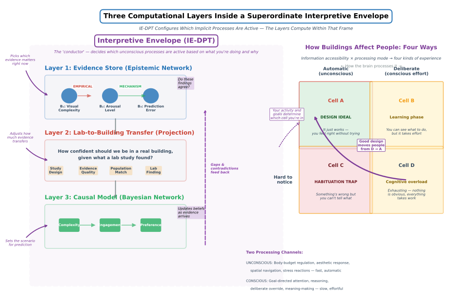

## PART I: THE EXPLANATION GAP AND 30 WORKED EXAMPLES (Sections 1–32)
**Status: [WRITTEN]** | **~80 pages**

- §1. The Explanation Gap
- §2. The System: Tracing Neural Chains
- §3–§32. Examples 1–30 (Ceiling Height & Creativity → Lighting Directionality & Drama)

---

**Figure M-1. Three Computational Layers Inside a Superordinate Interpretive Envelope.** Look at the left side first: three layers stack vertically. The Evidence Store (top) holds 3,420+ scientific findings — each tagged with how it was established and how confident we are. The Lab-to-Building Transfer layer (middle) asks the key question: how much should we trust a lab finding when applied to a real building? It discounts for study design, evidence quality, and how well lab participants match real occupants. The Causal Model (bottom) links architectural variables to human outcomes, enabling both forward prediction ("if we change the ceiling height, what happens to stress?") and backward diagnosis ("occupants report fatigue — what's causing it?"). Gaps and contradictions feed back upward, triggering new literature searches. Now look at the dashed purple envelope wrapping all three layers: this is the Interpretive Envelope (IE-DPT), a superordinate mechanism that determines *which* unconscious processes are active depending on what the occupant is doing and why. The 2×2 matrix on the right shows its key insight: buildings affect people in four fundamentally different ways, depending on whether information is easy or hard to notice and whether processing is automatic or deliberate. Good architectural design moves occupants from Cell D (everything is hard) toward Cell A (it just works).

---

