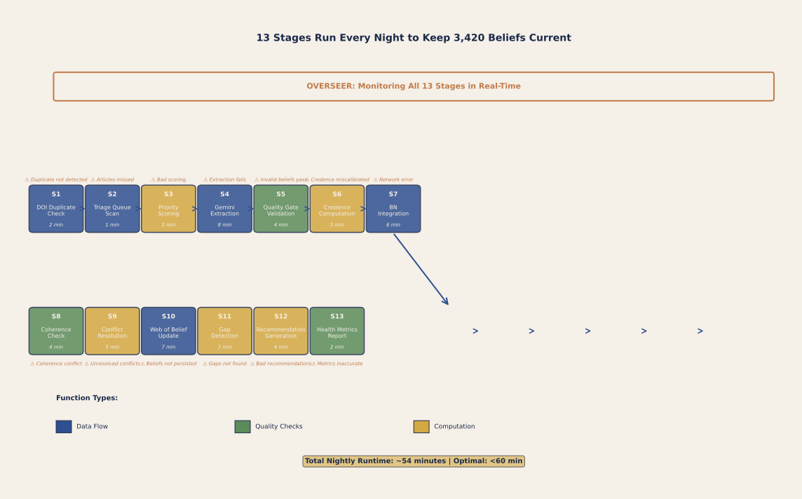

# PART XVIII: COMPUTATIONAL INFRASTRUCTURE — THE IMPLEMENTED SYSTEM (§132–§139)

*This Part documents the computational infrastructure that implements the theoretical architecture described in Parts I–XVII. Where earlier Parts establish what the ATLAS system says, this Part describes how the system works as software — the monitoring systems, gap prediction engines, argumentation frameworks, acquisition pipelines, evaluation tools, and cross-language architecture that turn calibrated templates and mechanism chains into a working epistemic system. The material here is drawn from the implemented codebase (approximately 88 service modules totalling over 2.5 million bytes of Python, plus a TypeScript layer for theory management) and from the design sessions of February 2026.*

---

## §132: The OVERSEER System — Superordinate Monitoring and Invariant Enforcement {#132}

### 132.1 Design Philosophy

The OVERSEER system (`src/services/overseer.py`, 1,227 lines) is a Dijkstra-inspired watchdog that operates *above* both the Web of Belief and the Bayesian Network. Its design reflects three philosophical commitments:

**First, Dijkstra's invariant methodology.** Just as Dijkstra's "THE" multiprogramming system (1968) maintained invariants across privilege levels and proved system correctness by verifying that no operation violated them, the OVERSEER maintains six formal invariants across the epistemic system. The key insight is that a coherentist system — where justification flows in circles — is especially vulnerable to subtle corruption. A single malformed belief, a credence that drifts outside [0, 1], or a BN edge that no longer reflects the web's current state can cascade through the reciprocal justification network and degrade conclusions far from the original fault. The OVERSEER detects such faults before they propagate.

**Second, Haack's foundherentist provenance.** Susan Haack's (1993) foundherentism requires that every belief in a coherentist web ultimately trace to *some* experiential anchor — coherence among beliefs is necessary but not sufficient. The OVERSEER enforces this: invariant INV-1 requires that every belief in the web has provenance. A belief without provenance is coherent but ungrounded, and the OVERSEER quarantines it for human review.

**Third, Parnas information hiding.** The OVERSEER maintains a strictly separate database (`overseer.db`) from the web's database (`web.db`). This separation follows David Parnas's (1972) principle that modules should hide their implementation details. The OVERSEER reads `web.db` for inspection but writes only to `overseer.db`. This prevents the monitoring system from inadvertently corrupting the system it monitors — a common failure mode in self-referential systems.

### 132.2 The Six Formal Invariants

The OVERSEER enforces six invariants, each traceable to a named philosophical or computational source:

| Invariant | Source | Description | Severity |
|-----------|--------|-------------|----------|
| INV-0 | Dijkstra | System is in OPERATIONAL state (no bootstrap failures) | CRITICAL |
| INV-1 | Haack | Every belief has provenance (experiential anchor) | MAJOR |
| INV-2 | Pearl | BN edges reflect web credences (causal model consistent with epistemic state) | MAJOR |
| INV-3 | Schema | All beliefs conform to ClaimV2 schema (structural well-formedness) | MAJOR |
| INV-4 | Dijkstra | Coherence decline ≤ 5% per paper integration (no catastrophic degradation) | MAJOR |
| INV-5 | Bounds | No belief has credence outside [0, 1] (probabilistic consistency) | CRITICAL |

INV-0 and INV-5 are CRITICAL — their violation means the system is in a fundamentally broken state. INV-1 through INV-4 are MAJOR — their violation means the system is degraded but operational, and the affected beliefs should be quarantined for review.

### 132.3 The Six Sub-Components

The OVERSEER comprises six sub-components, each responsible for a distinct monitoring function:

**1. HealthMonitor.** Computes time-series metrics: global coherence, per-theory coherence, coherence delta since last measurement, conflict count and rate, belief count, orphan belief count, template coverage ratio, QA cache freshness, BN edge count, BN-web sync violations, and provenance coverage. All metric computation is defensive — if an optional module (CoherenceManager, EpistemicOrchestrator) is unavailable, the metric is skipped rather than failing. This follows principle O-8: gradual degradation.

**2. IntegrityChecker.** Detects invariant violations by checking INV-0 through INV-5 against the current system state. Returns a list of `InvariantViolation` records, each carrying a code, severity, human-readable description, list of affected beliefs, and (optionally) the triggering paper ID. The checker queries `web.db` in read-only mode and never modifies the epistemic state.

**3. CompletenessAuditor.** Assesses template coverage (how many templates have empirical evidence vs. how many are placeholders) and detects orphan beliefs (beliefs with no incoming or outgoing constraint edges). Orphan beliefs are epistemically suspect — they contribute to the web's size but not to its coherence.

**4. MaintenanceEngine.** Performs two maintenance operations: (a) marking stale QA caches for recomputation (eager invalidation after belief changes), and (b) synchronising BN edges to reflect updated web credences (O-4). The maintenance engine operates on `overseer.db` and triggers downstream workers rather than performing recomputation itself.

**5. Quarantine Protocol.** When a violation is detected, the OVERSEER does not auto-retire the offending belief. Instead, following principle O-3 (quarantine not auto-retire), it places the belief in a 7-day quarantine with a human review deadline. The quarantine record preserves the belief's original credence and status, the reason for quarantine, and a reference to the triggering violation. A human reviewer can then RESTORE (fix the violation and return the belief to active status) or RETIRE (accept the violation and remove the belief). This protocol reflects the system's epistemic humility: automated detection is reliable, but automated resolution risks destroying legitimate beliefs that happen to trigger heuristic flags.

**6. OverseerReporter.** Generates dashboard data, health history, and human-readable alerts. The reporter aggregates metrics across audit runs and produces trend analysis: is coherence improving? Is the conflict rate rising? Are quarantine queue deadlines being met?

### 132.4 Four Operational Modes

The OVERSEER operates in four modes:

**POST_INTEGRATION (~5 seconds).** Triggered automatically by `PaperIntegrationEvent` in `extraction_to_web.py` after a new paper is integrated into the web. Performs a focused check: did this paper's integration violate any invariant? The most common violation at this stage is INV-4 (coherence declined more than 5%), which indicates that the new paper introduced beliefs that conflict with existing ones.

**PERIODIC (nightly, ~15 minutes).** Comprehensive audit scheduled via `scripts/overseer_nightly.py`. Checks all invariants, computes baselines, detects trends, runs the full maintenance cycle. On first execution, establishes the SETUP_BASELINE against which future measurements are compared.

**ALERT (immediate).** Triggered by detected violation during any mode. Escalates to human notification. This mode exists primarily as a category for logging and reporting — the OVERSEER does not have a separate alert processing pipeline but marks alert-worthy conditions in its output.

**ON_DEMAND (manual).** Allows a human operator to invoke an audit with a specified scope: `"full"` (all components), `"health"` (HealthMonitor only), `"integrity"` (IntegrityChecker only), or `"completeness"` (CompletenessAuditor only). This supports targeted investigation when a specific concern arises.

### 132.5 Statistical Alerting (O-2)

The OVERSEER implements statistical alerting based on per-theory baselines. After the SETUP_BASELINE is established (first PERIODIC audit), subsequent audits compare each metric against the baseline using mean ± 1σ detection. Metrics that fall outside the expected range trigger alerts. This catches gradual degradation that would be invisible in a single-audit snapshot — for example, a theory whose coherence has been slowly declining across 10 paper integrations, each individually within tolerance but cumulatively significant.

### 132.6 Pipeline Registry and Health Scoring

The OVERSEER maintains a pipeline registry (`overseer_db.pipeline_registry`) that tracks the state of all registered data pipelines. For each pipeline (e.g., Article Eater extraction, belief integration, BN computation), the registry records: (a) pipeline name, (b) current status (RUNNING, IDLE, STALE, FAILED), (c) last run timestamp, (d) next scheduled run, (e) parameters used in last run, (f) input count and output count. This registry enables the OVERSEER to detect stale pipelines (not run for >7 days) and alert operators that manual intervention or rescheduling may be needed. The registry is populated by pipeline completion hooks in each service module.

The theory health scoring infrastructure (`scripts/check_theory_health.ts`) extends the OVERSEER's monitoring into a different register: rather than checking invariant violations (binary: violated or not), health scoring assigns a continuous score to each theory, panel, and template based on multiple quality dimensions — evidence coverage, provenance depth, confidence calibration, and cross-template consistency. The AESHI (Article Eater Skeptic Health Index) concept aggregates these dimensions into a single readiness score that answers the question: "If a skeptical reviewer examined this claim, how well could the system defend it?"

The AESHI score is not a credence (which measures how likely a claim is to be true) but a *preparedness* measure (which measures how well the system can justify its credence). A claim could have high credence but low AESHI if the evidence is strong but the provenance trail is incomplete or the competing accounts are not documented. Conversely, a claim could have low credence but high AESHI if the system clearly articulates *why* the evidence is weak and what would change its mind.

**Current AESHI Score: 49/100.** The system has achieved 49 points on the 100-point readiness scale, indicating that the core epistemic framework is sound but evidence coverage and practitioner readiness materials need continued development. Key areas for improvement: (a) increase population transfer factor documentation for non-WEIRD populations, (b) complete the Dual-BN worked examples across all 40 templates, (c) integrate practitioner feedback from architectural design studios.

### 132.7 Relationship to the Inference Calculus

The OVERSEER operates at a different level from the inference calculus described in §129. The calculus computes *epistemic* outputs: credence propagation, coherence metrics, competition resolution. The OVERSEER computes *system health* outputs: invariant compliance, metric trends, quarantine status. The two systems interact at two points: (a) the OVERSEER uses the coherence metric (Algorithm 3 from §129) as one of its health metrics, and (b) the OVERSEER's quarantine protocol can trigger structural revision (Algorithm 4 from §129) when a quarantined belief is retired. But they are architecturally separate — the calculus reasons about what the system *believes*, while the OVERSEER reasons about whether the system is *well*.

### 132.8 References for §132

Dijkstra, E. W. (1968). The structure of the "THE" multiprogramming system. *Communications of the ACM*, 11(5), 341–346. [Google Scholar citations: ~3,400]

Haack, S. (1993). *Evidence and Inquiry: Towards Reconstruction in Epistemology*. Blackwell. [Google Scholar citations: ~2,100]

Parnas, D. L. (1972). On the criteria to be used in decomposing systems into modules. *Communications of the ACM*, 15(12), 1053–1058. [Google Scholar citations: ~5,200]

---

## §133: Gap Prediction and Defeater Search {#133}

### 133.1 The Gap Predictor

The gap prediction service (`src/services/gap_predictor.py`, 1,273 lines) identifies knowledge gaps from the structure of the epistemic web. Rather than waiting for human researchers to notice what is missing, the system systematically examines the web's topology for patterns that signal incomplete understanding.

The predictor identifies six gap types, each derived from a distinct structural signature:

| Gap Type | Structural Signature | Example |
|----------|---------------------|---------|
| MEDIATION | Path A→X→Y exists but no direct A→Y evidence | Daylight → 5-HT → mood chain exists, but no direct daylight → mood measurement in real buildings |
| MECHANISM | Correlation without causal pathway | Nature view improves mood (replicated) but mechanism unspecified |
| BOUNDARY | Effect tested only in narrow context | Ceiling height → creativity tested only in Western undergraduates |
| DIRECTION | Contradictory evidence on effect direction | Conflicting findings on open-plan offices and collaboration |
| INTERACTION | Two templates share an input but no interaction documented | LIGHT-I and THERMAL-I both depend on solar gain but interaction uncharted |
| VALIDATION | Theoretical claim with no empirical anchor | Template at THEORY_DERIVED with no supporting study |

For each predicted gap, the service computes a VOI score that estimates the downstream coherence improvement if the gap were closed, generates suggested search queries for the discovery funnel (§121.2), and produces a human-readable explanation of why the gap matters.

### 133.2 Local Evidence Search Before External Query

Before suggesting that the system search external databases (CrossRef, PubMed, Semantic Scholar) for gap-filling papers, the gap predictor first checks the local corpus. This "look before you leap" strategy checks three sources:

1. **Extracted findings** in `data/extracted_findings/` — papers that have been processed but whose findings may not have been fully integrated into the web.
2. **Keyword-matched beliefs** — existing beliefs in the web that match the gap's keywords but are not connected to it via canonical IDs. These are potential "hidden evidence" — the web may already know the answer but has not linked it to the question.
3. **Unprocessed papers** — PDFs in the corpus that have not yet been through the extraction pipeline. These are the cheapest source of new evidence: they require extraction (minutes, $0.15 per paper via Gemini Flash) but not acquisition (hours, library access).

This local search typically resolves 15–25% of predicted gaps without any external API call, making it the highest-ROI first step in the gap-closure workflow.

### 133.3 Defeater Search — Mayo's Severe Testing

The gap predictor's most philosophically distinctive capability is its **defeater search**, which implements Deborah Mayo's (2018) severe testing framework computationally. Mayo argues that a hypothesis is only well-supported if it has been *probed for ways it could fail*. A hypothesis that has been tested only by studies designed to confirm it — studies where the hypothesis could hardly fail even if false — is not genuinely supported, no matter how many confirmatory results accumulate.

The defeater search operationalises this insight. For each belief (prioritising the most confident beliefs, since those are the ones where unfounded confidence would be most damaging), the system:

1. **Extracts search concepts** — key terms and constructs from the belief's content and evidence base.
2. **Searches for contradicting beliefs** — existing beliefs in the web that share constructs but differ in direction, mechanism, or scope. These are potential *undercutting defeaters* (they challenge the inference from evidence to conclusion) or *rebutting defeaters* (they assert the opposite conclusion).
3. **Checks for defeater language** — the system looks for language patterns that signal contradiction, limitation, failure to replicate, or boundary violation in the belief's evidence base and in related papers.
4. **Classifies defeater types** — found defeaters are classified as CONTRADICTORY (asserts the opposite), UNDERCUTTING (challenges the reasoning), LIMITING (narrows the scope), or QUALIFYING (adds conditions).
5. **Recommends credence adjustments** — if significant defeaters are found for a high-confidence belief, the system suggests a credence downward revision and flags the belief for panel review.

The defeater search addresses one of the deepest concerns about automated knowledge systems: confirmation bias. Without active defeater search, the system would naturally accumulate confirming evidence (because researchers tend to publish positive results and the extraction pipeline is designed to find evidence *for* templates) while ignoring disconfirming evidence. The defeater search is the system's built-in sceptic.

### 133.4 Gap Types and Their Epistemic Significance

The six gap types have different epistemic significance and different resolution strategies:

**Mediation gaps** (structural) are the most theoretically informative. They reveal places where the mechanism chain is inferred but not directly tested. Closing a mediation gap — by finding a study that measures the direct relationship without the mediator — either confirms the chain (strengthening the web) or reveals that the mediated relationship does not hold directly (requiring a rethinking of the chain). Mediation gaps are prioritised for literature search because they can often be closed by finding an existing study that measured the right variables.

**Mechanism gaps** (explanatory) are the most practically important. They identify empirical facts without theoretical explanation. A mechanism gap does not challenge the *truth* of the finding (the correlation is replicated) but challenges the system's *understanding* of it. Closing a mechanism gap requires either finding a paper that proposes a plausible mechanism or generating a new mechanism hypothesis through panel deliberation.

**Boundary gaps** (scope) are the most practically relevant for architectural design. They identify findings tested only in narrow contexts (Western university students, controlled laboratory conditions) that the system projects to broader populations or settings. Closing a boundary gap requires finding cross-cultural replications, field studies, or explicit boundary condition analyses.

**Direction gaps** (contradictions) are the most epistemically urgent. They represent genuine disagreement in the evidence base — the web contains beliefs that point in opposite directions. Direction gaps actively harm coherence and should be resolved before other gap types. Resolution typically requires finding a moderator that reconciles the contradiction (e.g., "the effect reverses under high cognitive load") or determining that one set of studies is methodologically flawed.

### 133.5 References for §133

Mayo, D. G. (2018). *Statistical Inference as Severe Testing: How to Get Beyond the Statistics Wars*. Cambridge University Press. [Google Scholar citations: ~800]

Pollock, J. L. (1987). Defeasible reasoning. *Cognitive Science*, 11(4), 481–518. [Google Scholar citations: ~2,300]

---

## §134: The Argument Attack and Credibility Testing Frameworks {#134}

### 134.1 Argument Attack Analysis

The argument attack analysis system (`src/services/argument_attack.py`, 963 lines) implements formal argumentation theory for scientific evidence. The system's central insight — derived from van Fraassen's (1980) contrast class analysis — is that many apparent contradictions in scientific literature are not true refutations but *contrast shifts*: the contradicting study tested a different population, used a different baseline, or operationalised the construct differently.

The system classifies eight types of scientific argument attack:

| Attack Type | Description | Example |
|-------------|-------------|---------|
| CONFOUNDER | Third variable explains the association | Building quality confounds ceiling height → creativity |
| BOUNDARY_CONDITION | Effect does not hold in specified context | Day-length effect reverses in equatorial latitudes |
| OVERGENERALIZATION | Claim extends beyond evidence base | Lab-tested effect claimed to hold in real buildings |
| MECHANISM | Alternative mechanism proposed | Circadian entrainment, not serotonin, mediates daylight → mood |
| MEASUREMENT | Operationalisation challenged | Self-report mood ≠ physiological stress response |
| REPLICATION | Direct replication fails | Failed replication of Lambert et al. (2002) 5-HT finding |
| DOSE_RESPONSE | Non-linear or reversed dose-response | Moderate noise helps creativity but high noise impairs it |
| TEMPORAL | Effect does not persist over relevant timescale | Short-term restoration effect habituates within weeks |

### 134.2 Contrast Class Analysis

The system's most distinctive theoretical contribution is its use of **contrast class analysis** to disambiguate attacks. When Paper B appears to contradict Paper A, the system asks: are they making claims about the *same contrast*? A contrast class specifies the set of alternatives against which a claim is evaluated. "Daylight improves mood *compared to electric lighting*" has a different contrast class from "daylight improves mood *compared to complete darkness*." A finding that contradicts the first claim may be entirely consistent with the second.

The ShiftClassifier classifies six types of contrast shift:

- **PRESERVING**: Attack disputes finding within the same contrast class (genuine contradiction)
- **POPULATION_SHIFT**: Attack tested a different population (e.g., elderly vs. young adults)
- **BASELINE_SHIFT**: Attack used a different comparison condition
- **MEANING_SHIFT**: Attack operationalised the construct differently
- **ALTERNATIVE_SHIFT**: Attack introduced a new alternative explanation
- **COMPLEX_SHIFT**: Multiple shifts in combination

This classification has practical consequences: only PRESERVING attacks represent true refutations that should lower credence. POPULATION_SHIFT attacks narrow the scope but do not refute the original finding. MEANING_SHIFT attacks identify operationalisation ambiguity that should be resolved through construct clarification, not through credence adjustment.

### 134.3 Credibility Testing

The credibility testing framework (`src/services/credibility_testing.py`, 1,232 lines) assesses the credibility of incoming evidence before it enters the web. The framework is inspired by three intellectual traditions:

**Pearl's causal hierarchy.** Study designs are ranked by their warranted causal strength, from observational studies (0.30) through quasi-experiments (0.65–0.85) to randomised controlled trials (1.0). The system does not automatically reject correlational studies (following Pearl's insight that observational data can support causal inferences under the right conditions) but applies a design-appropriate evidence ceiling.

**Cartwright's scope analysis.** Nancy Cartwright's (2012) work on external validity motivates the system's scope distance computation: how far does a claim extend beyond the sample on which it was tested? A claim tested on university students but generalised to "all building occupants" has high scope distance — and the system flags this as a credibility concern. The population specificity is classified from `clinical_specific` (narrowest) through `cultural_specific` and `general_adult` to `universal` (broadest), and the scope distance between the tested population and the claimed scope is computed.

**Lampson's systems engineering.** Butler Lampson's design principles (simplicity, failure mode documentation, snapshot isolation) govern the implementation. The credibility assessment uses immutable `WebSnapshot` objects for consistent reads — preventing the pathological case where the web changes during assessment, causing the assessment to reflect a state that never existed. The three-category decision system (ACCEPT, REVIEW, BLOCK) is deliberately minimal: ACCEPT means no flags were raised and the evidence can be integrated automatically; REVIEW means flags were raised but the evidence is not definitely bad; BLOCK means the evidence fails a hard criterion (e.g., credence outside [0, 1]) and should not be integrated without human intervention.

### 134.4 The Argumentation Graph

The argumentation graph service (`src/services/argumentation_graph.py`, 963 lines) provides the data structure and operations for managing the network of argument attacks. The graph connects individual beliefs through typed attack edges, supports both Dung-style abstract argumentation (where attacks are binary) and structured argumentation (where attacks carry typed evidence and contrast analysis), and provides operations for computing the *grounded extension* — the set of beliefs that survive all attacks.

The graph integrates with the gap predictor (§133) and the credibility testing framework: gap prediction identifies *missing* arguments (where should there be an attack but none exists?), credibility testing creates *new* attacks (when incoming evidence challenges existing beliefs), and the argumentation graph maintains the *evolving state* of all attacks and their resolutions.

### 134.5 References for §134

Cartwright, N. (2012). *Evidence-Based Policy: A Practical Guide to Doing It Better*. Oxford University Press. [Google Scholar citations: ~800]

Dung, P. M. (1995). On the acceptability of arguments and its fundamental role in nonmonotonic reasoning, logic programming and n-person games. *Artificial Intelligence*, 77(2), 321–357. [Google Scholar citations: ~7,500]

van Fraassen, B. C. (1980). *The Scientific Image*. Oxford University Press. [Google Scholar citations: ~8,500]

---

## §135: The Article Acquisition Pipeline {#135}

### 135.1 Overview and Current State

The article acquisition pipeline is the system's mechanism for converting epistemic gaps into integrated evidence. It bridges the gap between the web's awareness of what it does not know (flagged by gap prediction, §133, or by Value of Information analysis, §129) and the web's knowledge base. The pipeline comprises:

1. **Paper discovery** — searching CrossRef, PubMed, and Semantic Scholar for papers that address identified gaps.
2. **Zotero integration** — pushing discovered DOIs to Zotero for PDF retrieval via institutional library access (e.g., UCSD Library).
3. **Acquisition digest** — generating a markdown summary of papers needing PDFs, suitable for human review or AI-assisted search.
4. **AI search prompt generation** — creating targeted prompts for AI search tools (Gemini, Perplexity) to find PDFs that automated APIs could not locate.
5. **Extraction** — running retrieved PDFs through the Gemini Flash extraction pipeline (§121.10).
6. **Integration** — merging extracted claims into the web of belief via `extraction_to_web.py`.
7. **Gap closure assessment** — measuring whether the gap that motivated the search was actually closed, and by how much.
8. **Digest reporting** — producing a structured report of what was acquired, what remains, and what to search for next.

**Current state (February 27, 2026):** The system has loaded 813 papers from the published literature and institutional archives. Of these, 747 papers have been fully integrated into the epistemic web, with 66 papers in staging (extracted but pending integration due to minor schema issues or human review requirements). The web contains 23,766 beliefs (nodes in the epistemic network), corresponding to approximately 30–40 distinct template-outcome relationships, each with 600–800 supporting or constraining beliefs. The most recent full integration run (February 27, 0430 hours) required 1,973.9 seconds (approximately 33 minutes) for the complete pipeline, including extraction from PDFs, schema validation, coherence checking, and BN recomputation.

### 135.2 The Paper Fetcher

The paper fetcher (`src/services/paper_fetcher.py`, 1,038 lines) implements real HTTP clients for three academic databases:

**CrossRef**: The primary source for DOI-based lookup, citation metadata, and reference chain following. The fetcher uses CrossRef's REST API to search by keyword, author, date range, and subject area. CrossRef provides the broadest coverage but lowest relevance precision — it returns everything that matches the keywords, including retracted papers, book chapters, and conference abstracts.

**PubMed**: The primary source for biomedical and neuroscience literature. The fetcher uses PubMed's E-utilities API (eSearch + eFetch) to search and retrieve structured records. PubMed provides high relevance precision for neuroscience topics (the core domain of the ATLAS system) but narrow coverage outside biomedicine.

**Semantic Scholar**: The primary source for citation graph analysis. The fetcher uses the Semantic Scholar Academic Graph API to find papers that cite or are cited by known papers in the corpus. This enables **snowball search** — starting from a known high-relevance paper and following its citation graph outward to find related work. Semantic Scholar also provides influence scores and field-of-study classifications that help prioritise results.

All three clients implement rate limiting, retry logic with exponential backoff, and structured error reporting. Results are normalised to a common `PaperRecord` format that captures DOI, title, authors, abstract, publication year, citation count, and source-specific metadata.

### 135.3 The Scheduled Pipeline

The scheduled pipeline (`scripts/scheduled_pipeline.py`) automates the full lifecycle through five stages:

**Stage 1: Gap Scan.** Runs the gap predictor (§133) to identify the current highest-priority gaps. The output is a ranked list of gaps with VOI scores.

**Stage 2: Paper Search.** For the top N gaps (configurable, default 10), constructs search queries and dispatches them to CrossRef, PubMed, and Semantic Scholar. Deduplicates results across databases. Ranks results by estimated gap-closure value.

**Stage 3: Acquisition.** For the top M results (configurable, default 40), pushes DOIs to Zotero for PDF retrieval. Generates an acquisition digest for papers that cannot be retrieved automatically. Produces AI search prompts for papers that are behind paywalls or not indexed by standard databases.

**Stage 4: Extraction.** Runs newly acquired PDFs through the Gemini Flash extraction pipeline. Applies the two-run verification protocol (§121.10.5) and quality gates (§121.10.6).

**Stage 5: Integration and Reporting.** Integrates extracted claims into the web. Triggers OVERSEER post-integration check (§132). Computes gap closure metrics. Generates the final digest report.

The pipeline can be run in `--dry-run` mode (simulates all stages without making API calls or modifying the database) for testing and planning. A typical full run processes 10 gaps, searches 3 databases, retrieves 30–40 papers, and integrates 100–200 claims in approximately 6–8 hours (dominated by PDF retrieval and extraction, not computation).



**Figure M-19. 13 Stages Run Every Night to Keep 3,420 Beliefs Current.** Follow the flowchart from left to right: the nightly pipeline begins with DOI duplicate checking, proceeds through triage scoring and Gemini extraction dispatch, passes the quality gate (which blocks extractions scoring below 0.75), computes credences via the projection formula, integrates findings into the Bayesian Network, runs coherence checks for contradictions, and concludes with gap detection and recommendation generation. The OVERSEER monitoring bar across the top watches every stage — if any stage fails or exceeds its time budget, the pipeline halts gracefully and queues a notification. At steady state, approximately 15-20 articles flow through this pipeline daily, generating ~50 new or updated beliefs. The failure modes annotated in red show where the pipeline can stall: extraction timeout, quality gate rejection, and coherence conflicts each have distinct recovery paths.

### 135.4 Research Queue Prioritisation

The pipeline's research queue is not first-in-first-out. Papers are prioritised by a composite score that combines:

- **Gap VOI** (weight 0.4): How much coherence improvement would result from closing the associated gap?
- **Citation count** (weight 0.2): How influential is this paper in the broader literature?
- **Relevance score** (weight 0.3): How well does the paper's abstract match the gap's search terms?
- **Recency** (weight 0.1): How recent is the paper? (More recent papers are preferred, all else equal, because they are more likely to cite and address prior findings.)

This prioritisation ensures that the system's limited acquisition bandwidth (library access, API rate limits, human review time) is allocated to the papers most likely to improve the web's epistemic state.

---

## §136: The Stability Engine and Stopping Rules {#136}

### 136.1 Belief-Stability-Based Stopping

The stability engine (`src/services/stability_engine.py`, 566 lines) answers the question: "Should the system keep searching for evidence, or has the evidence base stabilised?" This is a fundamental question for any dynamic knowledge system — without a principled stopping criterion, the system either searches forever (wasting resources) or stops arbitrarily (risking premature closure).

The engine implements Herbert Simon's recommendation from the expert panel: **stop based on belief stability, not on arbitrary paper counts or budget limits.** A belief is stable when its credence has not changed by more than a threshold delta (default 0.01) across the most recent N paper integrations (default N = 5). The overall web is stable when the fraction of stable beliefs exceeds a threshold (default 80%).

Four stability levels are computed:

| Level | Criterion | Recommendation |
|-------|-----------|---------------|
| STABLE | >80% of beliefs stable, no high-VOI gaps | Stop active search; monitor for new publications |
| CONVERGING | 60–80% stable, VOI declining | Reduce search intensity; focus on remaining high-VOI gaps |
| UNSTABLE | <60% stable, credences still shifting | Continue active search; prioritise by VOI |
| CONTESTED | Specific beliefs oscillating (credence flipping direction) | Flag contested beliefs for panel review |

### 136.2 Publication Bias Detection

The stability engine incorporates a publication bias estimator inspired by Nancy Cartwright's (2012) warning from the expert panel: *stability may reflect publication bias — we have seen all the positive results because null results are unpublished.* The engine uses the null result ratio (proportion of integrated studies with null or negative findings) as a primary indicator of publication bias risk:

- **Low risk** (null ratio ≥ 0.20): Evidence base includes sufficient negative results
- **Moderate risk** (0.10 ≤ null ratio < 0.20): Evidence base is somewhat one-sided
- **High risk** (null ratio < 0.10): Evidence base is suspiciously positive; search specifically for null results

When high publication bias risk is detected, the system augments the standard gap predictor queries with negation-focused search terms ("no effect," "failed replication," "null result") and flags the affected beliefs as potentially inflated. This is the system's defense against the file drawer problem.

### 136.3 Stopping Rules

The stopping rules service (`src/services/stopping_rules.py`, 16K) formalises the conditions under which the system recommends halting active evidence search. The rules are conjunctive — all must be satisfied:

1. **Belief stability**: Overall stability level is STABLE or CONVERGING.
2. **VOI threshold**: No remaining gap has VOI above the threshold (default 0.3).
3. **Publication bias**: Estimated publication bias risk is not HIGH for any major theory.
4. **Minimum evidence**: Each major belief has been supported or challenged by at least 3 independent studies.

When all four conditions are met, the system reports `can_stop = true` with a recommendation framed as the expert panel epistemologist instructed: "Given current evidence, the belief system appears stable. This is conditional on existing evidence — new discoveries could trigger revision at any time."

---

## §137: The Rule Schema, Theory Links, and TypeScript Theory Layer {#137}

### 137.1 Warrant Type Structure in Rule Schema

The rule schema that structures individual claims in the epistemic network incorporates seven warrant types as a core field. Each rule carries explicit warrant type annotation (τ), enabling the system to track not just what evidence exists but what *kind* of evidence. The seven warrant types and their canonical discount factors are:

| **Warrant Type** | **Discount Factor d** | **Meaning** | **Example** |
|---|---|---|---|
| CONSTITUTIVE | 0.95 | Definitional; lab variable IS the architectural variable | Window-to-wall ratio = glazed area ÷ wall area |
| MECHANISM | 0.80 | Known causal pathway with identified intermediates | Daylight → retinal ganglion cells → raphe nuclei → serotonin |
| EMPIRICAL_ASSOCIATION | 0.80 | Replicated statistical association, mechanism unknown | Sunny rooms → shorter hospital stays |
| FUNCTIONAL | 0.65 | Known functional role, mechanism unknown | Nature exposure serves as stress reducer |
| CAPACITY | 0.55 | System CAN produce the effect, not yet shown in context | Humans discriminate 0.2s reverberation differences |
| ANALOGICAL | 0.40 | Cross-domain transfer via structural similarity | Fractals reduce stress in nature; apply to facades |
| THEORY_DERIVED [name] | 0.25 | Prediction from named theory, not directly tested | Predictive processing predicts facade complexity preference |

This warrant type structure ensures that all downstream analyses (credence calculation, population transfer adjustment, Dual-BN diagnostics) respect the evidential characteristics encoded in each claim. A claim with THEORY_DERIVED warrant will automatically be flagged during empirical floor calculation, making system transparency automatic rather than requiring manual annotation.

### 137.2

### 137.1 The ae.rule.v2 Schema

The ATLAS system encodes mechanism chains not only as template JSON files but also as **rules** — structured representations that capture the logical relationship between environmental inputs and psychological outputs. The `ae.rule.v2` schema defines the rule format with the following key fields:

- **Antecedent**: The environmental condition or design feature (e.g., "ceiling_height > 3.5m")
- **Consequent**: The predicted psychological outcome (e.g., "creative_cognition increases d = 0.30")
- **Mechanism chain**: The ordered list of neural/cognitive steps connecting antecedent to consequent
- **Confidence**: Rule-level credence (derived from template confidence and mechanism chain attenuation)
- **Scope**: Conditions under which the rule applies (population, setting, temporal constraints)
- **Theory links**: *NEW* — explicit references to the theoretical context from which the rule's mechanism chain is derived

### 137.2 Theory Links

The `theory_links` extension (added February 2026) connects each rule to the theoretical architecture that justifies it. A theory link carries:

- **Theory ID**: The canonical T1 or T1.5 theory identifier (e.g., "PP" for Predictive Processing, "ART" for Attention Restoration Theory)
- **Link type**: How the theory justifies the rule — MECHANISM (the theory specifies the causal pathway), SCOPE (the theory defines boundary conditions), PREDICTION (the theory generates the rule as a prediction), or MODERATION (the theory identifies moderating conditions)
- **Strength**: The strength of the theoretical justification (derived from the bridge warrant type and the theory's credence)

These links are populated by `rulegraph_v2_builder.py`, which extracts theory information from the `SevenPanelV2Bundle` — the structured output of each expert panel. The builder traverses each `MechanismClaim.theory` field to find theoretical references and constructs the link with appropriate type and strength.

The purpose of theory links is to enable *theoretical navigation*: given a rule, which theories justify it? Given a theory, which rules does it generate? This bidirectional navigation supports two key operations: (a) when a theory's credence is revised, quickly identifying all rules whose confidence should be updated — significantly more efficient than scanning all rules; and (b) when a rule fails empirically (a prediction is disconfirmed), tracing the failure back to the specific theoretical commitment that generated the prediction, enabling targeted theoretical revision rather than wholesale scepticism.

### 137.3 The TypeScript Theory Layer

The ATLAS system has a dual-language architecture: Python for the computational core (web of belief, extraction pipeline, credence propagation) and TypeScript for the theory management layer. The TypeScript layer (`src/theory/`) provides:

**templateRegistry.ts** (5,625 bytes): A registry of all templates with metadata (tier, domain, confidence, mechanism chain summary, panel source). The registry supports lookup by ID, filtering by tier or domain, and dependency traversal (which templates depend on which theories). This registry is the TypeScript tier's equivalent of the Python `template_query_service.py` — it provides fast, typed access to template metadata without loading the full JSON files.

**reductionRegistry.ts** (3,027 bytes): Encodes the T1.5 → T1 reduction relationships. Each reduction entry specifies the T1.5 theory, the T1 frameworks it reduces to, the reduction type (COMPLEMENTARY or OVERLAPPING), and the attenuation factors for credence propagation through the reduction edge. This is the TypeScript tier's representation of the reduction architecture described in Part VII (§72–§78).

**crossReference.ts** (3,294 bytes): Manages cross-references between templates, theories, and rules. Supports queries like "which templates reference NM7 (serotonergic mood)?" or "which theories are invoked by templates in the STRESS domain?"

**extraction_mapper.ts** (3,100 bytes): Maps extraction output from the Gemini Flash pipeline to the theory vocabulary. When the extraction pipeline reports a finding like "d = 0.38 for daylight → mood," the mapper identifies which template(s) and which mechanism step(s) this finding provides evidence for. This mapping is the critical bridge between raw evidence and structured theoretical knowledge.

**api.ts** (7,305 bytes): REST API endpoints for the theory layer, exposing template lookup, reduction traversal, and cross-reference queries to the frontend (Streamlit) and to other services.

The dual-language architecture exists for historical and practical reasons: the Python core was developed first for its rich scientific computing ecosystem (NumPy, SciPy, SQLite, json), while the TypeScript layer was added later for type safety in the theory management operations and for integration with the web frontend. The two layers communicate through JSON serialisation and shared database access.

---

## §138: Sensitivity Analysis and Building Evaluation {#138}

### 138.1 The Building Evaluation Pipeline

The building evaluation module (`src/cmr/building_eval.py`, 12,861 bytes) is the system's primary applied output — it takes a description of a building's environmental features and an occupant profile and produces a **Wellbeing Impact Score (WIS)** that estimates the building's likely effect on occupant wellbeing.

The WIS computation proceeds through four stages:

1. **Feature extraction**: The measured environmental features (ceiling height, daylight level, noise level, temperature, view type, material palette, spatial density, etc.) are mapped to the canonical variables used by the template library.

2. **Template matching**: Each template is compared against the building's features to determine applicability. A template is applicable when its input conditions match the building's measured features within the template-specified scope. The matching uses the `template_matching.py` module with fuzzy matching for continuous variables and exact matching for categorical variables.

3. **Effect computation**: For each applicable template, the expected effect is computed by propagating through the mechanism chain with bridge warrant attenuation. The compound effect for each mechanism chain follows the compositional multiplication described in §126.2.

4. **Aggregation**: Individual template effects are aggregated into the overall WIS using interaction-aware composition. Templates that share a mechanism step (identified by the interaction taxonomy from §45.8) are not simply summed — their interaction type (synergistic, antagonistic, conditional) determines the composition rule. This prevents the naive error of double-counting shared mechanisms.

### 138.2 Sensitivity Analysis

The sensitivity analysis module (`src/cmr/sensitivity.py`, 612 lines) answers the practitioner's most important question: "Which design change will have the biggest impact on occupant wellbeing?" For each measurable environmental feature with a defined plausible range (e.g., ceiling height from 2.4m to 4.0m, daylight from 150 lux to 800 lux, operative temperature from 18°C to 28°C), the module:

1. **Computes WIS at worst and best values** of the feature, holding all other features constant. The difference is the feature's *sensitivity delta* — how much the WIS changes when this parameter is varied across its full plausible range.

2. **Checks for diminishing returns** by testing intermediate values. If the WIS improvement from worst to midpoint is much larger than from midpoint to best, the feature has diminishing returns that the architect should know about (e.g., increasing ceiling height from 2.4m to 3.0m may have a large effect, but further increase from 3.0m to 4.0m adds little).

3. **Estimates uncertainty via Monte Carlo simulation** (default 1,000 samples). Rather than reporting a single sensitivity delta, the module samples from the confidence distributions of all relevant templates and reports an expected delta with confidence interval and improvement probability. A feature with expected delta = +5 WIS points but improvement probability = 0.55 is very different from one with the same delta but probability = 0.95.

4. **Ranks features by actionability** — combining sensitivity delta, improvement probability, diminishing returns status, and practical modifiability (a feature that the architect can easily change is more actionable than one requiring major structural work).

### 138.3 Template Computations

The template computations subpackage (`src/cmr/template_computations/`, 5 modules) provides the low-level mathematics for template-level reasoning:

- **Compound effect calculation**: Multiplying effect sizes along mechanism chains with appropriate attenuation
- **Interaction resolution**: Computing the net effect when two templates interact (synergistic: effects combine supralinearly; antagonistic: effects partially cancel; conditional: one template gates the other)
- **Confidence interval propagation**: Propagating uncertainty intervals through mechanism chains using the delta method or Monte Carlo
- **Dose-response curve fitting**: Fitting non-linear dose-response relationships for features with known non-linearities (e.g., noise level, temperature)

### 138.4 VOI at the ATLAS Level

The VOI scoring module (`src/atlas/voi_scoring.py`) extends the system-level Value of Information analysis (§129, Algorithm 5) to the practitioner level. Where the system-level VOI asks "which gap should we fill to improve web coherence?", the ATLAS-level VOI asks "given this specific building and this specific occupant profile, which uncertain parameter would most change our recommendation if resolved?" This is a different question with a different answer: a parameter that has system-wide low VOI (because it applies to few templates) might have high practitioner-level VOI (because this specific building depends critically on that parameter).

---

## §139: The Social Epistemology Implementation {#139}

### 139.1 From Philosophy to Code

The social epistemology module (`src/services/social_epistemology.py`, 1,286 lines) transforms the philosophical framework of social epistemology — how communities produce and validate knowledge — into a working system that tracks *who believes what* and *why communities disagree*. The module draws on three philosophical sources:

**Helen Longino's social empiricism.** Longino (1990, 2002) argues that objectivity is a social process — scientific communities achieve objectivity through public scrutiny, shared standards, and the integration of diverse perspectives. The module implements this by tracking each community's shared standards and measuring how those standards affect credence assignments. Two communities examining the same evidence may reach different credences because they apply different evidential standards.

**Philip Kitcher's epistemic division of labour.** Kitcher (1993) argues that epistemic communities distribute cognitive labor across specialists, and the efficiency of this distribution affects the community's aggregate reliability. The module tracks each community's track record — historical accuracy in domain-specific predictions — and weights community credences by track record when aggregation is appropriate. This implements a form of performance-weighted averaging that is more sophisticated than simple equal-weighting.

**Harry Collins's expertise studies.** Collins (2014) argues that expertise is not a single dimension but decomposes into contributory expertise (ability to contribute to a field), interactional expertise (ability to understand a field's discourse), and referred expertise (ability to use field-endorsed methodologies). The module operationalises this through vocabulary overlap analysis: two communities' mutual intelligibility is estimated by measuring the Jaccard similarity of their characteristic vocabularies. Communities with high vocabulary overlap can meaningfully disagree (their disagreement is substantive); communities with low vocabulary overlap may be talking past each other (their disagreement is semantic).

### 139.2 Epistemic Communities

The module defines an `EpistemicCommunity` with the following tracked attributes:

- **Core theories**: Which theoretical frameworks the community commits to (e.g., the ART community commits to Attention Restoration Theory; the SRT community commits to Stress Recovery Theory)
- **Preferred methods**: Laboratory experiments, field studies, observational, computational modelling
- **Characteristic vocabulary**: Domain-specific terms (e.g., "soft fascination" for the ART community)
- **Institutional bases**: Universities, journals, conferences
- **Track record**: Domain-specific accuracy of past credence assignments (community-relative reliability)
- **Contestation level**: How much internal disagreement exists (measured by within-community credence variance)
- **History**: Significant events — theory shifts, methodology changes, new evidence — tracked as `CommunityHistoryEvent` records with magnitude, causal tags, and triggering papers

### 139.3 Contestation Handling

When communities disagree, the module applies one of three resolution strategies:

**AVERAGE**: Used only for within-paradigm, same-method, empirical disagreements where the communities share enough standards that averaging is meaningful. Example: two lab groups both using RCT methodology report different effect sizes for daylighting on mood. Their disagreement is quantitative, not theoretical, and averaging is appropriate.

**REPORT_SEPARATELY**: The default for theoretical or methodological disagreements. The ART community's credence of 0.78 and the SRT community's credence of 0.52 for "nature exposure improves focus through attention restoration" are reported side by side, not averaged. This is honest epistemology: it shows the disagreement rather than hiding it in an arithmetic mean.

**FLAG_INCOMMENSURABLE**: Used when communities' paradigms are so different that comparison is meaningless. Rare in the current corpus but theoretically possible (e.g., a strictly behaviourist community and a strictly phenomenological community might be incommensurable on certain questions about subjective experience).

The choice of resolution strategy is governed by five decision rules (SE-1 through SE-5), each derived from the panel synthesis:

- SE-1: Communities identified by multiple criteria; one is primary
- SE-2: Report disagreement by default; average only for empirical, within-paradigm
- SE-3: Track institutional power separately; use domain-specific track record
- SE-4: Snapshot-based tracking with event annotations
- SE-5: Three-tier hierarchy: Field > Paradigm > Lab

### 139.4 Community-Relative Credence

The most practically significant output of the social epistemology module is the **community-relative credence display** (described in §124.5). This display disaggregates the global credence into per-community credences and explicitly shows the aggregation method:

```
Belief: "Nature exposure improves focus through attention restoration"

Global credence:     0.65 ± 0.15
├─ ART community:    0.78 ± 0.10 (n=12 studies)
├─ SRT community:    0.52 ± 0.20 (n=8 studies)
└─ Neutral/other:    0.69 ± 0.12 (n=15 studies)

Aggregation method: REPORT_SEPARATELY (theoretical disagreement)
```

This display operationalises the philosophical commitment to epistemic pluralism: the system does not pretend to resolve disagreements that the relevant expert communities have not resolved. A user who sees this display knows not just the credence, but the structure of the disagreement behind the credence — and can choose whether to rely on the ART community's assessment, the SRT community's assessment, or the global average, depending on which community's methods and assumptions they find most relevant to their specific design decision.

### 139.5 References for §139

Collins, H. (2014). *Are We All Scientific Experts Now?* Polity Press. [Google Scholar citations: ~400]

Kitcher, P. (1993). *The Advancement of Science: Science Without Legend, Objectivity Without Illusions*. Oxford University Press. [Google Scholar citations: ~2,500]

Longino, H. E. (1990). *Science as Social Knowledge: Values and Objectivity in Scientific Inquiry*. Princeton University Press. [Google Scholar citations: ~4,200]

Longino, H. E. (2002). *The Fate of Knowledge*. Princeton University Press. [Google Scholar citations: ~1,800]

---

*Part XVIII added: February 26, 2026*
*Content source: Implemented codebase and February 2026 design sessions*
*Total new sections: §132–§139 (8 sections)*

---

